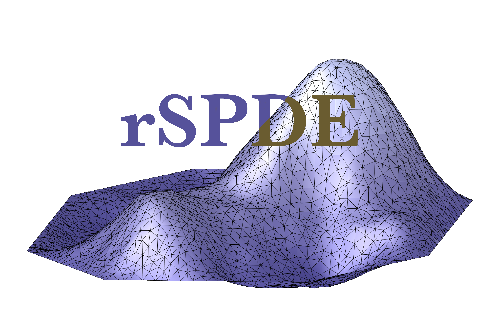

# rSPDE <a href="https://davidbolin.github.io/rSPDE/"></a>

[](https://cran.r-project.org/package=rSPDE)
[](https://cranlogs.r-pkg.org/badges/grand-total/rSPDE)
[](https://github.com/davidbolin/rSPDE/actions/workflows/R-CMD-check.yaml)

# Description #
`rSPDE` is an R package used for computing rational approximations of fractional SPDEs. These rational approximations can be used for computationally efficient statistical inference.

Basic statistical operations such as likelihood evaluations and kriging predictions using the fractional approximations are also implemented. The package also contains interfaces to [R-INLA][ref4] and [inlabru][ref8].

For illustration purposes, the package contains a simple FEM implementation for models on `R`. See the 
[Getting Started to the rSPDE package][ref2] vignette for an introduction to the package. The [Rational approximation with the rSPDE package][ref6] and [Operator-based rational approximation ][ref5] vignettes provide
introductions to how to create and fit rSPDE models. For an introduction to the R-INLA implementation
of the rSPDE models see the [R-INLA implementation of the rational SPDE approach][ref3]. The [`rSPDE` documentation][ref7] contains descriptions and examples of the functions in the `rSPDE` package.

# Shiny app

The paper [Covariance-based rational approximations of fractional SPDEs for computationally efficient Bayesian inference][ref9] contains a study on the accuracy of the various rational approximations that are implemented in the `rSPDE` package. These are summarized in a shiny app that can be run directly from GitHub by using the following command (you may need to install some of the dependencies):

```r
# install.packages(c("shiny", "shinythemes", "plotly"))
# install.packages(c("tidyr", "dplyr"))
shiny::runGitHub("davidbolin/rSPDE", subdir="shiny_app")
```

# References #
D. Bolin, A. B. Simas, Z. Xiong (2023) [Covariance-based rational approximations of fractional SPDEs for computationally efficient Bayesian inference][ref9]. Journal of Computational and Graphical Statistics, in press.

D. Bolin and K. Kirchner (2020) [The rational SPDE approach for Gaussian random fields with general smoothness][ref]. Journal of Computational and Graphical Statistics, 29:2, 274-285.

# Installation instructions #
The latest CRAN release of the package can be installed directly from CRAN with `install.packages("rSPDE")`.

It is also possible to install the CRAN version from github by using the command:
```r
remotes::install_github("davidbolin/rspde", ref = "cran")
```

The latest stable version (which on very rare occasions can be slightly more recent than the CRAN version), can be installed by using the command
```r
remotes::install_github("davidbolin/rspde", ref = "stable")
```
in R. The development version can be installed using the command
```r
remotes::install_github("davidbolin/rspde", ref = "devel")
```

*The following is intended for expert use only:*

The `devel` branch ships pure R by default but also carries the C/C++ `cgeneric` sources, which can be compiled on demand to build the local INLA shared object (`inst/shared/rspde_cgeneric_models.so`). Compilation is opt-in and controlled by either an environment variable or a `--enable-compiled` flag passed to `remotes::install_github()`:

```r
# Pure R install (default; matches CRAN):
remotes::install_github("davidbolin/rSPDE", ref = "devel")

# Opt in to the compiled cgeneric library:
remotes::install_github(
  "davidbolin/rSPDE",
  ref = "devel",
  configure.args = "--enable-compiled"
)

# Or via an environment variable:
withr::with_envvar(
  c(RSPDE_COMPILE = "1"),
  remotes::install_github("davidbolin/rSPDE", ref = "devel")
)
```

If you have already cloned the repository locally, `devtools::install()` works the same way. The most reliable form is to set the `RSPDE_COMPILE` environment variable before installing — `devtools::install()` does **not** accept a `configure.args` argument directly; configure flags must be forwarded through `args = "--configure-args=..."`:

```r
# From the cloned repo root, pure R (default, no compilation):
devtools::install()

# From the cloned repo root, with compilation (env-var form, recommended):
Sys.setenv(RSPDE_COMPILE = "1")
devtools::install()

# Or scoped to a single call:
withr::with_envvar(
  c(RSPDE_COMPILE = "1"),
  devtools::install()
)

# Equivalent --configure-args form (note: pass via `args`, not `configure.args`):
devtools::install(args = "--configure-args=--enable-compiled")
```

The compiled C/C++ sources live in `inst/src-optional/`. The `configure` (POSIX) and `configure.win` (Windows) scripts copy them into `src/` only when compilation is requested; otherwise they write a no-op `Makevars` so the install stays pure R. CRAN passes neither flag, so the CRAN tarball is unaffected.

At runtime the package checks the requested Cgeneric symbol in the installed INLA binary. If INLA does not provide it, rSPDE looks for the locally compiled shared object; if neither is available, it reports how to update INLA, compile rSPDE from source, or open an rSPDE issue.

For Windows users without Rtools, leave compilation disabled — the default pure-R install does not require a toolchain.

The compilation is only required to create the shared object used by `INLA`'s `cgeneric` interface; `INLA` itself ships such a shared object, so most users do not need to compile. The `stable-src` and `devel-src` branches are deprecated in favour of this single-branch `devel` workflow.

See the vignette [Building the rSPDE package from source on Mac and Linux](https://davidbolin.github.io/rSPDE//articles/build_source.html) for the toolchain prerequisites (gcc-14 on macOS, etc.) used by the optional compile path.

# Repository branch workflows #
The package version format for released versions is `major.minor.bugfix`. All regular development — both the `R` code and the `C`/`C++` `cgeneric` sources in `inst/src-optional/` — should be performed on the `devel` branch or in a feature branch managed with `git flow feature`. The legacy `devel-src` / `stable-src` branches are deprecated; the optional-compile machinery on `devel` (see *Installation instructions* above) replaces them. The `devel` version of the package should contain unit tests and examples for all important functions. Avoid direct pushes to `stable`; update it through the merge workflow described below.

Examples that depend on `INLA` stay in the package unchanged across branches. Guard them with `rspde_safe_inla()` so an unavailable, incompatible, or temporarily incomplete INLA installation does not fail a package check:

```r
#' @examplesIf rspde_safe_inla()
#' library(INLA)
#'
#' # The contents of the example
```

If an example requires a Cgeneric model that may not yet be present in every INLA build, pass its model symbol through `required_symbol`. Availability is detected dynamically; there is no static list of supported symbols.

## Updating the INLA source branch ##

The `inla` branch is used to mirror the source files that need to be available under `src/` for INLA. These files should be maintained on the `devel` branch under `inst/src-optional/`; they should not be edited manually on the `inla` branch.

To send the source files from `devel` to `inla`, commit the changes on `devel` with a commit message that ends with `INLA UPDATE`, and push to `devel`:

```bash
git checkout devel
# Edit the relevant files in inst/src-optional/
git add inst/src-optional
git commit -m "Update INLA cgeneric sources INLA UPDATE"
git push origin devel
```

When the last commit message in the push ends with `INLA UPDATE`, the GitHub Actions workflow copies the following files from `inst/src-optional/` on `devel` into `src/` on `inla`:

- all `.c` files;
- all `.cpp` files;
- `cgeneric_cpp.h`;
- `cgeneric_defs.h`.

The workflow then commits the copied files on the `inla` branch and pushes that branch. Only the head commit message of the push is checked, so if several commits are pushed at once, the last commit in the push must be the one whose message ends with `INLA UPDATE`. If the workflow file itself is being added for the first time, first push the workflow to `devel`, and then make a second push whose commit message ends with `INLA UPDATE`.

Every push produced by the normal `stable` merge workflow also refreshes the `inla` branch from `inst/src-optional/` on `stable`. This ensures that completing a stable release automatically publishes the matching Cgeneric sources to `inla`, without requiring a separate `INLA UPDATE` commit.

## Tests involving INLA ##

The tests that depend on `INLA` should have the following structure:

```
test_that("Description of the test", {
  local_rspde_safe_inla()

  # The contents of the test
})
```

`local_rspde_safe_inla()` checks the INLA package and executable, uses safe single-threaded test options, and restores the previous options after the test. For a test that needs a potentially newer Cgeneric model, use `local_rspde_safe_inla(required_symbol = "<model symbol>")`; the test is skipped if neither the installed INLA binary nor a locally compiled rSPDE library provides it. A separate `testthat::skip_on_cran()` may still be used when the test is intrinsically too slow for CRAN, but it is no longer needed merely to protect against INLA installation failures.

On the `devel` branch, the version number is `major.minor.bugfix.9000`, where the first three components reflect the latest released version with changes present in the `default` branch. Bugfixes should be applied via the `git flow bugfix` and `git flow hotfix` methods, as indicated below. For `git flow` configuration, use `master` as the stable master branch, `devel` as the develop branch, and `v` as the version tag prefix. Hotfixes directly `stable` should be avoided whenever possible to minimize conflicts on merges. See [the `git flow` tutorial](https://www.atlassian.com/git/tutorials/comparing-workflows/gitflow-workflow) for more information.

For non `devel` branches that collaborators need access to (e.g. release branches, feature branches, etc, use the `git flow publish` mechanism).


  * Prepare a new stable release with CRAN submission:
```
# If git flow was not initialized, initialize it with
git flow init
# When initializing git flow, choose the tag prefix as v
# Now, start the release 
git flow release start major.(minor+1).0
# In R, the following updates the version number in DESCRIPTION and NEWS:
usethis::use_version("minor") 
## At this point, see the CRAN submission section below.
git flow release finish 'VERSION'
# In the stable merge, accept all incoming changes.
# Do adjustments if needed and push the changes.
# Check the existing tags with
git tag
# If a tag was not created, create one with 
git tag vX.X.X -m "Tag for version X.X.X"
# After pushing the merge, also push the tag:
git push origin vX.X.X
# After handling the stable branch, merge back with devel.
# In R, the following updates the dev version number in DESCRIPTION and NEWS:
usethis::use_dev_version() 
```
  * Do a hotfix (branch from stable branch; use bugfix for release branch bugfixes):
```
git flow hotfix start hotfix_branch_name
## Do the bugfix, update the verison number major.minor.(bugfix+1), and commit
## Optionally, do CRAN submission
git flow hotfix finish hotfix_branch_name
## Resolve merge conflicts, if any
```
  * CRAN submission
```
## Perform CRAN checks on the stable branch
## If unsuccessful then do bugfixes with increasing bugfix version, until ok
## Submit to CRAN
## If not accepted then do more bugfixes and repeat
```


[ref]: https://www.tandfonline.com/doi/full/10.1080/10618600.2019.1665537  "The rational SPDE approach for Gaussian random fields with general smoothness"
[ref2]: https://davidbolin.github.io/rSPDE//articles/rSPDE.html "Getting Started to the rSPDE package"
[ref3]: https://davidbolin.github.io/rSPDE//articles/rspde_inla.html "INLA Vignette"
[ref4]: https://r-inla.org "INLA homepage"
[ref5]: https://davidbolin.github.io/rSPDE//articles/rspde_base.html
[ref6]: https://davidbolin.github.io/rSPDE//articles/rspde_cov.html
[ref7]: https://davidbolin.github.io/rSPDE/reference/index.html "`rSPDE` documentation."
[ref8]: https://sites.google.com/inlabru.org/inlabru "inlabru homepage"
[ref9]: https://doi.org/10.1080/10618600.2023.2231051 "Covariance-based rational approximations of fractional SPDEs for computationally efficient Bayesian inference"
