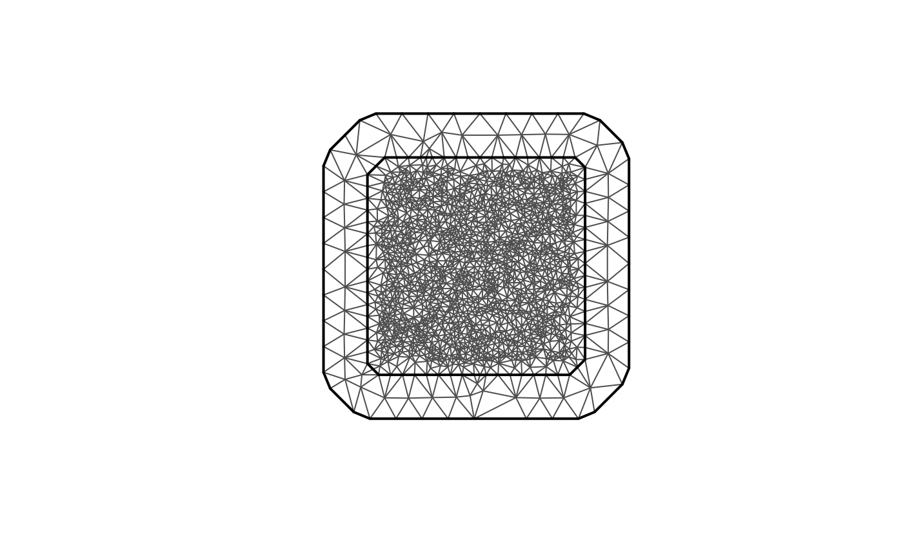
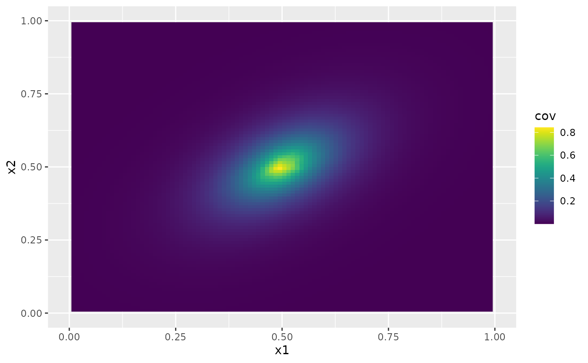
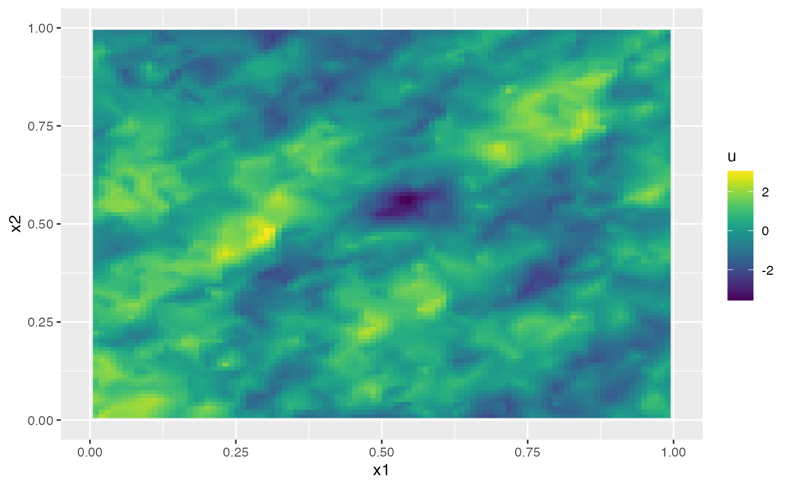
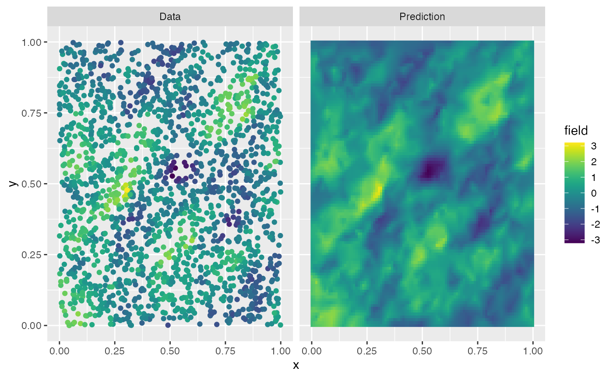

# Anisotropic models

## Introduction

For domains $`D\subset \mathbb{R}^2`$, the `rSPDE` package implements
the anisotropic Matérn model
``` math
    (I - \nabla\cdot (H\nabla))^{(\nu + 1)/2} u = c\sigma W, \quad \text{on }  D
```
Where $`H`$ is a $`2\times 2`$ positive definite matrix,
$`\sigma, \nu >0`$ and $`c`$ is a constant chosen such that $`u`$ would
have the covariance function
``` math
r(h) = \frac{\sigma^2}{2^{\nu-1}\Gamma(\nu)} (\sqrt{h^T H^{-1} h})^{\nu} K_{\nu}(\sqrt{h^T H^{-1} h}),
```
if the domain was $`D = \mathbb{R}^2`$, i.e., a stationary and
anisotropic Matérn covariance function. The matrix $`H`$ is defined as
``` math
H = \begin{bmatrix}
h_x^2 & h_xh_y h_{xy}\\
h_xh_y h_{xy} & h_y^2
\end{bmatrix}
```
with $`h_x,h_y>0`$ and $`h_{xy} \in (-1,1)`$.

## Implementation details

Let us begin by loading some packages needed for making the plots

``` r

library(ggplot2)
library(gridExtra)
library(viridis)
```

We start by creating a region of interest and a spatial mesh using the
`fmesher` package:

``` r

library(fmesher)
n_loc <- 2000
loc_2d_mesh <- matrix(runif(n_loc * 2), n_loc, 2)
mesh_2d <- fm_mesh_2d(
  loc = loc_2d_mesh,
  cutoff = 0.01,
  max.edge = c(0.1, 0.5)
)
plot(mesh_2d, main = "")
```



We now specify the model using the `matern2d.operators` function.

``` r

sigma <- 1
nu <- 0.5
hx <- 0.08
hy <- 0.08
hxy <- 0.5
op <- matern2d.operators(
  hx = hx, hy = hy, hxy = hxy, nu = nu,
  sigma = sigma, mesh = mesh_2d
)
```

The `matern2d.operators` object has `cov_function_mesh` method which can
be used evaluate the covariance function on the mesh. For example

``` r

r <- cov_function_mesh(op, p = matrix(c(0.5, 0.5), 1, 2))
proj <- fm_evaluator(mesh_2d, dims = c(100, 100), xlim = c(0, 1), ylim = c(0, 1))
r.mesh <- fm_evaluate(proj, field = as.vector(r))
cov.df <- data.frame(
  x1 = proj$lattice$loc[, 1],
  x2 = proj$lattice$loc[, 2],
  cov = c(r.mesh)
)
ggplot(cov.df, aes(x = x1, y = x2, fill = cov)) +
  geom_raster() +
  xlim(0, 1) +
  ylim(0, 1) +
  scale_fill_viridis()
#> Warning: Removed 396 rows containing missing values or values outside the scale range
#> (`geom_raster()`).
```



We can simulate from the field using the `simulate method`:

``` r

u <- simulate(op)
proj <- fm_evaluator(mesh_2d, dims = c(100, 100), xlim = c(0, 1), ylim = c(0, 1))
u.mesh <- fm_evaluate(proj, field = as.vector(u))
cov.df <- data.frame(
  x1 = proj$lattice$loc[, 1],
  x2 = proj$lattice$loc[, 2],
  u = c(u.mesh)
)
ggplot(cov.df, aes(x = x1, y = x2, fill = u)) +
  geom_raster() +
  xlim(0, 1) +
  ylim(0, 1) +
  scale_fill_viridis()
#> Warning: Removed 396 rows containing missing values or values outside the scale range
#> (`geom_raster()`).
```



Let us now simulate some data based on this simulated field.

``` r

n.obs <- 2000
obs.loc <- cbind(runif(n.obs), runif(n.obs))
A <- fm_basis(mesh_2d, obs.loc)
sigma.e <- 0.1
Y <- as.vector(A %*% u + sigma.e * rnorm(n.obs))
```

We can compute kriging predictions of the process $`u`$ based on these
observations. To specify which locations that should be predicted, the
argument `Aprd` is used. This argument should be an observation matrix
that links the mesh locations to the prediction locations.

``` r

A <- make_A(op, loc = obs.loc)
Aprd <- make_A(op, loc = proj$lattice$loc)
u.krig <- predict(op, A = A, Aprd = Aprd, Y = Y, sigma.e = sigma.e)
```

The process simulation, and the kriging prediction are shown in the
following figure.

``` r

data.df <- data.frame(x = obs.loc[, 1], y = obs.loc[, 2], field = Y, type = "Data")
krig.df <- data.frame(
  x = proj$lattice$loc[, 1], y = proj$lattice$loc[, 2],
  field = as.vector(u.krig$mean), type = "Prediction"
)
df_plot <- rbind(data.df, krig.df)
ggplot(df_plot) +
  aes(x = x, y = y, fill = field) +
  facet_wrap(~type) +
  geom_raster(data = krig.df) +
  geom_point(
    data = data.df, aes(colour = field),
    show.legend = FALSE
  ) +
  scale_fill_viridis() +
  scale_colour_viridis()
```

 Let us finally
use `rspde_lme` to estimate the parameters based on the data.

``` r

df <- data.frame(Y = as.matrix(Y), x = obs.loc[, 1], y = obs.loc[, 2])
res <- rspde_lme(Y ~ 1, loc = c("x", "y"), data = df, model = op, parallel = TRUE)
```

In the call, `y~1` indicates that we also want to estimate a mean value
of the model, and the arguments `loc` provides the names of the spatial
and temporal coordinates in the data frame. Let us see a summary of the
fitted model:

``` r

summary(res)
#> 
#> Latent model - Anisotropic Whittle-Matern
#> 
#> Call:
#> rspde_lme(formula = Y ~ 1, loc = c("x", "y"), data = df, model = op, 
#>     parallel = TRUE)
#> 
#> Fixed effects:
#>             Estimate Std.error z-value Pr(>|z|)
#> (Intercept)  -0.1569    0.1457  -1.077    0.282
#> 
#> Random effects:
#>       Estimate Std.error z-value
#> nu     0.44190   0.06000   7.365
#> sigma  0.95961   0.05450  17.609
#> hx     0.08968   0.01500   5.977
#> hy     0.08914   0.01478   6.030
#> hxy    0.57242   0.04927  11.618
#> 
#> Measurement error:
#>          Estimate Std.error z-value
#> std. dev   0.1003    0.0027   37.15
#> ---
#> Signif. codes:  0 '***' 0.001 '**' 0.01 '*' 0.05 '.' 0.1 ' ' 1 
#> 
#> Log-Likelihood:  -3.354359 
#> Number of function calls by 'optim' = 46
#> Optimization method used in 'optim' = L-BFGS-B
#> 
#> Time used to:     fit the model =  27.37154 secs 
#>   set up the parallelization = 2.85173 secs
```

Let us compare the estimated results with the true values:

``` r

results <- data.frame(
  sigma = c(sigma, res$coeff$random_effects[2]),
  hx = c(hx, res$coeff$random_effects[3]),
  hy = c(hy, res$coeff$random_effects[4]),
  hxy = c(hxy, res$coeff$random_effects[5]),
  nu = c(nu, res$coeff$random_effects[1]),
  sigma.e = c(sigma.e, res$coeff$measurement_error),
  intercept = c(0, res$coeff$fixed_effects),
  row.names = c("True", "Estimate")
)

print(results)
#>              sigma         hx         hy       hxy        nu   sigma.e
#> True     1.0000000 0.08000000 0.08000000 0.5000000 0.5000000 0.1000000
#> Estimate 0.9596148 0.08967586 0.08913957 0.5724202 0.4419019 0.1003199
#>           intercept
#> True      0.0000000
#> Estimate -0.1568538
```

Finally, we can also do prediction based on the fitted model as

``` r

pred.data <- data.frame(x = proj$lattice$loc[, 1], y = proj$lattice$loc[, 2])
pred <- predict(res, newdata = pred.data, loc = c("x", "y"))

data.df <- data.frame(x = obs.loc[, 1], y = obs.loc[, 2], field = Y, type = "Data")
krig.df <- data.frame(
  x = proj$lattice$loc[, 1], y = proj$lattice$loc[, 2],
  field = as.vector(u.krig$mean), type = "Prediction"
)
df_plot <- rbind(data.df, krig.df)
ggplot(df_plot) +
  aes(x = x, y = y, fill = field) +
  facet_wrap(~type) +
  geom_raster(data = krig.df) +
  geom_point(
    data = data.df, aes(colour = field),
    show.legend = FALSE
  ) +
  scale_fill_viridis() +
  scale_colour_viridis()
```



## Inlabru Implementation

We will now fit the model using the `inlabru` package. First, we load
the package, and create the anisotropic model object:

``` r

library(inlabru)

model_aniso <- rspde.anistropic2d(mesh = mesh_2d)
```

Then we create the component and fit the model using the `inlabru`
package. Observe that we can use the same data frame as in the
`rspde_lme` example.

``` r

cmp <- Y ~ Intercept(1) - 1 + field(cbind(x, y), model = model_aniso)
bru_fit_field <- bru(cmp, data = df, options = list(num.threads = "1:1"))
```

Let us now compare the estimated results (the means of the parameters)
with the true values. Observe that we are using the helper function
[`transform_parameters_anisotropic()`](https://davidbolin.github.io/rSPDE/reference/transform_parameters_anisotropic.md)
to change the scale of the estimated parameters back to the original
scale.

``` r

results <- data.frame(
  rbind(
    # True values
    c(hx = hx, hy = hy, hxy = hxy, sigma = sigma, nu = nu),
    # Estimated values transformed using transform_parameters_anisotropic
    transform_parameters_anisotropic(
      bru_fit_field$summary.hyperpar$mean[2:6],
      model_aniso[["nu_upper_bound"]]
    )
  ),
  # Add sigma.e values
  sigma.e = c(sigma.e, sqrt(1 / bru_fit_field$summary.hyperpar$mean[1])),
  # Add intercept values
  intercept = c(0, bru_fit_field$summary.fixed$mean),
  row.names = c("True", "Estimate")
)

print(results)
#>                  hx         hy       hxy     sigma       nu   sigma.e
#> True           0.08       0.08       0.5         1      0.5 0.1000000
#> Estimate 0.09184061 0.09097908 0.5725058 0.9740794 0.447389 0.1000421
#>           intercept
#> True      0.0000000
#> Estimate -0.1604084
```
