# Intrinsic models in the rSPDE package

### Introduction

In this vignette we provide a brief introduction to the intrinsic models
implemented in the `rSPDE` package.

### A fractional intrinsic model

A basic intrinsic model which is implemented in `rSPDE` is defined as  
``` math
(-\Delta)^{\beta/2}(\tau u) = \mathcal{W},
```
where $`\beta > d/2`$ and $`d`$ is the dimension of the spatial domain.

To illustrate these models, we begin by defining a mesh over
$`[0,2]\times [0, 2]`$:

``` r

library(fmesher)
bnd <- fm_segm(rbind(c(0, 0), c(2, 0), c(2, 2), c(0, 2)), is.bnd = TRUE)
mesh_2d <- fm_mesh_2d(
    boundary = bnd, 
    cutoff = 0.02,
    max.edge = c(0.1)
)
plot(mesh_2d, main = "")
```

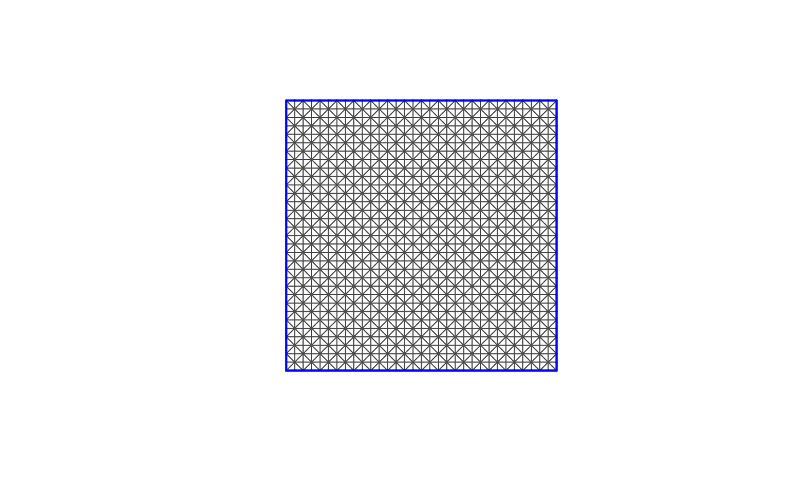

We now use the
[`intrinsic.operators()`](https://davidbolin.github.io/rSPDE/reference/intrinsic.operators.md)
function to construct the `rSPDE` representation of the general model.

``` r

library(rSPDE)
tau <- 0.2
beta <- 1.8
fem <- fm_fem(mesh_2d)
op <- intrinsic.operators(tau = tau, beta = beta, mesh = mesh_2d, m = 2)
```

To see that the `rSPDE` model is approximating the true model, we can
compare the variogram of the approximation (implemented in the function
`variogram` in the model object) with the true variogram (implemented in
[`variogram.intrinsic.spde()`](https://davidbolin.github.io/rSPDE/reference/variogram.intrinsic.spde.md))
as follows.

``` r

point <- matrix(c(1,1),1,2)
Gamma <- op$variogram(point)
vario <- variogram.intrinsic.spde(point, mesh_2d$loc[,1:2], tau = tau,
                                  beta = beta, L = 2, d = 2)
d = sqrt((mesh_2d$loc[,1]-point[1])^2 +  (mesh_2d$loc[,2]-point[2])^2)
plot(d, Gamma, xlim = c(0,0.7), ylim = c(0,3),
     ylab = "variogram(h)", xlab = "h")
points(d,vario,col=2)
```

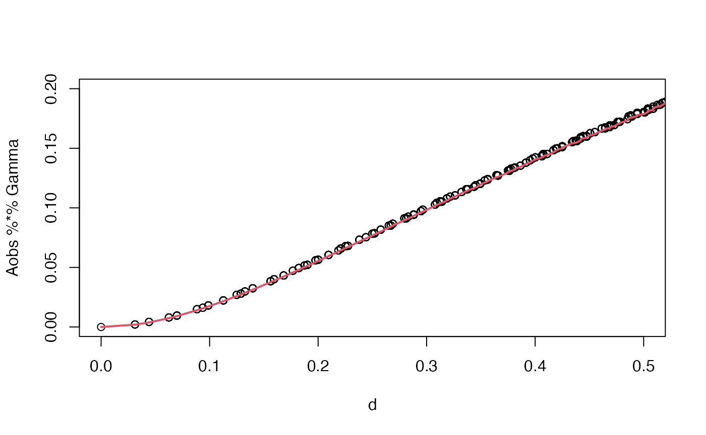

If we want to increase the accuracy, we can either use a finer mesh or
increase the order of the rational approximation through the argument
`m` in `intrinsic.operators`. The default value of `m` is 1. We can now
use the `simulate` function to simulate a realization of the field
$`u`$:

``` r

u <- simulate(op,nsim = 1)

proj <- fm_evaluator(mesh_2d, dims = c(100, 100))
field <- fm_evaluate(proj, field = as.vector(u))
field.df <- data.frame(x1 = proj$lattice$loc[,1],
                       x2 = proj$lattice$loc[,2], 
                       y = as.vector(field))

library(ggplot2)
library(viridis)
#> Loading required package: viridisLite
ggplot(field.df, aes(x = x1, y = x2, fill = y)) +
    geom_raster() +
    scale_fill_viridis()
```

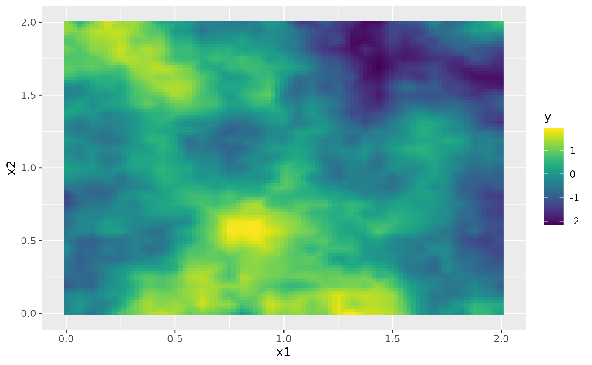

By default, the field is simulated with a zero-integral constraint.

### Fitting the model with `R-INLA`

Let us now consider a simple Gaussian linear model where the spatial
field $`u(\mathbf{s})`$ is observed at $`m`$ locations,
$`\{\mathbf{s}_1 , \ldots , \mathbf{s}_m \}`$ under Gaussian measurement
noise. For each $`i = 1,\ldots,m,`$ we have
``` math
\begin{align} 
y_i &= u(\mathbf{s}_i)+\varepsilon_i\\
\end{align},
```
where $`\varepsilon_1,\ldots,\varepsilon_{m}`$ are iid normally
distributed with mean 0 and standard deviation 0.1.

To generate a data set `y` from this model, we first draw some
observation locations at random in the domain and then use the
[`spde.make.A()`](https://davidbolin.github.io/rSPDE/reference/spde.make.A.md)
functions (that wraps the functions
[`fm_basis()`](https://inlabru-org.github.io/fmesher/reference/fm_basis.html),
[`fm_block()`](https://inlabru-org.github.io/fmesher/reference/fm_block.html)
and
[`fm_row_kron()`](https://inlabru-org.github.io/fmesher/reference/fm_row_kron.html)
of the `fmesher` package) to construct the observation matrix which can
be used to evaluate the simulated field $`u`$ at the observation
locations. After this we simply add the measurment noise.

``` r

n_loc <- 1000
loc_2d_mesh <- matrix(2*runif(n_loc * 2), n_loc, 2)

A <- spde.make.A(
  mesh = mesh_2d,
  loc = loc_2d_mesh
)
sigma.e <- 0.1
y <- A %*% u + rnorm(n_loc) * sigma.e
```

The generated data can be seen in the following image.

``` r

df <- data.frame(x1 = as.double(loc_2d_mesh[, 1]),
  x2 = as.double(loc_2d_mesh[, 2]), y = as.double(y))
ggplot(df, aes(x = x1, y = x2, col = y)) +
  geom_point() +
  scale_color_viridis()
```

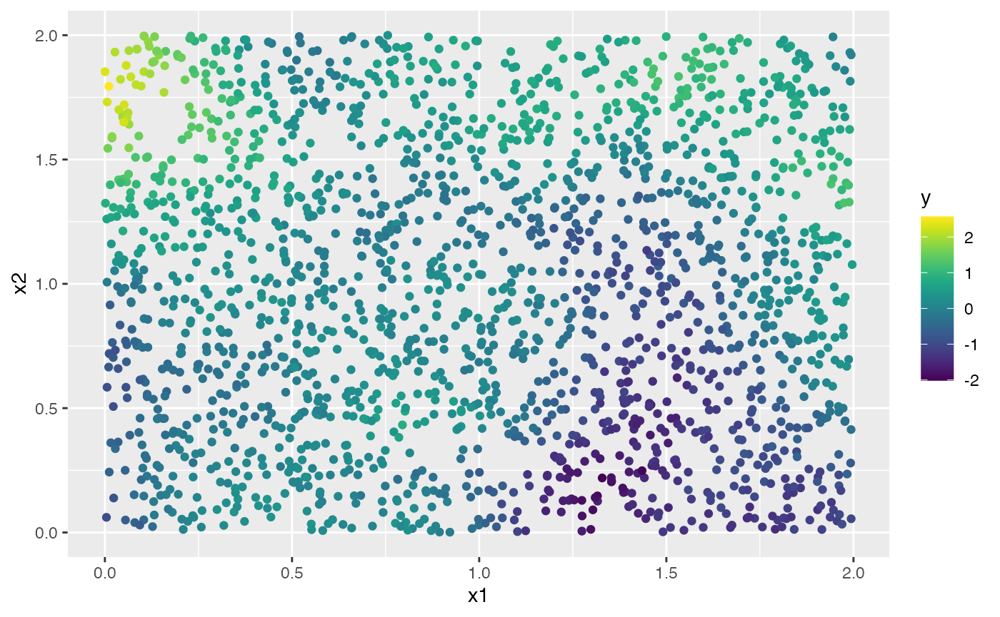

We will now fit the model using our [`R-INLA`](https://www.r-inla.org)
implementation of the rational SPDE approach. Further details on this
implementation can be found in [R-INLA implementation of the rational
SPDE
approach](https://davidbolin.github.io/rSPDE/articles/rspde_inla.md).

``` r

library(INLA)
#> 
rspde.order <- 2
mesh.index <- rspde.make.index(name = "field", mesh = mesh_2d, rspde.order = rspde.order)
Abar <- rspde.make.A(mesh = mesh_2d, loc = loc_2d_mesh, rspde.order = rspde.order)
st.dat <- inla.stack(data = list(y = as.vector(y)), A = Abar, effects = mesh.index)
```

We now create the model object.

``` r

rspde_model <- rspde.intrinsic(mesh = mesh_2d, rspde.order = rspde.order)
```

Finally, we create the formula and fit the model to the data:

``` r

f <- y ~ -1 + f(field, model = rspde_model)
rspde_fit <- inla(f,
                  data = inla.stack.data(st.dat),
                  family = "gaussian",
                  control.predictor = list(A = inla.stack.A(st.dat)))
```

To compare the estimated parameters to the true parameters, we can do
the following:

``` r

result_fit <- rspde.result(rspde_fit, "field", rspde_model)
summary(result_fit)
#>         mean        sd 0.025quant 0.5quant 0.975quant     mode
#> tau 0.124755 0.0254674  0.0817853 0.122389    0.18143 0.117699
#> nu  0.969231 0.0713635  0.8308710 0.968604    1.11068 0.966821
tau <- op$tau
nu <- op$beta - 1 #beta = nu + d/2 
result_df <- data.frame(
    parameter = c("tau", "nu", "sigma.e"),
    true = c(tau, nu, sigma.e), 
    mean = c(result_fit$summary.tau$mean,result_fit$summary.nu$mean,
             sqrt(1/rspde_fit$summary.hyperpar[1,1])),
    mode = c(result_fit$summary.tau$mode, result_fit$summary.nu$mode,
             sqrt(1/rspde_fit$summary.hyperpar[1,6]))
)
print(result_df)
#>   parameter true       mean       mode
#> 1       tau  0.2 0.12475546 0.11769865
#> 2        nu  0.8 0.96923117 0.96682118
#> 3   sigma.e  0.1 0.09783659 0.09827982
```

### Extreme value models

When used for extreme value statistics, one might want to use a
particular form of the mean value of the latent field $`u`$, which is
zero at one location $`k`$ and is given by the diagonal of
$`Q_{-k,-k}^{-1}`$ for the remaining locations. This option can be
specified via the `mean.correction` argument of `rspde.intrinsic`:

``` r

rspde_model2 <- rspde.intrinsic(mesh = mesh_2d, rspde.order = rspde.order,
                                mean.correction = TRUE)
```

We can then fit this model as before:

``` r

f <- y ~ -1 + f(field, model = rspde_model2)
rspde_fit <- inla(f,
                  data = inla.stack.data(st.dat),
                  family = "gaussian",
                  control.predictor = list(A = inla.stack.A(st.dat)))
```

To see the posterior distributions of the parameters we can do:

``` r

result_fit <- rspde.result(rspde_fit, "field", rspde_model2)
posterior_df_fit <- gg_df(result_fit)

ggplot(posterior_df_fit) + geom_line(aes(x = x, y = y)) + 
facet_wrap(~parameter, scales = "free") + labs(y = "Density")
```

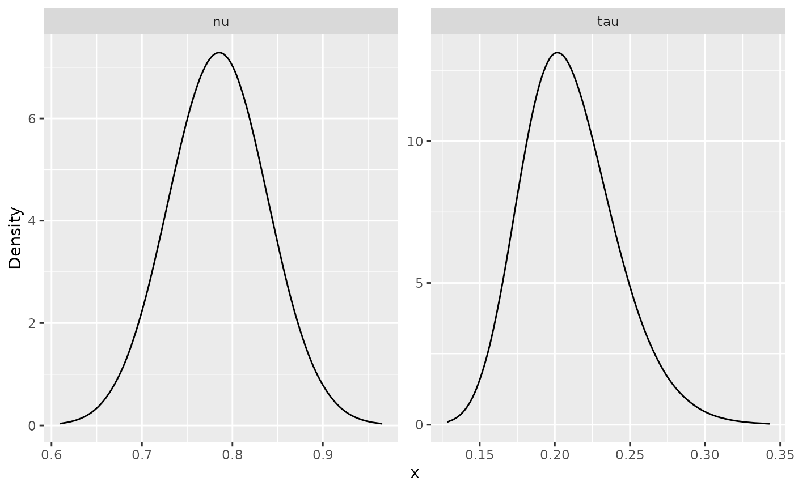

### An example with replicates

Let us redo the previous example with replicated data to illustrate that
replicates are handled in the same way as any other `rSPDE` model. We
start by generating some data with 200 observations per replicate

``` r

set.seed(1)
tau <- 0.2
beta <- 1.9
op <- intrinsic.operators(tau = tau, beta = beta, mesh = mesh_2d)
n.rep <- 5
m <- 1000
loc_2d_mesh <- matrix(2*runif(m * 2), m, 2)

A <- spde.make.A(
  mesh = mesh_2d,
  loc = loc_2d_mesh,
  index = rep(1:m, times = n.rep),
  repl = rep(1:n.rep, each = m)
)

u <- simulate(op, nsim = n.rep)
y <- as.vector(A %*% as.vector(u)) +
  rnorm(m * n.rep) * 0.1
```

We now create the stack, A matrix and index and fit the model:

``` r

Abar.rep <- rspde.make.A(
  mesh = mesh_2d, loc = loc_2d_mesh, index = rep(1:m, times = n.rep),
  repl = rep(1:n.rep, each = m)
)
mesh.index.rep <- rspde.make.index(
  name = "field", mesh = mesh_2d,
  n.repl = n.rep
)

st.dat.rep <- inla.stack(
  data = list(y = y),
  A = Abar.rep,
  effects = mesh.index.rep
)

rspde_model.rep <- rspde.intrinsic(mesh = mesh_2d, prior.nu.dist = "beta")

f.rep <-
  y ~ -1 + f(field,
    model = rspde_model.rep,
    replicate = field.repl
  )
rspde_fit.rep <-
  inla(f.rep,
    data = inla.stack.data(st.dat.rep),
    family = "gaussian",
    control.predictor =
      list(A = inla.stack.A(st.dat.rep))
  )
```

We then compare with the true parameter estimates as before

``` r

result_fit <- rspde.result(rspde_fit.rep, "field", rspde_model.rep)
summary(result_fit)
#>         mean        sd 0.025quant 0.5quant 0.975quant     mode
#> tau 0.176770 0.0090402   0.158024 0.177297   0.193194 0.179458
#> nu  0.924852 0.0128763   0.902314 0.923791   0.952477 0.920046
tau <- op$tau
nu <- op$beta - 1 #beta = nu + d/2 
result_df <- data.frame(
    parameter = c("tau", "nu", "sigma.e"),
    true = c(tau, nu, sigma.e), 
    mean = c(result_fit$summary.tau$mean,result_fit$summary.nu$mean,
             sqrt(1/rspde_fit.rep$summary.hyperpar[1,1])),
    mode = c(result_fit$summary.tau$mode, result_fit$summary.nu$mode,
             sqrt(1/rspde_fit.rep$summary.hyperpar[1,6]))
)
print(result_df)
#>   parameter true       mean       mode
#> 1       tau  0.2 0.17676983 0.17945787
#> 2        nu  0.9 0.92485248 0.92004609
#> 3   sigma.e  0.1 0.09988894 0.09972173
```

To see the posterior distributions of the parameters we can do:

``` r

result_fit <- rspde.result(rspde_fit.rep, "field", rspde_model.rep)
posterior_df_fit <- gg_df(result_fit)

ggplot(posterior_df_fit) + geom_line(aes(x = x, y = y)) + 
facet_wrap(~parameter, scales = "free") + labs(y = "Density")
```

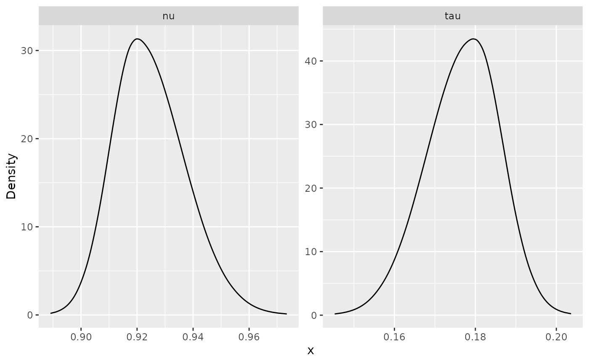

## A more general model

The `rSPDE` package also contains a partial implementation of a more
general intrinsic model, which we refer to as an intrinsic Matérn model.
The model is defined as  
``` math
(-\Delta)^{\beta/2}(\kappa^2-\Delta)^{\alpha/2}(\tau u) = \mathcal{W},
```
where $`\alpha + \beta > d/2`$ and $`d`$ is the dimension of the spatial
domain. These models are handled by performing two rational
approximations, one for each fractional operator.

To illustrate this model, we consider the same mesh as before and use
the
[`intrinsic.matern.operators()`](https://davidbolin.github.io/rSPDE/reference/intrinsic.matern.operators.md)
function to construct the `rSPDE` representation of the general model.

``` r

bnd <- fm_segm(rbind(c(0, 0), c(2, 0), c(2, 2), c(0, 2)), is.bnd = TRUE)
mesh_2d <- fm_mesh_2d(
    boundary = bnd, 
    cutoff = 0.01,
    max.edge = c(0.05)
)

kappa <- 10
tau <- 0.0025
alpha <- 2
beta <- 1
op <- intrinsic.matern.operators(kappa = kappa, tau = tau, alpha = alpha, 
                                 beta = beta, mesh = mesh_2d)
```

To see that the `rSPDE` model is approximating the true model, we can
compare the variogram of the approximation with the true variogram
(implemented in
[`variogram.intrinsic.spde()`](https://davidbolin.github.io/rSPDE/reference/variogram.intrinsic.spde.md))
as follows.

``` r

point <- matrix(c(1,1),1,2)
Gamma <- op$variogram(point)
vario <- variogram.intrinsic.spde(point, mesh_2d$loc[,1:2], kappa = kappa, 
                                  alpha = alpha, tau = tau,
                                  beta = beta, L = 2, d = 2)

d = sqrt((mesh_2d$loc[,1]-point[1])^2 +  (mesh_2d$loc[,2]-point[2])^2)
plot(d, Gamma, xlim = c(0,0.5), ylim = c(0,4),
     ylab = "variogram(h)", xlab = "h")
lines(sort(d),sort(vario),col=2, lwd = 2)
```

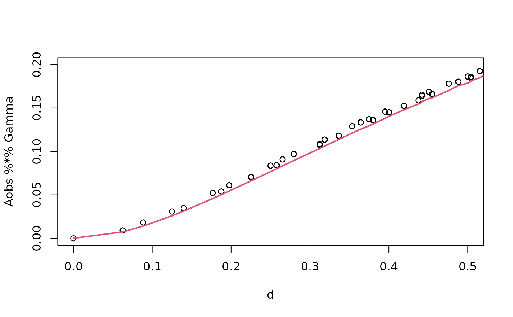

We can now use the `simulate` function to simulate a realization of the
field $`u`$:

``` r

u <- simulate(op,nsim = 1, use_kl = FALSE)

proj <- fm_evaluator(mesh_2d, dims = c(100, 100))
field <- fm_evaluate(proj, field = as.vector(u))
field.df <- data.frame(x1 = proj$lattice$loc[,1],
                       x2 = proj$lattice$loc[,2], 
                       y = as.vector(field))

library(ggplot2)
library(viridis)
ggplot(field.df, aes(x = x1, y = x2, fill = y)) +
    geom_raster() +
    scale_fill_viridis()
```

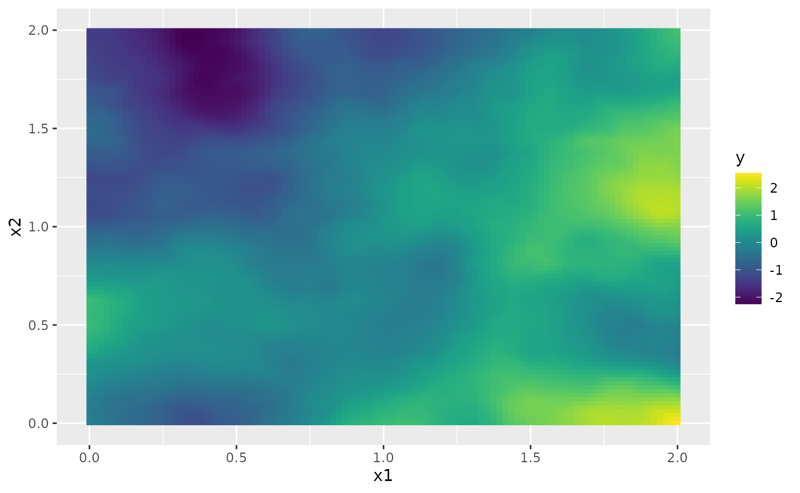

By default, the field is simulated with a zero-integral constraint.

### Fitting the model with `R-INLA`

We will now fit the model using our [`R-INLA`](https://www.r-inla.org)
implementation of the rational SPDE approach. Further details on this
implementation can be found in [R-INLA implementation of the rational
SPDE
approach](https://davidbolin.github.io/rSPDE/articles/rspde_inla.md).

We begin by simulating some data as before.

``` r

n_loc <- 2000
loc_2d_mesh <- matrix(2*runif(n_loc * 2), n_loc, 2)

A <- spde.make.A(
  mesh = mesh_2d,
  loc = loc_2d_mesh
)
sigma.e <- 0.1
y <- A %*% u + rnorm(n_loc) * sigma.e
```

The generated data can be seen in the following image.

``` r

df <- data.frame(x1 = as.double(loc_2d_mesh[, 1]),
  x2 = as.double(loc_2d_mesh[, 2]), y = as.double(y))
ggplot(df, aes(x = x1, y = x2, col = y)) +
  geom_point() +
  scale_color_viridis()
```

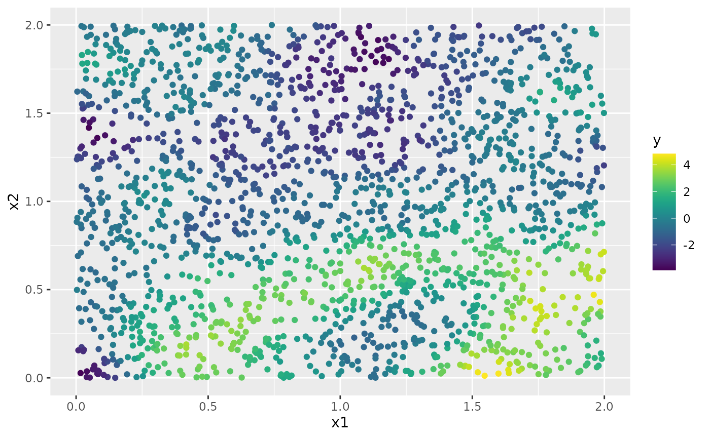

To fit the model, we create the $`A`$ matrix, the index, and the
`inla.stack` object. For now, these more general models can only be
estimated with $`\beta = 1`$ and $`\alpha = 1`$ or $`\alpha = 2`$. For
these non-fractional models, we can use the standard INLA functions to
make the required elements.

``` r

mesh.index <- inla.spde.make.index(name = "field", n.spde = mesh_2d$n)

st.dat <- inla.stack(data = list(y = as.vector(y)), A = A, effects = mesh.index)
```

We now create the model object.

``` r

rspde_model <- rspde.intrinsic.matern(mesh = mesh_2d, alpha = alpha)
```

Finally, we create the formula and fit the model to the data:

``` r

f <- y ~ -1 + f(field, model = rspde_model)
rspde_fit <- inla(f,
                  data = inla.stack.data(st.dat),
                  family = "gaussian",
                  control.predictor = list(A = inla.stack.A(st.dat)))
```

We can get a summary of the fit:

``` r

summary(rspde_fit)
#> Time used:
#>     Pre = 0.145, Running = 21.5, Post = 0.0574, Total = 21.7 
#> Random effects:
#>   Name     Model
#>     field CGeneric
#> 
#> Model hyperparameters:
#>                                           mean    sd 0.025quant 0.5quant
#> Precision for the Gaussian observations 100.68 4.490      92.10   100.59
#> Theta1 for field                         -5.98 0.048      -6.07    -5.98
#> Theta2 for field                          2.35 0.086       2.17     2.35
#>                                         0.975quant   mode
#> Precision for the Gaussian observations     109.78 100.44
#> Theta1 for field                             -5.88  -5.98
#> Theta2 for field                              2.51   2.35
#> 
#> Marginal log-Likelihood:  727.86 
#>  is computed 
#> Posterior summaries for the linear predictor and the fitted values are computed
#> (Posterior marginals needs also 'control.compute=list(return.marginals.predictor=TRUE)')
```

To get a summary of the fit of the random field only, we can do the
following:

``` r

result_fit <- rspde.result(rspde_fit, "field", rspde_model)
summary(result_fit)
#>              mean         sd 0.025quant    0.5quant  0.975quant       mode
#> tau    0.00253238 0.00012128 0.00230556  0.00252731  0.00278183  0.0025164
#> kappa 10.49110000 0.89757000 8.79922000 10.47040000 12.32020000 10.4491000
tau <- op$tau
result_df <- data.frame(
  parameter = c("tau", "kappa"),
  true = c(tau, kappa), mean = c(result_fit$summary.tau$mean,
                                     result_fit$summary.kappa$mean),
  mode = c(result_fit$summary.tau$mode, result_fit$summary.kappa$mode)
)
print(result_df)
#>   parameter    true         mean         mode
#> 1       tau  0.0025  0.002532378  0.002516398
#> 2     kappa 10.0000 10.491140458 10.449129306
```

### Kriging with `R-INLA` implementation

Let us now obtain predictions (i.e., do kriging) of the latent field on
a dense grid in the region.

We begin by creating the grid of locations where we want to compute the
predictions. To this end, we can use the
[`rspde.mesh.projector()`](https://davidbolin.github.io/rSPDE/reference/rspde.mesh.project.md)
function. This function has the same arguments as the function
[`inla.mesh.projector()`](https://rdrr.io/pkg/INLA/man/inla.mesh.project.html)
the only difference being that the rSPDE version also has an argument
`nu` and an argument `rspde.order`. Thus, we proceed in the same fashion
as we would in [`R-INLA`](https://www.r-inla.org)’s standard SPDE
implementation:

``` r

projgrid <- inla.mesh.projector(mesh_2d,
  xlim = c(0, 2),
  ylim = c(0, 2)
)
#> Warning: `inla.mesh.projector()` was deprecated in INLA 23.06.07.
#> ℹ Please use `fmesher::fm_evaluator()` instead.
#> ℹ For more information, see
#>   https://inlabru-org.github.io/fmesher/articles/inla_conversion.html
#> ℹ To silence these deprecation messages in old legacy code, set
#>   `inla.setOption(fmesher.evolution.warn = FALSE)`.
#> ℹ To ensure visibility of these messages in package tests, also set
#>   `inla.setOption(fmesher.evolution.verbosity = 'warn')`.
#> This warning is displayed once per session.
#> Call `lifecycle::last_lifecycle_warnings()` to see where this warning was
#> generated.
```

This lattice contains 100 × 100 locations (the default). Let us now
calculate the predictions jointly with the estimation. To this end,
first, we begin by linking the prediction coordinates to the mesh nodes
through an $`A`$ matrix

``` r

A.prd <- projgrid$proj$A
```

We now make a stack for the prediction locations. We have no data at the
prediction locations, so we set `y= NA`. We then join this stack with
the estimation stack.

``` r

ef.prd <- list(c(mesh.index))
st.prd <- inla.stack(
  data = list(y = NA),
  A = list(A.prd), tag = "prd",
  effects = ef.prd
)
st.all <- inla.stack(st.dat, st.prd)
```

Doing the joint estimation takes a while, and we therefore turn off the
computation of certain things that we are not interested in, such as the
marginals for the random effect. We will also use a simplified
integration strategy (actually only using the posterior mode of the
hyper-parameters) through the command
`control.inla = list(int.strategy = "eb")`, i.e. empirical Bayes:

``` r

rspde_fitprd <- inla(f,
  family = "Gaussian",
  data = inla.stack.data(st.all),
  control.predictor = list(
    A = inla.stack.A(st.all),
    compute = TRUE, link = 1
  ),
  control.compute = list(
    return.marginals = FALSE,
    return.marginals.predictor = FALSE
  ),
  control.inla = list(int.strategy = "eb")
)
```

We then extract the indices to the prediction nodes and then extract the
mean and the standard deviation of the response:

``` r

id.prd <- inla.stack.index(st.all, "prd")$data
m.prd <- matrix(rspde_fitprd$summary.fitted.values$mean[id.prd], 100, 100)
sd.prd <- matrix(rspde_fitprd$summary.fitted.values$sd[id.prd], 100, 100)
```

Finally, we plot the results. First the mean:

``` r

field.pred.df <- data.frame(x1 = projgrid$lattice$loc[,1],
                        x2 = projgrid$lattice$loc[,2], 
                        y = as.vector(m.prd))
ggplot(field.pred.df, aes(x = x1, y = x2, fill = y)) +
  geom_raster()  + scale_fill_viridis()
```

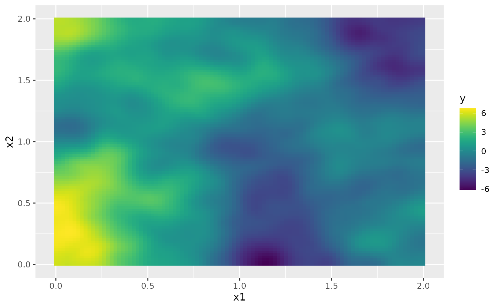

Then, the marginal standard deviations:

``` r

field.pred.sd.df <- data.frame(x1 = proj$lattice$loc[,1],
                        x2 = proj$lattice$loc[,2], 
                        sd = as.vector(sd.prd))
ggplot(field.pred.sd.df, aes(x = x1, y = x2, fill = sd)) +
  geom_raster() + scale_fill_viridis()
```

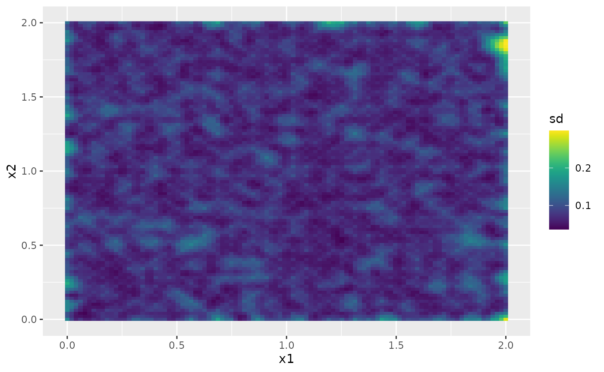

## Using intrinsic models without `R-INLA`

Currently, the more general model is only implemented in `R-INLA` using
fixed integer values of the smoothness parameters. However, all
intrinsic models are implemented in `rSPDE` in full generality. In this
section, we illustrate the `rSPDE` interface. Let us test a model in one
dimension.

Let us start with generating the model

``` r

L = 20
x <- seq(from = 0, to = L, length.out = 101)
mesh <- fm_mesh_1d(x)
beta <- 1.1
alpha <- 0
kappa <- 10
tau <- 10
op <- intrinsic.matern.operators(kappa = kappa, tau = tau, alpha = alpha,
                                 beta = beta, mesh = mesh, d = 1)

vario <- variogram.intrinsic.spde(c(L/2), mesh$loc, tau = tau,
                                  beta = beta, alpha = alpha, kappa = kappa, L = L, d = 1)
plot(x, vario, type = "l", col = 2, lwd = 2)
points(x,op$variogram(L/2),col=1)
```

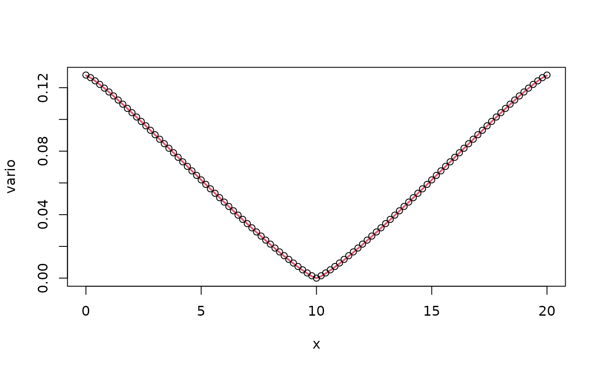

We now generate some data. The option to use a mean value correction for
extremes models is also implemented, so we generate some data using
this.

``` r

n.rep <- 100
u <- simulate(op,nsim = n.rep, integral.constraint = FALSE, use_kl = TRUE)

drift <- op$mean_correction()
u <- u + matrix(rep(drift, times = n.rep), nrow = op$n, ncol= n.rep)

sigma.e <- 0.01
n.obs <- 300
obs.loc <- runif(n = n.obs, min = 0, max = L)
A <- rSPDE.A1d(x, obs.loc)
Y <- as.matrix(A %*% u + sigma.e * matrix(rnorm(n.obs*n.rep),n.obs,n.rep))
```

Let us now show how to do kriging prediction for this model.

``` r

A <- make_A(op, loc = obs.loc)
A.krig <- make_A(op, loc = x)
u.krig <- predict(op,
  A = A, Aprd = A.krig, Y = Y[,1], sigma.e = sigma.e,
  compute.variances = TRUE
)


plot(obs.loc, Y[,1],
  ylab = "u(x)", xlab = "x", main = "Data and prediction",
  ylim = c(
    min(c(min(u.krig$mean - 2 * sqrt(u.krig$variance)),min(u[,1]))),
    max(c(max(u.krig$mean + 2 * sqrt(u.krig$variance)), max(u[,1])))
  )
)
lines(x,u[,1],col=3)
lines(x, u.krig$mean)
lines(x, u.krig$mean + 2 * sqrt(u.krig$variance), col = 2)
lines(x, u.krig$mean - 2 * sqrt(u.krig$variance), col = 2)
```

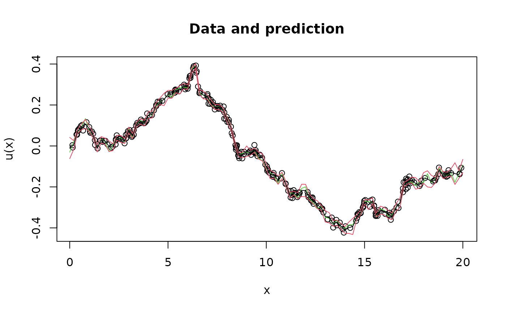

We now use `rspde_lme` to fit the parameters based on this data. Since
we generated data with `alpha=0`, we specify this in the function to
indicate that this parameter should not be fitted but kept fixed at
`alpha=0` by setting `fix_alpha=0` in `model_options`. We also specify
`mean_correction=TRUE` to indicate that we should use the mean value
correction when fitting.

``` r

data = data.frame(y = c(Y), loc = rep(obs.loc, n.rep), rep  = rep(1:n.rep, each = n.obs))

fit <- rspde_lme(y ~ -1, loc = "loc", repl  = "rep", data = data,
                 model = op, mean_correction = TRUE, parallel = TRUE,
                 model_options = list(fix_alpha = 0))

rbind(c(fit$coeff$random_effects[c("beta", "tau")], fit$coeff$measurement_error), 
      c(beta, tau, sigma.e))
#>          beta      tau    std. dev
#> [1,] 1.089129 10.02531 0.009988161
#> [2,] 1.100000 10.00000 0.010000000
```

### An example with estimated alpha and beta parameters

In the previous example, we fixed the alpha parameter and only estimated
beta. Now, let us demonstrate how to estimate both alpha and beta
simultaneously. We will set up a new model with different parameter
values:

``` r

L = 20
x <- seq(from = 0, to = L, length.out = 101)
mesh <- fm_mesh_1d(x)
beta <- 1.2
alpha <- 0.3
kappa <- 15
tau <- 7
op <- intrinsic.matern.operators(kappa = kappa, tau = tau, alpha = alpha,
                                 beta = beta, mesh = mesh, d = 1)

vario <- variogram.intrinsic.spde(c(L/2), mesh$loc, tau = tau,
                                  beta = beta, alpha = alpha, kappa = kappa, L = L, d = 1)
plot(x, vario, type = "l", col = 2, lwd = 2)
points(x, op$variogram(L/2), col = 1)
```

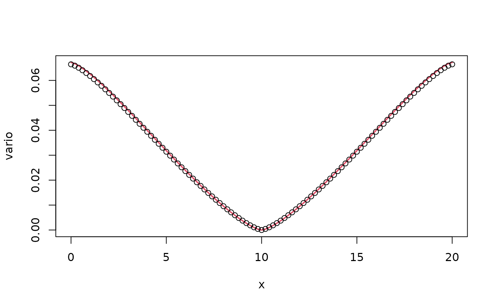

We can note here that the variogram of the approximate model is not
particularly close to the variogram of the true continuous model. The
reason for this is that the value of `alpha` is very small, and we
therefore need a larger order of the rational approximation than the
default value of 2. We can adjust the orders of the rational
approximations through the `m_alpha` and `m_beta` values in
`intrinsic.matern.operators`. Let us increase the value of `m_alpha` and
decrease the value of `m_beta`.

``` r

op <- intrinsic.matern.operators(kappa = kappa, tau = tau, alpha = alpha,
                                 beta = beta, mesh = mesh, d = 1, m_alpha = 6, 
                                 m_beta = 1)

vario <- variogram.intrinsic.spde(c(L/2), mesh$loc, tau = tau,
                                  beta = beta, alpha = alpha, kappa = kappa, L = L, d = 1)
plot(x, vario, type = "l", col = 2, lwd = 2)
points(x, op$variogram(L/2), col = 1)
```

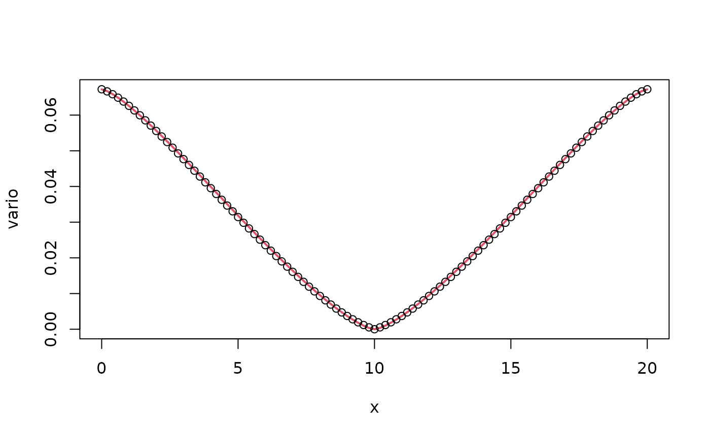

We now have a better approximation. Similar to the previous example, we
will generate data with the mean value correction for extremes models:

``` r

n.rep <- 100
u <- simulate(op, nsim = n.rep, integral.constraint = FALSE, use_kl = TRUE)

drift <- op$mean_correction()
u <- u + matrix(rep(drift, times = n.rep), nrow = op$n, ncol = n.rep)

sigma.e <- 0.015
n.obs <- 300
obs.loc <- runif(n = n.obs, min = 0, max = L)
A <- rSPDE.A1d(x, obs.loc)
Y <- as.matrix(A %*% u + sigma.e * matrix(rnorm(n.obs*n.rep), n.obs, n.rep))
```

Let’s visualize the data and predictions for this model:

``` r

A <- make_A(op, loc = obs.loc)
A.krig <- make_A(op, loc = x)
u.krig <- predict(op,
  A = A, Aprd = A.krig, Y = Y[,1], sigma.e = sigma.e,
  compute.variances = TRUE
)

plot(obs.loc, Y[,1],
  ylab = "u(x)", xlab = "x", main = "Data and prediction with fractional alpha and beta",
  ylim = c(
    min(c(min(u.krig$mean - 2 * sqrt(u.krig$variance)), min(u[,1]))),
    max(c(max(u.krig$mean + 2 * sqrt(u.krig$variance)), max(u[,1])))
  )
)
lines(x, u[,1], col = 3)
lines(x, u.krig$mean)
lines(x, u.krig$mean + 2 * sqrt(u.krig$variance), col = 2)
lines(x, u.krig$mean - 2 * sqrt(u.krig$variance), col = 2)
```

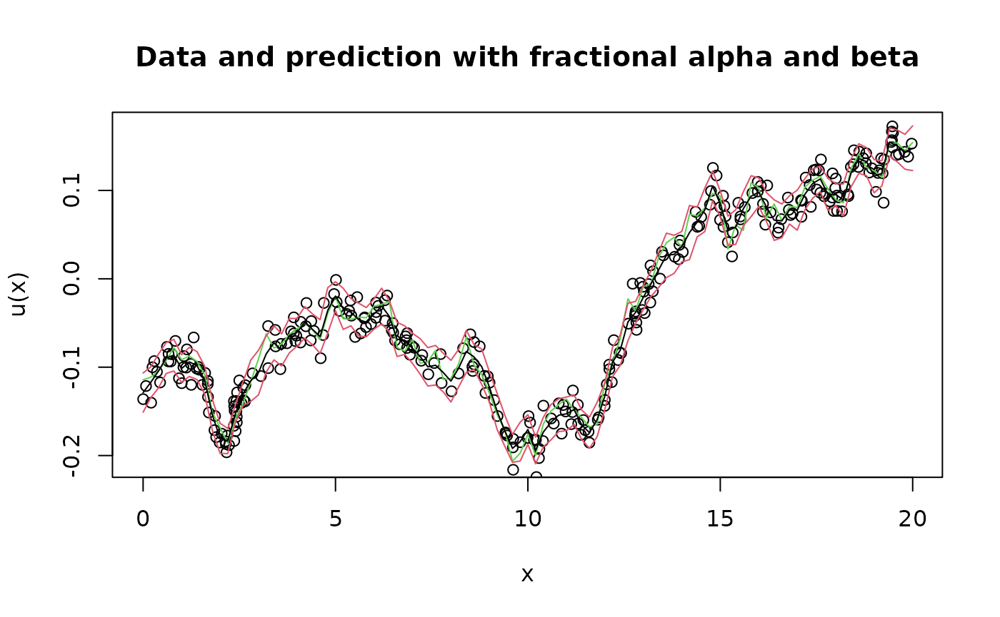

Now, we will use `rspde_lme` to fit the parameters but this time we will
not fix alpha, allowing both alpha and beta to be estimated. Unlike the
previous example where we set `fix_alpha=0`, we do not include this
constraint:

``` r

data = data.frame(y = c(Y), loc = rep(obs.loc, n.rep), rep = rep(1:n.rep, each = n.obs))
op <- intrinsic.matern.operators(kappa = kappa, tau = tau, alpha = 1.3, beta = 1.05, mesh = mesh, d = 1, m_alpha = 3, m_beta = 1)
fit <- rspde_lme(y ~ -1, loc = "loc", repl = "rep", data = data,
                 model = op, mean_correction = TRUE, parallel = FALSE)
#> alpha =  1.3 , tau =  7 , beta = 1.05 , sigma_e =  0.01600249 , lik =  -19908.86 nz =  8 , nz.p =  7 
#> alpha =  1.3 , tau =  7.007004 , beta = 1.05 , sigma_e =  0.01600249 , lik =  -20037.54 nz =  8 , nz.p =  7 
#> alpha =  1.3 , tau =  6.993003 , beta = 1.05 , sigma_e =  0.01600249 , lik =  -19780.33 nz =  8 , nz.p =  7 
#> alpha =  1.3 , tau =  7 , beta = 1.05 , sigma_e =  0.01600249 , lik =  -20075.76 nz =  8 , nz.p =  7 
#> alpha =  1.3 , tau =  7 , beta = 1.05 , sigma_e =  0.01600249 , lik =  -19742.22 nz =  8 , nz.p =  7 
#> alpha =  1.301301 , tau =  7 , beta = 1.05 , sigma_e =  0.01600249 , lik =  -20362.64 nz =  8 , nz.p =  7 
#> alpha =  1.298701 , tau =  7 , beta = 1.05 , sigma_e =  0.01600249 , lik =  -19457.5 nz =  8 , nz.p =  7 
#> alpha =  1.3 , tau =  7 , beta = 1.051051 , sigma_e =  0.01600249 , lik =  -19780.42 nz =  8 , nz.p =  7 
#> alpha =  1.3 , tau =  7 , beta = 1.048951 , sigma_e =  0.01600249 , lik =  -20037.58 nz =  8 , nz.p =  7 
#> alpha =  1.3 , tau =  7 , beta = 1.05 , sigma_e =  0.0160185 , lik =  -19837.52 nz =  8 , nz.p =  7 
#> alpha =  1.3 , tau =  7 , beta = 1.05 , sigma_e =  0.0159865 , lik =  -19980.3 nz =  8 , nz.p =  7 
#> alpha =  0.5448088 , tau =  5.467279 , beta = 1.344295 , sigma_e =  0.01835555 , lik =  72814.61 nz =  8 , nz.p =  7 
#> alpha =  0.5448088 , tau =  5.472749 , beta = 1.344295 , sigma_e =  0.01835555 , lik =  72812.16 nz =  8 , nz.p =  7 
#> alpha =  0.5448088 , tau =  5.461815 , beta = 1.344295 , sigma_e =  0.01835555 , lik =  72817.05 nz =  8 , nz.p =  7 
#> alpha =  0.5448088 , tau =  5.467279 , beta = 1.344295 , sigma_e =  0.01835555 , lik =  72815.81 nz =  8 , nz.p =  7 
#> alpha =  0.5453539 , tau =  5.467279 , beta = 1.344295 , sigma_e =  0.01835555 , lik =  72811.42 nz =  8 , nz.p =  7 
#> alpha =  0.5442643 , tau =  5.467279 , beta = 1.344295 , sigma_e =  0.01835555 , lik =  72817.91 nz =  8 , nz.p =  7 
#> alpha =  0.5448088 , tau =  5.467279 , beta = 1.34564 , sigma_e =  0.01835555 , lik =  72812.94 nz =  8 , nz.p =  7 
#> alpha =  0.5448088 , tau =  5.467279 , beta = 1.342951 , sigma_e =  0.01835555 , lik =  72816.28 nz =  8 , nz.p =  7 
#> alpha =  0.5448088 , tau =  5.467279 , beta = 1.344295 , sigma_e =  0.01837391 , lik =  72808.39 nz =  8 , nz.p =  7 
#> alpha =  0.5448088 , tau =  5.467279 , beta = 1.344295 , sigma_e =  0.0183372 , lik =  72820.8 nz =  8 , nz.p =  7 
#> alpha =  0.01680534 , tau =  2.03453 , beta = 4.094925 , sigma_e =  0.03177505 , lik =  -41808893 nz =  8 , nz.p =  7 
#> alpha =  0.01680534 , tau =  2.036566 , beta = 4.094925 , sigma_e =  0.03177505 , lik =  -27994298 nz =  8 , nz.p =  7 
#> alpha =  0.01680534 , tau =  2.032497 , beta = 4.094925 , sigma_e =  0.03177505 , lik =  7.39218e+11 nz =  8 , nz.p =  7 
#> alpha =  0.01680534 , tau =  2.03453 , beta = 4.094925 , sigma_e =  0.03177505 , lik =  -133351810 nz =  8 , nz.p =  7 
#> alpha =  0.01680534 , tau =  2.03453 , beta = 4.094925 , sigma_e =  0.03177505 , lik =  62841056935 nz =  8 , nz.p =  7 
#> alpha =  0.01682215 , tau =  2.03453 , beta = 4.094908 , sigma_e =  0.03177505 , lik =  -173907939 nz =  8 , nz.p =  7 
#> alpha =  0.01678854 , tau =  2.03453 , beta = 4.094942 , sigma_e =  0.03177505 , lik =  NaN nz =  8 , nz.p =  7 
#> alpha =  1.3 , tau =  7 , beta = 1.05 , sigma_e =  0.01600249 , lik =  -19908.86 nz =  8 , nz.p =  7 
#> alpha =  1.3 , tau =  10.58472 , beta = 1.05 , sigma_e =  0.01600249 , lik =  -89098.26 nz =  8 , nz.p =  7 
#> alpha =  1.3 , tau =  7 , beta = 1.05 , sigma_e =  0.01600249 , lik =  -117276.2 nz =  8 , nz.p =  7 
#> alpha =  1.965733 , tau =  7 , beta = 1.05 , sigma_e =  0.01600249 , lik =  -692264.5 nz =  8 , nz.p =  7 
#> alpha =  1.3 , tau =  7 , beta = 1.587708 , sigma_e =  0.01600249 , lik =  13011.82 nz =  8 , nz.p =  7 
#> alpha =  1.533825 , tau =  8.259058 , beta = 1.238859 , sigma_e =  0.01058294 , lik =  -316292.2 nz =  8 , nz.p =  7 
#> alpha =  1.471695 , tau =  7.92451 , beta = 1.188676 , sigma_e =  0.01301359 , lik =  -173869.7 nz =  8 , nz.p =  7 
#> alpha =  0.9034661 , tau =  8.679212 , beta = 1.301882 , sigma_e =  0.01473233 , lik =  38462.9 nz =  8 , nz.p =  7 
#> alpha =  0.6124992 , tau =  9.664322 , beta = 1.449648 , sigma_e =  0.01413557 , lik =  59173.68 nz =  8 , nz.p =  7 
#> alpha =  0.8498335 , tau =  8.300142 , beta = 1.245021 , sigma_e =  0.01872529 , lik =  53235.62 nz =  8 , nz.p =  7 
#> alpha =  0.9748882 , tau =  8.204597 , beta = 1.230689 , sigma_e =  0.01709703 , lik =  38582.59 nz =  8 , nz.p =  7 
#> alpha =  0.8116418 , tau =  10.059 , beta = 1.50885 , sigma_e =  0.01621565 , lik =  57110.82 nz =  8 , nz.p =  7 
#> alpha =  0.9130807 , tau =  9.187358 , beta = 1.378104 , sigma_e =  0.01616209 , lik =  48328 nz =  8 , nz.p =  7 
#> alpha =  0.6722531 , tau =  6.518143 , beta = 1.744331 , sigma_e =  0.0163017 , lik =  66780.89 nz =  8 , nz.p =  7 
#> alpha =  0.4834233 , tau =  5.115006 , beta = 2.264848 , sigma_e =  0.0164534 , lik =  67175.21 nz =  8 , nz.p =  7 
#> alpha =  0.4525708 , tau =  8.693694 , beta = 2.412764 , sigma_e =  0.0164839 , lik =  63010.91 nz =  8 , nz.p =  7 
#> alpha =  0.5891837 , tau =  8.235269 , beta = 1.930709 , sigma_e =  0.01636221 , lik =  64931.31 nz =  8 , nz.p =  7 
#> alpha =  0.3297687 , tau =  9.277613 , beta = 1.861801 , sigma_e =  0.01663113 , lik =  71292.54 nz =  8 , nz.p =  7 
#> alpha =  0.1660896 , tau =  10.68084 , beta = 2.079932 , sigma_e =  0.01695465 , lik =  69409.08 nz =  8 , nz.p =  7 
#> alpha =  0.3454373 , tau =  8.180674 , beta = 2.593097 , sigma_e =  0.01355433 , lik =  61379.93 nz =  8 , nz.p =  7 
#> alpha =  0.4326238 , tau =  8.210379 , beta = 2.128674 , sigma_e =  0.01469487 , lik =  63961.15 nz =  8 , nz.p =  7 
#> alpha =  0.2812141 , tau =  6.22362 , beta = 2.498379 , sigma_e =  0.01504753 , lik =  66502.04 nz =  8 , nz.p =  7 
#> alpha =  0.3665379 , tau =  7.017315 , beta = 2.189611 , sigma_e =  0.01533142 , lik =  66294.69 nz =  8 , nz.p =  7 
#> alpha =  0.2729409 , tau =  5.432193 , beta = 3.070726 , sigma_e =  0.01769892 , lik =  52265.48 nz =  8 , nz.p =  7 
#> alpha =  0.5004334 , tau =  8.368013 , beta = 1.715603 , sigma_e =  0.01495277 , lik =  67909.75 nz =  8 , nz.p =  7 
#> alpha =  0.4095982 , tau =  6.442984 , beta = 1.948681 , sigma_e =  0.01714418 , lik =  70331.18 nz =  8 , nz.p =  7 
#> alpha =  0.4152371 , tau =  6.845514 , beta = 1.991841 , sigma_e =  0.01649601 , lik =  68331.06 nz =  8 , nz.p =  7 
#> alpha =  0.2600523 , tau =  5.822858 , beta = 2.193804 , sigma_e =  0.01568738 , lik =  69414 nz =  8 , nz.p =  7 
#> alpha =  0.3190496 , tau =  6.349968 , beta = 2.128994 , sigma_e =  0.01585343 , lik =  68661.09 nz =  8 , nz.p =  7 
#> alpha =  0.5280606 , tau =  7.502537 , beta = 1.555844 , sigma_e =  0.01734448 , lik =  70207.97 nz =  8 , nz.p =  7 
#> alpha =  0.4510992 , tau =  7.160063 , beta = 1.760645 , sigma_e =  0.0167393 , lik =  71298.76 nz =  8 , nz.p =  7 
#> alpha =  0.2987934 , tau =  10.44319 , beta = 1.615733 , sigma_e =  0.01597215 , lik =  71420.43 nz =  8 , nz.p =  7 
#> alpha =  0.2349053 , tau =  14.92199 , beta = 1.387093 , sigma_e =  0.01573684 , lik =  70266.08 nz =  8 , nz.p =  7 
#> alpha =  0.2348347 , tau =  6.974957 , beta = 1.981178 , sigma_e =  0.01804488 , lik =  71527.16 nz =  8 , nz.p =  7 
#> alpha =  0.1608682 , tau =  6.367971 , beta = 2.05535 , sigma_e =  0.01982304 , lik =  70953.32 nz =  8 , nz.p =  7 
#> alpha =  0.4338389 , tau =  10.77432 , beta = 1.496687 , sigma_e =  0.0181906 , lik =  68912.26 nz =  8 , nz.p =  7 
#> alpha =  0.2955477 , tau =  6.791248 , beta = 2.011807 , sigma_e =  0.01627888 , lik =  69689.35 nz =  8 , nz.p =  7 
#> alpha =  0.3817346 , tau =  9.237967 , beta = 1.664748 , sigma_e =  0.01752963 , lik =  70955.37 nz =  8 , nz.p =  7 
#> alpha =  0.3580784 , tau =  8.554009 , beta = 1.749861 , sigma_e =  0.01720821 , lik =  71614.18 nz =  8 , nz.p =  7 
#> alpha =  0.2610232 , tau =  10.90616 , beta = 1.658495 , sigma_e =  0.01666972 , lik =  72241.52 nz =  8 , nz.p =  7 
#> alpha =  0.2083721 , tau =  14.18941 , beta = 1.532298 , sigma_e =  0.01643744 , lik =  71953.86 nz =  8 , nz.p =  7 
#> alpha =  0.2952674 , tau =  8.080107 , beta = 1.658526 , sigma_e =  0.01719989 , lik =  72720.49 nz =  8 , nz.p =  7 
#> alpha =  0.1821924 , tau =  10.98845 , beta = 1.663603 , sigma_e =  0.01727531 , lik =  72814.57 nz =  8 , nz.p =  7 
#> alpha =  0.1157869 , tau =  13.61277 , beta = 1.577512 , sigma_e =  0.01754971 , lik =  72800.53 nz =  8 , nz.p =  7 
#> alpha =  0.225681 , tau =  7.688851 , beta = 1.870765 , sigma_e =  0.01868204 , lik =  72546.6 nz =  8 , nz.p =  7 
#> alpha =  0.2420829 , tau =  8.300503 , beta = 1.806799 , sigma_e =  0.01796425 , lik =  72734.01 nz =  8 , nz.p =  7 
#> alpha =  0.2906595 , tau =  12.3418 , beta = 1.472458 , sigma_e =  0.01650653 , lik =  70984.88 nz =  8 , nz.p =  7 
#> alpha =  0.2476953 , tau =  8.044531 , beta = 1.841771 , sigma_e =  0.01764735 , lik =  72700.09 nz =  8 , nz.p =  7 
#> alpha =  0.164492 , tau =  9.819348 , beta = 1.677307 , sigma_e =  0.01748444 , lik =  73189.98 nz =  8 , nz.p =  7 
#> alpha =  0.111488 , tau =  10.52057 , beta = 1.614246 , sigma_e =  0.01762421 , lik =  73303.86 nz =  8 , nz.p =  7 
#> alpha =  0.1605696 , tau =  7.591493 , beta = 1.772667 , sigma_e =  0.01845575 , lik =  72923.52 nz =  8 , nz.p =  7 
#> alpha =  0.1813081 , tau =  8.311193 , beta = 1.748487 , sigma_e =  0.01799206 , lik =  73065.87 nz =  8 , nz.p =  7 
#> alpha =  0.1493565 , tau =  10.4271 , beta = 1.577565 , sigma_e =  0.01756875 , lik =  73202.83 nz =  8 , nz.p =  7 
#> alpha =  0.1694914 , tau =  9.772323 , beta = 1.639466 , sigma_e =  0.01758837 , lik =  73156.38 nz =  8 , nz.p =  7 
#> alpha =  0.09539595 , tau =  11.49597 , beta = 1.658008 , sigma_e =  0.01817945 , lik =  73051.77 nz =  8 , nz.p =  7 
#> alpha =  0.1265323 , tau =  10.526 , beta = 1.674218 , sigma_e =  0.01792945 , lik =  73112.3 nz =  8 , nz.p =  7 
#> alpha =  0.08975866 , tau =  12.30614 , beta = 1.507339 , sigma_e =  0.01739244 , lik =  73333.43 nz =  8 , nz.p =  7 
#> alpha =  0.05465533 , tau =  14.98411 , beta = 1.368679 , sigma_e =  0.01711339 , lik =  73388.33 nz =  8 , nz.p =  7 
#> alpha =  0.07368023 , tau =  10.52368 , beta = 1.512337 , sigma_e =  0.01801806 , lik =  73214.22 nz =  8 , nz.p =  7 
#> alpha =  0.09239443 , tau =  10.638 , beta = 1.553441 , sigma_e =  0.01782943 , lik =  73281.45 nz =  8 , nz.p =  7 
#> alpha =  0.05653997 , tau =  15.35746 , beta = 1.379041 , sigma_e =  0.01723756 , lik =  73307.67 nz =  8 , nz.p =  7 
#> alpha =  0.07566081 , tau =  13.17211 , beta = 1.46457 , sigma_e =  0.01742316 , lik =  73336.07 nz =  8 , nz.p =  7 
#> alpha =  0.06595371 , tau =  13.26404 , beta = 1.374496 , sigma_e =  0.01710068 , lik =  73515.24 nz =  8 , nz.p =  7 
#> alpha =  0.04761658 , tau =  14.88957 , beta = 1.252045 , sigma_e =  0.01670078 , lik =  73645.53 nz =  8 , nz.p =  7 
#> alpha =  0.03536959 , tau =  15.44057 , beta = 1.304765 , sigma_e =  0.01710164 , lik =  73517.98 nz =  8 , nz.p =  7 
#> alpha =  0.0507024 , tau =  13.99711 , beta = 1.372859 , sigma_e =  0.01721724 , lik =  73485.29 nz =  8 , nz.p =  7 
#> alpha =  0.07444488 , tau =  12.05916 , beta = 1.471178 , sigma_e =  0.01750667 , lik =  73399.17 nz =  8 , nz.p =  7 
#> alpha =  0.0274576 , tau =  18.75946 , beta = 1.169572 , sigma_e =  0.01672118 , lik =  73455.62 nz =  8 , nz.p =  7 
#> alpha =  0.0389766 , tau =  16.23398 , beta = 1.263694 , sigma_e =  0.0169425 , lik =  73499.03 nz =  8 , nz.p =  7 
#> alpha =  0.03103079 , tau =  16.28966 , beta = 1.209394 , sigma_e =  0.01672591 , lik =  73634.15 nz =  8 , nz.p =  7 
#> alpha =  0.03877594 , tau =  15.44713 , beta = 1.267332 , sigma_e =  0.01689756 , lik =  73579.5 nz =  8 , nz.p =  7 
#> alpha =  0.03425275 , tau =  14.80638 , beta = 1.229408 , sigma_e =  0.01687338 , lik =  73657.51 nz =  8 , nz.p =  7 
#> alpha =  0.02711608 , tau =  14.71831 , beta = 1.167383 , sigma_e =  0.01675463 , lik =  73689.48 nz =  8 , nz.p =  7 
#> alpha =  0.01678997 , tau =  19.92412 , beta = 1.055746 , sigma_e =  0.01620717 , lik =  73619.21 nz =  8 , nz.p =  7 
#> alpha =  0.02436386 , tau =  17.57372 , beta = 1.14121 , sigma_e =  0.01652271 , lik =  73664.5 nz =  8 , nz.p =  7 
#> alpha =  0.02657404 , tau =  15.2773 , beta = 1.165423 , sigma_e =  0.01657962 , lik =  73737.48 nz =  8 , nz.p =  7 
#> alpha =  0.02194242 , tau =  14.82031 , beta = 1.120578 , sigma_e =  0.01640111 , lik =  73743.98 nz =  8 , nz.p =  7 
#> alpha =  0.0241932 , tau =  15.80105 , beta = 1.0697 , sigma_e =  0.01615283 , lik =  73784.57 nz =  8 , nz.p =  7 
#> alpha =  0.02000899 , tau =  15.98443 , beta = 0.9793212 , sigma_e =  0.01569834 , lik =  73668.45 nz =  0 , nz.p =  0 
#> alpha =  0.02496265 , tau =  14.79608 , beta = 1.092011 , sigma_e =  0.01628696 , lik =  73746.3 nz =  8 , nz.p =  7 
#> alpha =  0.02635823 , tau =  15.15612 , beta = 1.1194 , sigma_e =  0.01639561 , lik =  73762.5 nz =  8 , nz.p =  7 
#> alpha =  0.0128407 , tau =  16.30268 , beta = 1.011613 , sigma_e =  0.01619159 , lik =  73678.84 nz =  8 , nz.p =  7 
#> alpha =  0.01781891 , tau =  15.9373 , beta = 1.064964 , sigma_e =  0.01631741 , lik =  73735.59 nz =  8 , nz.p =  7 
#> alpha =  0.02214393 , tau =  13.28306 , beta = 1.075361 , sigma_e =  0.01628444 , lik =  73557.28 nz =  8 , nz.p =  7 
#> alpha =  0.02378884 , tau =  16.38597 , beta = 1.124073 , sigma_e =  0.01646282 , lik =  73743.44 nz =  8 , nz.p =  7 
#> alpha =  0.01888133 , tau =  16.55577 , beta = 1.038036 , sigma_e =  0.01594656 , lik =  73795.03 nz =  8 , nz.p =  7 
#> alpha =  0.01575561 , tau =  17.55881 , beta = 0.9829564 , sigma_e =  0.01555726 , lik =  73719.57 nz =  0 , nz.p =  0 
#> alpha =  0.02019624 , tau =  15.83298 , beta = 1.079108 , sigma_e =  0.016294 , lik =  73758.44 nz =  8 , nz.p =  7 
#> alpha =  0.0206303 , tau =  14.8931 , beta = 1.047645 , sigma_e =  0.0160145 , lik =  73729.52 nz =  8 , nz.p =  7 
#> alpha =  0.02295653 , tau =  15.99928 , beta = 1.10402 , sigma_e =  0.01634958 , lik =  73768.79 nz =  8 , nz.p =  7 
#> alpha =  0.0227742 , tau =  16.97842 , beta = 1.044639 , sigma_e =  0.01605453 , lik =  73780.97 nz =  8 , nz.p =  7 
#> alpha =  0.02256334 , tau =  16.41108 , beta = 1.062761 , sigma_e =  0.01614048 , lik =  73784.25 nz =  8 , nz.p =  7 
#> alpha =  0.02586487 , tau =  16.1221 , beta = 1.07675 , sigma_e =  0.01609899 , lik =  73803.65 nz =  8 , nz.p =  7 
#> alpha =  0.0292705 , tau =  16.26864 , beta = 1.075006 , sigma_e =  0.01600237 , lik =  73815.83 nz =  8 , nz.p =  7 
#> alpha =  0.02066665 , tau =  17.32613 , beta = 1.02394 , sigma_e =  0.01584461 , lik =  73795.14 nz =  8 , nz.p =  7 
#> alpha =  0.02196249 , tau =  16.75611 , beta = 1.04634 , sigma_e =  0.0159806 , lik =  73799.11 nz =  8 , nz.p =  7 
#> alpha =  0.02331257 , tau =  16.71931 , beta = 1.01599 , sigma_e =  0.0157448 , lik =  73804.5 nz =  8 , nz.p =  7 
#> alpha =  0.02322305 , tau =  16.53632 , beta = 1.036776 , sigma_e =  0.01589387 , lik =  73805.08 nz =  8 , nz.p =  7 
#> alpha =  0.02399381 , tau =  16.34941 , beta = 1.043556 , sigma_e =  0.01585085 , lik =  73819.42 nz =  8 , nz.p =  7 
#> alpha =  0.0247427 , tau =  16.31866 , beta = 1.034123 , sigma_e =  0.01570798 , lik =  73831.42 nz =  8 , nz.p =  7 
#> alpha =  0.02257932 , tau =  17.20097 , beta = 1.023345 , sigma_e =  0.01566279 , lik =  73821.41 nz =  8 , nz.p =  7 
#> alpha =  0.02297241 , tau =  16.83977 , beta = 1.034568 , sigma_e =  0.01578389 , lik =  73819.58 nz =  8 , nz.p =  7 
#> alpha =  0.03107729 , tau =  16.66982 , beta = 1.046469 , sigma_e =  0.01575185 , lik =  73825.13 nz =  8 , nz.p =  7 
#> alpha =  0.02743724 , tau =  16.64123 , beta = 1.044881 , sigma_e =  0.0158003 , lik =  73824.37 nz =  8 , nz.p =  7 
#> alpha =  0.03069719 , tau =  16.43653 , beta = 1.038942 , sigma_e =  0.01562791 , lik =  73843.32 nz =  8 , nz.p =  7 
#> alpha =  0.03629168 , tau =  16.27904 , beta = 1.034018 , sigma_e =  0.0154545 , lik =  73853.37 nz =  8 , nz.p =  7 
#> alpha =  0.03470693 , tau =  16.55086 , beta = 1.047613 , sigma_e =  0.01553798 , lik =  73847.31 nz =  8 , nz.p =  7 
#> alpha =  0.03139004 , tau =  16.54722 , beta = 1.045268 , sigma_e =  0.0156262 , lik =  73844.24 nz =  8 , nz.p =  7 
#> alpha =  0.02947811 , tau =  16.93932 , beta = 1.002243 , sigma_e =  0.0152519 , lik =  73835.19 nz =  8 , nz.p =  7 
#> alpha =  0.02942607 , tau =  16.7691 , beta = 1.019573 , sigma_e =  0.01543615 , lik =  73842.17 nz =  8 , nz.p =  7 
#> alpha =  0.0424842 , tau =  15.85903 , beta = 1.047395 , sigma_e =  0.01549198 , lik =  73857.32 nz =  8 , nz.p =  7 
#> alpha =  0.05827546 , tau =  15.22785 , beta = 1.054891 , sigma_e =  0.01540728 , lik =  73847.16 nz =  8 , nz.p =  7 
#> alpha =  0.03497912 , tau =  16.04121 , beta = 1.027335 , sigma_e =  0.01530223 , lik =  73867.64 nz =  8 , nz.p =  7 
#> alpha =  0.03711007 , tau =  15.73585 , beta = 1.017739 , sigma_e =  0.01508226 , lik =  73872.21 nz =  8 , nz.p =  7 
#> alpha =  0.05166813 , tau =  16.14975 , beta = 1.027767 , sigma_e =  0.01509747 , lik =  73824.52 nz =  8 , nz.p =  7 
#> alpha =  0.02974343 , tau =  16.27627 , beta = 1.034195 , sigma_e =  0.01555308 , lik =  73851.29 nz =  8 , nz.p =  7 
#> alpha =  0.0436316 , tau =  15.52954 , beta = 1.052587 , sigma_e =  0.01540978 , lik =  73877.12 nz =  8 , nz.p =  7 
#> alpha =  0.05312949 , tau =  14.94456 , beta = 1.0682 , sigma_e =  0.01539662 , lik =  73885.7 nz =  8 , nz.p =  7 
#> alpha =  0.04386166 , tau =  15.10473 , beta = 1.03301 , sigma_e =  0.01525293 , lik =  73880.14 nz =  8 , nz.p =  7 
#> alpha =  0.04136831 , tau =  15.45396 , beta = 1.036861 , sigma_e =  0.0153237 , lik =  73877.09 nz =  8 , nz.p =  7 
#> alpha =  0.05978438 , tau =  14.9074 , beta = 1.041317 , sigma_e =  0.01511981 , lik =  73873.75 nz =  8 , nz.p =  7 
#> alpha =  0.05020981 , tau =  15.23843 , beta = 1.041378 , sigma_e =  0.01522698 , lik =  73879.43 nz =  8 , nz.p =  7 
#> alpha =  0.05579102 , tau =  14.51619 , beta = 1.04737 , sigma_e =  0.01512626 , lik =  73897.92 nz =  8 , nz.p =  7 
#> alpha =  0.06917401 , tau =  13.7077 , beta = 1.051116 , sigma_e =  0.01496476 , lik =  73904.86 nz =  8 , nz.p =  7 
#> alpha =  0.05792022 , tau =  14.05658 , beta = 1.037075 , sigma_e =  0.01488211 , lik =  73898.61 nz =  8 , nz.p =  7 
#> alpha =  0.05360181 , tau =  14.48702 , beta = 1.04011 , sigma_e =  0.01503229 , lik =  73898.21 nz =  8 , nz.p =  7 
#> alpha =  0.0792321 , tau =  13.54135 , beta = 1.071251 , sigma_e =  0.01520493 , lik =  73893.97 nz =  8 , nz.p =  7 
#> alpha =  0.06554639 , tau =  14.05948 , beta = 1.059584 , sigma_e =  0.01517417 , lik =  73900.9 nz =  8 , nz.p =  7 
#> alpha =  0.06514911 , tau =  13.54016 , beta = 1.058547 , sigma_e =  0.01503949 , lik =  73915.2 nz =  8 , nz.p =  7 
#> alpha =  0.07421103 , tau =  12.76338 , beta = 1.066187 , sigma_e =  0.01494662 , lik =  73923.02 nz =  8 , nz.p =  7 
#> alpha =  0.09203763 , tau =  12.77003 , beta = 1.074862 , sigma_e =  0.01489257 , lik =  73904.01 nz =  8 , nz.p =  7 
#> alpha =  0.07647074 , tau =  13.31748 , beta = 1.066684 , sigma_e =  0.01498185 , lik =  73913.93 nz =  8 , nz.p =  7 
#> alpha =  0.08789793 , tau =  12.32529 , beta = 1.039894 , sigma_e =  0.01459331 , lik =  73893.87 nz =  8 , nz.p =  7 
#> alpha =  0.07750289 , tau =  12.93358 , beta = 1.048667 , sigma_e =  0.01479012 , lik =  73908.46 nz =  8 , nz.p =  7 
#> alpha =  0.09058978 , tau =  12.67466 , beta = 1.078518 , sigma_e =  0.01506043 , lik =  73910.86 nz =  8 , nz.p =  7 
#> alpha =  0.08100595 , tau =  13.00685 , beta = 1.06875 , sigma_e =  0.01501565 , lik =  73915.72 nz =  8 , nz.p =  7 
#> alpha =  0.07037989 , tau =  13.5928 , beta = 1.060092 , sigma_e =  0.01505642 , lik =  73910.69 nz =  8 , nz.p =  7 
#> alpha =  0.08312964 , tau =  12.55655 , beta = 1.072947 , sigma_e =  0.01495095 , lik =  73927.37 nz =  8 , nz.p =  7 
#> alpha =  0.09113021 , tau =  12.01775 , beta = 1.083608 , sigma_e =  0.01494405 , lik =  73935.2 nz =  8 , nz.p =  7 
#> alpha =  0.07916237 , tau =  12.92284 , beta = 1.090467 , sigma_e =  0.01519027 , lik =  73925.52 nz =  8 , nz.p =  7 
#> alpha =  0.07874419 , tau =  12.92553 , beta = 1.079745 , sigma_e =  0.01508923 , lik =  73925.46 nz =  8 , nz.p =  7 
#> alpha =  0.09137264 , tau =  12.05002 , beta = 1.089912 , sigma_e =  0.01497451 , lik =  73937.39 nz =  8 , nz.p =  7 
#> alpha =  0.1041118 , tau =  11.34559 , beta = 1.104094 , sigma_e =  0.01493372 , lik =  73945.51 nz =  8 , nz.p =  7 
#> alpha =  0.09514179 , tau =  11.5355 , beta = 1.098949 , sigma_e =  0.01502969 , lik =  73941.96 nz =  8 , nz.p =  7 
#> alpha =  0.09008496 , tau =  11.95729 , beta = 1.090906 , sigma_e =  0.01501772 , lik =  73938.31 nz =  8 , nz.p =  7 
#> alpha =  0.09578366 , tau =  11.25724 , beta = 1.109636 , sigma_e =  0.01500147 , lik =  73944.11 nz =  8 , nz.p =  7 
#> alpha =  0.09185394 , tau =  11.67124 , beta = 1.099218 , sigma_e =  0.01500501 , lik =  73942.4 nz =  8 , nz.p =  7 
#> alpha =  0.1157895 , tau =  10.91001 , beta = 1.128167 , sigma_e =  0.01509285 , lik =  73949.7 nz =  8 , nz.p =  7 
#> alpha =  0.1446337 , tau =  10.08683 , beta = 1.157222 , sigma_e =  0.0151665 , lik =  73938.46 nz =  8 , nz.p =  7 
#> alpha =  0.1263802 , tau =  10.06976 , beta = 1.115695 , sigma_e =  0.01481259 , lik =  73949.58 nz =  8 , nz.p =  7 
#> alpha =  0.1124317 , tau =  10.71776 , beta = 1.110829 , sigma_e =  0.01490612 , lik =  73949.2 nz =  8 , nz.p =  7 
#> alpha =  0.1251244 , tau =  10.08864 , beta = 1.139895 , sigma_e =  0.01500353 , lik =  73958.56 nz =  8 , nz.p =  7 
#> alpha =  0.1466161 , tau =  9.243515 , beta = 1.167979 , sigma_e =  0.01503336 , lik =  73963.93 nz =  8 , nz.p =  7 
#> alpha =  0.1424811 , tau =  9.619221 , beta = 1.150388 , sigma_e =  0.01491949 , lik =  73961.65 nz =  8 , nz.p =  7 
#> alpha =  0.1287985 , tau =  10.06616 , beta = 1.138131 , sigma_e =  0.01494696 , lik =  73959.09 nz =  8 , nz.p =  7 
#> alpha =  0.1658912 , tau =  9.256089 , beta = 1.151578 , sigma_e =  0.01491484 , lik =  73942.95 nz =  8 , nz.p =  7 
#> alpha =  0.1098814 , tau =  10.71965 , beta = 1.122022 , sigma_e =  0.01497976 , lik =  73952.38 nz =  8 , nz.p =  7 
#> alpha =  0.1559497 , tau =  8.977882 , beta = 1.169095 , sigma_e =  0.01500095 , lik =  73964.54 nz =  8 , nz.p =  7 
#> alpha =  0.1908652 , tau =  7.986331 , beta = 1.199639 , sigma_e =  0.01503468 , lik =  73966.46 nz =  8 , nz.p =  7 
#> alpha =  0.1515042 , tau =  9.219615 , beta = 1.195458 , sigma_e =  0.01521392 , lik =  73958.53 nz =  8 , nz.p =  7 
#> alpha =  0.1447899 , tau =  9.425175 , beta = 1.174637 , sigma_e =  0.01511258 , lik =  73962.3 nz =  8 , nz.p =  7 
#> alpha =  0.1808265 , tau =  8.025882 , beta = 1.197285 , sigma_e =  0.01493922 , lik =  73966.04 nz =  8 , nz.p =  7 
#> alpha =  0.1617573 , tau =  8.666143 , beta = 1.180703 , sigma_e =  0.01497748 , lik =  73965.48 nz =  8 , nz.p =  7 
#> alpha =  0.2325637 , tau =  7.275483 , beta = 1.22746 , sigma_e =  0.01503569 , lik =  73948.11 nz =  8 , nz.p =  7 
#> alpha =  0.1325344 , tau =  9.729736 , beta = 1.150734 , sigma_e =  0.01499372 , lik =  73960.6 nz =  8 , nz.p =  7 
#> alpha =  0.1928136 , tau =  8.015702 , beta = 1.204253 , sigma_e =  0.01502169 , lik =  73964.42 nz =  8 , nz.p =  7 
#> alpha =  0.175564 , tau =  8.413592 , beta = 1.19159 , sigma_e =  0.01501469 , lik =  73966.22 nz =  8 , nz.p =  7 
#> alpha =  0.1949757 , tau =  7.684919 , beta = 1.223551 , sigma_e =  0.01513489 , lik =  73962.81 nz =  8 , nz.p =  7 
#> alpha =  0.1802705 , tau =  8.128576 , beta = 1.205088 , sigma_e =  0.01508075 , lik =  73965.14 nz =  8 , nz.p =  7 
#> alpha =  0.2094469 , tau =  7.392305 , beta = 1.207253 , sigma_e =  0.01492892 , lik =  73967.56 nz =  8 , nz.p =  7 
#> alpha =  0.2519079 , tau =  6.54674 , beta = 1.217677 , sigma_e =  0.01483793 , lik =  73964.95 nz =  8 , nz.p =  7 
#> alpha =  0.2385544 , tau =  6.893014 , beta = 1.228186 , sigma_e =  0.0149658 , lik =  73965.84 nz =  8 , nz.p =  7 
#> alpha =  0.2112205 , tau =  7.417647 , beta = 1.215007 , sigma_e =  0.01498266 , lik =  73967.13 nz =  8 , nz.p =  7 
#> alpha =  0.2067136 , tau =  7.556706 , beta = 1.19896 , sigma_e =  0.01487988 , lik =  73967.31 nz =  8 , nz.p =  7 
#> alpha =  0.1997597 , tau =  7.695787 , beta = 1.200792 , sigma_e =  0.01492984 , lik =  73967.58 nz =  8 , nz.p =  7 
#> alpha =  0.2144519 , tau =  7.525898 , beta = 1.207959 , sigma_e =  0.01501708 , lik =  73964.63 nz =  8 , nz.p =  7 
#> alpha =  0.1900575 , tau =  7.859101 , beta = 1.199203 , sigma_e =  0.01493453 , lik =  73967.14 nz =  8 , nz.p =  7 
#> alpha =  0.1952618 , tau =  7.839713 , beta = 1.200252 , sigma_e =  0.01498217 , lik =  73967.28 nz =  8 , nz.p =  7 
#> alpha =  0.1872715 , tau =  8.046689 , beta = 1.196424 , sigma_e =  0.01497221 , lik =  73967.23 nz =  8 , nz.p =  7 
#> alpha =  0.204546 , tau =  7.542519 , beta = 1.204044 , sigma_e =  0.01492938 , lik =  73967.59 nz =  8 , nz.p =  7 
#> alpha =  0.2054102 , tau =  7.555437 , beta = 1.207889 , sigma_e =  0.01495623 , lik =  73967.49 nz =  8 , nz.p =  7 
#> alpha =  0.2069755 , tau =  7.610369 , beta = 1.20444 , sigma_e =  0.0149734 , lik =  73966.87 nz =  8 , nz.p =  7 
#> alpha =  0.1941527 , tau =  7.796166 , beta = 1.200596 , sigma_e =  0.01494424 , lik =  73967.44 nz =  8 , nz.p =  7 
#> alpha =  0.2131086 , tau =  7.339507 , beta = 1.208619 , sigma_e =  0.01492455 , lik =  73967.5 nz =  8 , nz.p =  7 
#> alpha =  0.206333 , tau =  7.510252 , beta = 1.205736 , sigma_e =  0.01493645 , lik =  73967.56 nz =  8 , nz.p =  7 
#> alpha =  0.2089469 , tau =  7.405011 , beta = 1.207305 , sigma_e =  0.0148964 , lik =  73967.43 nz =  8 , nz.p =  7 
#> alpha =  0.2054382 , tau =  7.511373 , beta = 1.205585 , sigma_e =  0.0149178 , lik =  73967.55 nz =  8 , nz.p =  7 
#> alpha =  0.2149438 , tau =  7.33635 , beta = 1.208728 , sigma_e =  0.01492364 , lik =  73967.5 nz =  8 , nz.p =  7 
#> alpha =  0.2095461 , tau =  7.448697 , beta = 1.206808 , sigma_e =  0.01492879 , lik =  73967.58 nz =  8 , nz.p =  7 
#> alpha =  0.2047903 , tau =  7.527137 , beta = 1.201329 , sigma_e =  0.01490072 , lik =  73967.48 nz =  8 , nz.p =  7 
#> alpha =  0.205255 , tau =  7.548352 , beta = 1.206244 , sigma_e =  0.01494233 , lik =  73967.57 nz =  8 , nz.p =  7 
#> alpha =  0.2046893 , tau =  7.586182 , beta = 1.203884 , sigma_e =  0.01494893 , lik =  73967.55 nz =  8 , nz.p =  7 
#> alpha =  0.2048763 , tau =  7.56741 , beta = 1.204309 , sigma_e =  0.01494114 , lik =  73967.58 nz =  8 , nz.p =  7 
#> alpha =  0.2032249 , tau =  7.61036 , beta = 1.203158 , sigma_e =  0.01493214 , lik =  73967.56 nz =  8 , nz.p =  7 
#> alpha =  0.2055515 , tau =  7.535154 , beta = 1.205093 , sigma_e =  0.01493537 , lik =  73967.58 nz =  8 , nz.p =  7 
#> alpha =  0.2044102 , tau =  7.566648 , beta = 1.202199 , sigma_e =  0.01492348 , lik =  73967.59 nz =  8 , nz.p =  7 
#> alpha =  0.203989 , tau =  7.575812 , beta = 1.200185 , sigma_e =  0.01491407 , lik =  73967.56 nz =  8 , nz.p =  7 
#> alpha =  0.2119758 , tau =  7.371619 , beta = 1.208119 , sigma_e =  0.01493342 , lik =  73967.57 nz =  8 , nz.p =  7 
#> alpha =  0.2027461 , tau =  7.613432 , beta = 1.202652 , sigma_e =  0.01493074 , lik =  73967.59 nz =  8 , nz.p =  7 
#> alpha =  0.1994269 , tau =  7.683085 , beta = 1.20046 , sigma_e =  0.01493526 , lik =  73967.55 nz =  8 , nz.p =  7 
#> alpha =  0.2069691 , tau =  7.506615 , beta = 1.20524 , sigma_e =  0.0149304 , lik =  73967.59 nz =  8 , nz.p =  7 
#> alpha =  0.2048034 , tau =  7.538196 , beta = 1.203385 , sigma_e =  0.01491862 , lik =  73967.58 nz =  8 , nz.p =  7 
#> alpha =  0.2048581 , tau =  7.560096 , beta = 1.204078 , sigma_e =  0.01493551 , lik =  73967.59 nz =  8 , nz.p =  7 
#> alpha =  0.2038549 , tau =  7.580478 , beta = 1.202198 , sigma_e =  0.01492443 , lik =  73967.58 nz =  8 , nz.p =  7 
#> alpha =  0.2042777 , tau =  7.569122 , beta = 1.202921 , sigma_e =  0.01492717 , lik =  73967.59 nz =  8 , nz.p =  7 
#> alpha =  0.2047495 , tau =  7.583749 , beta = 1.202795 , sigma_e =  0.01492954 , lik =  73967.59 nz =  8 , nz.p =  7 
#> alpha =  0.2048514 , tau =  7.604448 , beta = 1.202171 , sigma_e =  0.01492962 , lik =  73967.59 nz =  8 , nz.p =  7 
#> alpha =  0.2050216 , tau =  7.566395 , beta = 1.204881 , sigma_e =  0.01493786 , lik =  73967.58 nz =  8 , nz.p =  7 
#> alpha =  0.2045628 , tau =  7.566585 , beta = 1.202869 , sigma_e =  0.01492708 , lik =  73967.59 nz =  8 , nz.p =  7 
#> alpha =  0.2044553 , tau =  7.575552 , beta = 1.202517 , sigma_e =  0.01492246 , lik =  73967.59 nz =  8 , nz.p =  7 
#> alpha =  0.2047573 , tau =  7.563957 , beta = 1.203687 , sigma_e =  0.01493225 , lik =  73967.59 nz =  8 , nz.p =  7 
#> alpha =  0.2074024 , tau =  7.502889 , beta = 1.204338 , sigma_e =  0.01492784 , lik =  73967.59 nz =  8 , nz.p =  7 
#> alpha =  0.2062284 , tau =  7.530373 , beta = 1.203923 , sigma_e =  0.01492856 , lik =  73967.6 nz =  8 , nz.p =  7 
#> alpha =  0.2066313 , tau =  7.531334 , beta = 1.204483 , sigma_e =  0.01493196 , lik =  73967.6 nz =  8 , nz.p =  7 
#> alpha =  0.2078183 , tau =  7.512511 , beta = 1.205261 , sigma_e =  0.01493436 , lik =  73967.6 nz =  8 , nz.p =  7 
#> alpha =  0.2038111 , tau =  7.60404 , beta = 1.201863 , sigma_e =  0.01492935 , lik =  73967.59 nz =  8 , nz.p =  7 
#> alpha =  0.2045961 , tau =  7.579566 , beta = 1.202708 , sigma_e =  0.01492961 , lik =  73967.6 nz =  8 , nz.p =  7 
#> alpha =  0.2059478 , tau =  7.552619 , beta = 1.203023 , sigma_e =  0.01492645 , lik =  73967.6 nz =  8 , nz.p =  7 
#> alpha =  0.2056496 , tau =  7.555452 , beta = 1.20319 , sigma_e =  0.0149279 , lik =  73967.6 nz =  8 , nz.p =  7 
#> alpha =  0.206581 , tau =  7.545551 , beta = 1.203969 , sigma_e =  0.01493195 , lik =  73967.6 nz =  8 , nz.p =  7 
#> alpha =  0.2060746 , tau =  7.550804 , beta = 1.203695 , sigma_e =  0.01493073 , lik =  73967.6 nz =  8 , nz.p =  7 
#> alpha =  0.2069259 , tau =  7.515375 , beta = 1.204403 , sigma_e =  0.01492997 , lik =  73967.6 nz =  8 , nz.p =  7 
#> alpha =  0.2063796 , tau =  7.53241 , beta = 1.204002 , sigma_e =  0.01492986 , lik =  73967.6 nz =  8 , nz.p =  7 
#> alpha =  0.2057196 , tau =  7.56261 , beta = 1.20347 , sigma_e =  0.01493151 , lik =  73967.6 nz =  8 , nz.p =  7 
#> alpha =  0.2054657 , tau =  7.57878 , beta = 1.203243 , sigma_e =  0.01493299 , lik =  73967.6 nz =  8 , nz.p =  7 
#> alpha =  0.207713 , tau =  7.513216 , beta = 1.204894 , sigma_e =  0.01493181 , lik =  73967.6 nz =  8 , nz.p =  7 
#> alpha =  0.2069294 , tau =  7.529749 , beta = 1.204349 , sigma_e =  0.01493126 , lik =  73967.6 nz =  8 , nz.p =  7 
#> alpha =  0.2065645 , tau =  7.533416 , beta = 1.204173 , sigma_e =  0.0149309 , lik =  73967.6 nz =  8 , nz.p =  7 
#> alpha =  0.2068099 , tau =  7.524736 , beta = 1.204411 , sigma_e =  0.01493098 , lik =  73967.6 nz =  8 , nz.p =  7 
#> alpha =  0.2073593 , tau =  7.51999 , beta = 1.205071 , sigma_e =  0.01493493 , lik =  73967.6 nz =  8 , nz.p =  7 
#> alpha =  0.2060757 , tau =  7.546571 , beta = 1.20366 , sigma_e =  0.01492966 , lik =  73967.6 nz =  8 , nz.p =  7 
#> alpha =  0.2057412 , tau =  7.572629 , beta = 1.20356 , sigma_e =  0.01493274 , lik =  73967.6 nz =  8 , nz.p =  7 
#> alpha =  0.205679 , tau =  7.573128 , beta = 1.203111 , sigma_e =  0.01493106 , lik =  73967.6 nz =  8 , nz.p =  7 
#> alpha =  0.2052044 , tau =  7.594112 , beta = 1.202426 , sigma_e =  0.0149306 , lik =  73967.6 nz =  8 , nz.p =  7 
#> alpha =  0.2060747 , tau =  7.568465 , beta = 1.203715 , sigma_e =  0.01493392 , lik =  73967.6 nz =  8 , nz.p =  7 
#> alpha =  0.2060742 , tau =  7.579436 , beta = 1.203742 , sigma_e =  0.01493605 , lik =  73967.6 nz =  8 , nz.p =  7 
#> alpha =  0.2048849 , tau =  7.605356 , beta = 1.202781 , sigma_e =  0.01493423 , lik =  73967.6 nz =  8 , nz.p =  7 
#> alpha =  0.2053941 , tau =  7.586383 , beta = 1.203174 , sigma_e =  0.01493349 , lik =  73967.6 nz =  8 , nz.p =  7 
#> alpha =  0.2061108 , tau =  7.566741 , beta = 1.203704 , sigma_e =  0.014933 , lik =  73967.61 nz =  8 , nz.p =  7 
#> alpha =  0.2064341 , tau =  7.560728 , beta = 1.203934 , sigma_e =  0.014933 , lik =  73967.61 nz =  8 , nz.p =  7 
#> alpha =  0.2049626 , tau =  7.623333 , beta = 1.202679 , sigma_e =  0.01493593 , lik =  73967.61 nz =  8 , nz.p =  7 
#> alpha =  0.2053619 , tau =  7.600754 , beta = 1.203053 , sigma_e =  0.01493467 , lik =  73967.61 nz =  8 , nz.p =  7 
#> alpha =  0.205471 , tau =  7.604128 , beta = 1.20294 , sigma_e =  0.01493537 , lik =  73967.61 nz =  8 , nz.p =  7 
#> alpha =  0.205336 , tau =  7.619927 , beta = 1.20263 , sigma_e =  0.01493668 , lik =  73967.61 nz =  8 , nz.p =  7 
#> alpha =  0.2056082 , tau =  7.585413 , beta = 1.203132 , sigma_e =  0.01493312 , lik =  73967.61 nz =  8 , nz.p =  7 
#> alpha =  0.206483 , tau =  7.58212 , beta = 1.203664 , sigma_e =  0.01493568 , lik =  73967.61 nz =  8 , nz.p =  7 
#> alpha =  0.2054541 , tau =  7.609126 , beta = 1.202674 , sigma_e =  0.01493372 , lik =  73967.61 nz =  8 , nz.p =  7 
#> alpha =  0.2051447 , tau =  7.624014 , beta = 1.202141 , sigma_e =  0.01493256 , lik =  73967.61 nz =  8 , nz.p =  7 
#> alpha =  0.2066417 , tau =  7.565581 , beta = 1.20352 , sigma_e =  0.01493249 , lik =  73967.61 nz =  8 , nz.p =  7 
#> alpha =  0.2062206 , tau =  7.579978 , beta = 1.20331 , sigma_e =  0.01493335 , lik =  73967.61 nz =  8 , nz.p =  7 
#> alpha =  0.2064064 , tau =  7.595444 , beta = 1.203223 , sigma_e =  0.01493505 , lik =  73967.61 nz =  8 , nz.p =  7 
#> alpha =  0.2068067 , tau =  7.600465 , beta = 1.203267 , sigma_e =  0.01493602 , lik =  73967.62 nz =  8 , nz.p =  7 
#> alpha =  0.205729 , tau =  7.636237 , beta = 1.202156 , sigma_e =  0.01493637 , lik =  73967.62 nz =  8 , nz.p =  7 
#> alpha =  0.205905 , tau =  7.617289 , beta = 1.2026 , sigma_e =  0.01493553 , lik =  73967.62 nz =  8 , nz.p =  7 
#> alpha =  0.2069874 , tau =  7.583395 , beta = 1.203268 , sigma_e =  0.01493256 , lik =  73967.62 nz =  8 , nz.p =  7 
#> alpha =  0.207818 , tau =  7.565194 , beta = 1.203584 , sigma_e =  0.0149305 , lik =  73967.62 nz =  8 , nz.p =  7 
#> alpha =  0.2063689 , tau =  7.614399 , beta = 1.202205 , sigma_e =  0.01493149 , lik =  73967.61 nz =  8 , nz.p =  7 
#> alpha =  0.2063974 , tau =  7.606316 , beta = 1.20257 , sigma_e =  0.01493254 , lik =  73967.62 nz =  8 , nz.p =  7 
#> alpha =  0.2061129 , tau =  7.647453 , beta = 1.20197 , sigma_e =  0.0149347 , lik =  73967.62 nz =  8 , nz.p =  7 
#> alpha =  0.205849 , tau =  7.68872 , beta = 1.201196 , sigma_e =  0.01493581 , lik =  73967.63 nz =  8 , nz.p =  7 
#> alpha =  0.2079018 , tau =  7.614538 , beta = 1.202963 , sigma_e =  0.01493594 , lik =  73967.62 nz =  8 , nz.p =  7 
#> alpha =  0.207209 , tau =  7.616906 , beta = 1.20276 , sigma_e =  0.01493509 , lik =  73967.62 nz =  8 , nz.p =  7 
#> alpha =  0.2069646 , tau =  7.636503 , beta = 1.202616 , sigma_e =  0.01493698 , lik =  73967.63 nz =  8 , nz.p =  7 
#> alpha =  0.2072487 , tau =  7.651642 , beta = 1.202638 , sigma_e =  0.0149392 , lik =  73967.63 nz =  8 , nz.p =  7 
#> alpha =  0.2082492 , tau =  7.612716 , beta = 1.203218 , sigma_e =  0.01493428 , lik =  73967.63 nz =  8 , nz.p =  7 
#> alpha =  0.2076163 , tau =  7.618589 , beta = 1.202954 , sigma_e =  0.0149348 , lik =  73967.63 nz =  8 , nz.p =  7 
#> alpha =  0.2077408 , tau =  7.653474 , beta = 1.202091 , sigma_e =  0.01493393 , lik =  73967.64 nz =  8 , nz.p =  7 
#> alpha =  0.2066992 , tau =  7.724922 , beta = 1.201179 , sigma_e =  0.01494083 , lik =  73967.63 nz =  8 , nz.p =  7 
#> alpha =  0.2069783 , tau =  7.684677 , beta = 1.20178 , sigma_e =  0.01493824 , lik =  73967.63 nz =  8 , nz.p =  7 
#> alpha =  0.2072143 , tau =  7.699711 , beta = 1.201611 , sigma_e =  0.01493749 , lik =  73967.64 nz =  8 , nz.p =  7 
#> alpha =  0.2072169 , tau =  7.741451 , beta = 1.201037 , sigma_e =  0.0149387 , lik =  73967.65 nz =  8 , nz.p =  7 
#> alpha =  0.2091366 , tau =  7.648676 , beta = 1.203103 , sigma_e =  0.01493793 , lik =  73967.64 nz =  8 , nz.p =  7 
#> alpha =  0.2083098 , tau =  7.658668 , beta = 1.202628 , sigma_e =  0.0149374 , lik =  73967.64 nz =  8 , nz.p =  7 
#> alpha =  0.2070781 , tau =  7.739616 , beta = 1.201044 , sigma_e =  0.01494092 , lik =  73967.64 nz =  8 , nz.p =  7 
#> alpha =  0.2073702 , tau =  7.707694 , beta = 1.201587 , sigma_e =  0.01493926 , lik =  73967.64 nz =  8 , nz.p =  7 
#> alpha =  0.2080092 , tau =  7.735534 , beta = 1.200983 , sigma_e =  0.01493669 , lik =  73967.65 nz =  8 , nz.p =  7 
#> alpha =  0.2083905 , tau =  7.777824 , beta = 1.200155 , sigma_e =  0.01493544 , lik =  73967.66 nz =  8 , nz.p =  7 
#> alpha =  0.2088482 , tau =  7.739489 , beta = 1.201188 , sigma_e =  0.01493652 , lik =  73967.67 nz =  8 , nz.p =  7 
#> alpha =  0.2097895 , tau =  7.767042 , beta = 1.200887 , sigma_e =  0.01493566 , lik =  73967.69 nz =  8 , nz.p =  7 
#> alpha =  0.2089 , tau =  7.816964 , beta = 1.200401 , sigma_e =  0.01494153 , lik =  73967.68 nz =  8 , nz.p =  7 
#> alpha =  0.2086096 , tau =  7.775767 , beta = 1.200824 , sigma_e =  0.01493963 , lik =  73967.67 nz =  8 , nz.p =  7 
#> alpha =  0.2074119 , tau =  7.890258 , beta = 1.198319 , sigma_e =  0.01493897 , lik =  73967.67 nz =  8 , nz.p =  7 
#> alpha =  0.2078417 , tau =  7.829156 , beta = 1.199512 , sigma_e =  0.01493871 , lik =  73967.67 nz =  8 , nz.p =  7 
#> alpha =  0.2077079 , tau =  7.76902 , beta = 1.200603 , sigma_e =  0.01493949 , lik =  73967.66 nz =  8 , nz.p =  7 
#> alpha =  0.2096667 , tau =  7.867221 , beta = 1.199103 , sigma_e =  0.01493774 , lik =  73967.69 nz =  8 , nz.p =  7 
#> alpha =  0.2109025 , tau =  7.93087 , beta = 1.198125 , sigma_e =  0.01493726 , lik =  73967.71 nz =  8 , nz.p =  7 
#> alpha =  0.2094876 , tau =  7.891702 , beta = 1.199182 , sigma_e =  0.01494173 , lik =  73967.71 nz =  8 , nz.p =  7 
#> alpha =  0.2092128 , tau =  7.863077 , beta = 1.199426 , sigma_e =  0.01494016 , lik =  73967.7 nz =  8 , nz.p =  7 
#> alpha =  0.2108946 , tau =  7.950315 , beta = 1.198154 , sigma_e =  0.01493857 , lik =  73967.73 nz =  8 , nz.p =  7 
#> alpha =  0.2125062 , tau =  8.042543 , beta = 1.196911 , sigma_e =  0.01493811 , lik =  73967.76 nz =  8 , nz.p =  7 
#> alpha =  0.2132553 , tau =  7.888243 , beta = 1.199865 , sigma_e =  0.01493874 , lik =  73967.74 nz =  8 , nz.p =  7 
#> alpha =  0.2117792 , tau =  7.888747 , beta = 1.199488 , sigma_e =  0.0149388 , lik =  73967.73 nz =  8 , nz.p =  7 
#> alpha =  0.213491 , tau =  7.991168 , beta = 1.197571 , sigma_e =  0.01493508 , lik =  73967.75 nz =  8 , nz.p =  7 
#> alpha =  0.2123339 , tau =  7.947256 , beta = 1.198287 , sigma_e =  0.01493669 , lik =  73967.74 nz =  8 , nz.p =  7 
#> alpha =  0.2140783 , tau =  8.134569 , beta = 1.195761 , sigma_e =  0.0149407 , lik =  73967.77 nz =  8 , nz.p =  7 
#> alpha =  0.2162555 , tau =  8.324803 , beta = 1.193166 , sigma_e =  0.01494322 , lik =  73967.79 nz =  8 , nz.p =  7 
#> alpha =  0.2171309 , tau =  8.179012 , beta = 1.19502 , sigma_e =  0.01493524 , lik =  73967.73 nz =  8 , nz.p =  7 
#> alpha =  0.2151943 , tau =  8.106218 , beta = 1.196085 , sigma_e =  0.01493686 , lik =  73967.75 nz =  8 , nz.p =  7 
#> alpha =  0.2174192 , tau =  8.210123 , beta = 1.195275 , sigma_e =  0.01493954 , lik =  73967.8 nz =  8 , nz.p =  7 
#> alpha =  0.2207528 , tau =  8.353415 , beta = 1.19378 , sigma_e =  0.01494068 , lik =  73967.79 nz =  8 , nz.p =  7 
#> alpha =  0.2166901 , tau =  8.387604 , beta = 1.191743 , sigma_e =  0.01493838 , lik =  73967.79 nz =  8 , nz.p =  7 
#> alpha =  0.2158262 , tau =  8.259876 , beta = 1.193777 , sigma_e =  0.01493847 , lik =  73967.79 nz =  8 , nz.p =  7 
#> alpha =  0.2153334 , tau =  8.274234 , beta = 1.193797 , sigma_e =  0.01494087 , lik =  73967.82 nz =  8 , nz.p =  7 
#> alpha =  0.2154029 , tau =  8.359544 , beta = 1.192656 , sigma_e =  0.01494288 , lik =  73967.85 nz =  8 , nz.p =  7 
#> alpha =  0.2178268 , tau =  8.546037 , beta = 1.19032 , sigma_e =  0.01494578 , lik =  73967.84 nz =  8 , nz.p =  7 
#> alpha =  0.2167347 , tau =  8.403808 , beta = 1.19214 , sigma_e =  0.0149431 , lik =  73967.82 nz =  8 , nz.p =  7 
#> alpha =  0.2210117 , tau =  8.700218 , beta = 1.18827 , sigma_e =  0.01494581 , lik =  73967.81 nz =  8 , nz.p =  7 
#> alpha =  0.2188539 , tau =  8.530922 , beta = 1.190461 , sigma_e =  0.01494389 , lik =  73967.82 nz =  8 , nz.p =  7 
#> alpha =  0.21822 , tau =  8.487863 , beta = 1.191015 , sigma_e =  0.01494096 , lik =  73967.86 nz =  8 , nz.p =  7 
#> alpha =  0.2192089 , tau =  8.570587 , beta = 1.189932 , sigma_e =  0.01493983 , lik =  73967.89 nz =  8 , nz.p =  7 
#> alpha =  0.2187915 , tau =  8.497349 , beta = 1.191716 , sigma_e =  0.01494639 , lik =  73967.9 nz =  8 , nz.p =  7 
#> alpha =  0.2198498 , tau =  8.552759 , beta = 1.191696 , sigma_e =  0.01495039 , lik =  73967.94 nz =  8 , nz.p =  7 
#> alpha =  0.2190295 , tau =  8.82418 , beta = 1.186771 , sigma_e =  0.01494956 , lik =  73967.98 nz =  8 , nz.p =  7 
#> alpha =  0.2198391 , tau =  9.148223 , beta = 1.182535 , sigma_e =  0.01495457 , lik =  73968.07 nz =  8 , nz.p =  7 
#> alpha =  0.217985 , tau =  8.733019 , beta = 1.188399 , sigma_e =  0.01494949 , lik =  73968.01 nz =  8 , nz.p =  7 
#> alpha =  0.2182019 , tau =  8.68205 , beta = 1.188914 , sigma_e =  0.01494809 , lik =  73967.97 nz =  8 , nz.p =  7 
#> alpha =  0.2190764 , tau =  8.793372 , beta = 1.187768 , sigma_e =  0.01494908 , lik =  73968.07 nz =  8 , nz.p =  7 
#> alpha =  0.2187633 , tau =  8.730875 , beta = 1.188407 , sigma_e =  0.01494826 , lik =  73968.02 nz =  8 , nz.p =  7 
#> alpha =  0.2230452 , tau =  9.173325 , beta = 1.183402 , sigma_e =  0.01495447 , lik =  73968.08 nz =  8 , nz.p =  7 
#> alpha =  0.2269675 , tau =  9.609458 , beta = 1.178676 , sigma_e =  0.01496027 , lik =  73967.68 nz =  8 , nz.p =  7 
#> alpha =  0.2206989 , tau =  9.194016 , beta = 1.183595 , sigma_e =  0.01496338 , lik =  73968.18 nz =  8 , nz.p =  7 
#> alpha =  0.2214477 , tau =  9.522535 , beta = 1.180432 , sigma_e =  0.01497518 , lik =  73968.12 nz =  8 , nz.p =  7 
#> alpha =  0.2203952 , tau =  9.483512 , beta = 1.178636 , sigma_e =  0.01495801 , lik =  73968.13 nz =  8 , nz.p =  7 
#> alpha =  0.2232605 , tau =  9.599155 , beta = 1.17795 , sigma_e =  0.01496232 , lik =  73967.97 nz =  8 , nz.p =  7 
#> alpha =  0.219292 , tau =  8.941935 , beta = 1.185796 , sigma_e =  0.0149527 , lik =  73968.09 nz =  8 , nz.p =  7 
#> alpha =  0.2222356 , tau =  9.597373 , beta = 1.177819 , sigma_e =  0.01496417 , lik =  73967.98 nz =  8 , nz.p =  7 
#> alpha =  0.219862 , tau =  8.987826 , beta = 1.18528 , sigma_e =  0.01495286 , lik =  73968.12 nz =  8 , nz.p =  7 
#> alpha =  0.2214738 , tau =  9.160058 , beta = 1.184149 , sigma_e =  0.01495799 , lik =  73968.21 nz =  8 , nz.p =  7 
#> alpha =  0.2222956 , tau =  9.165982 , beta = 1.184956 , sigma_e =  0.0149597 , lik =  73968.26 nz =  8 , nz.p =  7 
#> alpha =  0.2179965 , tau =  9.132067 , beta = 1.183876 , sigma_e =  0.01496019 , lik =  73968.2 nz =  8 , nz.p =  7 
#> alpha =  0.2192479 , tau =  9.142364 , beta = 1.183766 , sigma_e =  0.01495876 , lik =  73968.2 nz =  8 , nz.p =  7 
#> alpha =  0.2212026 , tau =  9.447553 , beta = 1.18074 , sigma_e =  0.01496496 , lik =  73968.2 nz =  8 , nz.p =  7 
#> alpha =  0.2207234 , tau =  9.31853 , beta = 1.182005 , sigma_e =  0.01496189 , lik =  73968.23 nz =  8 , nz.p =  7 
#> alpha =  0.2209746 , tau =  9.536155 , beta = 1.179951 , sigma_e =  0.01496842 , lik =  73968.16 nz =  8 , nz.p =  7 
#> alpha =  0.2206959 , tau =  9.396014 , beta = 1.181282 , sigma_e =  0.01496453 , lik =  73968.22 nz =  8 , nz.p =  7 
#> alpha =  0.2205603 , tau =  9.004271 , beta = 1.187678 , sigma_e =  0.01496587 , lik =  73968.25 nz =  8 , nz.p =  7 
#> alpha =  0.220519 , tau =  9.121761 , beta = 1.185408 , sigma_e =  0.0149639 , lik =  73968.25 nz =  8 , nz.p =  7 
#> alpha =  0.2202014 , tau =  9.21064 , beta = 1.184324 , sigma_e =  0.01496149 , lik =  73968.3 nz =  8 , nz.p =  7 
#> alpha =  0.219953 , tau =  9.218963 , beta = 1.184688 , sigma_e =  0.01496054 , lik =  73968.32 nz =  8 , nz.p =  7 
#> alpha =  0.2237293 , tau =  9.308317 , beta = 1.184337 , sigma_e =  0.01496483 , lik =  73968.28 nz =  8 , nz.p =  7 
#> alpha =  0.2222821 , tau =  9.263938 , beta = 1.184232 , sigma_e =  0.01496367 , lik =  73968.29 nz =  8 , nz.p =  7 
#> alpha =  0.2216267 , tau =  8.995751 , beta = 1.188157 , sigma_e =  0.01496014 , lik =  73968.32 nz =  8 , nz.p =  7 
#> alpha =  0.2219614 , tau =  8.943545 , beta = 1.189901 , sigma_e =  0.01496207 , lik =  73968.34 nz =  8 , nz.p =  7 
#> alpha =  0.222583 , tau =  8.761749 , beta = 1.193882 , sigma_e =  0.01496216 , lik =  73968.32 nz =  8 , nz.p =  7 
#> alpha =  0.2226889 , tau =  9.230665 , beta = 1.185087 , sigma_e =  0.01495658 , lik =  73968.35 nz =  8 , nz.p =  7 
#> alpha =  0.2237609 , tau =  9.345988 , beta = 1.183785 , sigma_e =  0.01495194 , lik =  73968.32 nz =  8 , nz.p =  7 
#> alpha =  0.2211068 , tau =  9.093355 , beta = 1.187866 , sigma_e =  0.0149615 , lik =  73968.35 nz =  8 , nz.p =  7 
#> alpha =  0.2214034 , tau =  9.111458 , beta = 1.187139 , sigma_e =  0.01496105 , lik =  73968.35 nz =  8 , nz.p =  7 
#> alpha =  0.2207702 , tau =  8.937671 , beta = 1.189757 , sigma_e =  0.01495649 , lik =  73968.33 nz =  8 , nz.p =  7 
#> alpha =  0.2211472 , tau =  9.018144 , beta = 1.188375 , sigma_e =  0.01495828 , lik =  73968.35 nz =  8 , nz.p =  7 
#> alpha =  0.2235917 , tau =  8.9025 , beta = 1.190786 , sigma_e =  0.01495871 , lik =  73968.36 nz =  8 , nz.p =  7 
#> alpha =  0.2254336 , tau =  8.748365 , beta = 1.193852 , sigma_e =  0.01495779 , lik =  73968.33 nz =  8 , nz.p =  7 
#> alpha =  0.222688 , tau =  9.08545 , beta = 1.188355 , sigma_e =  0.01495854 , lik =  73968.39 nz =  8 , nz.p =  7 
#> alpha =  0.2232206 , tau =  9.130635 , beta = 1.188453 , sigma_e =  0.01495773 , lik =  73968.39 nz =  8 , nz.p =  7 
#> alpha =  0.2226432 , tau =  9.19621 , beta = 1.185995 , sigma_e =  0.01495519 , lik =  73968.38 nz =  8 , nz.p =  7 
#> alpha =  0.2224725 , tau =  9.132383 , beta = 1.186971 , sigma_e =  0.01495691 , lik =  73968.38 nz =  8 , nz.p =  7 
#> alpha =  0.2239976 , tau =  9.166175 , beta = 1.186948 , sigma_e =  0.01495843 , lik =  73968.38 nz =  8 , nz.p =  7 
#> alpha =  0.2232816 , tau =  9.128941 , beta = 1.187308 , sigma_e =  0.01495839 , lik =  73968.38 nz =  8 , nz.p =  7 
#> alpha =  0.2226834 , tau =  8.915533 , beta = 1.191144 , sigma_e =  0.01496086 , lik =  73968.37 nz =  8 , nz.p =  7 
#> alpha =  0.2226848 , tau =  8.993293 , beta = 1.189626 , sigma_e =  0.01495979 , lik =  73968.38 nz =  8 , nz.p =  7 
#> alpha =  0.222172 , tau =  9.079712 , beta = 1.187874 , sigma_e =  0.01495976 , lik =  73968.37 nz =  8 , nz.p =  7 
#> alpha =  0.2217311 , tau =  9.268826 , beta = 1.185278 , sigma_e =  0.01495865 , lik =  73968.34 nz =  8 , nz.p =  7 
#> alpha =  0.2229846 , tau =  9.10717 , beta = 1.187832 , sigma_e =  0.01495847 , lik =  73968.39 nz =  8 , nz.p =  7 
#> alpha =  0.2224299 , tau =  9.082581 , beta = 1.188114 , sigma_e =  0.01495915 , lik =  73968.38 nz =  8 , nz.p =  7 
#> alpha =  0.2225803 , tau =  9.108886 , beta = 1.187663 , sigma_e =  0.01495772 , lik =  73968.39 nz =  8 , nz.p =  7 
#> alpha =  0.2231394 , tau =  8.99351 , beta = 1.189569 , sigma_e =  0.01495862 , lik =  73968.38 nz =  8 , nz.p =  7 
#> alpha =  0.2226864 , tau =  9.039254 , beta = 1.18899 , sigma_e =  0.01495916 , lik =  73968.39 nz =  8 , nz.p =  7 
#> alpha =  0.2232021 , tau =  9.050936 , beta = 1.188849 , sigma_e =  0.01495786 , lik =  73968.39 nz =  8 , nz.p =  7 
#> alpha =  0.2235892 , tau =  9.035156 , beta = 1.189216 , sigma_e =  0.01495721 , lik =  73968.4 nz =  8 , nz.p =  7 
#> alpha =  0.2226716 , tau =  9.157483 , beta = 1.187254 , sigma_e =  0.01495782 , lik =  73968.38 nz =  8 , nz.p =  7 
#> alpha =  0.2230224 , tau =  9.034226 , beta = 1.18899 , sigma_e =  0.01495842 , lik =  73968.39 nz =  8 , nz.p =  7 
#> alpha =  0.2234083 , tau =  9.011775 , beta = 1.189692 , sigma_e =  0.014959 , lik =  73968.39 nz =  8 , nz.p =  7 
#> alpha =  0.223201 , tau =  9.035955 , beta = 1.189184 , sigma_e =  0.01495868 , lik =  73968.39 nz =  8 , nz.p =  7 
#> alpha =  0.223591 , tau =  9.070143 , beta = 1.188642 , sigma_e =  0.01495749 , lik =  73968.4 nz =  8 , nz.p =  7 
#> alpha =  0.2233645 , tau =  9.062411 , beta = 1.188729 , sigma_e =  0.01495791 , lik =  73968.4 nz =  8 , nz.p =  7 
#> alpha =  0.2235347 , tau =  8.987845 , beta = 1.190128 , sigma_e =  0.0149578 , lik =  73968.4 nz =  8 , nz.p =  7 
#> alpha =  0.2233971 , tau =  9.017529 , beta = 1.189553 , sigma_e =  0.01495796 , lik =  73968.4 nz =  8 , nz.p =  7 
#> alpha =  0.2241725 , tau =  8.970491 , beta = 1.190313 , sigma_e =  0.01495743 , lik =  73968.4 nz =  8 , nz.p =  7 
#> alpha =  0.2238004 , tau =  8.999093 , beta = 1.189823 , sigma_e =  0.01495771 , lik =  73968.4 nz =  8 , nz.p =  7 
#> alpha =  0.2241484 , tau =  9.007304 , beta = 1.19001 , sigma_e =  0.01495726 , lik =  73968.41 nz =  8 , nz.p =  7 
#> alpha =  0.2247136 , tau =  8.993874 , beta = 1.19052 , sigma_e =  0.01495668 , lik =  73968.42 nz =  8 , nz.p =  7 
#> alpha =  0.2242833 , tau =  9.022565 , beta = 1.189639 , sigma_e =  0.01495576 , lik =  73968.41 nz =  8 , nz.p =  7 
#> alpha =  0.2240642 , tau =  9.019866 , beta = 1.189652 , sigma_e =  0.01495657 , lik =  73968.41 nz =  8 , nz.p =  7 
#> alpha =  0.2240834 , tau =  9.044698 , beta = 1.189435 , sigma_e =  0.01495627 , lik =  73968.41 nz =  8 , nz.p =  7 
#> alpha =  0.2240126 , tau =  9.033275 , beta = 1.189532 , sigma_e =  0.01495663 , lik =  73968.41 nz =  8 , nz.p =  7 
#> alpha =  0.2245698 , tau =  9.078888 , beta = 1.188851 , sigma_e =  0.01495557 , lik =  73968.41 nz =  8 , nz.p =  7 
#> alpha =  0.2243106 , tau =  9.056041 , beta = 1.189171 , sigma_e =  0.01495612 , lik =  73968.41 nz =  8 , nz.p =  7 
#> alpha =  0.2249059 , tau =  8.99998 , beta = 1.190423 , sigma_e =  0.0149551 , lik =  73968.42 nz =  8 , nz.p =  7 
#> alpha =  0.2255662 , tau =  8.965102 , beta = 1.191314 , sigma_e =  0.01495391 , lik =  73968.43 nz =  8 , nz.p =  7 
#> alpha =  0.2257011 , tau =  9.006745 , beta = 1.190685 , sigma_e =  0.01495406 , lik =  73968.43 nz =  8 , nz.p =  7 
#> alpha =  0.2267646 , tau =  8.992573 , beta = 1.191417 , sigma_e =  0.01495248 , lik =  73968.43 nz =  8 , nz.p =  7 
#> alpha =  0.2259951 , tau =  9.00731 , beta = 1.190975 , sigma_e =  0.0149542 , lik =  73968.43 nz =  8 , nz.p =  7 
#> alpha =  0.2255659 , tau =  9.011121 , beta = 1.190641 , sigma_e =  0.01495459 , lik =  73968.43 nz =  8 , nz.p =  7 
#> alpha =  0.2269666 , tau =  8.970392 , beta = 1.191795 , sigma_e =  0.01495287 , lik =  73968.43 nz =  8 , nz.p =  7 
#> alpha =  0.2262423 , tau =  8.988911 , beta = 1.191205 , sigma_e =  0.01495372 , lik =  73968.43 nz =  8 , nz.p =  7 
#> alpha =  0.2274387 , tau =  8.893738 , beta = 1.193566 , sigma_e =  0.01495249 , lik =  73968.43 nz =  8 , nz.p =  7 
#> alpha =  0.2267181 , tau =  8.939669 , beta = 1.192384 , sigma_e =  0.01495326 , lik =  73968.43 nz =  8 , nz.p =  7 
#> alpha =  0.2281021 , tau =  8.956124 , beta = 1.19263 , sigma_e =  0.01495001 , lik =  73968.44 nz =  8 , nz.p =  7 
#> alpha =  0.2298154 , tau =  8.937309 , beta = 1.193679 , sigma_e =  0.01494668 , lik =  73968.43 nz =  8 , nz.p =  7 
#> alpha =  0.2282583 , tau =  8.981267 , beta = 1.192363 , sigma_e =  0.01495122 , lik =  73968.43 nz =  8 , nz.p =  7 
#> alpha =  0.2275823 , tau =  8.977223 , beta = 1.192102 , sigma_e =  0.01495189 , lik =  73968.43 nz =  8 , nz.p =  7 
#> alpha =  0.2284638 , tau =  8.927225 , beta = 1.193156 , sigma_e =  0.01495 , lik =  73968.44 nz =  8 , nz.p =  7 
#> alpha =  0.2278441 , tau =  8.947179 , beta = 1.192611 , sigma_e =  0.01495105 , lik =  73968.44 nz =  8 , nz.p =  7 
#> alpha =  0.228187 , tau =  8.997794 , beta = 1.191836 , sigma_e =  0.01495006 , lik =  73968.43 nz =  8 , nz.p =  7 
#> alpha =  0.2270844 , tau =  8.954165 , beta = 1.192248 , sigma_e =  0.01495246 , lik =  73968.43 nz =  8 , nz.p =  7 
#> alpha =  0.2279845 , tau =  8.960485 , beta = 1.192609 , sigma_e =  0.01495029 , lik =  73968.44 nz =  8 , nz.p =  7 
#> alpha =  0.2277296 , tau =  8.96296 , beta = 1.192406 , sigma_e =  0.01495093 , lik =  73968.44 nz =  8 , nz.p =  7 
#> alpha =  0.2285755 , tau =  8.926597 , beta = 1.193382 , sigma_e =  0.01495006 , lik =  73968.43 nz =  8 , nz.p =  7 
#> alpha =  0.2281214 , tau =  8.943046 , beta = 1.192891 , sigma_e =  0.01495066 , lik =  73968.44 nz =  8 , nz.p =  7 
#> alpha =  0.2279699 , tau =  8.928229 , beta = 1.193012 , sigma_e =  0.01495016 , lik =  73968.44 nz =  8 , nz.p =  7 
#> alpha =  0.228164 , tau =  8.903832 , beta = 1.193468 , sigma_e =  0.01494929 , lik =  73968.44 nz =  8 , nz.p =  7 
#> alpha =  0.2288257 , tau =  8.94084 , beta = 1.193171 , sigma_e =  0.01494867 , lik =  73968.43 nz =  8 , nz.p =  7 
#> alpha =  0.2275185 , tau =  8.950832 , beta = 1.192479 , sigma_e =  0.01495151 , lik =  73968.44 nz =  8 , nz.p =  7 
#> alpha =  0.2275444 , tau =  8.955073 , beta = 1.192365 , sigma_e =  0.0149508 , lik =  73968.44 nz =  8 , nz.p =  7 
#> alpha =  0.2272565 , tau =  8.961092 , beta = 1.192102 , sigma_e =  0.01495087 , lik =  73968.44 nz =  8 , nz.p =  7 
#> alpha =  0.2278618 , tau =  8.932029 , beta = 1.192834 , sigma_e =  0.01495048 , lik =  73968.44 nz =  8 , nz.p =  7 
#> alpha =  0.2278288 , tau =  8.939752 , beta = 1.192727 , sigma_e =  0.01495059 , lik =  73968.44 nz =  8 , nz.p =  7 
#> alpha =  0.2277543 , tau =  8.94172 , beta = 1.192717 , sigma_e =  0.01495013 , lik =  73968.44 nz =  8 , nz.p =  7 
#> alpha =  0.2277095 , tau =  8.938992 , beta = 1.19277 , sigma_e =  0.01494967 , lik =  73968.44 nz =  8 , nz.p =  7 
#> alpha =  0.227358 , tau =  8.92704 , beta = 1.192732 , sigma_e =  0.01495122 , lik =  73968.44 nz =  8 , nz.p =  7 
#> alpha =  0.2279158 , tau =  8.948844 , beta = 1.192656 , sigma_e =  0.01495031 , lik =  73968.44 nz =  8 , nz.p =  7 
#> alpha =  0.2281003 , tau =  8.931526 , beta = 1.192954 , sigma_e =  0.01494924 , lik =  73968.44 nz =  8 , nz.p =  7 
#> alpha =  0.2283918 , tau =  8.921888 , beta = 1.193192 , sigma_e =  0.01494811 , lik =  73968.44 nz =  8 , nz.p =  7 
#> alpha =  0.2277764 , tau =  8.926589 , beta = 1.192897 , sigma_e =  0.01495001 , lik =  73968.44 nz =  8 , nz.p =  7 
#> alpha =  0.2278112 , tau =  8.932148 , beta = 1.192837 , sigma_e =  0.01495009 , lik =  73968.44 nz =  8 , nz.p =  7 
#> alpha =  0.227645 , tau =  8.946544 , beta = 1.192494 , sigma_e =  0.01495011 , lik =  73968.44 nz =  8 , nz.p =  7 
#> alpha =  0.2274827 , tau =  8.955717 , beta = 1.192235 , sigma_e =  0.01495009 , lik =  73968.44 nz =  8 , nz.p =  7 
#> alpha =  0.2276663 , tau =  8.948548 , beta = 1.192537 , sigma_e =  0.01494964 , lik =  73968.44 nz =  8 , nz.p =  7 
#> alpha =  0.2277151 , tau =  8.944415 , beta = 1.192611 , sigma_e =  0.01494985 , lik =  73968.44 nz =  8 , nz.p =  7 
#> alpha =  0.2280326 , tau =  8.922919 , beta = 1.193075 , sigma_e =  0.01494885 , lik =  73968.44 nz =  8 , nz.p =  7 
#> alpha =  0.2279105 , tau =  8.930947 , beta = 1.192898 , sigma_e =  0.01494934 , lik =  73968.44 nz =  8 , nz.p =  7 
#> alpha =  0.2278849 , tau =  8.931935 , beta = 1.192795 , sigma_e =  0.0149492 , lik =  73968.44 nz =  8 , nz.p =  7 
#> alpha =  0.2279502 , tau =  8.927046 , beta = 1.192834 , sigma_e =  0.01494874 , lik =  73968.44 nz =  8 , nz.p =  7 
#> alpha =  0.2279324 , tau =  8.947258 , beta = 1.19259 , sigma_e =  0.01494882 , lik =  73968.44 nz =  8 , nz.p =  7 
#> alpha =  0.2278934 , tau =  8.942086 , beta = 1.192667 , sigma_e =  0.01494912 , lik =  73968.44 nz =  8 , nz.p =  7 
#> alpha =  0.2275417 , tau =  8.94861 , beta = 1.192387 , sigma_e =  0.01494942 , lik =  73968.44 nz =  8 , nz.p =  7 
#> alpha =  0.2276812 , tau =  8.944336 , beta = 1.192529 , sigma_e =  0.01494937 , lik =  73968.44 nz =  8 , nz.p =  7 
#> alpha =  0.2279256 , tau =  8.931613 , beta = 1.192744 , sigma_e =  0.01494893 , lik =  73968.44 nz =  8 , nz.p =  7 
#> alpha =  0.2278607 , tau =  8.935844 , beta = 1.192692 , sigma_e =  0.01494911 , lik =  73968.44 nz =  8 , nz.p =  7 
#> alpha =  0.2280593 , tau =  8.927646 , beta = 1.192886 , sigma_e =  0.01494799 , lik =  73968.44 nz =  8 , nz.p =  7 
#> alpha =  0.2282667 , tau =  8.918212 , beta = 1.193083 , sigma_e =  0.01494693 , lik =  73968.44 nz =  8 , nz.p =  7 
#> alpha =  0.2278531 , tau =  8.941916 , beta = 1.192479 , sigma_e =  0.01494822 , lik =  73968.44 nz =  8 , nz.p =  7 
#> alpha =  0.2278244 , tau =  8.947406 , beta = 1.192269 , sigma_e =  0.01494766 , lik =  73968.44 nz =  8 , nz.p =  7 
#> alpha =  0.2277879 , tau =  8.925673 , beta = 1.192658 , sigma_e =  0.01494828 , lik =  73968.44 nz =  8 , nz.p =  7 
#> alpha =  0.227824 , tau =  8.931065 , beta = 1.192641 , sigma_e =  0.01494841 , lik =  73968.44 nz =  8 , nz.p =  7 
#> alpha =  0.2282778 , tau =  8.915168 , beta = 1.19297 , sigma_e =  0.01494722 , lik =  73968.44 nz =  8 , nz.p =  7 
#> alpha =  0.2280936 , tau =  8.923517 , beta = 1.192824 , sigma_e =  0.01494777 , lik =  73968.44 nz =  8 , nz.p =  7 
#> alpha =  0.2279605 , tau =  8.928894 , beta = 1.192645 , sigma_e =  0.01494724 , lik =  73968.44 nz =  8 , nz.p =  7 
#> alpha =  0.2279779 , tau =  8.927535 , beta = 1.192596 , sigma_e =  0.0149464 , lik =  73968.44 nz =  8 , nz.p =  7 
#> alpha =  0.2279469 , tau =  8.933657 , beta = 1.19246 , sigma_e =  0.0149465 , lik =  73968.44 nz =  8 , nz.p =  7 
#> alpha =  0.2279478 , tau =  8.932004 , beta = 1.192553 , sigma_e =  0.01494706 , lik =  73968.44 nz =  8 , nz.p =  7 
#> alpha =  0.2277931 , tau =  8.935463 , beta = 1.192236 , sigma_e =  0.01494665 , lik =  73968.44 nz =  8 , nz.p =  7 
#> alpha =  0.2278596 , tau =  8.933508 , beta = 1.192399 , sigma_e =  0.01494699 , lik =  73968.44 nz =  8 , nz.p =  7 
#> alpha =  0.2276653 , tau =  8.9436 , beta = 1.192129 , sigma_e =  0.01494656 , lik =  73968.44 nz =  8 , nz.p =  7 
#> alpha =  0.2274515 , tau =  8.953658 , beta = 1.191782 , sigma_e =  0.01494595 , lik =  73968.44 nz =  8 , nz.p =  7 
#> alpha =  0.2279217 , tau =  8.948618 , beta = 1.192083 , sigma_e =  0.01494536 , lik =  73968.44 nz =  8 , nz.p =  7 
#> alpha =  0.2279242 , tau =  8.927366 , beta = 1.192397 , sigma_e =  0.01494506 , lik =  73968.44 nz =  8 , nz.p =  7 
#> alpha =  0.2279741 , tau =  8.917362 , beta = 1.192461 , sigma_e =  0.01494377 , lik =  73968.44 nz =  8 , nz.p =  7 
#> alpha =  0.2279148 , tau =  8.938795 , beta = 1.192267 , sigma_e =  0.01494497 , lik =  73968.44 nz =  8 , nz.p =  7 
#> alpha =  0.227901 , tau =  8.937473 , beta = 1.1923 , sigma_e =  0.01494547 , lik =  73968.44 nz =  8 , nz.p =  7 
#> alpha =  0.2278499 , tau =  8.919782 , beta = 1.192656 , sigma_e =  0.01494643 , lik =  73968.44 nz =  8 , nz.p =  7 
#> alpha =  0.2278678 , tau =  8.926982 , beta = 1.192513 , sigma_e =  0.01494616 , lik =  73968.44 nz =  8 , nz.p =  7 
#> alpha =  0.227793 , tau =  8.932048 , beta = 1.192301 , sigma_e =  0.01494516 , lik =  73968.44 nz =  8 , nz.p =  7 
#> alpha =  0.2277161 , tau =  8.931243 , beta = 1.192221 , sigma_e =  0.0149445 , lik =  73968.44 nz =  8 , nz.p =  7 
#> alpha =  0.2276574 , tau =  8.939659 , beta = 1.192015 , sigma_e =  0.0149445 , lik =  73968.44 nz =  8 , nz.p =  7 
#> alpha =  0.2277375 , tau =  8.936626 , beta = 1.19216 , sigma_e =  0.01494497 , lik =  73968.44 nz =  8 , nz.p =  7 
#> alpha =  0.2279989 , tau =  8.920817 , beta = 1.192494 , sigma_e =  0.01494371 , lik =  73968.44 nz =  8 , nz.p =  7 
#> alpha =  0.2279155 , tau =  8.926507 , beta = 1.192403 , sigma_e =  0.01494442 , lik =  73968.44 nz =  8 , nz.p =  7 
#> alpha =  0.2278153 , tau =  8.937233 , beta = 1.192066 , sigma_e =  0.01494341 , lik =  73968.44 nz =  8 , nz.p =  7 
#> alpha =  0.2278285 , tau =  8.934669 , beta = 1.192178 , sigma_e =  0.0149441 , lik =  73968.44 nz =  8 , nz.p =  7 
#> alpha =  0.2277339 , tau =  8.923775 , beta = 1.192277 , sigma_e =  0.01494425 , lik =  73968.44 nz =  8 , nz.p =  7 
#> alpha =  0.2277791 , tau =  8.927527 , beta = 1.192274 , sigma_e =  0.01494443 , lik =  73968.44 nz =  8 , nz.p =  7 
#> alpha =  0.2277161 , tau =  8.949124 , beta = 1.192221 , sigma_e =  0.0149445 , lik =  73968.42 nz =  8 , nz.p =  7 
#> alpha =  0.2277161 , tau =  8.931243 , beta = 1.192221 , sigma_e =  0.0149445 , lik =  73968.44 nz =  8 , nz.p =  7 
#> alpha =  0.2277161 , tau =  8.940179 , beta = 1.192221 , sigma_e =  0.0149445 , lik =  73968.43 nz =  8 , nz.p =  7 
#> alpha =  0.2277161 , tau =  8.940179 , beta = 1.192221 , sigma_e =  0.0149445 , lik =  73968.44 nz =  8 , nz.p =  7 
#> alpha =  0.227944 , tau =  8.940179 , beta = 1.191993 , sigma_e =  0.0149445 , lik =  73968.43 nz =  8 , nz.p =  7 
#> alpha =  0.2274885 , tau =  8.940179 , beta = 1.192449 , sigma_e =  0.0149445 , lik =  73968.44 nz =  8 , nz.p =  7 
#> alpha =  0.2277161 , tau =  8.940179 , beta = 1.193142 , sigma_e =  0.0149445 , lik =  73968.43 nz =  8 , nz.p =  7 
#> alpha =  0.2277161 , tau =  8.940179 , beta = 1.191302 , sigma_e =  0.0149445 , lik =  73968.44 nz =  8 , nz.p =  7 
#> alpha =  0.2277161 , tau =  8.940179 , beta = 1.192221 , sigma_e =  0.01495945 , lik =  73968.42 nz =  8 , nz.p =  7 
#> alpha =  0.2277161 , tau =  8.940179 , beta = 1.192221 , sigma_e =  0.01492956 , lik =  73968.41 nz =  8 , nz.p =  7 
#> alpha =  0.2277161 , tau =  8.931243 , beta = 1.192221 , sigma_e =  0.0149445 , lik =  73968.44 nz =  8 , nz.p =  7 
#> alpha =  0.2277161 , tau =  8.913399 , beta = 1.192221 , sigma_e =  0.0149445 , lik =  73968.42 nz =  8 , nz.p =  7 
#> alpha =  0.2277161 , tau =  8.922317 , beta = 1.192221 , sigma_e =  0.0149445 , lik =  73968.44 nz =  8 , nz.p =  7 
#> alpha =  0.2277161 , tau =  8.922317 , beta = 1.192221 , sigma_e =  0.0149445 , lik =  73968.43 nz =  8 , nz.p =  7 
#> alpha =  0.227944 , tau =  8.922317 , beta = 1.191993 , sigma_e =  0.0149445 , lik =  73968.44 nz =  8 , nz.p =  7 
#> alpha =  0.2274885 , tau =  8.922317 , beta = 1.192449 , sigma_e =  0.0149445 , lik =  73968.43 nz =  8 , nz.p =  7 
#> alpha =  0.2277161 , tau =  8.922317 , beta = 1.193142 , sigma_e =  0.0149445 , lik =  73968.44 nz =  8 , nz.p =  7 
#> alpha =  0.2277161 , tau =  8.922317 , beta = 1.191302 , sigma_e =  0.0149445 , lik =  73968.43 nz =  8 , nz.p =  7 
#> alpha =  0.2277161 , tau =  8.940179 , beta = 1.192221 , sigma_e =  0.0149445 , lik =  73968.43 nz =  8 , nz.p =  7 
#> alpha =  0.2277161 , tau =  8.922317 , beta = 1.192221 , sigma_e =  0.0149445 , lik =  73968.44 nz =  8 , nz.p =  7 
#> alpha =  0.2277161 , tau =  8.931243 , beta = 1.192221 , sigma_e =  0.0149445 , lik =  73968.44 nz =  8 , nz.p =  7 
#> alpha =  0.2277161 , tau =  8.931243 , beta = 1.192221 , sigma_e =  0.0149445 , lik =  73968.44 nz =  8 , nz.p =  7 
#> alpha =  0.227944 , tau =  8.931243 , beta = 1.191993 , sigma_e =  0.0149445 , lik =  73968.44 nz =  8 , nz.p =  7 
#> alpha =  0.2274885 , tau =  8.931243 , beta = 1.192449 , sigma_e =  0.0149445 , lik =  73968.44 nz =  8 , nz.p =  7 
#> alpha =  0.2277161 , tau =  8.931243 , beta = 1.193142 , sigma_e =  0.0149445 , lik =  73968.44 nz =  8 , nz.p =  7 
#> alpha =  0.2277161 , tau =  8.931243 , beta = 1.191302 , sigma_e =  0.0149445 , lik =  73968.44 nz =  8 , nz.p =  7 
#> alpha =  0.2277161 , tau =  8.931243 , beta = 1.192221 , sigma_e =  0.01495945 , lik =  73968.42 nz =  8 , nz.p =  7 
#> alpha =  0.2277161 , tau =  8.931243 , beta = 1.192221 , sigma_e =  0.01492956 , lik =  73968.42 nz =  8 , nz.p =  7 
#> alpha =  0.2277161 , tau =  8.940179 , beta = 1.192221 , sigma_e =  0.0149445 , lik =  73968.44 nz =  8 , nz.p =  7 
#> alpha =  0.2277161 , tau =  8.922317 , beta = 1.192221 , sigma_e =  0.0149445 , lik =  73968.43 nz =  8 , nz.p =  7 
#> alpha =  0.2277161 , tau =  8.931243 , beta = 1.192221 , sigma_e =  0.0149445 , lik =  73968.44 nz =  8 , nz.p =  7 
#> alpha =  0.2277161 , tau =  8.931243 , beta = 1.192221 , sigma_e =  0.0149445 , lik =  73968.44 nz =  8 , nz.p =  7 
#> alpha =  0.227944 , tau =  8.931243 , beta = 1.191993 , sigma_e =  0.0149445 , lik =  73968.44 nz =  8 , nz.p =  7 
#> alpha =  0.2274885 , tau =  8.931243 , beta = 1.192449 , sigma_e =  0.0149445 , lik =  73968.44 nz =  8 , nz.p =  7 
#> alpha =  0.2277161 , tau =  8.931243 , beta = 1.193142 , sigma_e =  0.0149445 , lik =  73968.44 nz =  8 , nz.p =  7 
#> alpha =  0.2277161 , tau =  8.931243 , beta = 1.191302 , sigma_e =  0.0149445 , lik =  73968.44 nz =  8 , nz.p =  7 
#> alpha =  0.2277161 , tau =  8.931243 , beta = 1.192221 , sigma_e =  0.01495945 , lik =  73968.42 nz =  8 , nz.p =  7 
#> alpha =  0.2277161 , tau =  8.931243 , beta = 1.192221 , sigma_e =  0.01492956 , lik =  73968.42 nz =  8 , nz.p =  7 
#> alpha =  0.227944 , tau =  8.940179 , beta = 1.191993 , sigma_e =  0.0149445 , lik =  73968.43 nz =  8 , nz.p =  7 
#> alpha =  0.227944 , tau =  8.922317 , beta = 1.191993 , sigma_e =  0.0149445 , lik =  73968.44 nz =  8 , nz.p =  7 
#> alpha =  0.227944 , tau =  8.931243 , beta = 1.191993 , sigma_e =  0.0149445 , lik =  73968.44 nz =  8 , nz.p =  7 
#> alpha =  0.227944 , tau =  8.931243 , beta = 1.191993 , sigma_e =  0.0149445 , lik =  73968.44 nz =  8 , nz.p =  7 
#> alpha =  0.228172 , tau =  8.931243 , beta = 1.191765 , sigma_e =  0.0149445 , lik =  73968.44 nz =  8 , nz.p =  7 
#> alpha =  0.2277161 , tau =  8.931243 , beta = 1.192221 , sigma_e =  0.0149445 , lik =  73968.44 nz =  8 , nz.p =  7 
#> alpha =  0.227944 , tau =  8.931243 , beta = 1.192914 , sigma_e =  0.0149445 , lik =  73968.43 nz =  8 , nz.p =  7 
#> alpha =  0.227944 , tau =  8.931243 , beta = 1.191074 , sigma_e =  0.0149445 , lik =  73968.44 nz =  8 , nz.p =  7 
#> alpha =  0.227944 , tau =  8.931243 , beta = 1.191993 , sigma_e =  0.01495945 , lik =  73968.42 nz =  8 , nz.p =  7 
#> alpha =  0.227944 , tau =  8.931243 , beta = 1.191993 , sigma_e =  0.01492956 , lik =  73968.42 nz =  8 , nz.p =  7 
#> alpha =  0.2274885 , tau =  8.940179 , beta = 1.192449 , sigma_e =  0.0149445 , lik =  73968.44 nz =  8 , nz.p =  7 
#> alpha =  0.2274885 , tau =  8.922317 , beta = 1.192449 , sigma_e =  0.0149445 , lik =  73968.43 nz =  8 , nz.p =  7 
#> alpha =  0.2274885 , tau =  8.931243 , beta = 1.192449 , sigma_e =  0.0149445 , lik =  73968.44 nz =  8 , nz.p =  7 
#> alpha =  0.2274885 , tau =  8.931243 , beta = 1.192449 , sigma_e =  0.0149445 , lik =  73968.44 nz =  8 , nz.p =  7 
#> alpha =  0.2277161 , tau =  8.931243 , beta = 1.192221 , sigma_e =  0.0149445 , lik =  73968.44 nz =  8 , nz.p =  7 
#> alpha =  0.2274885 , tau =  8.931243 , beta = 1.193369 , sigma_e =  0.0149445 , lik =  73968.44 nz =  8 , nz.p =  7 
#> alpha =  0.2274885 , tau =  8.931243 , beta = 1.191529 , sigma_e =  0.0149445 , lik =  73968.43 nz =  8 , nz.p =  7 
#> alpha =  0.2274885 , tau =  8.931243 , beta = 1.192449 , sigma_e =  0.01495945 , lik =  73968.42 nz =  8 , nz.p =  7 
#> alpha =  0.2274885 , tau =  8.931243 , beta = 1.192449 , sigma_e =  0.01492956 , lik =  73968.42 nz =  8 , nz.p =  7 
#> alpha =  0.2277161 , tau =  8.940179 , beta = 1.193142 , sigma_e =  0.0149445 , lik =  73968.43 nz =  8 , nz.p =  7 
#> alpha =  0.2277161 , tau =  8.922317 , beta = 1.193142 , sigma_e =  0.0149445 , lik =  73968.44 nz =  8 , nz.p =  7 
#> alpha =  0.2277161 , tau =  8.931243 , beta = 1.193142 , sigma_e =  0.0149445 , lik =  73968.44 nz =  8 , nz.p =  7 
#> alpha =  0.2277161 , tau =  8.931243 , beta = 1.193142 , sigma_e =  0.0149445 , lik =  73968.44 nz =  8 , nz.p =  7 
#> alpha =  0.227944 , tau =  8.931243 , beta = 1.192914 , sigma_e =  0.0149445 , lik =  73968.43 nz =  8 , nz.p =  7 
#> alpha =  0.2274885 , tau =  8.931243 , beta = 1.193369 , sigma_e =  0.0149445 , lik =  73968.44 nz =  8 , nz.p =  7 
#> alpha =  0.2277161 , tau =  8.931243 , beta = 1.194063 , sigma_e =  0.0149445 , lik =  73968.43 nz =  8 , nz.p =  7 
#> alpha =  0.2277161 , tau =  8.931243 , beta = 1.192221 , sigma_e =  0.0149445 , lik =  73968.44 nz =  8 , nz.p =  7 
#> alpha =  0.2277161 , tau =  8.931243 , beta = 1.193142 , sigma_e =  0.01495945 , lik =  73968.42 nz =  8 , nz.p =  7 
#> alpha =  0.2277161 , tau =  8.931243 , beta = 1.193142 , sigma_e =  0.01492956 , lik =  73968.41 nz =  8 , nz.p =  7 
#> alpha =  0.2277161 , tau =  8.940179 , beta = 1.191302 , sigma_e =  0.0149445 , lik =  73968.44 nz =  8 , nz.p =  7 
#> alpha =  0.2277161 , tau =  8.922317 , beta = 1.191302 , sigma_e =  0.0149445 , lik =  73968.43 nz =  8 , nz.p =  7 
#> alpha =  0.2277161 , tau =  8.931243 , beta = 1.191302 , sigma_e =  0.0149445 , lik =  73968.44 nz =  8 , nz.p =  7 
#> alpha =  0.2277161 , tau =  8.931243 , beta = 1.191302 , sigma_e =  0.0149445 , lik =  73968.44 nz =  8 , nz.p =  7 
#> alpha =  0.227944 , tau =  8.931243 , beta = 1.191074 , sigma_e =  0.0149445 , lik =  73968.44 nz =  8 , nz.p =  7 
#> alpha =  0.2274885 , tau =  8.931243 , beta = 1.191529 , sigma_e =  0.0149445 , lik =  73968.43 nz =  8 , nz.p =  7 
#> alpha =  0.2277161 , tau =  8.931243 , beta = 1.192221 , sigma_e =  0.0149445 , lik =  73968.44 nz =  8 , nz.p =  7 
#> alpha =  0.2277161 , tau =  8.931243 , beta = 1.190383 , sigma_e =  0.0149445 , lik =  73968.43 nz =  8 , nz.p =  7 
#> alpha =  0.2277161 , tau =  8.931243 , beta = 1.191302 , sigma_e =  0.01495945 , lik =  73968.41 nz =  8 , nz.p =  7 
#> alpha =  0.2277161 , tau =  8.931243 , beta = 1.191302 , sigma_e =  0.01492956 , lik =  73968.42 nz =  8 , nz.p =  7 
#> alpha =  0.2277161 , tau =  8.940179 , beta = 1.192221 , sigma_e =  0.01495945 , lik =  73968.42 nz =  8 , nz.p =  7 
#> alpha =  0.2277161 , tau =  8.922317 , beta = 1.192221 , sigma_e =  0.01495945 , lik =  73968.41 nz =  8 , nz.p =  7 
#> alpha =  0.2277161 , tau =  8.931243 , beta = 1.192221 , sigma_e =  0.01495945 , lik =  73968.42 nz =  8 , nz.p =  7 
#> alpha =  0.2277161 , tau =  8.931243 , beta = 1.192221 , sigma_e =  0.01495945 , lik =  73968.42 nz =  8 , nz.p =  7 
#> alpha =  0.227944 , tau =  8.931243 , beta = 1.191993 , sigma_e =  0.01495945 , lik =  73968.42 nz =  8 , nz.p =  7 
#> alpha =  0.2274885 , tau =  8.931243 , beta = 1.192449 , sigma_e =  0.01495945 , lik =  73968.42 nz =  8 , nz.p =  7 
#> alpha =  0.2277161 , tau =  8.931243 , beta = 1.193142 , sigma_e =  0.01495945 , lik =  73968.42 nz =  8 , nz.p =  7 
#> alpha =  0.2277161 , tau =  8.931243 , beta = 1.191302 , sigma_e =  0.01495945 , lik =  73968.41 nz =  8 , nz.p =  7 
#> alpha =  0.2277161 , tau =  8.931243 , beta = 1.192221 , sigma_e =  0.01497442 , lik =  73968.35 nz =  8 , nz.p =  7 
#> alpha =  0.2277161 , tau =  8.931243 , beta = 1.192221 , sigma_e =  0.0149445 , lik =  73968.44 nz =  8 , nz.p =  7 
#> alpha =  0.2277161 , tau =  8.940179 , beta = 1.192221 , sigma_e =  0.01492956 , lik =  73968.41 nz =  8 , nz.p =  7 
#> alpha =  0.2277161 , tau =  8.922317 , beta = 1.192221 , sigma_e =  0.01492956 , lik =  73968.42 nz =  8 , nz.p =  7 
#> alpha =  0.2277161 , tau =  8.931243 , beta = 1.192221 , sigma_e =  0.01492956 , lik =  73968.42 nz =  8 , nz.p =  7 
#> alpha =  0.2277161 , tau =  8.931243 , beta = 1.192221 , sigma_e =  0.01492956 , lik =  73968.42 nz =  8 , nz.p =  7 
#> alpha =  0.227944 , tau =  8.931243 , beta = 1.191993 , sigma_e =  0.01492956 , lik =  73968.42 nz =  8 , nz.p =  7 
#> alpha =  0.2274885 , tau =  8.931243 , beta = 1.192449 , sigma_e =  0.01492956 , lik =  73968.42 nz =  8 , nz.p =  7 
#> alpha =  0.2277161 , tau =  8.931243 , beta = 1.193142 , sigma_e =  0.01492956 , lik =  73968.41 nz =  8 , nz.p =  7 
#> alpha =  0.2277161 , tau =  8.931243 , beta = 1.191302 , sigma_e =  0.01492956 , lik =  73968.42 nz =  8 , nz.p =  7 
#> alpha =  0.2277161 , tau =  8.931243 , beta = 1.192221 , sigma_e =  0.0149445 , lik =  73968.44 nz =  8 , nz.p =  7 
#> alpha =  0.2277161 , tau =  8.931243 , beta = 1.192221 , sigma_e =  0.01491464 , lik =  73968.35 nz =  8 , nz.p =  7
#> Warning in rspde_lme(y ~ -1, loc = "loc", repl = "rep", data = data, model =
#> op, : All optimization methods failed to provide a numerically
#> positive-definite Hessian. The optimization method with largest likelihood was
#> chosen. You can try to obtain a positive-definite Hessian by setting
#> 'improve_hessian' to TRUE.

# Compare estimated and true parameter values
rbind(c(fit$coeff$random_effects[c("alpha", "beta", "tau", "kappa")], fit$coeff$measurement_error), 
      c(alpha, beta, tau, kappa, sigma.e))
#>          alpha     beta      tau    kappa  std. dev
#> [1,] 0.2277161 1.192221 8.931243 12.33807 0.0149445
#> [2,] 0.3000000 1.200000 7.000000 15.00000 0.0150000
```
