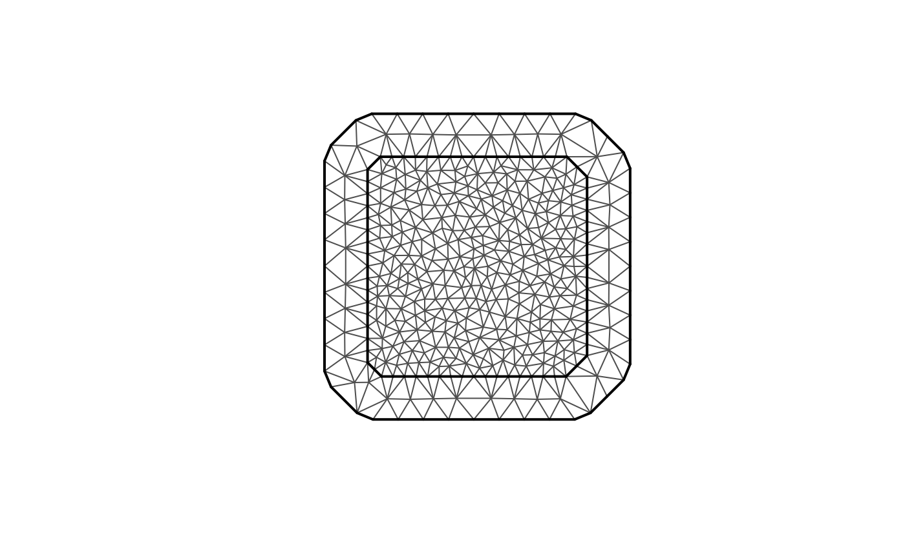
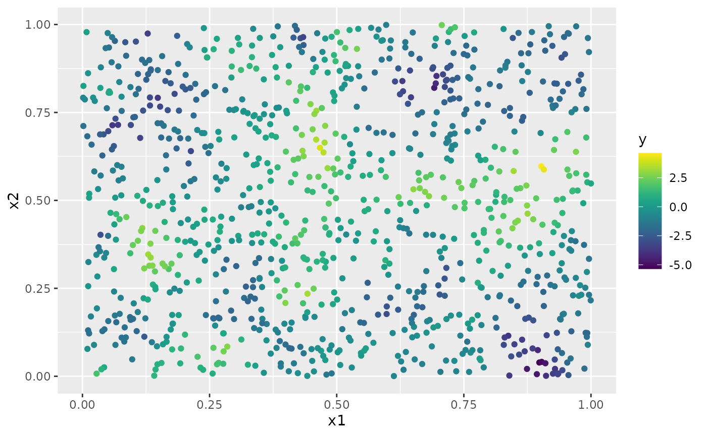
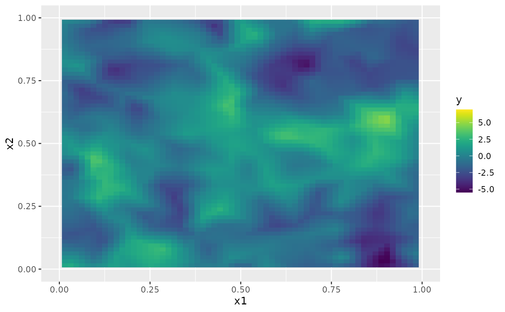
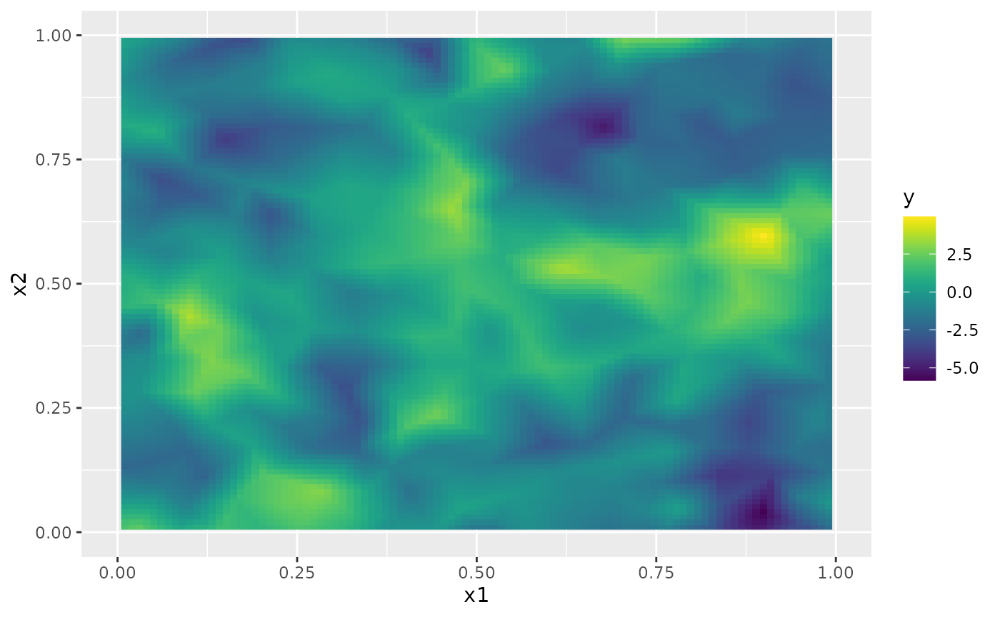
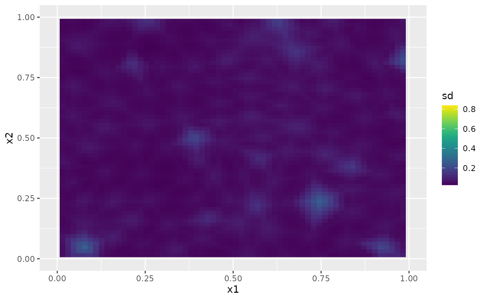
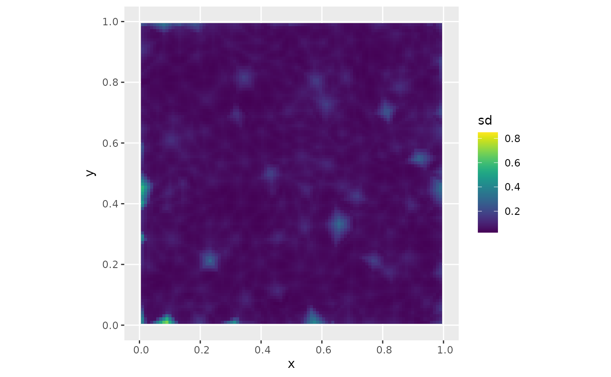
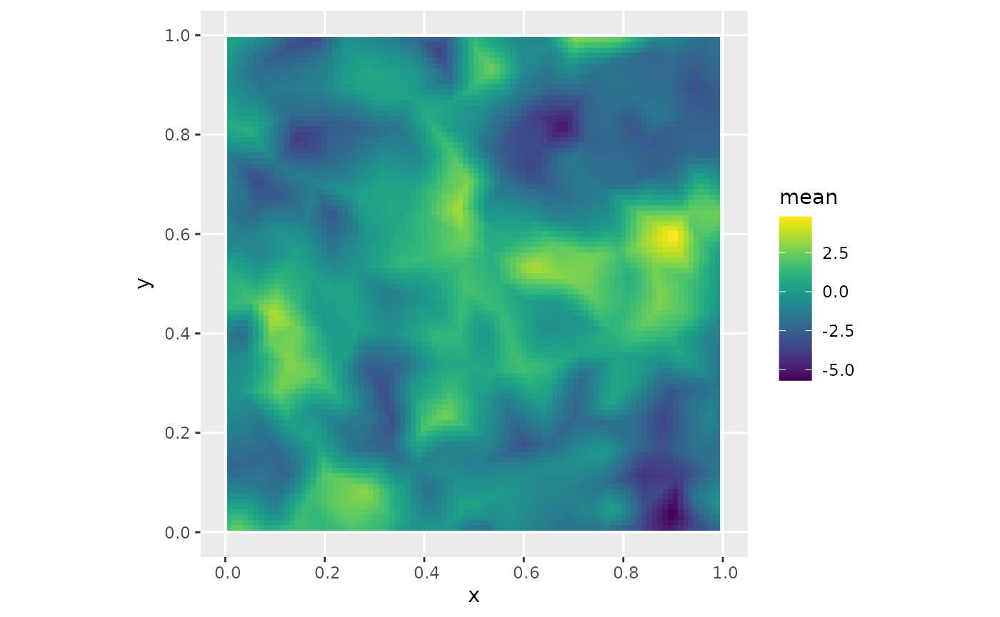
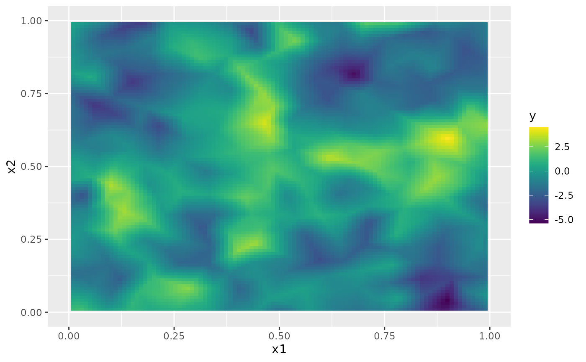
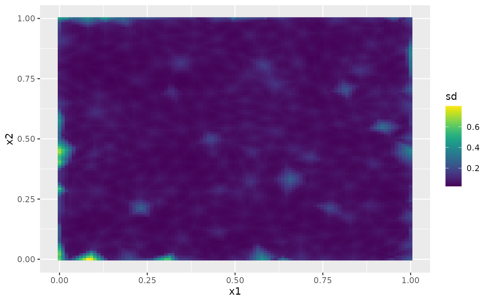

# An introduction to the rSPDE package

### Introduction

In this vignette we provide a brief introduction to the `rSPDE` package.
The main approach for constructing the rational approximations is the
covariance-based rational SPDE approach of [Bolin, Simas, and Xiong
(2023)](https://doi.org/10.1080/10618600.2023.2231051). The package
contains three main “families” of functions that implement the approach:

- an interface to [`R-INLA`](https://www.r-inla.org);

- an interface to [`inlabru`](http://inlabru.org/);

- a stand-alone implementation of the approach.

To illustrate these different functions, we begin by using the package
to generate a simple data set, which then will be analyzed using the
different approaches. Further details on each family of functions is
given in the following additional vignettes:

- [R-INLA implementation of the rational SPDE
  approach](https://davidbolin.github.io/rSPDE/articles/rspde_inla.md)

- [inlabru implementation of the rational SPDE
  approach](https://davidbolin.github.io/rSPDE/articles/rspde_inlabru.md)

- [Rational approximation with the rSPDE
  package](https://davidbolin.github.io/rSPDE/articles/rspde_cov.md)

The `rSPDE` package also has a separate group of functions for
performing the operator-based rational approximations introduced in
[Bolin and Kirchner
(2020)](https://www.tandfonline.com/doi/full/10.1080/10618600.2019.1665537).
These are especially useful when performing rational approximations for
fractional SPDE models with non-Gaussian noise. An example in which such
approximation is suitable is when one has the so-called type-G Lévy
noises.

We refer the reader to [Wallin and Bolin
(2015)](https://onlinelibrary.wiley.com/doi/full/10.1111/sjos.12141),
[Bolin
(2013)](https://onlinelibrary.wiley.com/doi/abs/10.1111/sjos.12046) and
[Asar et al.
(2020)](https://rss.onlinelibrary.wiley.com/doi/pdf/10.1111/rssc.12405)
for examples of models driven by type-G Lévy noises. We also refer the
reader to the [`ngme` package](https://github.com/davidbolin/ngme) where
one can fit such models.

We explore the functions for performing the operator-based rational
approximation on the vignette:

- [Operator-based rational approximation with the rSPDE
  package](https://davidbolin.github.io/rSPDE/articles/rspde_base.md)

### A toy data set

We begin by generating a toy data set.

For this illustration, we will simulate a data set on a two-dimensional
spatial domain. To this end, we need to construct a mesh over the domain
of interest and then compute the matrices needed to define the operator.
We will use the [`R-INLA`](https://www.r-inla.org) package to create the
mesh and obtain the matrices of interest.

We will begin by defining a mesh over
$\lbrack 0,1\rbrack \times \lbrack 0,1\rbrack$:

``` r
library(fmesher)
n_loc <- 1000
loc_2d_mesh <- matrix(runif(n_loc * 2), n_loc, 2)
mesh_2d <- fm_mesh_2d(
  loc = loc_2d_mesh,
  cutoff = 0.05,
  max.edge = c(0.1, 0.5)
)
plot(mesh_2d, main = "")
```



We now use the
[`matern.operators()`](https://davidbolin.github.io/rSPDE/reference/matern.operators.md)
function to construct a rational SPDE approximation of order $m = 2$ for
a Gaussian random field with a Matérn covariance function on
$\lbrack 0,1\rbrack \times \lbrack 0,1\rbrack$. We choose $\nu = 0.5$
which corresponds to exponential covariance. We also set $\sigma = 1$
and the range as $0.2$.

``` r
library(rSPDE)
sigma <- 2
range <- 0.25
nu <- 1.3
kappa <- sqrt(8 * nu) / range
op <- matern.operators(
  mesh = mesh_2d, nu = nu,
  range = range, sigma = sigma, m = 2,
  parameterization = "matern"
)
tau <- op$tau
```

We can now use the `simulate` function to simulate a realization of the
field $u$:

``` r
u <- simulate(op)
```

Let us now consider a simple Gaussian linear model where the spatial
field $u(\mathbf{s})$ is observed at $m$ locations,
$\{\mathbf{s}_{1},\ldots,\mathbf{s}_{m}\}$ under Gaussian measurement
noise. For each $i = 1,\ldots,m,$ we have $$\begin{aligned}
y_{i} & {= u\left( \mathbf{s}_{i} \right) + \varepsilon_{i}} \\
 & 
\end{aligned},$$ where $\varepsilon_{1},\ldots,\varepsilon_{m}$ are iid
normally distributed with mean 0 and standard deviation 0.1.

To generate a data set `y` from this model, we first draw some
observation locations at random in the domain and then use the
[`spde.make.A()`](https://davidbolin.github.io/rSPDE/reference/spde.make.A.md)
functions (that wraps the functions
[`fm_basis()`](https://inlabru-org.github.io/fmesher/reference/fm_basis.html),
[`fm_block()`](https://inlabru-org.github.io/fmesher/reference/fm_block.html)
and
[`fm_row_kron()`](https://inlabru-org.github.io/fmesher/reference/fm_row_kron.html)
of the `fmesher` package) to construct the observation matrix which can
be used to evaluate the simulated field $u$ at the observation
locations. After this we simply add the measurment noise.

``` r
A <- spde.make.A(
  mesh = mesh_2d,
  loc = loc_2d_mesh
)
sigma.e <- 0.1
y <- A %*% u + rnorm(n_loc) * sigma.e
```

The generated data can be seen in the following image.

``` r
library(ggplot2)
library(viridis)
#> Loading required package: viridisLite
df <- data.frame(x1 = as.double(loc_2d_mesh[, 1]),
  x2 = as.double(loc_2d_mesh[, 2]), y = as.double(y))
ggplot(df, aes(x = x1, y = x2, col = y)) +
  geom_point() +
  scale_color_viridis()
```



The simulated random field is shown in the following figure.

``` r
proj <- fm_evaluator(mesh_2d, dims = c(100, 100))
field <- fm_evaluate(proj, field = as.vector(u))
field.df <- data.frame(x1 = proj$lattice$loc[,1],
                        x2 = proj$lattice$loc[,2], 
                        y = as.vector(field))
ggplot(field.df, aes(x = x1, y = x2, fill = y)) +
  geom_raster() + xlim(0,1) + ylim(0,1) + 
  scale_fill_viridis()
```



### Fitting the model with `R-INLA` implementation of the rational SPDE approach

We will now fit the model of the toy data set using our
[`R-INLA`](https://www.r-inla.org) implementation of the rational SPDE
approach. Further details on this implementation can be found in [R-INLA
implementation of the rational SPDE
approach](https://davidbolin.github.io/rSPDE/articles/rspde_inla.md).

We begin by loading the `INLA` package and creating the $A$ matrix, the
index, and the `inla.stack` object.

``` r
library(INLA)
#> 

Abar <- rspde.make.A(mesh = mesh_2d, loc = loc_2d_mesh)
mesh.index <- rspde.make.index(name = "field", mesh = mesh_2d)

st.dat <- inla.stack(
  data = list(y = as.vector(y)),
  A = Abar,
  effects = mesh.index
)
```

We now create the model object. We need to set an upper bound for the
smoothness parameter $\nu$. The default value for this is $4$. If we
increase the upper bound for $\nu$ we also increase the computational
cost, and if we decrease the upper bound we also decrease the
computatoinal cost. For this example we set `nu.upper.bound=2`. See the
[R-INLA implementation of the rational SPDE
approach](https://davidbolin.github.io/rSPDE/articles/rspde_inla.md) for
further details.

``` r
rspde_model <- rspde.matern(
  mesh = mesh_2d,
  nu.upper.bound = 2,
  parameterization = "spde"
)
```

Finally, we create the formula and fit the model to the data:

``` r
f <-
  y ~ -1 + f(field, model = rspde_model)
rspde_fit <-
  inla(f,
    data = inla.stack.data(st.dat),
    family = "gaussian",
    control.predictor =
      list(A = inla.stack.A(st.dat)),
      num.threads = "1:1"
  )
```

We can get a summary of the fit:

``` r
summary(rspde_fit)
#> Time used:
#>     Pre = 0.322, Running = 2.05, Post = 0.045, Total = 2.42 
#> Random effects:
#>   Name     Model
#>     field CGeneric
#> 
#> Model hyperparameters:
#>                                           mean    sd 0.025quant 0.5quant
#> Precision for the Gaussian observations 93.892 4.972     84.453   93.772
#> Theta1 for field                        -3.780 0.139     -4.011   -3.792
#> Theta2 for field                         2.327 0.148      2.029    2.329
#> Theta3 for field                        -0.322 0.088     -0.513   -0.315
#>                                         0.975quant   mode
#> Precision for the Gaussian observations    104.022 93.557
#> Theta1 for field                            -3.473 -3.850
#> Theta2 for field                             2.611  2.340
#> Theta3 for field                            -0.173 -0.283
#> 
#> Marginal log-Likelihood:  50.03 
#>  is computed 
#> Posterior summaries for the linear predictor and the fitted values are computed
#> (Posterior marginals needs also 'control.compute=list(return.marginals.predictor=TRUE)')
```

To get a summary of the fit of the random field only, we can do the
following:

``` r
result_fit <- rspde.result(rspde_fit, "field", rspde_model)
summary(result_fit)
#>            mean         sd 0.025quant   0.5quant 0.975quant       mode
#> tau    0.023036 0.00330453  0.0181309  0.0224716  0.0309068  0.0210012
#> kappa 10.358400 1.51889000  7.6287200 10.2778000 13.5799000 10.1475000
#> nu     0.840967 0.04224310  0.7498380  0.8448430  0.9135740  0.8590260
tau <- op$tau
result_df <- data.frame(
  parameter = c("tau", "kappa", "nu"),
  true = c(tau, kappa, nu), mean = c(
    result_fit$summary.tau$mean,
    result_fit$summary.kappa$mean,
    result_fit$summary.nu$mean
  ),
  mode = c(
    result_fit$summary.tau$mode,
    result_fit$summary.kappa$mode,
    result_fit$summary.nu$mode
  )
)
print(result_df)
#>   parameter         true        mean        mode
#> 1       tau  0.004452908  0.02303604  0.02100122
#> 2     kappa 12.899612397 10.35839835 10.14751303
#> 3        nu  1.300000000  0.84096732  0.85902616
```

We can also obtain the summary in the `matern` parameterization by
setting the `parameterization` argument to `matern`:

``` r
result_fit_matern <- rspde.result(rspde_fit, "field", rspde_model,
                                  parameterization = "matern")
summary(result_fit_matern)
#>             mean        sd 0.025quant 0.5quant 0.975quant     mode
#> std.dev 2.514460 0.3038230   1.988750 2.486720   3.175010 2.402750
#> range   0.261786 0.0421123   0.189920 0.258092   0.353621 0.249552
#> nu      0.840967 0.0422431   0.749838 0.844843   0.913574 0.859026
result_df_matern <- data.frame(
  parameter = c("sigma", "range", "nu"),
  true = c(sigma, range, nu), mean = c(
    result_fit_matern$summary.std.dev$mean,
    result_fit_matern$summary.range$mean,
    result_fit_matern$summary.nu$mean
  ),
  mode = c(
    result_fit_matern$summary.std.dev$mode,
    result_fit_matern$summary.range$mode,
    result_fit_matern$summary.nu$mode
  )
)
print(result_df_matern)
#>   parameter true      mean      mode
#> 1     sigma 2.00 2.5144623 2.4027516
#> 2     range 0.25 0.2617861 0.2495523
#> 3        nu 1.30 0.8409673 0.8590262
```

### Kriging with `R-INLA` implementation of the rational SPDE approach

Let us now obtain predictions (i.e., do kriging) of the latent field on
a dense grid in the region.

We begin by creating the grid of locations where we want to compute the
predictions. To this end, we can use the
[`rspde.mesh.projector()`](https://davidbolin.github.io/rSPDE/reference/rspde.mesh.project.md)
function. This function has the same arguments as the function
[`inla.mesh.projector()`](https://rdrr.io/pkg/INLA/man/inla.mesh.project.html)
the only difference being that the rSPDE version also has an argument
`nu` and an argument `rspde.order`. Thus, we proceed in the same fashion
as we would in [`R-INLA`](https://www.r-inla.org)’s standard SPDE
implementation:

``` r
projgrid <- rspde.mesh.projector(mesh_2d,
  xlim = c(0, 1),
  ylim = c(0, 1)
)
```

This lattice contains 100 × 100 locations (the default) which are shown
in the following figure:

``` r
coord.prd <- projgrid$lattice$loc
plot(coord.prd, type = "p", cex = 0.1)
```


Let us now calculate the predictions jointly with the estimation. To
this end, first, we begin by linking the prediction coordinates to the
mesh nodes through an $A$ matrix

``` r
A.prd <- projgrid$proj$A
```

We now make a stack for the prediction locations. We have no data at the
prediction locations, so we set `y= NA`. We then join this stack with
the estimation stack.

``` r
ef.prd <- list(c(mesh.index))
st.prd <- inla.stack(
  data = list(y = NA),
  A = list(A.prd), tag = "prd",
  effects = ef.prd
)
st.all <- inla.stack(st.dat, st.prd)
```

Doing the joint estimation takes a while, and we therefore turn off the
computation of certain things that we are not interested in, such as the
marginals for the random effect. We will also use a simplified
integration strategy (actually only using the posterior mode of the
hyper-parameters) through the command
`control.inla = list(int.strategy = "eb")`, i.e. empirical Bayes:

``` r
rspde_fitprd <- inla(f,
  family = "Gaussian",
  data = inla.stack.data(st.all),
  control.predictor = list(
    A = inla.stack.A(st.all)
  ),
  control.inla = list(int.strategy = "eb"),
  num.threads = "1:1"
)
```

We then extract the indices to the prediction nodes and then extract the
mean and the standard deviation of the response:

``` r
id.prd <- inla.stack.index(st.all, "prd")$data
m.prd <- matrix(rspde_fitprd$summary.fitted.values$mean[id.prd], 100, 100)
sd.prd <- matrix(rspde_fitprd$summary.fitted.values$sd[id.prd], 100, 100)
```

Finally, we plot the results. First the mean:

``` r
field.pred.df <- data.frame(x1 = projgrid$lattice$loc[,1],
                        x2 = projgrid$lattice$loc[,2], 
                        y = as.vector(m.prd))
ggplot(field.pred.df, aes(x = x1, y = x2, fill = y)) +
  geom_raster() + xlim(0,1) + ylim(0,1) + 
  scale_fill_viridis()
#> Warning: Removed 396 rows containing missing values or values outside the scale range
#> (`geom_raster()`).
```



Then, the marginal standard deviations:

``` r
field.pred.sd.df <- data.frame(x1 = proj$lattice$loc[,1],
                        x2 = proj$lattice$loc[,2], 
                        sd = as.vector(sd.prd))
ggplot(field.pred.sd.df, aes(x = x1, y = x2, fill = sd)) +
  geom_raster() + xlim(0,1) + ylim(0,1) + 
  geom_raster() +
  scale_fill_viridis()
#> Warning: Removed 6156 rows containing missing values or values outside the scale range
#> (`geom_raster()`).
#> Removed 6156 rows containing missing values or values outside the scale range
#> (`geom_raster()`).
```



### Fitting the model with `inlabru` implementation of the rational SPDE approach

We will now fit the same model of the toy data set using our
[`inlabru`](http://inlabru.org/) implementation of the rational SPDE
approach. Further details on this implementation can be found in
[`inlabru` implementation of the rational SPDE
approach](https://davidbolin.github.io/rSPDE/articles/rspde_inlabru.md).

We begin by loading the `inlabru` package:

``` r
library(inlabru)
```

The creation of the model object is the same as in `R-INLA`’s case:

``` r
rspde_model <- rspde.matern(
  mesh = mesh_2d,
  nu.upper.bound = 2,
  parameterization = "spde"
)
```

The advantage with `inlabru` is that we do not need to form the stack
manually, but can simply collect the required data in a
[`data.frame()`](https://rdrr.io/r/base/data.frame.html). Further, we
can turn the data into an `sf` object.

``` r
library(sf)
#> Linking to GEOS 3.12.1, GDAL 3.8.4, PROJ 9.4.0; sf_use_s2() is TRUE
toy_df <- data.frame(coord1 = loc_2d_mesh[,1],
                     coord2 = loc_2d_mesh[,2],
                     y = as.vector(y))
toy_df <- st_as_sf(toy_df, coords = c("coord1", "coord2"))
```

Finally, we create the component and fit:

``` r
cmp <-
  y ~ -1 + field(geometry, 
                    model = rspde_model)

rspde_bru_fit <-
  bru(cmp,
      data=toy_df,
    options=list(
    family = "gaussian",
    num.threads = "1:1")
  )
```

At this stage, we can get a summary of the fit just as in the `R-INLA`
case:

``` r
summary(rspde_bru_fit)
#> inlabru version: 2.14.0 
#> INLA version: 26.03.19 
#> Latent components:
#> field: main = cgeneric(geometry)
#> Observation models:
#>   Model tag: <No tag>
#>     Family: 'gaussian'
#>     Data class: 'sf', 'data.frame'
#>     Response class: 'numeric'
#>     Predictor: y ~ field
#>     Additive/Linear/Rowwise: TRUE/TRUE/TRUE
#>     Used components: effect[field], latent[] 
#> Time used:
#>     Pre = 0.17, Running = 2.36, Post = 0.159, Total = 2.69 
#> Random effects:
#>   Name     Model
#>     field CGeneric
#> 
#> Model hyperparameters:
#>                                           mean    sd 0.025quant 0.5quant
#> Precision for the Gaussian observations 93.921 4.977      84.46   93.804
#> Theta1 for field                        -3.781 0.134      -4.01   -3.792
#> Theta2 for field                         2.360 0.145       2.06    2.363
#> Theta3 for field                        -0.321 0.083      -0.50   -0.316
#>                                         0.975quant   mode
#> Precision for the Gaussian observations    104.052 93.601
#> Theta1 for field                            -3.487 -3.845
#> Theta2 for field                             2.635  2.380
#> Theta3 for field                            -0.176 -0.291
#> 
#> Marginal log-Likelihood:  50.00 
#>  is computed 
#> Posterior summaries for the linear predictor and the fitted values are computed
#> (Posterior marginals needs also 'control.compute=list(return.marginals.predictor=TRUE)')
```

and also obtain a summary of the field only:

``` r
result_fit <- rspde.result(rspde_bru_fit, "field", rspde_model)
summary(result_fit)
#>            mean         sd 0.025quant   0.5quant 0.975quant       mode
#> tau    0.022990 0.00317576  0.0181978  0.0224716  0.0304985  0.0211154
#> kappa 10.699000 1.53780000  7.8891100 10.6374000 13.9099000 10.5592000
#> nu     0.840994 0.04006560  0.7559770  0.8439860  0.9119480  0.8549180
tau <- op$tau
result_df <- data.frame(
  parameter = c("tau", "kappa", "nu"),
  true = c(tau, kappa, nu), mean = c(
    result_fit$summary.tau$mean,
    result_fit$summary.kappa$mean,
    result_fit$summary.nu$mean
  ),
  mode = c(
    result_fit$summary.tau$mode,
    result_fit$summary.kappa$mode,
    result_fit$summary.nu$mode
  )
)
print(result_df)
#>   parameter         true        mean        mode
#> 1       tau  0.004452908  0.02298995  0.02111545
#> 2     kappa 12.899612397 10.69897415 10.55923942
#> 3        nu  1.300000000  0.84099409  0.85491824
```

Let us obtain a summary in the `matern` parameterization by setting the
`parameterization` argument to `matern`:

``` r
result_fit_matern <- rspde.result(rspde_bru_fit, "field", rspde_model,
                                  parameterization = "matern")
summary(result_fit_matern)
#>             mean        sd 0.025quant 0.5quant 0.975quant     mode
#> std.dev 2.393770 0.2676660   1.934890 2.372190   2.983150 2.379330
#> range   0.244527 0.0378366   0.180689 0.241053   0.328163 0.243084
#> nu      0.840994 0.0400656   0.755977 0.843986   0.911948 0.854918
result_df_matern <- data.frame(
  parameter = c("sigma", "range", "nu"),
  true = c(sigma, range, nu), mean = c(
    result_fit_matern$summary.std.dev$mean,
    result_fit_matern$summary.range$mean,
    result_fit_matern$summary.nu$mean
  ),
  mode = c(
    result_fit_matern$summary.std.dev$mode,
    result_fit_matern$summary.range$mode,
    result_fit_matern$summary.nu$mode
  )
)
print(result_df_matern)
#>   parameter true      mean      mode
#> 1     sigma 2.00 2.3937680 2.3793280
#> 2     range 0.25 0.2445273 0.2430845
#> 3        nu 1.30 0.8409941 0.8549182
```

### Kriging with `inlabru` implementation of the rational SPDE approach

Let us now obtain predictions (i.e., do kriging) of the latent field on
a dense grid in the region.

We begin by creating the grid of the locations where we want to evaluate
the predictions. We begin by creating a regular grid in and then extract
the coorinates:

``` r
pred_coords <- data.frame(coord1 = projgrid$lattice$loc[,1],
                          coord2 = projgrid$lattice$loc[,2])
pred_coords <- st_as_sf(pred_coords, coords = c("coord1", "coord2"))                          
```

Let us now compute the predictions. An advantage with `inlabru` is that
we can do this after fitting the model to the data:

``` r
field_pred <- predict(rspde_bru_fit, pred_coords, ~ data.frame(field))
```

The following figure shows the mean of these predictions:

``` r
ggplot() + gg(field_pred, geom = "tile", aes(fill = mean)) + 
  xlim(0,1) + ylim(0,1) + 
  scale_fill_viridis()
```


The following figure shows the marginal standard deviations of the
predictions:

``` r
ggplot() + gg(field_pred, geom = "tile", aes(fill = sd)) + 
  xlim(0,1) + ylim(0,1) + 
  scale_fill_viridis()
```



An alternative and very simple approach is to use the
[`fm_pixels()`](https://inlabru-org.github.io/fmesher/reference/fm_pixels.html)
function:

``` r
pxl <- fm_pixels(mesh_2d)

field_pred <- predict(rspde_bru_fit, pxl, ~field)

ggplot() + gg(field_pred, geom = "tile", aes(fill = mean)) +
  scale_fill_viridis() + xlim(0,1) + ylim(0,1)
```



### Fitting the model with `rSPDE`

We will now fit the model of the toy data set without using
[`R-INLA`](https://www.r-inla.org) or `inlabru`. To this end we will use
the rational approximation functions from `rSPDE` package. Further
details can be found in the vignette [Rational approximation with the
rSPDE
package](https://davidbolin.github.io/rSPDE/articles/rspde_cov.md).

We use the function
[`rSPDE.construct.matern.loglike()`](https://davidbolin.github.io/rSPDE/reference/rSPDE.construct.matern.loglike.md)
to define the likelihood. This function is object-based, in the sense
that it obtains several of the quantities it needs from the `rSPDE`
model object.

Notice that we already created a `rSPDE` model object to simulate the
data. We will, then, use the same model object. Recall that the `rSPDE`
model object we created is `op`.

Let us create an object for estimation, a `data.frame` with the data and
then fit the model using the
[`rspde_lme()`](https://davidbolin.github.io/rSPDE/reference/rspde_lme.md)
function.

``` r
op_est <- matern.operators(
  mesh = mesh_2d, m = 2
)

toy_df_rspde <- data.frame(coord1 = loc_2d_mesh[,1],
                     coord2 = loc_2d_mesh[,2],
                     y = as.vector(y))
```

``` r
fit_rspde <- rspde_lme(y ~ -1, data = toy_df_rspde, loc = c("coord1", "coord2"),
                      model = op_est, parallel = TRUE)
```

We can obtain the summary:

``` r
summary(fit_rspde)
#> 
#> Latent model - Whittle-Matern
#> 
#> Call:
#> rspde_lme(formula = y ~ -1, loc = c("coord1", "coord2"), data = toy_df_rspde, 
#>     model = op_est, parallel = TRUE)
#> 
#> No fixed effects.
#> 
#> Random effects:
#>        Estimate Std.error z-value
#> alpha 3.059e+00 6.404e-01   4.777
#> tau   2.132e-04 5.412e-04   0.394
#> kappa 2.105e+01 5.118e+00   4.113
#> 
#> Random effects (Matern parameterization):
#>       Estimate Std.error z-value
#> nu     2.05900   0.64042   3.215
#> sigma  1.73844   0.14282  12.172
#> range  0.19279   0.01494  12.904
#> 
#> Measurement error:
#>          Estimate Std.error z-value
#> std. dev 0.103393  0.002745   37.67
#> ---
#> Signif. codes:  0 '***' 0.001 '**' 0.01 '*' 0.05 '.' 0.1 ' ' 1 
#> 
#> Log-Likelihood:  69.00332 
#> Number of function calls by 'optim' = 145
#> Optimization method used in 'optim' = L-BFGS-B
#> 
#> Time used to:     fit the model =  48.97317 secs 
#>   set up the parallelization = 2.79211 secs
```

Let us compare with the true values:

``` r
print(data.frame(
  sigma = c(sigma, fit_rspde$alt_par_coeff$coeff["sigma"]), 
  range = c(range, fit_rspde$alt_par_coeff$coeff["range"]),
  nu = c(nu, fit_rspde$alt_par_coeff$coeff["nu"]),
  row.names = c("Truth", "Estimates")
))
#>              sigma     range       nu
#> Truth     2.000000 0.2500000 1.300000
#> Estimates 1.738436 0.1927938 2.058999

# Time to fit
print(fit_rspde$fitting_tim)
#> Time difference of 48.97317 secs
```

### Kriging with `rSPDE`

We will now do kriging on the same dense grid we did for the
[`R-INLA`](https://www.r-inla.org)-based rational SPDE approach, but now
using the `rSPDE` functions. To this end we will use the `predict`
method on the `rSPDE` model object.

Observe that we need an $A$ matrix connecting the mesh to the prediction
locations.

Let us now create the `data.frame` with the prediction locations:

``` r
predgrid <- fm_evaluator(mesh_2d,
  xlim = c(0, 1),
  ylim = c(0, 1)
)
pred_coords <- data.frame(coord1 = predgrid$lattice$loc[,1],
                          coord2 = predgrid$lattice$loc[,2])
```

We will now use the [`predict()`](https://rdrr.io/r/stats/predict.html)
method on the `rSPDE` model object with the argument `compute.variances`
set to `TRUE` so that we can plot the standard deviations. Let us also
update the values of the `rSPDE` model object to the fitted ones, and
also save the estimated value of `sigma.e`.

``` r
pred.rspde <- predict(fit_rspde,
  data = pred_coords, loc = c("coord1", "coord2"),
  compute_variances = TRUE
)
#> Warning: The `data` argument of `predict()` is deprecated as of rSPDE 2.3.3.
#> ℹ Please use the `newdata` argument instead.
#> ℹ `data` was provided but not `newdata`. Setting `newdata <- data`.
#> This warning is displayed once per session.
#> Call `lifecycle::last_lifecycle_warnings()` to see where this warning was
#> generated.
```

Finally, we plot the results. First the mean:

``` r
field.pred2.df <- data.frame(x1 = predgrid$lattice$loc[,1],
                             x2 = predgrid$lattice$loc[,2],
                             y = as.vector(pred.rspde$mean))
ggplot(field.pred2.df, aes(x = x1, y = x2, fill = y)) +
  geom_raster() + xlim(0,1) + ylim(0,1) + 
  scale_fill_viridis()
#> Warning: Removed 396 rows containing missing values or values outside the scale range
#> (`geom_raster()`).
```



Then, the standard deviations:

``` r
field.pred2.sd.df <-field.pred2.df <- data.frame(x1 = predgrid$lattice$loc[,1],
                             x2 = predgrid$lattice$loc[,2],
                             sd = as.vector(sqrt(pred.rspde$variance)))
ggplot(field.pred2.sd.df, aes(x = x1, y = x2, fill = sd)) +
  geom_raster() +
  scale_fill_viridis()
```



## References

Asar, Özgür, David Bolin, Peter Diggle, and Jonas Wallin. 2020. “Linear
Mixed Effects Models for Non-Gaussian Repeated Measurement Data.”
*Journal of the Royal Statistical Society. Series C. Applied Statistics*
69 (5): 1015–65.

Bolin, David. 2013. “Spatial Matérn Fields Driven by Non-Gaussian
Noise.” *Scandinavian Journal of Statistics* 41 (3): 557–79.

Bolin, David, and Kristin Kirchner. 2020. “The Rational SPDE Approach
for Gaussian Random Fields with General Smoothness.” *Journal of
Computational and Graphical Statistics* 29 (2): 274–85.

Bolin, David, Alexandre B. Simas, and Zhen Xiong. 2023.
“Covariance-Based Rational Approximations of Fractional SPDEs for
Computationally Efficient Bayesian Inference.” *Journal of Computational
and Graphical Statistics*.
<https://doi.org/10.1080/10618600.2022.2139648>.

Wallin, Jonas, and David Bolin. 2015. “Geostatistical Modelling Using
Non-Gaussian Matérn Fields.” *Scandinavian Journal of Statistics* 42
(3): 872–90.
