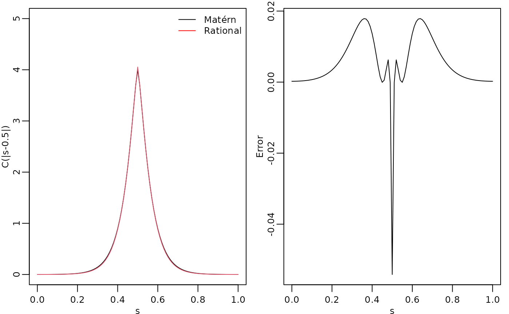
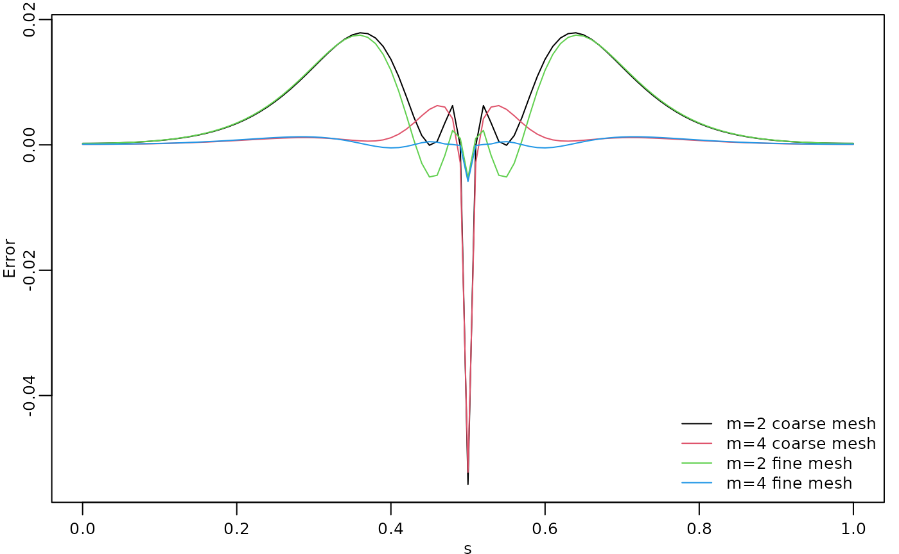
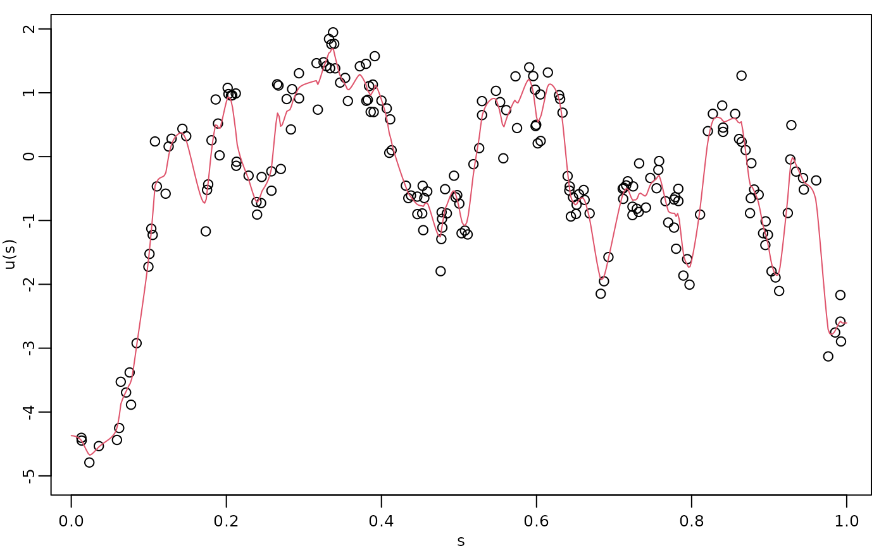
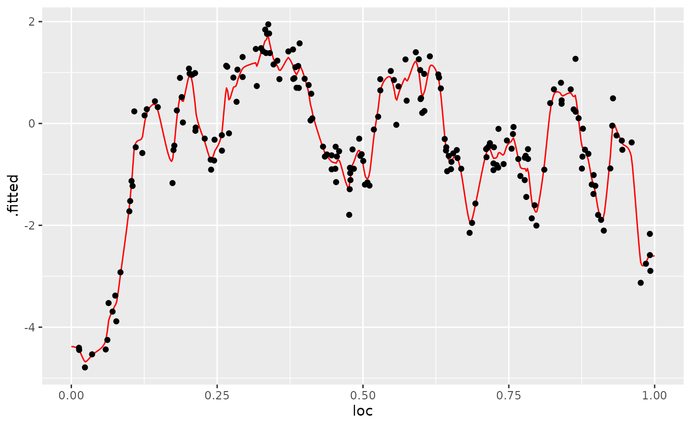
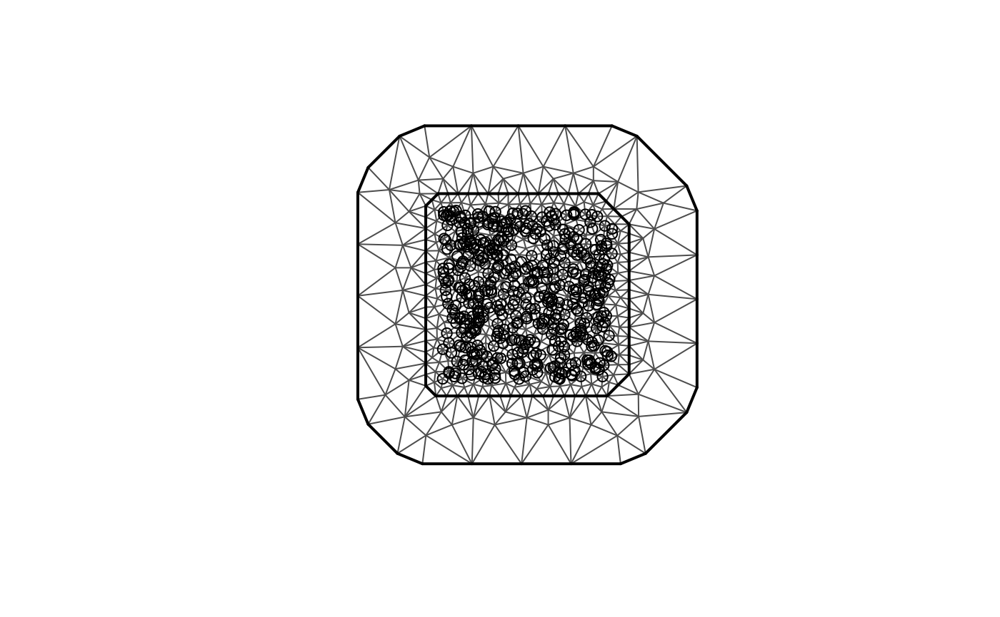
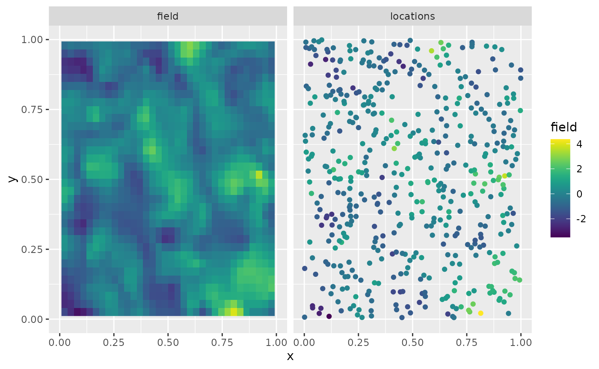
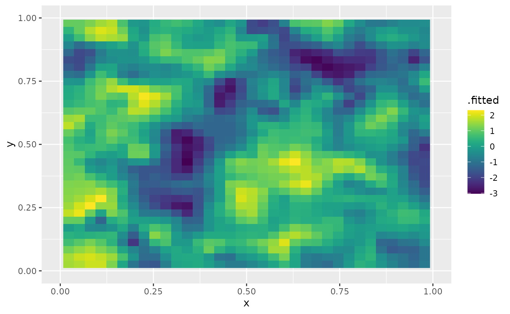

# Rational approximation with the rSPDE package

## Introduction

In this vignette we will introduce the covariance-based rational SPDE
approach and illustrate how to perform statistical inference with it.

The covariance-based approach is an efficient alternative to the
operator-based rational SPDE approach by [Bolin and Kirchner
(2020)](https://www.tandfonline.com/doi/full/10.1080/10618600.2019.1665537)
which works when one has SPDE driven by Gaussian white noise. We refer
the reader to [Bolin, Simas, and Xiong
(2023)](https://doi.org/10.1080/10618600.2023.2231051) for the
theoretical details of the approach.

Details about the operator-based rational SPDE approach are given in the
[Operator-based rational
approximation](https://davidbolin.github.io/rSPDE/articles/rspde_base.md)
vignette. For the [`R-INLA`](https://www.r-inla.org) and `inlabru`
implementations of the covariance-based rational SPDE approach we refer
the reader to the vignettes [R-INLA implementation of the rational SPDE
approach](https://davidbolin.github.io/rSPDE/articles/rspde_inla.md) and
[inlabru implementation of the rational SPDE
approach](https://davidbolin.github.io/rSPDE/articles/rspde_inlabru.md)
respectively.

## Covariance-based rational SPDE approach

Let us first present the idea behind the approach. In the SPDE approach,
introduced in [Lindgren, Rue, and Lindström
(2011)](https://rss.onlinelibrary.wiley.com/doi/full/10.1111/j.1467-9868.2011.00777.x)
we model $u$ as the solution of the following SPDE:
$$L^{\alpha/2}(\tau u) = W,$$ where $L = - \Delta + \kappa^{2}I$ and $W$
is the standard Gaussian white noise. Here, $\alpha$, $\kappa$ and
$\tau$ are the parameters of the model. In the standard SPDE approach,
$\alpha = \nu + d/2$ needs to be fixed to an integer value, where
$\alpha = 2$ is the usual default value. In the rational SPDE approach
we can use any value of $\nu > 0$ and also estimate it from data.

The main idea of the covariance-based rational SPDE approach is to
perform the rational approximation of the covariance operator
$L^{- \alpha}$. To this end, we begin by obtaining an approximation of
the random field $u$, which is the solution of the SPDE above, by using
the finite element method (FEM):
$$u_{h}\left( \mathbf{s}_{i} \right) = \sum\limits_{j = 1}^{n_{h}}{\widehat{u}}_{j}\varphi_{j}\left( \mathbf{s}_{i} \right),$$
where $\{{\widehat{u}}_{j}\}_{j = 1}^{n_{h}}$ are stochastic weights and
$\{\varphi_{j}\left( \mathbf{s}_{i} \right)\}_{j = 1}^{n_{h}}$ are fixed
piecewise linear and continuous basis functions obtained from a
triangulation of the spatial domain. We then obtain a FEM approximation
of the operator $L$, which is given by $L_{h}$, and the covariance
operator of $u_{h}$ is given by $L_{h}^{- \alpha}$.

Now, by using the rational approximation on $L_{h}$, we can approximate
covariance operator $L_{h}^{- \alpha}$ as
$$L_{h,m}^{- \alpha} = L_{h}^{- \lfloor\alpha\rfloor}p\left( L_{h}^{- 1} \right)q\left( L_{h}^{- 1} \right)^{- 1},$$
where $\lfloor\alpha\rfloor$ denotes the integer part of $\alpha$, $m$
is the order of rational approximation,
$p\left( L_{h}^{- 1} \right) = \sum_{i = 0}^{m}a_{i}L_{h}^{m - i}$ and
$q\left( L_{h}^{- 1} \right) = \sum_{j = 0}^{m}b_{j}L_{h}^{m - i}$, with
$\{ a_{i}\}_{i = 0}^{m}$ and $\{ b_{j}\}_{j = 0}^{m}$ being known
coefficients obtained from a rational approximation of the function
$x^{\alpha - \lfloor\alpha\rfloor}$.

The next step is to perform a partial fraction decomposition of the
rational function
$p\left( L_{h}^{- 1} \right)q\left( L_{h}^{- 1} \right)^{- 1}$, which
yields the representation
$$L_{h,m}^{- \alpha} = L_{h}^{- \lfloor\alpha\rfloor}\left( \sum\limits_{i = 1}^{m}r_{i}\left( L_{h} - p_{i}I \right)^{- 1} + k \right).$$
Based on the above operator equation, we can write the covariance matrix
of the stochastic weights $\widehat{\textbf{𝐮}}$, where
$\widehat{\textbf{𝐮}} = \left\lbrack {\widehat{u}}_{1},...,{\widehat{u}}_{n_{h}} \right\rbrack^{\top}$,
as
$$\mathbf{\Sigma}_{\widehat{\textbf{𝐮}}} = \left( \textbf{𝐋}^{- 1}\textbf{𝐂} \right)^{\lfloor\alpha\rfloor}\sum\limits_{i = 1}^{m}r_{i}\left( \textbf{𝐋} - p_{i}\textbf{𝐂} \right)^{- 1} + \textbf{𝐊},$$
where $\textbf{𝐂} = \{ C_{ij}\}_{i,j = 1}^{n_{h}}$,
$C_{ij} = \left( \varphi_{i},\varphi_{j} \right)_{L_{2}{(\mathcal{D})}}$,
is the mass matrix, $\textbf{𝐋} = \kappa^{2}\textbf{𝐂} + \textbf{𝐆}$,
$\textbf{𝐆} = \{ G_{ij}\}_{i,j = 1}^{n_{h}}$,
$G_{ij} = \left( \nabla\varphi_{i},\nabla\varphi_{j} \right)_{L_{2}{(\mathcal{D})}}$,
is the stiffness matrix, and $$\textbf{𝐊} = \left\{ \begin{array}{lcl}
{k\textbf{𝐂}} & & {\lfloor\alpha\rfloor = 0} \\
{k\textbf{𝐋}^{- 1}\left( \textbf{𝐂}\textbf{𝐋}^{- 1} \right)^{\lfloor\alpha\rfloor - 1}} & & {\lfloor\alpha\rfloor \geq 1} \\
 & & 
\end{array} \right..$$

The above representation shows that we can express
$\widehat{\textbf{𝐮}}$ as
$$\widehat{\textbf{𝐮}} = \sum\limits_{i = 1}^{m + 1}\textbf{𝐱}_{i},$$
where $\textbf{𝐱}_{i} = \left( x_{i,1},\ldots,x_{i,n_{h}} \right)$,
$$\textbf{𝐱}_{i} \sim N\left( \textbf{𝟎},\textbf{𝐐}_{i}^{- 1} \right),$$
and $\textbf{𝐐}_{i}$ is the precision matrix of $\textbf{𝐱}_{i}$, which
is given by $$\textbf{𝐐}_{i} = \left\{ \begin{array}{lcl}
{\left( \textbf{𝐋} - p_{i}\textbf{𝐂} \right)\left( \textbf{𝐂}^{- 1}\textbf{𝐋} \right)^{\lfloor\alpha\rfloor}/r_{i},} & & {i = 1,...,m} \\
{\textbf{𝐊}^{- 1},} & & {i = m + 1} \\
 & & 
\end{array}. \right.$$

We, then, replace the Matérn latent field by the latent vector given
above, which has precision matrix given by
$$\textbf{𝐐} = \begin{bmatrix}
\textbf{𝐐}_{1} & & \\
 & \ddots & \\
 & & \textbf{𝐐}_{m + 1}
\end{bmatrix}.$$ We thus have a Markov approximation which can be used
for computationally efficient inference. For example, assume that we
observe
$$y_{j} = u_{h}\left( \mathbf{s}_{j} \right) + \varepsilon_{j},\quad j = 1,\ldots,N,$$
where $\varepsilon_{j} \sim N\left( 0,\sigma_{\varepsilon}^{2} \right)$
are iid measurement noise. Then, we have that
$$y_{j} = u_{h}\left( \mathbf{s}_{j} \right) + \varepsilon_{j} = \sum\limits_{l = 1}^{n_{h}}{\widehat{u}}_{l}\varphi_{l}\left( \mathbf{s}_{j} \right) + \varepsilon_{j} = \sum\limits_{i = 1}^{m + 1}\sum\limits_{l = 1}^{n_{h}}x_{i,l}\varphi_{l}\left( \mathbf{s}_{j} \right) + \varepsilon_{j}.$$
This can be written in a matrix form as
$$\textbf{𝐲} = \overline{\textbf{𝐀}}\textbf{𝐗} + {\mathbf{ε}},$$ where
$\textbf{𝐲} = \left\lbrack y_{1},\ldots,y_{N} \right\rbrack^{\top},\textbf{𝐗} = \left\lbrack \textbf{𝐱}_{1}^{\top},\ldots,\textbf{𝐱}_{m + 1}^{\top} \right\rbrack^{\top}$,
${\mathbf{ε}} = \left\lbrack \varepsilon_{1},\ldots,\varepsilon_{N} \right\rbrack^{\top}$,
$$\overline{\textbf{𝐀}} = \begin{bmatrix}
\textbf{𝐀} & \cdots & \textbf{𝐀}
\end{bmatrix}_{n \times n_{h}{(m + 1)}},$$ and
$$\textbf{𝐀} = \begin{bmatrix}
{\varphi_{1}\left( s_{1} \right)} & \cdots & {\varphi_{n_{h}}\left( s_{1} \right)} \\
\vdots & \vdots & \vdots \\
{\varphi_{1}\left( s_{n} \right)} & \cdots & {\varphi_{n_{h}}\left( s_{n} \right)}
\end{bmatrix}.$$ We then arrive at the following hierarchical model:
$$\begin{aligned}
{\textbf{𝐲} \mid \textbf{𝐗}} & {\sim N\left( 0,\sigma_{\varepsilon}\textbf{𝐈} \right)} \\
\textbf{𝐗} & {\sim N\left( 0,\textbf{𝐐}^{- 1} \right)}
\end{aligned}.$$

With these elements, we can, for example, use
[`R-INLA`](https://www.r-inla.org) to compute the posterior distribution
of the three parameters we want to estimate.

## Constructing the approximation

In this section, we explain how to to use the function
[`matern.operators()`](https://davidbolin.github.io/rSPDE/reference/matern.operators.md)
with the default argument `type`, that is, `type="covariance"`, which is
constructs the covariance-based rational approximation. We will also
illustrate the usage of several methods and functions related to the
covariance-based rational approximation. We will use functions to sample
from Gaussian fields with stationary Matérn covariance function, compute
the log-likelihood function, and do spatial prediction.

The first step for performing the covariance-based rational SPDE
approximation is to define the FEM mesh. We will also illustrate how
spatial models can be constructed if the FEM implementation of the
`fmesher` package is used. When using the
[`R-INLA`](https://www.r-inla.org) package, we also recommend the usage
of our [`R-INLA`](https://www.r-inla.org) implementation of the rational
SPDE approach. For more details, see the [R-INLA implementation of the
rational SPDE
approach](https://davidbolin.github.io/rSPDE/articles/rspde_inla.md)
vignette.

We begin by loading the `rSPDE` package:

``` r
library(rSPDE)
```

Assume that we want to define a model on the interval
$\lbrack 0,1\rbrack$. We then start by defining a vector with mesh nodes
$s_{i}$ where the basis functions $\varphi_{i}$ are centered.

``` r
s <- seq(from = 0, to = 1, length.out = 101)
```

We can now use
[`matern.operators()`](https://davidbolin.github.io/rSPDE/reference/matern.operators.md)
to construct a rational SPDE approximation of order $m = 2$ for a
Gaussian random field with a Matérn covariance function on the interval.
We also refer the reader to the [Operator-based rational
approximation](https://davidbolin.github.io/rSPDE/articles/rspde_base.md)
for a similar comparison made for the operator-based rational
approximation.

``` r
kappa <- 20
sigma <- 2
nu <- 0.8
r <- sqrt(8*nu)/kappa #range parameter
op_cov <- matern.operators(loc_mesh = s, nu = nu,
  range = r, sigma = sigma, d = 1, m = 2, parameterization = "matern"
)
```

The object `op_cov` contains the matrices needed for evaluating the
distribution of the stochastic weights $u$. If we want to evaluate
$u_{h}(s)$ at some locations $s_{1},\ldots,s_{n}$, we need to multiply
the weights with the basis functions $\varphi_{i}(s)$ evaluated at the
locations. For this, we can construct the observation matrix $A$, with
elements $A_{ij} = \varphi_{j}\left( s_{i} \right)$, which links the FEM
basis functions to the locations. This matrix can be constructed using
the function
[`fm_basis()`](https://inlabru-org.github.io/fmesher/reference/fm_basis.html)
from the `fmesher` package. However, as observed in the introduction of
this vignette, we have decomposed the stochastic weights $u$ into a
vector of latent variables. Thus, the $A$ matrix for the
covariance-based rational approximation, which we will denote by
$\overline{A}$, is actually given by the $m + 1$-fold horizontal
concatenation of these $A$ matrices, where $m$ is the order of the
rational approximation.

To evaluate the accuracy of the approximation, let us compute the
covariance function between the process at $s = 0.5$ and all other
locations in `s` and compare with the true Matérn covariance function.
The covariances can be calculated by using the
[`cov_function_mesh()`](https://davidbolin.github.io/rSPDE/reference/cov_function_mesh.md)
method.

``` r
c_cov.approx <- cov_function_mesh(op_cov, 0.5)
```

Let us now compute the true Matérn covariance function on the interval
$(0,1)$, which is the folded Matérn, see Theorem 1 in [An explicit link
between Gaussian fields and Gaussian Markov random fields: the
stochastic partial differential equation
approach](https://www.jstor.org/stable/41262260) for further details.

``` r
c.true <- folded.matern.covariance.1d(rep(0.5, length(s)), 
                                      abs(s), kappa, nu, sigma)
```

The covariance function and the error compared with the Matérn
covariance are shown in the following figure.

``` r
opar <- par(
  mfrow = c(1, 2), mgp = c(1.3, 0.5, 0),
  mar = c(2, 2, 0.5, 0.5) + 0.1
)
plot(s, c.true,
  type = "l", ylab = "C(|s-0.5|)", xlab = "s", ylim = c(0, 5),
  cex.main = 0.8, cex.axis = 0.8, cex.lab = 0.8
)
lines(s, c_cov.approx, col = 2)
legend("topright",
  bty = "n",
  legend = c("Matérn", "Rational"),
  col = c("black", "red"),
  lty = rep(1, 2), ncol = 1,
  cex = 0.8
)

plot(s, c.true - c_cov.approx,
  type = "l", ylab = "Error", xlab = "s",
  cex.main = 0.8, cex.axis = 0.8, cex.lab = 0.8
)
par(opar)
```



To improve the approximation we can increase the degree of the
polynomials, by increasing $m$, and/or increase the number of basis
functions used for the FEM approximation. Let us, for example, compute
the approximation with $m = 4$ using the same mesh, as well as the
approximation when we increase the number of basis functions and use
$m = 2$ and $m = 4$. We will also load the `fmesher` package to use the
[`fm_basis()`](https://inlabru-org.github.io/fmesher/reference/fm_basis.html)
and
[`fm_mesh_1d()`](https://inlabru-org.github.io/fmesher/reference/fm_mesh_1d.html)
functions to map between the meshes.

``` r
library(fmesher)

op_cov2 <- matern.operators(
  range = r, sigma = sigma, nu = nu,
  loc_mesh = s, d = 1, m = 4,
  parameterization = "matern"
)

c_cov.approx2 <- cov_function_mesh(op_cov2, 0.5)

s2 <- seq(from = 0, to = 1, length.out = 501)

op_cov <- matern.operators(
  range = r, sigma = sigma, nu = nu,
  loc_mesh = s2, d = 1, m = 2,
  parameterization = "matern"
)

mesh_s2 <- fm_mesh_1d(s2)

# Map the mesh s2 to s
A2 <- fm_basis(mesh_s2, s)

c_cov.approx3 <- A2 %*% cov_function_mesh(op_cov, 0.5)

op_cov <- matern.operators(
  range = r, sigma = sigma, nu = nu,
  loc_mesh = s2, d = 1, m = 4,
  parameterization = "matern"
)

c_cov.approx4 <- A2 %*% cov_function_mesh(op_cov, 0.5)
```

The resulting errors are shown in the following figure.

``` r
opar <- par(mgp = c(1.3, 0.5, 0), mar = c(2, 2, 0.5, 0.5) + 0.1)
plot(s, c.true - c_cov.approx,
  type = "l", ylab = "Error", xlab = "s", col = 1,
  cex.main = 0.8, cex.axis = 0.8, cex.lab = 0.8
)
lines(s, c.true - c_cov.approx2, col = 2)
lines(s, c.true - c_cov.approx3, col = 3)
lines(s, c.true - c_cov.approx4, col = 4)
legend("bottomright",
  bty = "n",
  legend = c("m=2 coarse mesh", "m=4 coarse mesh", 
             "m=2 fine mesh", "m=4 fine mesh"),
  col = c(1, 2, 3, 4),
  lty = rep(1, 2), ncol = 1,
  cex = 0.8
)
par(opar)
```



Since the error induced by the rational approximation decreases
exponentially in $m$, there is in general rarely a need for an
approximation with a large value of $m$. This is good because the size
of $Q$ increases with $m$, which makes the approximation more
computationally costly to use. To illustrate this, let us compute the
norm of the approximation error for different $m$.

``` r
# Mapping s2 to s
A2 <- fm_basis(mesh_s2, s)

errors <- rep(0, 4)
for (i in 1:4) {
  op_cov <- matern.operators(
    range = r, sigma = sigma, nu = nu,
    loc_mesh = s2, d = 1, m = i,
    parameterization = "matern"
  )
  c_cov.approx <- A2 %*% cov_function_mesh(op_cov, 0.5)
  errors[i] <- norm(c.true - c_cov.approx)
}
print(errors)
```

    ## [1] 2.72288321 0.58558875 0.16311776 0.05787784

We see that the error decreases very fast when we increase $m$ from $1$
to $4$, without any numerical instability. This is an advantage of the
covariance-based rational approximation when compared to the
operator-based rational approximation. See [Operator-based rational
approximation](https://davidbolin.github.io/rSPDE/articles/rspde_base.md)
for details on the numerical instability of the operator-based rational
approximation.

## Using the approximation

When we use the function
[`matern.operators()`](https://davidbolin.github.io/rSPDE/reference/matern.operators.md),
we can simulate from the model using the
[`simulate()`](https://rdrr.io/r/stats/simulate.html) method. To such an
end we simply apply the
[`simulate()`](https://rdrr.io/r/stats/simulate.html) method to the
object returned by the
[`matern.operators()`](https://davidbolin.github.io/rSPDE/reference/matern.operators.md)
function:

``` r
u <- simulate(op_cov)
```

If we want replicates, we simply set the argument `nsim` to the desired
number of replicates. For instance, to generate two replicates of the
model, we simply do:

``` r
u.rep <- simulate(op_cov, nsim = 2)
```

### Fitting a model

There is built-in support for computing log-likelihood functions and
performing kriging prediction in the `rSPDE` package. To illustrate
this, we use the simulation to create some noisy observations of the
process. For this, we first construct the observation matrix linking the
FEM basis functions to the locations where we want to simulate. We first
randomly generate some observation locations and then construct the
matrix.

``` r
set.seed(1)
s <- seq(from = 0, to = 1, length.out = 501)
n.obs <- 200
obs.loc <- runif(n.obs)
mesh_s <- fm_mesh_1d(s)
A <- fm_basis(x = mesh_s, loc = obs.loc)
```

We now generate the observations as
$Y_{i} = 2 - x1 + u\left( s_{i} \right) + \varepsilon_{i}$, where
$\varepsilon_{i} \sim N\left( 0,\sigma_{e}^{2} \right)$ is Gaussian
measurement noise, $x1$ is a covariate giving the observation location.
We will assume that the latent process has a Matérn covariance with
$\kappa = 20,\sigma = 1.3$ and $\nu = 0.8$:

``` r
kappa <- 20
sigma <- 1.3
nu <- 0.8
r <- sqrt(8*nu)/kappa
op_cov <- matern.operators(
  loc_mesh = s, nu = nu,
  range = r, sigma = sigma, d = 1, m = 2,
  parameterization = "matern"
)

u <- simulate(op_cov)

sigma.e <- 0.3

x1 <- obs.loc

Y <- 2 - x1 + as.vector(A %*% u + sigma.e * rnorm(n.obs))

Y <- as.vector(A%*% u + sigma.e * rnorm(n.obs))

df_data <- data.frame(y = Y, loc = obs.loc, x1 = x1)
```

Let us create a new object to fit the model:

``` r
op_cov_est <- matern.operators(
  loc_mesh = s, d = 1, m = 2,
  parameterization = "matern"
)
```

Let us now fit the model. To this end we will use the
[`rspde_lme()`](https://davidbolin.github.io/rSPDE/reference/rspde_lme.md)
function:

``` r
fit <- rspde_lme(y~x1, model = op_cov_est,
                    data = df_data, loc = "loc")
```

We can get a summary of the fit with the
[`summary()`](https://rdrr.io/r/base/summary.html) method:

``` r
summary(fit)
```

    ## 
    ## Latent model - Whittle-Matern
    ## 
    ## Call:
    ## rspde_lme(formula = y ~ x1, loc = "loc", data = df_data, model = op_cov_est)
    ## 
    ## Fixed effects:
    ##             Estimate Std.error z-value Pr(>|z|)
    ## (Intercept) -0.51706   1.42006  -0.364    0.716
    ## x1           0.09975   2.42250   0.041    0.967
    ## 
    ## Random effects:
    ##       Estimate Std.error z-value
    ## nu    0.622500  0.007433  83.746
    ## sigma 1.540749  0.391787   3.933
    ## range 0.209251  0.093256   2.244
    ## 
    ## Random effects (SPDE parameterization):
    ##        Estimate Std.error z-value
    ## alpha  1.122500  0.007433 151.012
    ## tau    0.097619  0.009413  10.371
    ## kappa 10.664682  4.573720   2.332
    ## 
    ## Measurement error:
    ##          Estimate Std.error z-value
    ## std. dev  0.29353   0.02219   13.23
    ## ---
    ## Signif. codes:  0 '***' 0.001 '**' 0.01 '*' 0.05 '.' 0.1 ' ' 1 
    ## 
    ## Log-Likelihood:  -153.0439 
    ## Number of function calls by 'optim' = 52
    ## Optimization method used in 'optim' = L-BFGS-B
    ## 
    ## Time used to:     fit the model =  10.75658 secs

Let us compare the parameters of the latent model:

``` r
print(data.frame(
  nu = c(nu, fit$coeff$random_effects["nu"]),
  sigma = c(sigma, fit$coeff$random_effects["sigma"]), 
  range = c(r, fit$coeff$random_effects["range"]),
  row.names = c("Truth", "Estimates")
))
```

    ##                  nu    sigma     range
    ## Truth     0.8000000 1.300000 0.1264911
    ## Estimates 0.6224996 1.540749 0.2092506

``` r
# Total time
print(fit$fitting_time)
```

    ## Time difference of 10.75658 secs

Let us take a glance at the fit:

``` r
glance(fit)
```

    ## # A tibble: 1 × 8
    ##    nobs sigma logLik   AIC   BIC deviance df.residual model                     
    ##   <int> <dbl>  <dbl> <dbl> <dbl>    <dbl>       <dbl> <chr>                     
    ## 1   200 0.294  -153.  318.  338.     306.         194 Covariance-Based Matern S…

We can also speed up the optimization by setting `parallel=TRUE` (which
uses implicitly the `optimParallel` function):

``` r
fit_par <- rspde_lme(y~x1, model = op_cov_est,
                    data = df_data, loc = "loc", parallel = TRUE)
```

Here is the summary:

``` r
summary(fit_par)
```

    ## 
    ## Latent model - Whittle-Matern
    ## 
    ## Call:
    ## rspde_lme(formula = y ~ x1, loc = "loc", data = df_data, model = op_cov_est, 
    ##     parallel = TRUE)
    ## 
    ## Fixed effects:
    ##             Estimate Std.error z-value Pr(>|z|)
    ## (Intercept) -0.51706   1.42006  -0.364    0.716
    ## x1           0.09975   2.42250   0.041    0.967
    ## 
    ## Random effects:
    ##       Estimate Std.error z-value
    ## nu    0.622500  0.007433  83.746
    ## sigma 1.540749  0.391787   3.933
    ## range 0.209251  0.093256   2.244
    ## 
    ## Random effects (SPDE parameterization):
    ##        Estimate Std.error z-value
    ## alpha  1.122500  0.007433 151.012
    ## tau    0.097619  0.009413  10.371
    ## kappa 10.664682  4.573720   2.332
    ## 
    ## Measurement error:
    ##          Estimate Std.error z-value
    ## std. dev  0.29353   0.02219   13.23
    ## ---
    ## Signif. codes:  0 '***' 0.001 '**' 0.01 '*' 0.05 '.' 0.1 ' ' 1 
    ## 
    ## Log-Likelihood:  -153.0439 
    ## Number of function calls by 'optim' = 52
    ## Optimization method used in 'optim' = L-BFGS-B
    ## 
    ## Time used to:     fit the model =  8.91283 secs 
    ##   set up the parallelization = 2.67923 secs

Let us compare with the true values and compare the time:

``` r
print(data.frame(
  sigma = c(sigma, fit_par$coeff$random_effects["sigma"]), 
  range = c(r, fit_par$coeff$random_effects["range"]),
  nu = c(nu, fit_par$coeff$random_effects["nu"]),
  row.names = c("Truth", "Estimates")
))
```

    ##              sigma     range        nu
    ## Truth     1.300000 0.1264911 0.8000000
    ## Estimates 1.540749 0.2092506 0.6224996

``` r
# Total time (time to fit plus time to set up the parallelization)
total_time <- fit_par$fitting_time + fit_par$time_par
print(total_time)
```

    ## Time difference of 11.59207 secs

### Kriging

Finally, we compute the kriging prediction of the process $u$ at the
locations in `s` based on these observations.

Let us create the `data.frame` with locations in which we want to obtain
the predictions. Observe that we also must provide the values of the
covariates.

``` r
df_pred <- data.frame(loc = s, x1 = s)
```

We can now perform kriging with the
[`predict()`](https://rdrr.io/r/stats/predict.html) method:

``` r
u.krig <- predict(fit, newdata = df_pred, loc = "loc")
```

The simulated process, the observed data, and the kriging prediction are
shown in the following figure.

``` r
opar <- par(mgp = c(1.3, 0.5, 0), mar = c(2, 2, 0.5, 0.5) + 0.1)
plot(obs.loc, Y,
  ylab = "u(s)", xlab = "s",
  ylim = c(min(c(min(u), min(Y))), max(c(max(u), max(Y)))),
  cex.main = 0.8, cex.axis = 0.8, cex.lab = 0.8
)
lines(s, u.krig$mean, col = 2)
par(opar)
```



We can also use the
[`augment()`](https://davidbolin.github.io/rSPDE/reference/augment.rspde_lme.md)
function and pipe the results into a plot:

``` r
library(ggplot2)
library(dplyr)

augment(fit, newdata = df_pred, loc = "loc") %>% ggplot() + 
                aes(x = loc, y = .fitted) +
                geom_line(col="red") + 
                geom_point(data = df_data, aes(x = loc, y=Y))
```



## Fitting a model with replicates

Let us illustrate how to simulate a dataset with replicates and then fit
a model to such data. Recall that to simulate a latent model with
replicates, all we do is set the `nsim` argument to the number of
replicates.

We will use the `CBrSPDEobj` object (returned from the
[`matern.operators()`](https://davidbolin.github.io/rSPDE/reference/matern.operators.md)
function) from the previous example, namely `op_cov`.

``` r
set.seed(123)
n.rep <- 20
u.rep <- simulate(op_cov, nsim = n.rep)
```

Now, let us generate the observed values $Y$:

``` r
sigma.e <- 0.3
Y.rep <- A %*% u.rep + sigma.e * matrix(rnorm(n.obs * n.rep), ncol = n.rep)
```

Note that $Y$ is a matrix with 20 columns, each column containing one
replicate. We need to turn `y` into a vector and create an auxiliary
vector `repl` indexing the replicates of `y`:

``` r
y_vec <- as.vector(Y.rep)
repl <- rep(1:n.rep, each = n.obs)

df_data_repl  <- data.frame(y = y_vec, loc = rep(obs.loc, n.rep))
```

We can now fit the model in the same way as before by using the
[`rspde_lme()`](https://davidbolin.github.io/rSPDE/reference/rspde_lme.md)
function:

``` r
fit_repl <- rspde_lme(y_vec ~ -1, model = op_cov_est, repl = repl, 
      data = df_data_repl, loc = "loc", parallel = TRUE)
```

    ## Warning in rspde_lme(y_vec ~ -1, model = op_cov_est, repl = repl, data =
    ## df_data_repl, : The optimization failed to provide a numerically
    ## positive-definite Hessian. You can try to obtain a positive-definite Hessian by
    ## setting 'improve_hessian' to TRUE or by setting 'parallel' to FALSE, which
    ## allows other optimization methods to be used.

    ## Warning in sqrt(diag(inv_fisher)): NaNs produced

Let us see a summary of the fit:

``` r
summary(fit_repl)
```

    ## 
    ## Latent model - Whittle-Matern
    ## 
    ## Call:
    ## rspde_lme(formula = y_vec ~ -1, loc = "loc", data = df_data_repl, 
    ##     model = op_cov_est, repl = repl, parallel = TRUE)

    ## 
    ## No fixed effects.

    ## 
    ## Random effects:
    ##       Estimate Std.error z-value
    ## nu    0.706953       NaN     NaN
    ## sigma 1.280270  0.053547   23.91
    ## range 0.138553  0.008751   15.83
    ## 
    ## Random effects (SPDE parameterization):
    ##        Estimate Std.error z-value
    ## alpha  1.206953        NA      NA
    ## tau    0.065896  0.001669   39.49
    ## kappa 17.164267  1.186120   14.47
    ## 
    ## Measurement error:
    ##          Estimate Std.error z-value
    ## std. dev 0.298933  0.004798   62.31
    ## ---
    ## Signif. codes:  0 '***' 0.001 '**' 0.01 '*' 0.05 '.' 0.1 ' ' 1 
    ## 
    ## Log-Likelihood:  -2760.546 
    ## Number of function calls by 'optim' = 36
    ## Optimization method used in 'optim' = L-BFGS-B
    ## 
    ## Time used to:     fit the model =  14.74074 secs 
    ##   set up the parallelization = 2.74145 secs

and glance:

``` r
glance(fit_repl)
```

    ## # A tibble: 1 × 8
    ##    nobs sigma logLik   AIC   BIC deviance df.residual model                     
    ##   <int> <dbl>  <dbl> <dbl> <dbl>    <dbl>       <dbl> <chr>                     
    ## 1  4000 0.299 -2761. 5529. 5554.    5521.        3996 Covariance-Based Matern S…

Let us compare with the true values:

``` r
  print(data.frame(
    sigma = c(sigma, fit_repl$coeff$random_effects["sigma"]), 
    range = c(r, fit_repl$coeff$random_effects["range"]),
    nu = c(nu, fit_repl$coeff$random_effects["nu"]),
    row.names = c("Truth", "Estimates")
  ))
```

    ##             sigma     range        nu
    ## Truth     1.30000 0.1264911 0.8000000
    ## Estimates 1.28027 0.1385527 0.7069531

``` r
# Total time
print(fit_repl$fitting_time)
```

    ## Time difference of 14.74074 secs

We can obtain better estimates of the Hessian by setting
`improve_hessian` to `TRUE`, however this might make the process take
longer:

``` r
fit_repl2 <- rspde_lme(y_vec ~ -1, model = op_cov_est, repl = repl, 
      data = df_data_repl, loc = "loc", parallel = TRUE, 
      improve_hessian = TRUE)
```

Let us get a summary:

``` r
summary(fit_repl2)
```

    ## 
    ## Latent model - Whittle-Matern
    ## 
    ## Call:
    ## rspde_lme(formula = y_vec ~ -1, loc = "loc", data = df_data_repl, 
    ##     model = op_cov_est, repl = repl, parallel = TRUE, improve_hessian = TRUE)

    ## 
    ## No fixed effects.

    ## 
    ## Random effects:
    ##       Estimate Std.error z-value
    ## nu     0.70695   0.04226   16.73
    ## sigma  1.28027   0.05369   23.84
    ## range  0.13855   0.01244   11.14
    ## 
    ## Random effects (SPDE parameterization):
    ##        Estimate Std.error z-value
    ## alpha  1.206953  0.042257   28.56
    ## tau    0.065896  0.001669   39.49
    ## kappa 17.164267  1.186123   14.47
    ## 
    ## Measurement error:
    ##          Estimate Std.error z-value
    ## std. dev  0.29893   0.00543   55.05
    ## ---
    ## Signif. codes:  0 '***' 0.001 '**' 0.01 '*' 0.05 '.' 0.1 ' ' 1 
    ## 
    ## Log-Likelihood:  -2760.546 
    ## Number of function calls by 'optim' = 36
    ## Optimization method used in 'optim' = L-BFGS-B
    ## 
    ## Time used to:     fit the model =  12.0325 secs 
    ##   compute the Hessian = 6.88836 secs 
    ##   set up the parallelization = 2.72905 secs

## Spatial data and parameter estimation

The functions used in the previous examples also work for spatial
models. We then need to construct a mesh over the domain of interest and
then compute the matrices needed to define the operator. These tasks can
be performed, for example, using the `fmesher` package. Let us start by
defining a mesh over $\lbrack 0,1\rbrack \times \lbrack 0,1\rbrack$ and
compute the mass and stiffness matrices for that mesh.

We consider a simple Gaussian linear model with 30 independent
replicates of a latent spatial field $u(\mathbf{s})$, observed at the
same $m$ locations, $\{\mathbf{s}_{1},\ldots,\mathbf{s}_{m}\}$, for each
replicate. For each $i = 1,\ldots,m,$ we have

$$\begin{aligned}
y_{i} & {= u_{1}\left( \mathbf{s}_{i} \right) + \varepsilon_{i},} \\
\vdots & {= \vdots} \\
y_{i + 29m} & {= u_{30}\left( \mathbf{s}_{i} \right) + \varepsilon_{i + 29m},}
\end{aligned}$$

where $\varepsilon_{1},\ldots,\varepsilon_{30m}$ are iid normally
distributed with mean 0 and standard deviation 0.1.

Let us create the FEM mesh:

``` r
n_loc <- 500
loc_2d_mesh <- matrix(runif(n_loc * 2), n_loc, 2)
mesh_2d <- fm_mesh_2d(
  loc = loc_2d_mesh,
  cutoff = 0.05,
  offset = c(0.1, 0.4),
  max.edge = c(0.05, 0.5)
)
plot(mesh_2d, main = "")
points(loc_2d_mesh[, 1], loc_2d_mesh[, 2])
```



We can now use this mesh to define a rational SPDE approximation of
order $m = 2$ for a Matérn model in the same fashion as we did above in
the one-dimensional case. We now simulate a latent process with standard
deviation $\sigma = 1$ and range $0.1$. We will use $\nu = 0.5$ so that
the model has an exponential covariance function. To this end we create
a model object with the
[`matern.operators()`](https://davidbolin.github.io/rSPDE/reference/matern.operators.md)
function:

``` r
nu <- 0.7
sigma <- 1.3
range <- 0.15
d <- 2
op_cov_2d <- matern.operators(
  mesh = mesh_2d,
  nu = nu,
  range = range,
  sigma = sigma,
  m = 2,
  parameterization = "matern"
)
tau <- op_cov_2d$tau
```

Now let us simulate some noisy data that we will use to estimate the
parameters of the model. To construct the observation matrix, we use the
function
[`fm_basis()`](https://inlabru-org.github.io/fmesher/reference/fm_basis.html)
from the `fmesher` package. Recall that we will simulate the data with
30 replicates.

``` r
n.rep <- 30
u <- simulate(op_cov_2d, nsim = n.rep)
A <- fm_basis(
  x = mesh_2d,
  loc = loc_2d_mesh
)
sigma.e <- 0.1
Y <- A %*% u + matrix(rnorm(n_loc * n.rep), ncol = n.rep) * sigma.e
```

The first replicate of the simulated random field as well as the
observation locations are shown in the following figure.

``` r
library(viridis)
library(ggplot2)
proj <- fm_evaluator(mesh_2d, dims = c(70, 70))

df_field <- data.frame(x = proj$lattice$loc[,1],
                        y = proj$lattice$loc[,2],
                        field = as.vector(fm_evaluate(proj, 
                        field = as.vector(u[, 1]))),
                        type = "field")

df_loc <- data.frame(x = loc_2d_mesh[, 1],
                      y = loc_2d_mesh[, 2],
                      field = as.vector(Y[,1]),
                      type = "locations")
df_plot <- rbind(df_field, df_loc)

ggplot(df_plot) + aes(x = x, y = y, fill = field) +
        facet_wrap(~type) + xlim(0,1) + ylim(0,1) + 
        geom_raster(data = df_field) +
        geom_point(data = df_loc, aes(colour = field),
        show.legend = FALSE) + 
        scale_fill_viridis() + scale_colour_viridis()
```



Let us now create a new object to fit the model:

``` r
op_cov_2d_est <- matern.operators(
  mesh = mesh_2d,
  m = 2
)
```

We can now proceed as in the previous cases. We set up a vector with the
response variables and create an auxiliary replicates vector, `repl`,
that contains the indexes of the replicates of each observation, and
then we fit the model:

``` r
y_vec <- as.vector(Y)
repl <- rep(1:n.rep, each = n_loc)
df_data_2d <- data.frame(y = y_vec, x_coord = loc_2d_mesh[,1],
                      y_coord = loc_2d_mesh[,2])

fit_2d <- rspde_lme(y ~ -1, model = op_cov_2d_est, 
          data = df_data_2d, repl = repl,
          loc = c("x_coord", "y_coord"), parallel = TRUE)
```

Let us get a summary:

``` r
summary(fit_2d)
```

    ## 
    ## Latent model - Whittle-Matern
    ## 
    ## Call:
    ## rspde_lme(formula = y ~ -1, loc = c("x_coord", "y_coord"), data = df_data_2d, 
    ##     model = op_cov_2d_est, repl = repl, parallel = TRUE)

    ## 
    ## No fixed effects.

    ## 
    ## Random effects:
    ##        Estimate Std.error z-value
    ## alpha  1.597605  0.004863  328.52
    ## tau    0.055376  0.001267   43.71
    ## kappa 14.381420  0.458797   31.35
    ## 
    ## Random effects (Matern parameterization):
    ##       Estimate Std.error z-value
    ## nu    0.597605  0.004863  122.89
    ## sigma 1.339541  0.014051   95.33
    ## range 0.152037  0.004815   31.58
    ## 
    ## Measurement error:
    ##           Estimate Std.error z-value
    ## std. dev 0.1004194 0.0008793   114.2
    ## ---
    ## Signif. codes:  0 '***' 0.001 '**' 0.01 '*' 0.05 '.' 0.1 ' ' 1 
    ## 
    ## Log-Likelihood:  -5657.679 
    ## Number of function calls by 'optim' = 69
    ## Optimization method used in 'optim' = L-BFGS-B
    ## 
    ## Time used to:     fit the model =  2.65855 mins 
    ##   set up the parallelization = 2.80338 secs

and glance:

``` r
glance(fit_2d)
```

    ## # A tibble: 1 × 8
    ##    nobs sigma logLik    AIC    BIC deviance df.residual model                   
    ##   <int> <dbl>  <dbl>  <dbl>  <dbl>    <dbl>       <dbl> <chr>                   
    ## 1 15000 0.100 -5658. 11323. 11354.   11315.       14996 Covariance-Based Matern…

Let us compare the estimated results with the true values:

``` r
print(data.frame(
  sigma = c(sigma, fit_2d$alt_par_coeff$coeff["sigma"]), 
  range = c(range, fit_2d$alt_par_coeff$coeff["range"]),
  nu = c(nu, fit_2d$alt_par_coeff$coeff["nu"]),
  row.names = c("Truth", "Estimates")
))
```

    ##              sigma     range        nu
    ## Truth     1.300000 0.1500000 0.7000000
    ## Estimates 1.339541 0.1520373 0.5976046

``` r
# Total time
print(fit_2d$fitting_time)
```

    ## Time difference of 2.658551 mins

Let us now plot the prediction for replicate 3 by using the `augment`
function. We begin by creating the `data.frame` we want to do
prediction:

``` r
df_pred <- data.frame(x = proj$lattice$loc[,1],
                        y = proj$lattice$loc[,2])
```

``` r
augment(fit_2d, newdata = df_pred, loc = c("x","y"), which_repl = 3) %>% ggplot() +
              geom_raster(aes(x=x, y=y, fill = .fitted)) + xlim(0,1) + ylim(0,1) + 
              scale_fill_viridis()
```

    ## Warning: Removed 3744 rows containing missing values or values outside the scale range
    ## (`geom_raster()`).



## Further details on rspde_lme

The `rspde_lme` function provides flexibility in model fitting by
allowing users to fix certain parameters at specific values or set
custom starting values for the optimization process. This can be useful
when you have prior knowledge about some parameters or when you want to
improve convergence by providing better starting points.

### Fixing parameters

Parameters can be fixed by using the `model_options` argument with
elements of the form `fix_parname = value`, where `parname` is the name
of the parameter you want to fix. For stationary models, the parameters
that can be fixed in the `model_options` list are:

- `fix_sigma_e`: Fix the standard deviation of the noise parameter
  $\sigma_{\varepsilon}$
- `fix_nu`: Fix the smoothness parameter ν
- `fix_sigma`: Fix the standard deviation parameter σ
- `fix_range`: Fix the range parameter
- `fix_tau`: Fix the precision parameter τ (when using the SPDE
  parameterization)
- `fix_kappa`: Fix the scale parameter κ (when using the SPDE
  parameterization)
- `fix_alpha`: Fix the fractional power α (when using the SPDE
  parameterization)

### Setting starting values

Similarly, you can set starting values for parameters using elements of
the form `start_parname = value` in the `model_options` list. This is
particularly useful when the default starting values might be far from
the optimal values, which could lead to slow convergence or convergence
to a local minimum. For example, to set a starting value for the range
parameter, you would use `model_options = list(start_range = 0.15)`.

- `start_sigma_e`: Starting value for the standard deviation of the
  noise parameter $\sigma_{\varepsilon}$
- `start_nu`: Starting value for the smoothness parameter ν
- `start_sigma`: Starting value for the standard deviation parameter σ
- `start_range`: Starting value for the range parameter
- `start_tau`: Starting value for the precision parameter τ (when using
  the SPDE parameterization)
- `start_kappa`: Starting value for the scale parameter κ (when using
  the SPDE parameterization)
- `start_alpha`: Starting value for the fractional power α (when using
  the SPDE parameterization)

### Example: Fixing and setting starting values

Let us demonstrate how to use these parameters with our 2D spatial
example. We will fix the smoothness parameter ν to 0.8, fix the standard
deviation σ to 1, and set the starting value for the range parameter to
0.15.

``` r
# Create a new model fit with fixed ν and σ, and a starting value for range
fit_2d_fixed <- rspde_lme(y ~ -1, model = op_cov_2d_est, 
                         data = df_data_2d, repl = repl,
                         loc = c("x_coord", "y_coord"),, 
                         model_options = list(
                           fix_nu = 0.8,      # Fix ν to 0.8
                           fix_sigma = 1,     # Fix σ to 1
                           start_range = 0.15 # Set starting value for range
                         ),
                         parallel = TRUE)
```

Let us get a summary of the fit:

``` r
summary(fit_2d_fixed)
```

    ## 
    ## Latent model - Whittle-Matern
    ## 
    ## Call:
    ## rspde_lme(formula = y ~ -1, loc = c("x_coord", "y_coord"), data = df_data_2d, 
    ##     model = op_cov_2d_est, repl = repl, model_options = list(fix_nu = 0.8, 
    ##         fix_sigma = 1, start_range = 0.15), parallel = TRUE)

    ## 
    ## No fixed effects.

    ## 
    ## Random effects:
    ##               Estimate Std.error z-value
    ## nu (fixed)    0.800000        NA      NA
    ## sigma (fixed) 1.000000        NA      NA
    ## range         0.119443  0.001593      75
    ## 
    ## Random effects (SPDE parameterization):
    ##       Estimate Std.error z-value
    ## alpha  1.80000        NA      NA
    ## tau    0.02742        NA      NA
    ## kappa 21.18021        NA      NA
    ## 
    ## Measurement error:
    ##           Estimate Std.error z-value
    ## std. dev 0.1016883 0.0009017   112.8
    ## ---
    ## Signif. codes:  0 '***' 0.001 '**' 0.01 '*' 0.05 '.' 0.1 ' ' 1 
    ## 
    ## Log-Likelihood:  -6104.864 
    ## Number of function calls by 'optim' = 8
    ## Optimization method used in 'optim' = L-BFGS-B
    ## 
    ## Time used to:     fit the model =  14.69199 secs 
    ##   set up the parallelization = 2.74842 secs

Notice in the summary that ν and σ are fixed at the specified values,
and only the range parameter is estimated. When parameters are fixed,
they do not appear in the parameter estimates section, but rather are
treated as constants.

Let us compare this fit with our previous fit where all parameters were
estimated:

``` r
# Compare the log-likelihoods
logLik_full <- logLik(fit_2d)
logLik_fixed <- logLik(fit_2d_fixed)

cat("Log-likelihood with all parameters estimated:", logLik_full, "\n")
```

    ## Log-likelihood with all parameters estimated: -5657.679

``` r
cat("Log-likelihood with fixed nu and sigma:", logLik_fixed, "\n")
```

    ## Log-likelihood with fixed nu and sigma: -6104.864

### Using a previous fit to initialize the optimization

You can use a previous fit to initialize the optimization by using the
`start_from_previous` argument. For example, to use the previous fit to
initialize the optimization, you would use
`start_from_previous = fit_2d`.

``` r
fit_2d_start <- rspde_lme(y ~ -1, model = op_cov_2d_est, 
                         data = df_data_2d, repl = repl,
                         loc = c("x_coord", "y_coord"),, 
                         previous_fit = fit_2d)
```

    ## Warning in rspde_lme(y ~ -1, model = op_cov_2d_est, data = df_data_2d, repl =
    ## repl, : optim method L-BFGS-B failed to provide a positive-definite Hessian.
    ## Another optimization method was used.

Let us get a summary of the fit:

``` r
summary(fit_2d_start)
```

    ## 
    ## Latent model - Whittle-Matern
    ## 
    ## Call:
    ## rspde_lme(formula = y ~ -1, loc = c("x_coord", "y_coord"), data = df_data_2d, 
    ##     model = op_cov_2d_est, repl = repl, previous_fit = fit_2d)

    ## 
    ## No fixed effects.

    ## 
    ## Random effects:
    ##        Estimate Std.error z-value
    ## alpha 1.712e+00 5.722e-03  299.13
    ## tau   3.554e-02 9.076e-04   39.16
    ## kappa 1.602e+01 4.561e-01   35.13
    ## 
    ## Random effects (Matern parameterization):
    ##       Estimate Std.error z-value
    ## nu    0.711696  0.005722  124.37
    ## sigma 1.306607  0.013810   94.61
    ## range 0.148917  0.004209   35.38
    ## 
    ## Measurement error:
    ##           Estimate Std.error z-value
    ## std. dev 0.1004172 0.0008793   114.2
    ## ---
    ## Signif. codes:  0 '***' 0.001 '**' 0.01 '*' 0.05 '.' 0.1 ' ' 1 
    ## 
    ## Log-Likelihood:  -5657.875 
    ## Number of function calls by 'optim' = 125
    ## Optimization method used in 'optim' = Nelder-Mead
    ## 
    ## Time used to:     fit the model =  1.57207 mins

## An example with a non-stationary model

Our goal now is to show how one can fit model with non-stationary
$\sigma$ (std. deviation) and non-stationary $\rho$ (a range parameter).
One can also use the parameterization in terms of non-stationary SPDE
parameters $\kappa$ and $\tau$.

For this example we will consider simulated data.

### Simulating the data

Let us consider a simple Gaussian linear model with a latent spatial
field $x(\mathbf{s})$, defined on the rectangle $(0,10) \times (0,5)$,
where the std. deviation and range parameter satisfy the following
log-linear regressions: $$\begin{aligned}
{\log\left( \sigma(\mathbf{s}) \right)} & {= \theta_{1} + \theta_{3}b(\mathbf{s}),} \\
{\log\left( \rho(\mathbf{s}) \right)} & {= \theta_{2} + \theta_{3}b(\mathbf{s}),}
\end{aligned}$$ where $b(\mathbf{s}) = \left( s_{1} - 5 \right)/10$. We
assume the data is observed at $m$ locations,
$\{\mathbf{s}_{1},\ldots,\mathbf{s}_{m}\}$. For each $i = 1,\ldots,m,$
we have

$$y_{i} = x_{1}\left( \mathbf{s}_{i} \right) + \varepsilon_{i},$$

where $\varepsilon_{1},\ldots,\varepsilon_{m}$ are iid normally
distributed with mean 0 and standard deviation 0.1.

We begin by defining the domain and creating the mesh:

``` r
rec_domain <- cbind(c(0, 1, 1, 0, 0) * 10, c(0, 0, 1, 1, 0) * 5)

mesh <- fm_mesh_2d(loc.domain = rec_domain, cutoff = 0.1, 
  max.edge = c(0.5, 1.5), offset = c(0.5, 1.5))
```

We follow the same structure as `INLA`. However, `INLA` only allows one
to specify `B.tau` and `B.kappa` matrices, and, in `INLA`, if one wants
to parameterize in terms of range and standard deviation one needs to do
it manually. Here we provide the option to directly provide the matrices
`B.sigma` and `B.range`.

The usage of the matrices `B.tau` and `B.kappa` are identical to the
corresponding ones in
[`inla.spde2.matern()`](https://rdrr.io/pkg/INLA/man/inla.spde2.matern.html)
function. The matrices `B.sigma` and `B.range` work in the same way, but
they parameterize the stardard deviation and range, respectively.

The columns of the `B` matrices correspond to the same parameter. The
first column does not have any parameter to be estimated, it is a
constant column.

So, for instance, if one wants to share a parameter with both `sigma`
and `range` (or with both `tau` and `kappa`), one simply let the
corresponding column to be nonzero on both `B.sigma` and `B.range` (or
on `B.tau` and `B.kappa`).

We will assume $\nu = 0.8$, $\theta_{1} = 0,\theta_{2} = 1$ and
$\theta_{3} = 1$. Let us now build the model with the
[`spde.matern.operators()`](https://davidbolin.github.io/rSPDE/reference/spde.matern.operators.md)
function:

``` r
nu <- 0.8
true_theta <- c(0,1, 1)
B.sigma = cbind(0, 1, 0, (mesh$loc[,1] - 5) / 10)
B.range = cbind(0, 0, 1, (mesh$loc[,1] - 5) / 10)
alpha <- nu + 1 # nu + d/2 ; d = 2

# SPDE model
op_cov_ns <- spde.matern.operators(mesh = mesh, 
  theta = true_theta,
  nu = nu,
  B.sigma = B.sigma, 
  B.range = B.range,
  parameterization = "matern")
```

Let us now sample the data with the
[`simulate()`](https://rdrr.io/r/stats/simulate.html) method:

``` r
u <- as.vector(simulate(op_cov_ns, seed = 123))
```

Let us now obtain 600 random locations on the rectangle and compute the
$A$ matrix:

``` r
m <-600
loc_mesh <- cbind(runif(m) * 10, runif(m) * 5)

A <- fm_basis(
  x = mesh,
  loc = loc_mesh
)
```

We can now generate the response vector `y`:

``` r
y <- as.vector(A %*% as.vector(u)) + rnorm(m) * 0.3
```

Let us now create the object to fit the data:

``` r
op_cov_ns_est <- op_cov_ns <- spde.matern.operators(mesh = mesh, 
  B.sigma = B.sigma, 
  B.range = B.range,
  parameterization = "matern")
```

Let us also create the
[`data.frame()`](https://rdrr.io/r/base/data.frame.html) that contains
the data and the locations:

``` r
df_data_ns <- data.frame(y= y, x_coord = loc_mesh[,1], y_coord = loc_mesh[,2])
```

### Fitting the non-stationary rSPDE model

``` r
fit_ns <- rspde_lme(y ~ -1, model = op_cov_ns_est, 
          data = df_data_ns, loc = c("x_coord", "y_coord"), 
          parallel = TRUE)
```

    ## Warning in rspde_lme(y ~ -1, model = op_cov_ns_est, data = df_data_ns, loc =
    ## c("x_coord", : The optimization failed to provide a numerically
    ## positive-definite Hessian. You can try to obtain a positive-definite Hessian by
    ## setting 'improve_hessian' to TRUE or by setting 'parallel' to FALSE, which
    ## allows other optimization methods to be used.

Let us get the summary:

``` r
summary(fit_ns)
```

    ## 
    ## Latent model - Generalized Whittle-Matern
    ## 
    ## Call:
    ## rspde_lme(formula = y ~ -1, loc = c("x_coord", "y_coord"), data = df_data_ns, 
    ##     model = op_cov_ns_est, parallel = TRUE)

    ## 
    ## No fixed effects.

    ## 
    ## Random effects:
    ##          Estimate Std.error z-value
    ## nu      8.302e-01        NA      NA
    ## theta1  5.328e-18        NA      NA
    ## theta2  1.030e+00        NA      NA
    ## theta3 -1.097e-15        NA      NA
    ## 
    ## Measurement error:
    ##          Estimate Std.error z-value
    ## std. dev   0.3134        NA      NA
    ## ---
    ## Signif. codes:  0 '***' 0.001 '**' 0.01 '*' 0.05 '.' 0.1 ' ' 1 
    ## 
    ## Log-Likelihood:  -395.2684 
    ## Number of function calls by 'optim' = 24
    ## Optimization method used in 'optim' = L-BFGS-B
    ## 
    ## Time used to:     fit the model =  7.13451 secs 
    ##   set up the parallelization = 2.75503 secs

Let us now compare with the true values:

``` r
print(data.frame(
  theta1 = c(true_theta[1], fit_ns$coeff$random_effects[2]), 
  theta2 = c(true_theta[2], fit_ns$coeff$random_effects[3]),
  theta3 = c(true_theta[3], fit_ns$coeff$random_effects[4]), 
  nu = c(alpha-1, fit_ns$coeff$random_effects[1])),
  row.names = c("Truth", "Estimates"))
```

    ##                theta1   theta2        theta3        nu
    ## Truth     0.00000e+00 1.000000  1.000000e+00 0.8000000
    ## Estimates 5.32807e-18 1.029619 -1.097284e-15 0.8301865

### Fixing parameters in non-stationary models

In non-stationary models, the parameters are labeled as theta1, theta2,
etc., corresponding to the coefficients in the B matrices. Similar to
the stationary case, we can fix individual parameters or set starting
values, but these options must be set in the `model_options` list
argument using `fix_theta1`, `fix_theta2`, etc., or `start_theta1`,
`start_theta2`, etc.

For example, if we want to fix the first coefficient theta1 to 0:

``` r
fit_ns_fixed_theta1 <- rspde_lme(y ~ -1, model = op_cov_ns_est, 
          data = df_data_ns, loc = c("x_coord", "y_coord"), 
          model_options = list(fix_theta1 = 0),  # Fix theta1 to 0
          parallel = TRUE)
```

    ## Warning in rspde_lme(y ~ -1, model = op_cov_ns_est, data = df_data_ns, loc =
    ## c("x_coord", : The optimization failed to provide a numerically
    ## positive-definite Hessian. You can try to obtain a positive-definite Hessian by
    ## setting 'improve_hessian' to TRUE or by setting 'parallel' to FALSE, which
    ## allows other optimization methods to be used.

``` r
summary(fit_ns_fixed_theta1)
```

    ## 
    ## Latent model - Generalized Whittle-Matern
    ## 
    ## Call:
    ## rspde_lme(formula = y ~ -1, loc = c("x_coord", "y_coord"), data = df_data_ns, 
    ##     model = op_cov_ns_est, model_options = list(fix_theta1 = 0), 
    ##     parallel = TRUE)

    ## 
    ## No fixed effects.

    ## 
    ## Random effects:
    ##                  Estimate Std.error z-value
    ## nu              8.302e-01        NA      NA
    ## theta1 (fixed)  0.000e+00        NA      NA
    ## theta2          1.030e+00        NA      NA
    ## theta3         -1.097e-15        NA      NA
    ## 
    ## Measurement error:
    ##          Estimate Std.error z-value
    ## std. dev   0.3134        NA      NA
    ## ---
    ## Signif. codes:  0 '***' 0.001 '**' 0.01 '*' 0.05 '.' 0.1 ' ' 1 
    ## 
    ## Log-Likelihood:  -395.2684 
    ## Number of function calls by 'optim' = 24
    ## Optimization method used in 'optim' = L-BFGS-B
    ## 
    ## Time used to:     fit the model =  5.21653 secs 
    ##   set up the parallelization = 2.73451 secs

We can also fix the entire theta vector at once using the `fix_theta`
parameter. This is particularly useful when we have strong prior
knowledge about all the parameters:

``` r
fit_ns_fixed_all <- rspde_lme(y ~ -1, model = op_cov_ns_est, 
          data = df_data_ns, loc = c("x_coord", "y_coord"), 
          model_options = list(fix_theta = c(0, 1, 1)),  # Fix the entire theta vector
          parallel = TRUE)
```

``` r
summary(fit_ns_fixed_all)
```

    ## 
    ## Latent model - Generalized Whittle-Matern
    ## 
    ## Call:
    ## rspde_lme(formula = y ~ -1, loc = c("x_coord", "y_coord"), data = df_data_ns, 
    ##     model = op_cov_ns_est, model_options = list(fix_theta = c(0, 
    ##         1, 1)), parallel = TRUE)

    ## 
    ## No fixed effects.

    ## 
    ## Random effects:
    ##                Estimate Std.error z-value
    ## nu              0.83019   0.06792   12.22
    ## theta1 (fixed)  0.00000        NA      NA
    ## theta2 (fixed)  1.00000        NA      NA
    ## theta3 (fixed)  1.00000        NA      NA
    ## 
    ## Measurement error:
    ##          Estimate Std.error z-value
    ## std. dev  0.31344   0.01516   20.67
    ## ---
    ## Signif. codes:  0 '***' 0.001 '**' 0.01 '*' 0.05 '.' 0.1 ' ' 1 
    ## 
    ## Log-Likelihood:  -395.2684 
    ## Number of function calls by 'optim' = 24
    ## Optimization method used in 'optim' = L-BFGS-B
    ## 
    ## Time used to:     fit the model =  2.81203 secs 
    ##   set up the parallelization = 2.74067 secs

Similarly, we can provide starting values for the entire theta vector
with `start_theta`:

``` r
fit_ns_start <- rspde_lme(y ~ -1, model = op_cov_ns_est, 
          data = df_data_ns, loc = c("x_coord", "y_coord"), 
          model_options = list(start_theta = c(0, 1, 1)),  # Starting values for theta vector
          parallel = TRUE)
```

    ## Warning in rspde_lme(y ~ -1, model = op_cov_ns_est, data = df_data_ns, loc =
    ## c("x_coord", : The optimization failed to provide a numerically
    ## positive-definite Hessian. You can try to obtain a positive-definite Hessian by
    ## setting 'improve_hessian' to TRUE or by setting 'parallel' to FALSE, which
    ## allows other optimization methods to be used.

``` r
summary(fit_ns_start)
```

    ## 
    ## Latent model - Generalized Whittle-Matern
    ## 
    ## Call:
    ## rspde_lme(formula = y ~ -1, loc = c("x_coord", "y_coord"), data = df_data_ns, 
    ##     model = op_cov_ns_est, model_options = list(start_theta = c(0, 
    ##         1, 1)), parallel = TRUE)

    ## 
    ## No fixed effects.

    ## 
    ## Random effects:
    ##        Estimate Std.error z-value
    ## nu       0.8302        NA      NA
    ## theta1   0.0000        NA      NA
    ## theta2   1.0000        NA      NA
    ## theta3   1.0000        NA      NA
    ## 
    ## Measurement error:
    ##          Estimate Std.error z-value
    ## std. dev   0.3134        NA      NA
    ## ---
    ## Signif. codes:  0 '***' 0.001 '**' 0.01 '*' 0.05 '.' 0.1 ' ' 1 
    ## 
    ## Log-Likelihood:  -395.2684 
    ## Number of function calls by 'optim' = 24
    ## Optimization method used in 'optim' = L-BFGS-B
    ## 
    ## Time used to:     fit the model =  7.25699 secs 
    ##   set up the parallelization = 2.77567 secs

## Changing the type and the order of the rational approximation

We have three rational approximations available. The BRASIL algorithm
[Hofreither (2021)](https://doi.org/10.1007/s11075-020-01042-0), and two
“versions” of the Clenshaw-Lord Chebyshev-Pade algorithm, one with lower
bound zero and another with the lower bound given in [Bolin, Simas, and
Xiong (2023)](https://doi.org/10.1080/10618600.2023.2231051).

The type of rational approximation can be chosen by setting the
`type_rational_approximation` argument in the `matern.operators`
function. The BRASIL algorithm corresponds to the choice `brasil`, the
Clenshaw-Lord Chebyshev pade with zero lower bound and non-zero lower
bounds are given, respectively, by the choices `chebfun` and
`chebfunLB`.

For instance, we can create an `rSPDE` object with a `chebfunLB`
rational approximation by

``` r
op_cov_2d_type <- matern.operators(
  mesh = mesh_2d,
  m = 2,
  type_rational_approximation = "chebfunLB"
)
tau <- op_cov_2d_type$tau
```

We can check the order of the rational approximation with the
[`rational.order()`](https://davidbolin.github.io/rSPDE/reference/rational.order.md)
function and assign a new order with the `rational.order<-()` function:

``` r
rational.order(op_cov_2d_type)
```

    ## [1] 2

``` r
rational.order(op_cov_2d_type) <- 1
```

Let us fit a model using the data from the previous example:

``` r
fit_order1 <- rspde_lme(y ~ -1, model = op_cov_2d_type, 
          data = df_data_2d,repl = repl,
          loc = c("x_coord", "y_coord"), parallel = TRUE)
```

    ## Warning in rspde_lme(y ~ -1, model = op_cov_2d_type, data = df_data_2d, : The
    ## optimization failed to provide a numerically positive-definite Hessian. You can
    ## try to obtain a positive-definite Hessian by setting 'improve_hessian' to TRUE
    ## or by setting 'parallel' to FALSE, which allows other optimization methods to
    ## be used.

    ## Warning in sqrt(diag(inv_fisher)): NaNs produced

``` r
summary(fit_order1)
```

    ## 
    ## Latent model - Whittle-Matern
    ## 
    ## Call:
    ## rspde_lme(formula = y ~ -1, loc = c("x_coord", "y_coord"), data = df_data_2d, 
    ##     model = op_cov_2d_type, repl = repl, parallel = TRUE)

    ## 
    ## No fixed effects.

    ## 
    ## Random effects:
    ##       Estimate Std.error z-value
    ## alpha  1.61193       NaN     NaN
    ## tau    0.05022       NaN     NaN
    ## kappa 15.36259   0.42734   35.95
    ## 
    ## Random effects (Matern parameterization):
    ##       Estimate Std.error z-value
    ## nu    0.611925        NA      NA
    ## sigma 1.349526  0.014388   93.79
    ## range 0.144022  0.004072   35.37
    ## 
    ## Measurement error:
    ##           Estimate Std.error z-value
    ## std. dev 0.1003691 0.0008785   114.3
    ## ---
    ## Signif. codes:  0 '***' 0.001 '**' 0.01 '*' 0.05 '.' 0.1 ' ' 1 
    ## 
    ## Log-Likelihood:  -5657.867 
    ## Number of function calls by 'optim' = 43
    ## Optimization method used in 'optim' = L-BFGS-B
    ## 
    ## Time used to:     fit the model =  49.04249 secs 
    ##   set up the parallelization = 2.75677 secs

Let us compare with the true values:

``` r
print(data.frame(
  sigma = c(sigma, fit_order1$alt_par_coeff$coeff["sigma"]), 
  range = c(range, fit_order1$alt_par_coeff$coeff["range"]),
  nu = c(nu, fit_order1$alt_par_coeff$coeff["nu"]),
  row.names = c("Truth", "Estimates")
))
```

    ##              sigma     range        nu
    ## Truth     1.300000 0.1500000 0.8000000
    ## Estimates 1.349526 0.1440223 0.6119254

Finally, we can check the type of rational approximation with the
[`rational.type()`](https://davidbolin.github.io/rSPDE/reference/rational.type.md)
function and assign a new type by using the `rational.type<-()`
function:

``` r
rational.type(op_cov_2d_type)
```

    ## [1] "chebfunLB"

``` r
rational.type(op_cov_2d_type) <- "brasil"
```

Let us now fit this model, with the data from the previous example, with
`brasil` rational approximation:

``` r
fit_brasil <- rspde_lme(y ~ -1, model = op_cov_2d_type, 
          data = df_data_2d,repl = repl,
          loc = c("x_coord", "y_coord"), parallel = TRUE)
```

    ## Warning in rspde_lme(y ~ -1, model = op_cov_2d_type, data = df_data_2d, : The
    ## optimization failed to provide a numerically positive-definite Hessian. You can
    ## try to obtain a positive-definite Hessian by setting 'improve_hessian' to TRUE
    ## or by setting 'parallel' to FALSE, which allows other optimization methods to
    ## be used.

    ## Warning in sqrt(diag(inv_fisher)): NaNs produced

``` r
summary(fit_brasil)
```

    ## 
    ## Latent model - Whittle-Matern
    ## 
    ## Call:
    ## rspde_lme(formula = y ~ -1, loc = c("x_coord", "y_coord"), data = df_data_2d, 
    ##     model = op_cov_2d_type, repl = repl, parallel = TRUE)

    ## 
    ## No fixed effects.

    ## 
    ## Random effects:
    ##       Estimate Std.error z-value
    ## alpha  1.62691       NaN     NaN
    ## tau    0.04809       NaN     NaN
    ## kappa 15.53015   0.39376   39.44
    ## 
    ## Random effects (Matern parameterization):
    ##       Estimate Std.error z-value
    ## nu    0.626906        NA      NA
    ## sigma 1.327274  0.014232   93.26
    ## range 0.144202  0.003721   38.75
    ## 
    ## Measurement error:
    ##           Estimate Std.error z-value
    ## std. dev 0.1003903 0.0008789   114.2
    ## ---
    ## Signif. codes:  0 '***' 0.001 '**' 0.01 '*' 0.05 '.' 0.1 ' ' 1 
    ## 
    ## Log-Likelihood:  -5659.434 
    ## Number of function calls by 'optim' = 50
    ## Optimization method used in 'optim' = L-BFGS-B
    ## 
    ## Time used to:     fit the model =  55.42778 secs 
    ##   set up the parallelization = 2.76947 secs

Let us compare with the true values:

``` r
print(data.frame(
  sigma = c(sigma, fit_brasil$alt_par_coeff$coeff["sigma"]), 
  range = c(range, fit_brasil$alt_par_coeff$coeff["range"]),
  nu = c(nu, fit_brasil$alt_par_coeff$coeff["nu"]),
  row.names = c("Truth", "Estimates")
))
```

    ##              sigma     range        nu
    ## Truth     1.300000 0.1500000 0.8000000
    ## Estimates 1.327274 0.1442017 0.6269057

## References

Bolin, David, and Kristin Kirchner. 2020. “The Rational SPDE Approach
for Gaussian Random Fields with General Smoothness.” *Journal of
Computational and Graphical Statistics* 29 (2): 274–85.

Bolin, David, Alexandre B. Simas, and Zhen Xiong. 2023.
“Covariance-Based Rational Approximations of Fractional SPDEs for
Computationally Efficient Bayesian Inference.” *Journal of Computational
and Graphical Statistics*.
<https://doi.org/10.1080/10618600.2022.2139648>.

Hofreither, Clemens. 2021. “An Algorithm for Best Rational Approximation
Based on Barycentric Rational Interpolation.” *Numerical Algorithms* 88
(1): 365–88.

Lindgren, Finn, Håvard Rue, and Johan Lindström. 2011. “An Explicit Link
Between Gaussian Fields and Gaussian Markov Random Fields: The
Stochastic Partial Differential Equation Approach.” *Journal of the
Royal Statistical Society. Series B. Statistical Methodology* 73 (4):
423–98.
