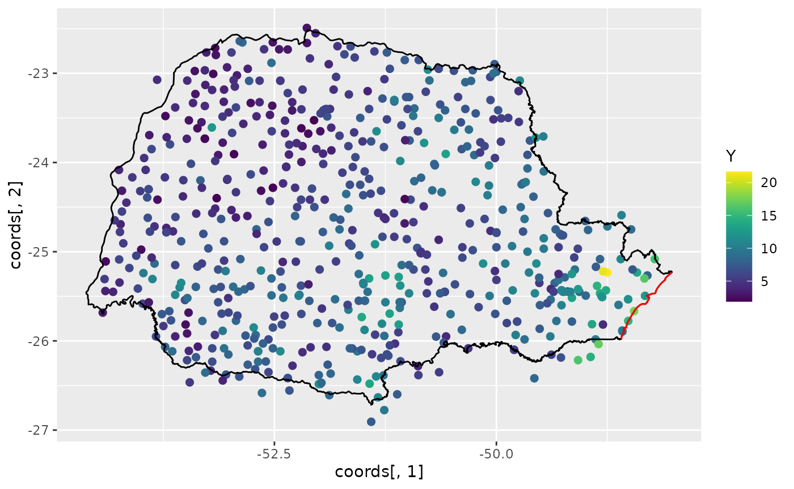
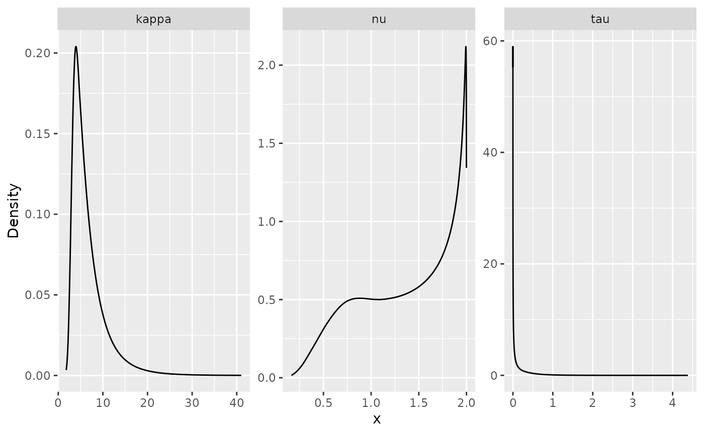
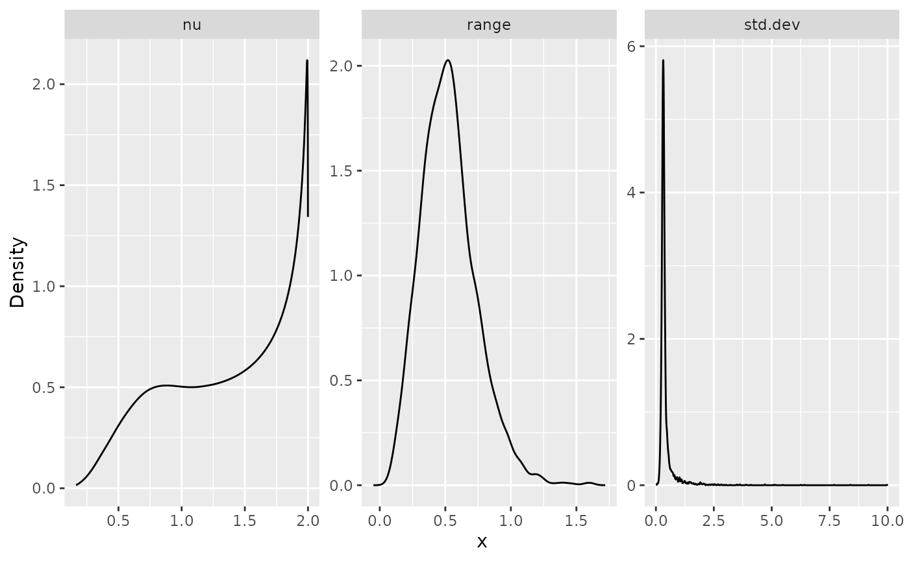
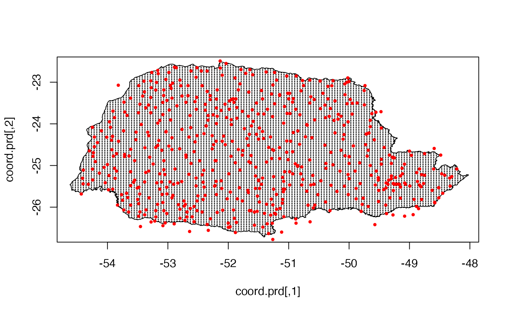
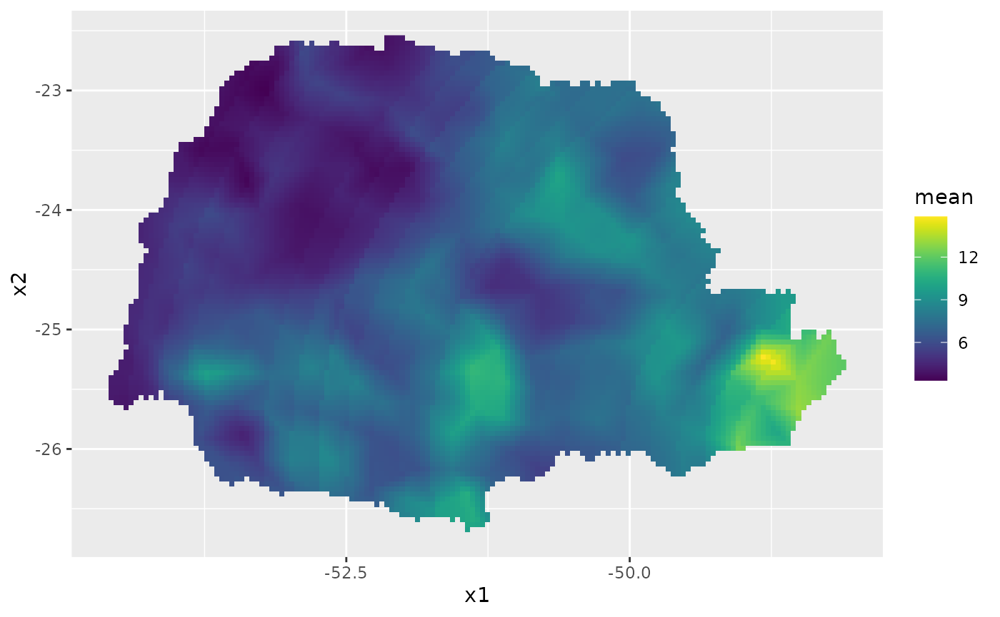
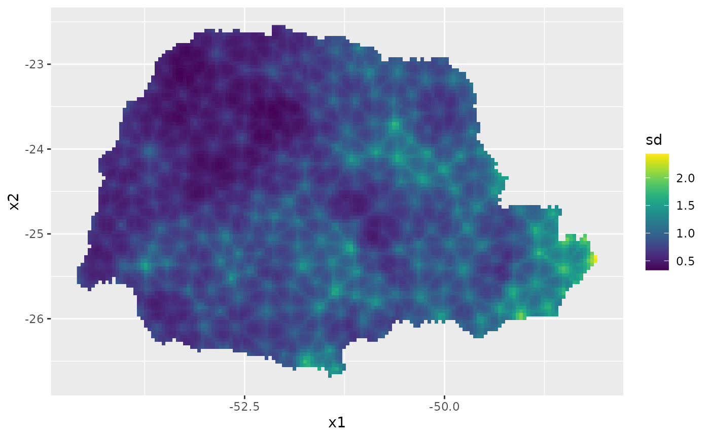
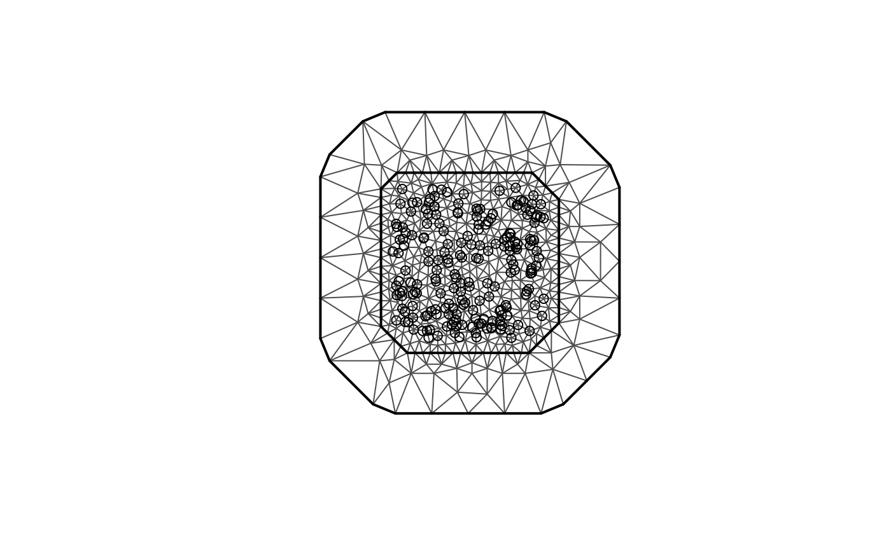
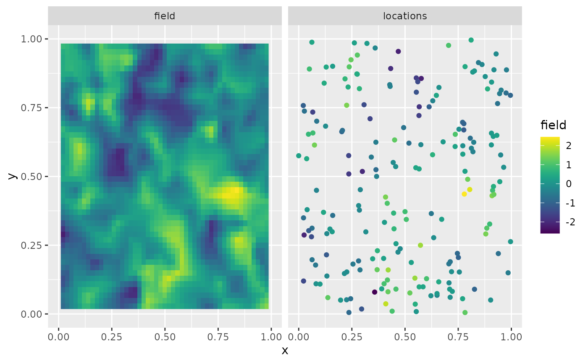
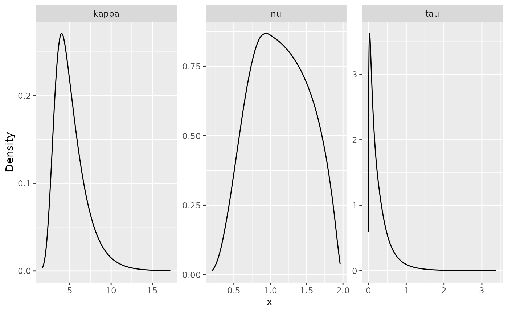

# R-INLA implementation of the rational SPDE approach

## Introduction

In this vignette we will present the [`R-INLA`](https://www.r-inla.org)
implementation of the rational SPDE approach. For theoretical details we
refer the reader to the [Rational approximation with the `rSPDE`
package](https://davidbolin.github.io/rSPDE/articles/rspde_cov.md)
vignette and to [Bolin, Simas, and Xiong
(2023)](https://doi.org/10.1080/10618600.2023.2231051).

We begin by providing a step-by-step illustration on how to use our
implementation. To this end we will consider a real world data set that
consists of precipitation measurements from the Paraná region in Brazil.

After the initial model fitting, we will show how to change some
parameters of the model. In the end, we will also provide an example in
which we have replicates.

It is important to mention that one can improve the performance by using
the PARDISO solver. Please, go to
<https://www.pardiso-project.org/r-inla/#license> to apply for a
license. Also, use
[`inla.pardiso()`](https://rdrr.io/pkg/INLA/man/pardiso.html) for
instructions on how to enable the PARDISO sparse library.

## Example with real data

To illustrate our implementation of `rSPDE` in
[`R-INLA`](https://www.r-inla.org) we will consider a dataset available
in [`R-INLA`](https://www.r-inla.org). This data has also been used to
illustrate the SPDE approach, see for instance the book [Advanced
Spatial Modeling with Stochastic Partial Differential Equations Using R
and
INLA](https://www.routledge.com/Advanced-Spatial-Modeling-with-Stochastic-Partial-Differential-Equations/Krainski-Gomez-Rubio-Bakka-Lenzi-Castro-Camilo-Simpson-Lindgren-Rue/p/book/9780367570644)
and also the vignette [Spatial Statistics using R-INLA and Gaussian
Markov random
fields](https://sites.stat.washington.edu/peter/591/INLA.html). See also
[Lindgren, Rue, and Lindström
(2011)](https://rss.onlinelibrary.wiley.com/doi/full/10.1111/j.1467-9868.2011.00777.x)
for theoretical details on the standard SPDE approach.

The data consist of precipitation measurements from the Paraná region in
Brazil and were provided by the Brazilian National Water Agency. The
data were collected at 616 gauge stations in Paraná state, south of
Brazil, for each day in 2011.

### An rSPDE model for precipitation

We will follow the vignette [Spatial Statistics using R-INLA and
Gaussian Markov random
fields](https://sites.stat.washington.edu/peter/591/INLA.html). As
precipitation data are always positive, we will assume it is Gamma
distributed. [`R-INLA`](https://www.r-inla.org) uses the following
parameterization of the Gamma distribution,
$$\Gamma(\mu,\phi):\pi(y) = \frac{1}{\Gamma(\phi)}\left( \frac{\phi}{\mu} \right)^{\phi}y^{\phi - 1}\exp\left( - \frac{\phi y}{\mu} \right).$$
In this parameterization, the distribution has expected value
$E(x) = \mu$ and variance $V(x) = \mu^{2}/(\phi)$, where$1/\phi$ is a
dispersion parameter.

In this example $\mu$ will be modeled using a stochastic model that
includes both covariates and spatial structure, resulting in the latent
Gaussian model for the precipitation measurements $$\begin{aligned}
{y_{i} \mid \mu\left( s_{i} \right),\theta} & {\sim \Gamma\left( \mu\left( s_{i} \right),c\phi \right)} \\
{\log\left( \mu(s) \right)} & {= \eta(s) = \sum\limits_{k}f_{k}\left( c_{k}(s) \right) + u(s)} \\
\theta & {\sim \pi(\theta)}
\end{aligned},$$

where $y_{i}$ denotes the measurement taken at location $s_{i}$,
$c_{k}(s)$ are covariates, $u(s)$ is a mean-zero Gaussian Matérn field,
and $\theta$ is a vector containing all parameters of the model,
including smoothness of the field. That is, by using the `rSPDE` model
we will also be able to estimate the smoothness of the latent field.

### Examining the data

We will be using [`R-INLA`](https://www.r-inla.org). To install
[`R-INLA`](https://www.r-inla.org) go to [R-INLA
Project](https://www.r-inla.org/download-install).

We begin by loading some libraries we need to get the data and build the
plots.

``` r
library(ggplot2)
library(INLA)
library(splancs)
library(viridis)
```

Let us load the data and the border of the region

``` r
data(PRprec)
data(PRborder)
```

The data frame contains daily measurements at 616 stations for the year
2011, as well as coordinates and altitude information for the
measurement stations. We will not analyze the full spatio-temporal data
set, but instead look at the total precipitation in January, which we
calculate as

``` r
Y <- rowMeans(PRprec[, 3 + 1:31])
```

In the next snippet of code, we extract the coordinates and altitudes
and remove the locations with missing values.

``` r
ind <- !is.na(Y)
Y <- Y[ind]
coords <- as.matrix(PRprec[ind, 1:2])
alt <- PRprec$Altitude[ind]
```

Let us build plot the precipitation observations using `ggplot`:

``` r
ggplot() +
  geom_point(aes(
    x = coords[, 1], y = coords[, 2],
    colour = Y
  ), size = 2, alpha = 1) +
  geom_path(aes(x = PRborder[, 1], y = PRborder[, 2])) +
  geom_path(aes(x = PRborder[1034:1078, 1], y = PRborder[
    1034:1078,
    2
  ]), colour = "red") + 
  scale_color_viridis()
```



The red line in the figure shows the coast line, and we expect the
distance to the coast to be a good covariate for precipitation. This
covariate is not available, so let us calculate it for each observation
location:

``` r
seaDist <- apply(spDists(coords, PRborder[1034:1078, ],
  longlat = TRUE
), 1, min)
```

Now, let us plot the precipitation as a function of the possible
covariates:

``` r
par(mfrow = c(2, 2))
plot(coords[, 1], Y, cex = 0.5, xlab = "Longitude")
plot(coords[, 2], Y, cex = 0.5, xlab = "Latitude")
plot(seaDist, Y, cex = 0.5, xlab = "Distance to sea")
plot(alt, Y, cex = 0.5, xlab = "Altitude")
```


``` r
par(mfrow = c(1, 1))
```

### Creating the rSPDE model

To use the [`R-INLA`](https://www.r-inla.org) implementation of the
`rSPDE` model we need to load the functions:

``` r
library(rSPDE)
```

The `rSPDE`-`INLA` implementation is very reminiscent of
[`R-INLA`](https://www.r-inla.org), so its usage should be
straightforward for [`R-INLA`](https://www.r-inla.org) users. For
instance, to create a `rSPDE` model, one would use
[`rspde.matern()`](https://davidbolin.github.io/rSPDE/reference/rspde.matern.md)
in place of
[`inla.spde2.matern()`](https://rdrr.io/pkg/INLA/man/inla.spde2.matern.html).
To create an index, one should use
[`rspde.make.index()`](https://davidbolin.github.io/rSPDE/reference/rspde.make.index.md)
in place of
[`inla.spde.make.index()`](https://rdrr.io/pkg/INLA/man/inla.spde.make.index.html).
To create the `A` matrix, one should use
[`rspde.make.A()`](https://davidbolin.github.io/rSPDE/reference/rspde.make.A.md)
in place of
[`inla.spde.make.A()`](https://rdrr.io/pkg/INLA/man/inla.spde.make.A.html),
and so on.

The main differences when comparing the arguments between the
`rSPDE`-`INLA` implementation and the standard SPDE implementation in
[`R-INLA`](https://www.r-inla.org), are the `nu` and `rspde.order`
arguments, which are present in `rSPDE`-`INLA` implementation. We will
see below how use these arguments.

#### Mesh

We can use `fmesher` for creating the mesh. We begin by loading the
`fmesher` package:

``` r
library(fmesher)
```

Let us create a mesh which is based on a non-convex hull to avoid adding
many small triangles outside the domain of interest:

``` r
prdomain <- fm_nonconvex_hull(coords, -0.03, -0.05, resolution = c(100, 100))
prmesh <- fm_mesh_2d(boundary = prdomain, max.edge = c(0.45, 1), cutoff = 0.2)

plot(prmesh, asp = 1, main = "")
lines(PRborder, col = 3)
points(coords[, 1], coords[, 2], pch = 19, cex = 0.5, col = "red")
```


#### The observation matrix

We now create the $A$ matrix, that connects the mesh to the observation
locations and then create the `rSPDE` model.

For this task, as we mentioned earlier, we need to use an
`rSPDE`specific function, whose name is very reminiscent to
[`R-INLA`](https://www.r-inla.org)’s standard SPDE approach, namely
[`rspde.make.A()`](https://davidbolin.github.io/rSPDE/reference/rspde.make.A.md)
(in place of [`R-INLA`](https://www.r-inla.org)’s
[`inla.spde.make.A()`](https://rdrr.io/pkg/INLA/man/inla.spde.make.A.html)).
The reason for the need of this specific function is that the size of
the $A$ matrix depends on the order of the rational approximation. The
details can be found in the introduction of the [Rational approximation
with the `rSPDE`
package](https://davidbolin.github.io/rSPDE/articles/rspde_cov.md)
vignette.

The default order is 2 for our covariance-based rational approximation.
As mentioned in the introduction of the [Rational approximation with the
`rSPDE`
package](https://davidbolin.github.io/rSPDE/articles/rspde_cov.md)
vignette, an approximation of order 2 in the covariance-based rational
approximation has approximately the same computational cost as the
operator-based rational approximation of order 1.

Recall that the latent process $u$ is a solution of
$$\left( \kappa^{2}I - \Delta \right)^{\alpha/2}(\tau u) = \mathcal{W},$$
where $\alpha = \nu + d/2$. We want to estimate all three parameters
$\tau,\kappa$ and $\nu$, which is the default option of  
the `rSPDE`-`INLA` implementation. However, there is also an option to
fix the smoothness parameter $\nu$ to some predefined value and only
estimate $\tau$ and $\kappa$. This will be discussed later.

In this first example we will assume we want a rational approximation of
order 1. To this end we can use the
[`rspde.make.A()`](https://davidbolin.github.io/rSPDE/reference/rspde.make.A.md)
function. Since we will assume order 1 and that we want to estimate
smoothness, which are the default options in this function, the required
parameters are simply the mesh and the locations:

``` r
Abar <- rspde.make.A(mesh = prmesh, loc = coords)
```

#### Setting up the rSPDE model

To set up an `rSPDE`model, all we need is the mesh. By default it will
assume that we want to estimate the smoothness parameter $\nu$ and to do
a covariance-based rational approximation of order 2.

Later in this vignette we will also see other options for setting up
`rSPDE` models such as keeping the smoothness parameter fixed and/or
increasing the order of the covariance-based rational approximation.

Therefore, to set up a model all we have to do is use the
[`rspde.matern()`](https://davidbolin.github.io/rSPDE/reference/rspde.matern.md)
function:

``` r
rspde_model <- rspde.matern(mesh = prmesh)
```

Note that this function is very reminiscent of
[`R-INLA`](https://www.r-inla.org)’s
[`inla.spde2.matern()`](https://rdrr.io/pkg/INLA/man/inla.spde2.matern.html)
function. This is a pattern we have tried to keep consistent in the
package: All the `rSPDE` versions of some
[`R-INLA`](https://www.r-inla.org) function will either replace `inla`
or `inla.spde` or `inla.spde2` by `rspde`.

#### The `inla.stack`

Since the covariates are already evaluated at the observation locations,
we only want to apply the $A$ matrix to the spatial effect and not the
fixed effects. We can use the
[`inla.stack()`](https://rdrr.io/pkg/INLA/man/inla.stack.html) function.

The difference, however, is that we need to use the function
[`rspde.make.index()`](https://davidbolin.github.io/rSPDE/reference/rspde.make.index.md)
(in place of the standard
[`inla.spde.make.index()`](https://rdrr.io/pkg/INLA/man/inla.spde.make.index.html))
to create the index.

If one is using the default options, that is, to estimate the smoothness
parameter $\nu$ and to do a rational approximation of order 2, the usage
of
[`rspde.make.index()`](https://davidbolin.github.io/rSPDE/reference/rspde.make.index.md)
is identical to the usage of
[`inla.spde.make.index()`](https://rdrr.io/pkg/INLA/man/inla.spde.make.index.html):

``` r
mesh.index <- rspde.make.index(name = "field", mesh = prmesh)
```

We can then create the stack in a standard manner:

``` r
stk.dat <- inla.stack(
  data = list(y = Y), A = list(Abar, 1), tag = "est",
  effects = list(
    c(
      mesh.index
    ),
    list(
      seaDist = inla.group(seaDist),
      Intercept = 1
    )
  )
)
```

Here the observation matrix $A$ is applied to the spatial effect and the
intercept while an identity observation matrix, denoted by $1$, is
applied to the covariates. This means the covariates are unaffected by
the observation matrix.

The observation matrices in $A = list(Abar,1)$ are used to link the
corresponding elements in the effects-list to the observations. Thus in
our model the latent spatial field `mesh.index` and the intercept are
linked to the log-expectation of the observations, i.e. $\eta(s)$,
through the $A$-matrix. The covariates, on the other hand, are linked
directly to $\eta(s)$. The `stk.dat` object defined above implies the
following principal linkage between model components and observations
$$\eta(s) \sim Ax(s) + A{\mspace{6mu}\text{Intercept}} + \text{seaDist}.$$$\eta(s)$
will then be used in the observation-likelihood,
$$y_{i} \mid \eta\left( s_{i} \right),\theta \sim \Gamma\left( \exp\left( \eta\left( s_{i} \right) \right),c\phi \right).$$

### Model fitting

We will build a model using the distance to the sea $x_{i}$ as a
covariate through an improper CAR(1) model with
$\beta_{ij} = 1(i \sim j)$, which [`R-INLA`](https://www.r-inla.org)
calls a random walk of order 1.

``` r
f.s <- y ~ -1 + Intercept + f(seaDist, model = "rw1") +
  f(field, model = rspde_model)
```

Here `-1` is added to remove R’s implicit intercept, which is replaced
by the explicit `+Intercept` from when we created the stack.

To fit the model we proceed as in the standard SPDE approach and we
simply call [`inla()`](https://rdrr.io/pkg/INLA/man/inla.html).

``` r
rspde_fit <- inla(f.s,
  family = "Gamma", data = inla.stack.data(stk.dat),
  verbose = FALSE,
  control.inla = list(int.strategy = "eb"),
  control.predictor = list(A = inla.stack.A(stk.dat), compute = TRUE),
  num.threads = "1:1"
)
```

    ## 
    ##  *** inla.core.safe:  The inla program failed, but will rerun in case better initial values may help. try=1/1 
    ## 
    ##  *** inla.core.safe:  rerun with improved initial values

### INLA results

We can look at some summaries of the posterior distributions for the
parameters, for example the fixed effects (i.e. the intercept) and the
hyper-parameters (i.e. dispersion in the gamma likelihood, the precision
of the RW1, and the parameters of the spatial field):

``` r
summary(rspde_fit)
```

    ## Time used:
    ##     Pre = 0.219, Running = 4.09, Post = 0.0271, Total = 4.34 
    ## Fixed effects:
    ##            mean    sd 0.025quant 0.5quant 0.975quant  mode kld
    ## Intercept 1.941 0.042       1.86    1.941      2.023 1.941   0
    ## 
    ## Random effects:
    ##   Name     Model
    ##     seaDist RW1 model
    ##    field CGeneric
    ## 
    ## Model hyperparameters:
    ##                                                   mean      sd 0.025quant
    ## Precision-parameter for the Gamma observations   14.44    1.04     12.497
    ## Precision for seaDist                          7523.70 4191.21   2354.495
    ## Theta1 for field                                 -2.87    2.06     -7.622
    ## Theta2 for field                                  1.77    0.49      0.973
    ## Theta3 for field                                  1.19    1.69     -1.363
    ##                                                0.5quant 0.975quant     mode
    ## Precision-parameter for the Gamma observations   14.402      16.60   14.325
    ## Precision for seaDist                          6574.384   18285.23 5016.562
    ## Theta1 for field                                 -2.599       0.23   -1.252
    ## Theta2 for field                                  1.722       2.87    1.483
    ## Theta3 for field                                  0.972       5.08   -0.121
    ## 
    ## Marginal log-Likelihood:  -1255.19 
    ##  is computed 
    ## Posterior summaries for the linear predictor and the fitted values are computed
    ## (Posterior marginals needs also 'control.compute=list(return.marginals.predictor=TRUE)')

Let $\theta_{1} = \text{Theta1}$, $\theta_{2} = \text{Theta2}$ and
$\theta_{3} = \text{Theta3}$. In terms of the SPDE
$$\left( \kappa^{2}I - \Delta \right)^{\alpha/2}(\tau u) = \mathcal{W},$$
where $\alpha = \nu + d/2$, we have that
$$\tau = \exp\left( \theta_{1} \right),\quad\kappa = \exp\left( \theta_{2} \right),$$
and by default
$$\nu = 2(\frac{\exp\left( \theta_{3} \right)}{1 + \exp\left( \theta_{3} \right)}).$$
The number 2 comes from the upper bound for $\nu$, which will be
discussed later in this vignette.

In general, we have
$$\nu = \nu_{UB}(\frac{\exp\left( \theta_{3} \right)}{1 + \exp\left( \theta_{3} \right)}),$$
where $\nu_{UB}$ is the value of the upper bound for the smoothness
parameter $\nu$.

Another choice for prior for $\nu$ is a truncated lognormal distribution
and will also be discussed later in this vignette.

### `rSPDE`-`INLA` results

We can obtain outputs with respect to parameters in the original scale
by using the function
[`rspde.result()`](https://davidbolin.github.io/rSPDE/reference/rspde.result.md):

``` r
result_fit <- rspde.result(rspde_fit, "field", rspde_model)
```

    ## Warning in rspde.result(rspde_fit, "field", rspde_model): the mean or mode of
    ## nu is very close to nu.upper.bound, please consider increasing nu.upper.bound,
    ## and refitting the model.

``` r
summary(result_fit)
```

    ##           mean       sd  0.025quant  0.5quant 0.975quant        mode
    ## tau   0.222278 0.363214 0.000519387 0.0790884    1.23529 3.60355e-05
    ## kappa 6.658210 3.942570 2.658790000 5.5050500   17.34740 3.95701e+00
    ## nu    1.352700 0.487874 0.412933000 1.4306900    1.98708 1.99346e+00

As mentioned above, when we create the model object with
[`rspde.matern()`](https://davidbolin.github.io/rSPDE/reference/rspde.matern.md),
we must choose an upper bound for `nu` by using the argument
`nu.upper.bound`. If such an argument is not passed, the default value
of `2` will be used. However, if the mean or mode of `nu` is too close
to `nu.upper.bound`, a warning will be given suggesting the user to
increase `nu.upper.bound` and refit the data.

To create plots of the posterior marginal densities, we can use the
[`gg_df()`](https://davidbolin.github.io/rSPDE/reference/gg_df.md)
function, which creates `ggplot2`-friendly data frames. The following
figure shows the posterior marginal densities of the three parameters
using the
[`gg_df()`](https://davidbolin.github.io/rSPDE/reference/gg_df.md)
function.

``` r
posterior_df_fit <- gg_df(result_fit)

ggplot(posterior_df_fit) + geom_line(aes(x = x, y = y)) + 
facet_wrap(~parameter, scales = "free") + labs(y = "Density")
```



This function is reminiscent to the
[`inla.spde.result()`](https://rdrr.io/pkg/INLA/man/inla.spde.result.html)
function with the main difference that it has the
[`summary()`](https://rdrr.io/r/base/summary.html) and
[`plot()`](https://rdrr.io/r/graphics/plot.default.html) methods
implemented.

We can also obtain the results for the `matern` parameterization by
setting the `parameterization` argument to `matern`:

``` r
result_fit_matern <- rspde.result(rspde_fit, "field", 
                      rspde_model, parameterization = "matern")
```

    ## Warning in rspde.result(rspde_fit, "field", rspde_model, parameterization =
    ## "matern"): the mean or mode of nu is very close to nu.upper.bound, please
    ## consider increasing nu.upper.bound, and refitting the model.

``` r
summary(result_fit_matern)
```

    ##             mean       sd 0.025quant 0.5quant 0.975quant     mode
    ## std.dev 0.422309 0.437475   0.193335 0.331190    1.38804 0.320889
    ## range   0.527773 0.215102   0.168182 0.509916    1.00619 0.519904
    ## nu      1.352700 0.487874   0.412933 1.430690    1.98708 1.993460

In a similar manner, we can obtain posterior plots on the `matern`
parameterization:

``` r
posterior_df_fit_matern <- gg_df(result_fit_matern)

ggplot(posterior_df_fit_matern) + geom_line(aes(x = x, y = y)) + 
facet_wrap(~parameter, scales = "free") + labs(y = "Density")
```



### Predictions

Let us now obtain predictions (i.e. do kriging) of the expected
precipitation on a dense grid in the region.

We begin by creating the grid in which we want to do the predictions. To
this end, we can use the
[`rspde.mesh.projector()`](https://davidbolin.github.io/rSPDE/reference/rspde.mesh.project.md)
function. This function has the same arguments as the function
[`inla.mesh.projector()`](https://rdrr.io/pkg/INLA/man/inla.mesh.project.html),
with the only difference being that the `rSPDE` version also has an
argument `nu` and an argument `rspde.order`. Thus, we proceed in the
same fashion as we would in [`R-INLA`](https://www.r-inla.org)’s
standard SPDE implementation:

``` r
nxy <- c(150, 100)
projgrid <- rspde.mesh.projector(prmesh,
  xlim = range(PRborder[, 1]),
  ylim = range(PRborder[, 2]), dims = nxy
)
```

This lattice contains 150 × 100 locations. One can easily change the
resolution of the kriging prediction by changing `nxy`. Let us find the
cells that are outside the region of interest so that we do not plot the
estimates there.

``` r
xy.in <- inout(projgrid$lattice$loc, cbind(PRborder[, 1], PRborder[, 2]))
```

Let us plot the locations that we will do prediction:

``` r
coord.prd <- projgrid$lattice$loc[xy.in, ]
plot(coord.prd, type = "p", cex = 0.1)
lines(PRborder)
points(coords[, 1], coords[, 2], pch = 19, cex = 0.5, col = "red")
```



Now, there are a few ways we could calculate the kriging prediction. The
simplest way is to evaluate the mean of all individual random effects in
the linear predictor and then to calculate the exponential of their sum
(since $\mu(s) = \exp\left( \eta(s) \right)$ ). A more accurate way is
to calculate the prediction jointly with the estimation, which
unfortunately is quite computationally expensive if we do prediction on
a fine grid. However, in this illustration, we proceed with this option
to show how one can do it.

To this end, first, link the prediction coordinates to the mesh nodes
through an $A$ matrix

``` r
A.prd <- projgrid$proj$A[xy.in, ]
```

Since we are using distance to the sea as a covariate, we also have to
calculate this covariate for the prediction locations.

``` r
seaDist.prd <- apply(spDists(coord.prd,
  PRborder[1034:1078, ],
  longlat = TRUE
), 1, min)
```

We now make a stack for the prediction locations. We have no data at the
prediction locations, so we set `y= NA`. We then join this stack with
the estimation stack.

``` r
ef.prd <- list(
  c(mesh.index),
  list(
    long = inla.group(coord.prd[
      ,
      1
    ]), lat = inla.group(coord.prd[, 2]),
    seaDist = inla.group(seaDist.prd),
    Intercept = 1
  )
)
stk.prd <- inla.stack(
  data = list(y = NA),
  A = list(A.prd, 1), tag = "prd",
  effects = ef.prd
)
stk.all <- inla.stack(stk.dat, stk.prd)
```

Doing the joint estimation takes a while, and we therefore turn off the
computation of certain things that we are not interested in, such as the
marginals for the random effect. We will also use a simplified
integration strategy (actually only using the posterior mode of the
hyper-parameters) through the command
`control.inla = list(int.strategy = "eb")`, i.e. empirical Bayes.

``` r
rspde_fitprd <- inla(f.s,
  family = "Gamma",
  data = inla.stack.data(stk.all),
  control.predictor = list(
    A = inla.stack.A(stk.all),
    compute = TRUE, link = 1
  ),
  control.compute = list(
    return.marginals = FALSE,
    return.marginals.predictor = FALSE
  ),
  control.inla = list(int.strategy = "eb"),
  num.threads = "1:1"
)
```

We then extract the indices to the prediction nodes and then extract the
mean and the standard deviation of the response:

``` r
id.prd <- inla.stack.index(stk.all, "prd")$data
m.prd <- rspde_fitprd$summary.fitted.values$mean[id.prd]
sd.prd <- rspde_fitprd$summary.fitted.values$sd[id.prd]
```

Finally, we plot the results:

``` r
# Plot the predictions
pred_df <- data.frame(x1 = coord.prd[,1],
                      x2 = coord.prd[,2],
                      mean = m.prd,
                      sd = sd.prd)

ggplot(pred_df, aes(x = x1, y = x2, fill = mean)) +
  geom_raster() +
  scale_fill_viridis()
```



Then, the std. deviations:

``` r
ggplot(pred_df, aes(x = x1, y = x2, fill = sd)) +
  geom_raster() + scale_fill_viridis()
```



## An example with replicates

For this example we will simulate a data with replicates. We will use
the same example considered in the [Rational approximation with the
`rSPDE`
package](https://davidbolin.github.io/rSPDE/articles/rspde_cov.md)
vignette (the only difference is the way the data is organized). We also
refer the reader to this vignette for a description of the function
[`matern.operators()`](https://davidbolin.github.io/rSPDE/reference/matern.operators.md),
along with its methods (for instance, the
[`simulate()`](https://rdrr.io/r/stats/simulate.html) method).

### Simulating the data

Let us consider a simple Gaussian linear model with 30 independent
replicates of a latent spatial field $x(\mathbf{s})$, observed at the
same $m$ locations, $\{\mathbf{s}_{1},\ldots,\mathbf{s}_{m}\}$, for each
replicate. For each $i = 1,\ldots,m,$ we have

$$\begin{aligned}
y_{i} & {= x_{1}\left( \mathbf{s}_{i} \right) + \varepsilon_{i},} \\
\vdots & {= \vdots} \\
y_{i + 29m} & {= x_{30}\left( \mathbf{s}_{i} \right) + \varepsilon_{i + 29m},}
\end{aligned}$$

where $\varepsilon_{1},\ldots,\varepsilon_{30m}$ are iid normally
distributed with mean 0 and standard deviation 0.1.

We use the basis function representation of $x( \cdot )$ to define the
$A$ matrix linking the point locations to the mesh. We also need to
account for the fact that we have 30 replicates at the same locations.
To this end, the $A$ matrix we need can be generated by
[`spde.make.A()`](https://davidbolin.github.io/rSPDE/reference/spde.make.A.md)
function. The reason being that we are sampling $x( \cdot )$ directly
and not the latent vector described in the introduction of the [Rational
approximation with the `rSPDE`
package](https://davidbolin.github.io/rSPDE/articles/rspde_cov.md)
vignette.

We begin by creating the mesh:

``` r
m <- 200
loc_2d_mesh <- matrix(runif(m * 2), m, 2)
mesh_2d <- fm_mesh_2d(
  loc = loc_2d_mesh,
  cutoff = 0.05,
  offset = c(0.1, 0.4),
  max.edge = c(0.05, 0.5)
)
plot(mesh_2d, main = "")
points(loc_2d_mesh[, 1], loc_2d_mesh[, 2])
```



We then compute the $A$ matrix, which is needed for simulation, and
connects the observation locations to the mesh. To this end we will use
the
[`spde.make.A()`](https://davidbolin.github.io/rSPDE/reference/spde.make.A.md)
helper function, which is a wrapper that uses the functions
[`fm_basis()`](https://inlabru-org.github.io/fmesher/reference/fm_basis.html),
[`fm_block()`](https://inlabru-org.github.io/fmesher/reference/fm_block.html)
and
[`fm_row_kron()`](https://inlabru-org.github.io/fmesher/reference/fm_row_kron.html)
from the `fmesher` package.

``` r
n.rep <- 30
A <- spde.make.A(
  mesh = mesh_2d,
  loc = loc_2d_mesh,
  index = rep(1:m, times = n.rep),
  repl = rep(1:n.rep, each = m)
)
```

Notice that for the simulated data, we should use the $A$ matrix from
[`spde.make.A()`](https://davidbolin.github.io/rSPDE/reference/spde.make.A.md)
function instead of the
[`rspde.make.A()`](https://davidbolin.github.io/rSPDE/reference/rspde.make.A.md)
function.

We will now simulate a latent process with standard deviation
$\sigma = 1$ and range $0.1$. We will use $\nu = 0.5$ so that the model
has an exponential covariance function. To this end we create a model
object with the
[`matern.operators()`](https://davidbolin.github.io/rSPDE/reference/matern.operators.md)
function:

``` r
nu <- 0.5
sigma <- 1
range <- 0.1
kappa <- sqrt(8 * nu) / range
tau <- sqrt(gamma(nu) / (sigma^2 * kappa^(2 * nu) * (4 * pi) * gamma(nu + 1)))
d <- 2
operator_information <- matern.operators(
  mesh = mesh_2d,
  nu = nu,
  range = range,
  sigma = sigma,
  m = 2,
  parameterization = "matern"
)
```

More details on this function can be found at the [Rational
approximation with the rSPDE
package](https://davidbolin.github.io/rSPDE/articles/rspde_cov.md)
vignette.

To simulate the latent process all we need to do is to use the
[`simulate()`](https://rdrr.io/r/stats/simulate.html) method on the
`operator_information` object. We then obtain the simulated data $y$ by
connecting with the $A$ matrix and adding the gaussian noise.

``` r
set.seed(1)
u <- simulate(operator_information, nsim = n.rep)
y <- as.vector(A %*% as.vector(u)) +
  rnorm(m * n.rep) * 0.1
```

The first replicate of the simulated random field as well as the
observation locations are shown in the following figure.

``` r
proj <- fm_evaluator(mesh_2d, dims = c(100, 100))

df_field <- data.frame(x = proj$lattice$loc[,1],
                        y = proj$lattice$loc[,2],
                        field = as.vector(fm_evaluate(proj, 
                        field = as.vector(u[, 1]))),
                        type = "field")

df_loc <- data.frame(x = loc_2d_mesh[, 1],
                      y = loc_2d_mesh[, 2],
                      field = y[1:m],
                      type = "locations")
df_plot <- rbind(df_field, df_loc)

ggplot(df_plot) + aes(x = x, y = y, fill = field) +
        facet_wrap(~type) + xlim(0,1) + ylim(0,1) + 
        geom_raster(data = df_field) +
        geom_point(data = df_loc, aes(colour = field),
        show.legend = FALSE) + 
        scale_fill_viridis() + scale_colour_viridis()
```

    ## Warning: Removed 7648 rows containing missing values or values outside the scale range
    ## (`geom_raster()`).



### Fitting the R-INLA rSPDE model

Let us then use the rational SPDE approach to fit the data.

We begin by creating the $A$ matrix and index with replicates, and the
`inla.stack` object. It is important to notice that since we have
replicates we should provide the `index` and `repl` arguments for
[`rspde.make.A()`](https://davidbolin.github.io/rSPDE/reference/rspde.make.A.md)
function, and also the argument `n.repl` in
[`rspde.make.index()`](https://davidbolin.github.io/rSPDE/reference/rspde.make.index.md)
function. They behave identically as in their
[`R-INLA`](https://www.r-inla.org)’s counterparts, namely,
[`inla.spde.make.A()`](https://rdrr.io/pkg/INLA/man/inla.spde.make.A.html)
and `inla.make.index()`.

``` r
Abar.rep <- rspde.make.A(
  mesh = mesh_2d, loc = loc_2d_mesh, index = rep(1:m, times = n.rep),
  repl = rep(1:n.rep, each = m)
)
mesh.index.rep <- rspde.make.index(
  name = "field", mesh = mesh_2d,
  n.repl = n.rep
)

st.dat.rep <- inla.stack(
  data = list(y = y),
  A = Abar.rep,
  effects = mesh.index.rep
)
```

We now create the model object.

``` r
rspde_model.rep <- rspde.matern(mesh = mesh_2d, parameterization = "spde") 
```

Finally, we create the formula and fit. It is extremely important not to
forget the `replicate` argument when building the formula as
[`inla()`](https://rdrr.io/pkg/INLA/man/inla.html) function will not
produce warning and might fit some meaningless model.

``` r
f.rep <-
  y ~ -1 + f(field,
    model = rspde_model.rep,
    replicate = field.repl
  )
rspde_fit.rep <-
  inla(f.rep,
    data = inla.stack.data(st.dat.rep),
    family = "gaussian",
    control.predictor =
      list(A = inla.stack.A(st.dat.rep)),
    num.threads = "1:1"
  )
```

We can get the summary:

``` r
summary(rspde_fit.rep)
```

    ## Time used:
    ##     Pre = 0.154, Running = 65.7, Post = 0.599, Total = 66.5 
    ## Random effects:
    ##   Name     Model
    ##     field CGeneric
    ## 
    ## Model hyperparameters:
    ##                                           mean    sd 0.025quant 0.5quant
    ## Precision for the Gaussian observations 96.824 4.208      88.87   96.711
    ## Theta1 for field                        -3.243 0.630      -4.55   -3.221
    ## Theta2 for field                         3.168 0.102       2.98    3.166
    ## Theta3 for field                        -0.611 0.342      -1.25   -0.623
    ##                                         0.975quant   mode
    ## Precision for the Gaussian observations    105.430 96.442
    ## Theta1 for field                            -2.072 -3.120
    ## Theta2 for field                             3.376  3.154
    ## Theta3 for field                             0.098 -0.678
    ## 
    ## Marginal log-Likelihood:  -4105.75 
    ##  is computed 
    ## Posterior summaries for the linear predictor and the fitted values are computed
    ## (Posterior marginals needs also 'control.compute=list(return.marginals.predictor=TRUE)')

and the summary in the user’s scale:

``` r
result_fit_rep <- rspde.result(rspde_fit.rep, "field", rspde_model.rep)
summary(result_fit_rep)
```

    ##             mean        sd 0.025quant   0.5quant 0.975quant      mode
    ## tau    0.0471574 0.0300795  0.0107388  0.0402062   0.124811  0.026964
    ## kappa 23.8893000 2.4364800 19.6483000 23.6883000  29.198900 23.201400
    ## nu     0.7108190 0.1537490  0.4481370  0.6966180   1.045560  0.658368

``` r
result_df <- data.frame(
  parameter = c("tau", "kappa", "nu"),
  true = c(tau, kappa, nu),
  mean = c(
    result_fit_rep$summary.tau$mean,
    result_fit_rep$summary.kappa$mean,
    result_fit_rep$summary.nu$mean
  ),
  mode = c(
    result_fit_rep$summary.tau$mode,
    result_fit_rep$summary.kappa$mode,
    result_fit_rep$summary.nu$mode
  )
)
print(result_df)
```

    ##   parameter        true        mean        mode
    ## 1       tau  0.08920621  0.04715738  0.02696397
    ## 2     kappa 20.00000000 23.88929003 23.20138115
    ## 3        nu  0.50000000  0.71081877  0.65836827

## An example with a non-stationary model

It is also possible to consider models in which $\sigma$ (std.
deviation) and $\rho$ (range parameter) are non-stationary. One can also
use the parameterization in terms of the SPDE parameters $\kappa$ and
$\tau$.

An example of such a model is given in the vignette [inlabru
implementation of the rational SPDE
approach](https://davidbolin.github.io/rSPDE/articles/rspde_inlabru.md).

## Further options of the `rSPDE`-`INLA` implementation

We will now discuss some of the arguments that were introduced in our
[`R-INLA`](https://www.r-inla.org) implementation of the rational
approximation that are not present in
[`R-INLA`](https://www.r-inla.org)’s standard SPDE implementation.

In each case we will provide an illustrative example.

### Changing the upper bound for the smoothness parameter

When we fit a
[`rspde.matern()`](https://davidbolin.github.io/rSPDE/reference/rspde.matern.md)
model we need to provide an upper bound for the smoothness parameter
$\nu$. The reason for that is that the sparsity of the precision matrix
should be kept fixed during [`R-INLA`](https://www.r-inla.org)’s
estimation and the higher the value of $\nu$ the denser the precision
matrix gets.

This means that the higher the value of $\nu$, the higher the
computational cost to fit the model. Therefore, ideally, want to choose
an upper bound for $\nu$ as small as possible.

To change the value of the upper bound for the smoothness parameter, we
must change the argument `nu.upper.bound`. The default value for
`nu.upper.bound` is 2. Other common choices for `nu.upper.bound` are 1,
3 and 4.

It is clear from the discussion above that the smaller the value of
`nu.upper.bound` the faster the estimation procedure will be.

However, if we choose a value of `nu.upper.bound` which is too low, the
“correct” value of $\nu$ might not belong to the interval
$\left( 0,\nu_{UB} \right)$, where $\nu_{UB}$ is the value of
`nu.upper.bound`. Hence, one might be forced to increase
`nu.upper.bound` and estimate again, which, obviously will increase the
computational cost as we will need to do more than one estimation.

Let us illustrate by considering the same model we considered above for
the precipitation in Paraná region in Brazil and consider
`nu.upper.bound` equal to 4, which is generally a good choice for
`nu.upper.bound`.

We simply use the function
[`rspde.matern()`](https://davidbolin.github.io/rSPDE/reference/rspde.matern.md)
with the argument `nu.upper.bound` set to 4:

``` r
rspde_model_2 <- rspde.matern(mesh = prmesh, nu.upper.bound = 4)
```

Since we are considering the default `rspde.order`, the $A$ matrix and
the mesh index objects are the same as the previous ones. Let us then
update the formula and fit the model:

``` r
f.s.2 <- y ~ -1 + Intercept + f(seaDist, model = "rw1") +
  f(field, model = rspde_model_2)

rspde_fit_2 <- inla(f.s.2,
  family = "Gamma", data = inla.stack.data(stk.dat),
  verbose = FALSE,
  control.inla = list(int.strategy = "eb"),
  control.predictor = list(A = inla.stack.A(stk.dat), compute = TRUE),
  num.threads = "1:1"
)
```

Let us see the summary of the fit:

``` r
summary(rspde_fit_2)
```

    ## Time used:
    ##     Pre = 0.162, Running = 17.7, Post = 0.0282, Total = 17.8 
    ## Fixed effects:
    ##            mean    sd 0.025quant 0.5quant 0.975quant  mode kld
    ## Intercept 1.941 0.042      1.858    1.941      2.024 1.941   0
    ## 
    ## Random effects:
    ##   Name     Model
    ##     seaDist RW1 model
    ##    field CGeneric
    ## 
    ## Model hyperparameters:
    ##                                                    mean       sd 0.025quant
    ## Precision-parameter for the Gamma observations   14.493    1.041     12.504
    ## Precision for seaDist                          7655.868 4116.176   2268.286
    ## Theta1 for field                                  0.228    1.147     -1.788
    ## Theta2 for field                                  1.033    0.543     -0.117
    ## Theta3 for field                                 -2.382    1.116     -4.779
    ##                                                0.5quant 0.975quant     mode
    ## Precision-parameter for the Gamma observations   14.472     16.598   14.467
    ## Precision for seaDist                          6797.866  17977.589 5229.599
    ## Theta1 for field                                  0.157      2.696   -0.191
    ## Theta2 for field                                  1.060      2.012    1.190
    ## Theta3 for field                                 -2.315     -0.415   -1.985
    ## 
    ## Marginal log-Likelihood:  -1255.29 
    ##  is computed 
    ## Posterior summaries for the linear predictor and the fitted values are computed
    ## (Posterior marginals needs also 'control.compute=list(return.marginals.predictor=TRUE)')

Let us compare with the cost from the previous fit, with the default
value of `nu.upper.bound` of 2:

``` r
# nu.upper.bound = 2
rspde_fit$cpu.used
```

    ##        Pre    Running       Post      Total 
    ## 0.21926355 4.09188676 0.02714777 4.33829808

``` r
# nu.upper.bound = 4
rspde_fit_2$cpu.used
```

    ##         Pre     Running        Post       Total 
    ##  0.16212630 17.65266728  0.02820325 17.84299684

We can see that the fit for `nu.upper.bound` equal to 2 was considerably
faster.

Finally, let us get the result results for the field and see the
estimate of $\nu$:

``` r
result_fit_2 <- rspde.result(rspde_fit_2, "field", rspde_model_2)
summary(result_fit_2)
```

    ##           mean       sd 0.025quant 0.5quant 0.975quant      mode
    ## tau   2.605160 4.906410  0.1695770 1.141680   14.44800 0.3856020
    ## kappa 3.227510 1.706940  0.9001350 2.912810    7.42455 2.1885500
    ## nu    0.484949 0.414181  0.0342162 0.367309    1.57807 0.0924683

### Changing the order of the rational approximation

To change the order of the rational approximation all we have to do is
set the argument `rspde.order` to the desired value. The current
available possibilities are `1,2,3`,…, up to `8`.

The higher the order of the rational approximation, the more accurate
the results will be, however, the higher the computational cost will be.

The default `rspde.order` of 1 is generally a good choice, fast, and
reasonably accurate. See the vignette [Rational approximation with the
rSPDE package](https://davidbolin.github.io/rSPDE/articles/rspde_cov.md)
for further details on the order of the rational approximation and some
comparison with the Matérn covariance.

Let us fit the above model with the covariance-based rational
approximation of order `3`. Since we are changing the order of the
rational approximation, that is, we are changing the `rspde.order`
argument, we need to recompute the $A$ matrix and the mesh index.
Therefore, we proceed as follows:

- We build a new model:

``` r
rspde_model_order_3 <- rspde.matern(mesh = prmesh, 
  rspde.order = 3
)
```

- We create a new $A$ matrix:

``` r
Abar_3 <- rspde.make.A(mesh = prmesh, loc = coords, rspde.order = 3)
```

- We create a new index:

``` r
mesh.index.3 <- rspde.make.index(
  name = "field", mesh = prmesh,
  rspde.order = 3
)
```

Now the remaining steps are the same as before:

``` r
stk.dat.3 <- inla.stack(
  data = list(y = Y), A = list(Abar_3, 1), tag = "est",
  effects = list(
    c(
      mesh.index.3
    ),
    list(
      long = inla.group(coords[, 1]),
      lat = inla.group(coords[, 2]),
      seaDist = inla.group(seaDist),
      Intercept = 1
    )
  )
)

f.s.3 <- y ~ -1 + Intercept + f(seaDist, model = "rw1") +
  f(field, model = rspde_model_order_3)

rspde_fit_order_3 <- inla(f.s.3,
  family = "Gamma", data = inla.stack.data(stk.dat.3),
  verbose = FALSE,
  control.inla = list(int.strategy = "eb"),
  control.predictor = list(A = inla.stack.A(stk.dat.3), compute = TRUE),
  num.threads = "1:1"
)
```

Let us see the summary:

``` r
summary(rspde_fit_order_3)
```

    ## Time used:
    ##     Pre = 0.164, Running = 21.1, Post = 0.0353, Total = 21.3 
    ## Fixed effects:
    ##            mean    sd 0.025quant 0.5quant 0.975quant  mode kld
    ## Intercept 1.942 0.041      1.861    1.942      2.022 1.942   0
    ## 
    ## Random effects:
    ##   Name     Model
    ##     seaDist RW1 model
    ##    field CGeneric
    ## 
    ## Model hyperparameters:
    ##                                                    mean       sd 0.025quant
    ## Precision-parameter for the Gamma observations   14.485    1.037     12.498
    ## Precision for seaDist                          7626.387 4366.740   2552.613
    ## Theta1 for field                                 -2.373    1.832     -6.522
    ## Theta2 for field                                  1.716    0.486      0.897
    ## Theta3 for field                                  0.776    1.527     -1.648
    ##                                                0.5quant 0.975quant     mode
    ## Precision-parameter for the Gamma observations   14.466   1.66e+01   14.468
    ## Precision for seaDist                          6568.023   1.91e+04 4963.421
    ## Theta1 for field                                 -2.171   5.27e-01   -1.204
    ## Theta2 for field                                  1.679   2.79e+00    1.488
    ## Theta3 for field                                  0.611   4.23e+00   -0.187
    ## 
    ## Marginal log-Likelihood:  -1255.21 
    ##  is computed 
    ## Posterior summaries for the linear predictor and the fitted values are computed
    ## (Posterior marginals needs also 'control.compute=list(return.marginals.predictor=TRUE)')

We can see in the above summary that the computational cost
significantly increased. Let us compare the cost of having
`rspde.order=3` with the cost of having `rspde.order=1`:

``` r
# order = 1
rspde_fit$cpu.used
```

    ##        Pre    Running       Post      Total 
    ## 0.21926355 4.09188676 0.02714777 4.33829808

``` r
# order = 3
rspde_fit_order_3$cpu.used
```

    ##         Pre     Running        Post       Total 
    ##  0.16441798 21.07960725  0.03533483 21.27936006

One can check the order of the rational approximation by using the
[`rational.order()`](https://davidbolin.github.io/rSPDE/reference/rational.order.md)
function. It also allows another way to change the order of the rational
order, by using the corresponding `rational.order<-()` function.

The
[`rational.order()`](https://davidbolin.github.io/rSPDE/reference/rational.order.md)
and `rational.order<-()` functions can be applied to the `inla.rspde`
object, to the `A` matrix and to the `index` objects.

Here to check the models:

``` r
rational.order(rspde_model)
```

    ## [1] 1

``` r
rational.order(rspde_model_order_3)
```

    ## [1] 3

Here to check the `A` matrices:

``` r
rational.order(Abar)
```

    ## [1] 1

``` r
rational.order(Abar_3)
```

    ## [1] 3

Here to check the indexes:

``` r
rational.order(mesh.index)
```

    ## [1] 1

``` r
rational.order(mesh.index.3)
```

    ## [1] 3

Let us now change the order of the `rspde_model` object to be 2:

``` r
rational.order(rspde_model) <- 2
rational.order(Abar) <- 2
rational.order(mesh.index) <- 2
```

Let us fit this new model:

``` r
 f.s.2 <- y ~ -1 + Intercept + f(seaDist, model = "rw1") +
  f(field, model = rspde_model)

stk.dat.2 <- inla.stack(
  data = list(y = Y), A = list(Abar, 1), tag = "est",
  effects = list(
    c(
      mesh.index
    ),
    list(
      long = inla.group(coords[, 1]),
      lat = inla.group(coords[, 2]),
      seaDist = inla.group(seaDist),
      Intercept = 1
    )
  )
)

rspde_fit_order_2 <- inla(f.s.2,
  family = "Gamma", data = inla.stack.data(stk.dat.2),
  verbose = FALSE,
  control.inla = list(int.strategy = "eb"),
  control.predictor = list(A = inla.stack.A(stk.dat.2), compute = TRUE),
  num.threads = "1:1"
)
```

Here is the summary:

``` r
summary(rspde_fit_order_2)
```

    ## Time used:
    ##     Pre = 0.163, Running = 9.19, Post = 0.0325, Total = 9.39 
    ## Fixed effects:
    ##            mean    sd 0.025quant 0.5quant 0.975quant  mode kld
    ## Intercept 1.942 0.042       1.86    1.942      2.023 1.942   0
    ## 
    ## Random effects:
    ##   Name     Model
    ##     seaDist RW1 model
    ##    field CGeneric
    ## 
    ## Model hyperparameters:
    ##                                                    mean       sd 0.025quant
    ## Precision-parameter for the Gamma observations   14.442    1.035     12.482
    ## Precision for seaDist                          7467.393 4225.309   2395.649
    ## Theta1 for field                                 -2.227    1.384     -5.327
    ## Theta2 for field                                  1.675    0.396      0.989
    ## Theta3 for field                                  0.639    1.105     -1.167
    ##                                                0.5quant 0.975quant     mode
    ## Precision-parameter for the Gamma observations   14.415   1.66e+01   14.383
    ## Precision for seaDist                          6477.157   1.84e+04 4918.673
    ## Theta1 for field                                 -2.092   1.80e-02   -1.427
    ## Theta2 for field                                  1.649   2.53e+00    1.517
    ## Theta3 for field                                  0.536   3.10e+00    0.022
    ## 
    ## Marginal log-Likelihood:  -1255.54 
    ##  is computed 
    ## Posterior summaries for the linear predictor and the fitted values are computed
    ## (Posterior marginals needs also 'control.compute=list(return.marginals.predictor=TRUE)')

### Estimating models with fixed smoothness

We can fix the smoothness, say $\nu$, of the model by providing a
non-NULL positive value for `nu`.

When the smoothness, $\nu$, is fixed, we can have two possibilities:

- $\alpha = \nu + d/2$ is integer;

- $\alpha = \nu + d/2$ is not integer.

The first case, i.e., when $\alpha$ is integer, has less computational
cost. Furthermore, the $A$ matrix is different than the $A$ matrix for
the non-integer $\alpha$.

The $A$ matrix is the same for all values of $\nu$ such that $\alpha$ is
integer. So, the $A$ matrix for these cases only need to be computed
once. The same holds for the `index` obtained from the
[`rspde.make.index()`](https://davidbolin.github.io/rSPDE/reference/rspde.make.index.md)
function.

In the second case the $A$ matrix only depends on the order of the
rational approximation and not on $\nu$. Therefore, if the matrix $A$
has already been computed for some `rspde.order`, then the $A$ matrix
will be same for all the values of $\nu$ such that $\alpha$ is
non-integer for that `rspde.order`. The same holds for the `index`
obtained from the
[`rspde.make.index()`](https://davidbolin.github.io/rSPDE/reference/rspde.make.index.md)
function.

If $\nu$ is fixed, we have that the parameters returned by
[`R-INLA`](https://www.r-inla.org) are \$\$\kappa =
\exp(\theta_1)\quad\hbox{and}\quad\tau = \exp(\theta_2).\$\$ We will now
provide illustrations for both scenarios. It is also noteworthy that
just as for the case in which we estimate $\nu$, we can also change the
order of the rational approximation by changing the value of
`rspde.order`. For both illustrations with fixed $\nu$ below, we will
only consider the order of the rational approximation of 1, that is, the
default order.

#### Estimating models with fixed smoothness and non-integer $\alpha$

Recall that:
$$\nu = \nu_{UB}(\frac{\exp\left( \theta_{3} \right)}{1 + \exp\left( \theta_{3} \right)}).$$
Thus, to illustrate, let us consider a fixed $\nu$ given by the mean of
$\nu$ obtained from the first model we considered in this vignette,
namely, the fit given by `rspde_fit`, which is approximately
$\nu = 1.21$.

Notice that for this $\nu$, the value of $\alpha$ is non-integer, so we
can use the $A$ matrix and the index of the first fitted model, which is
also of order 2.

Therefore, all we have to do is build a new model in which we set `nu`
to `1.21`:

``` r
rspde_model_fix <- rspde.matern(mesh = prmesh, nu = 1.21)
```

Let us now fit the model:

``` r
f.s.fix <- y ~ -1 + Intercept + f(seaDist, model = "rw1") +
  f(field, model = rspde_model_fix)

rspde_fix <- inla(f.s.fix,
  family = "Gamma", data = inla.stack.data(stk.dat),
  verbose = FALSE,
  control.inla = list(int.strategy = "eb"),
  control.predictor = list(A = inla.stack.A(stk.dat), compute = TRUE),
  num.threads = "1:1"
)
```

Here we have the summary:

``` r
summary(rspde_fix)
```

    ## Time used:
    ##     Pre = 0.169, Running = 4.12, Post = 0.0268, Total = 4.31 
    ## Fixed effects:
    ##            mean   sd 0.025quant 0.5quant 0.975quant  mode kld
    ## Intercept 1.941 0.04      1.863    1.941       2.02 1.941   0
    ## 
    ## Random effects:
    ##   Name     Model
    ##     seaDist RW1 model
    ##    field CGeneric
    ## 
    ## Model hyperparameters:
    ##                                                   mean       sd 0.025quant
    ## Precision-parameter for the Gamma observations   14.44    1.042      12.49
    ## Precision for seaDist                          7462.32 4212.580    2402.05
    ## Theta1 for field                                 -1.89    0.359      -2.60
    ## Theta2 for field                                  1.60    0.268       1.08
    ##                                                0.5quant 0.975quant    mode
    ## Precision-parameter for the Gamma observations    14.41      16.59   14.35
    ## Precision for seaDist                           6475.95   18384.69 4923.04
    ## Theta1 for field                                  -1.88      -1.18   -1.88
    ## Theta2 for field                                   1.60       2.13    1.60
    ## 
    ## Marginal log-Likelihood:  -1256.21 
    ##  is computed 
    ## Posterior summaries for the linear predictor and the fitted values are computed
    ## (Posterior marginals needs also 'control.compute=list(return.marginals.predictor=TRUE)')

Now, the summary in the original scale:

``` r
result_fix <- rspde.result(rspde_fix, "field", rspde_model_fix)
summary(result_fix)
```

    ##           mean        sd 0.025quant 0.5quant 0.975quant     mode
    ## tau   0.161772 0.0591209  0.0749437 0.152151   0.304643 0.134079
    ## kappa 5.143220 1.3944100  2.9534000 4.957380   8.396610 4.602980

#### Estimating models with fixed smoothness and integer $\alpha$

Since we are in dimension $d = 2$, and $\nu > 0$, the smallest value of
$\nu$ that makes $\alpha = \nu + 1$ an integer is $\nu = 1$. This value
is also close to the estimated mean of the first model we fitted and
enclosed by the posterior marginal density of $\nu$ for the first fit.
Therefore, let us fit the model with $\nu = 1$.

To this end we need to compute a new $A$ matrix:

``` r
Abar.int <- rspde.make.A(
  mesh = prmesh, loc = coords,
  nu = 1
)
```

a new index:

``` r
mesh.index.int <- rspde.make.index(
  name = "field", mesh = prmesh,
  nu = 1
)
```

create a new model (remember to set `nu=1`):

``` r
rspde_model_fix_int1 <- rspde.matern(mesh = prmesh,
  nu = 1)
```

The remaining is standard:

``` r
stk.dat.int <- inla.stack(
  data = list(y = Y), A = list(Abar.int, 1), tag = "est",
  effects = list(
    c(
      mesh.index.int
    ),
    list(
      long = inla.group(coords[, 1]),
      lat = inla.group(coords[, 2]),
      seaDist = inla.group(seaDist),
      Intercept = 1
    )
  )
)

f.s.fix.int.1 <- y ~ -1 + Intercept + f(seaDist, model = "rw1") +
  f(field, model = rspde_model_fix_int1)

rspde_fix_int_1 <- inla(f.s.fix.int.1,
  family = "Gamma",
  data = inla.stack.data(stk.dat.int), verbose = FALSE,
  control.inla = list(int.strategy = "eb"),
  control.predictor = list(
    A = inla.stack.A(stk.dat.int),
    compute = TRUE
  ),
  num.threads = "1:1"
)
```

Let us check the summary:

``` r
summary(rspde_fix_int_1)
```

    ## Time used:
    ##     Pre = 0.166, Running = 1.05, Post = 0.0234, Total = 1.24 
    ## Fixed effects:
    ##            mean    sd 0.025quant 0.5quant 0.975quant  mode kld
    ## Intercept 1.942 0.041       1.86    1.942      2.023 1.942   0
    ## 
    ## Random effects:
    ##   Name     Model
    ##     seaDist RW1 model
    ##    field CGeneric
    ## 
    ## Model hyperparameters:
    ##                                                   mean       sd 0.025quant
    ## Precision-parameter for the Gamma observations   14.43    1.041     12.488
    ## Precision for seaDist                          7627.08 4465.875   2401.191
    ## Theta1 for field                                 -1.40    0.327     -2.052
    ## Theta2 for field                                  1.52    0.292      0.951
    ##                                                0.5quant 0.975quant    mode
    ## Precision-parameter for the Gamma observations    14.39     16.583   14.32
    ## Precision for seaDist                           6550.42  19283.073 4901.63
    ## Theta1 for field                                  -1.40     -0.766   -1.39
    ## Theta2 for field                                   1.52      2.100    1.51
    ## 
    ## Marginal log-Likelihood:  -1255.98 
    ##  is computed 
    ## Posterior summaries for the linear predictor and the fitted values are computed
    ## (Posterior marginals needs also 'control.compute=list(return.marginals.predictor=TRUE)')

and check the summary in the user’s scale:

``` r
rspde_result_int <- rspde.result(rspde_fix_int_1, "field", rspde_model_fix_int1)
summary(rspde_result_int)
```

    ##           mean        sd 0.025quant 0.5quant 0.975quant     mode
    ## tau   0.259898 0.0856921   0.129298 0.247505    0.46277 0.223478
    ## kappa 4.764650 1.4168300   2.601220 4.555200    8.12455 4.150990

### Changing the priors

We begin by recalling that the fitted `rSPDE` model in
[`R-INLA`](https://www.r-inla.org) contains the parameters
$\text{Theta1}$, $\text{Theta2}$ and $\text{Theta3}$. Let, again,
$\theta_{1} = \text{Theta1}$, $\theta_{2} = \text{Theta2}$ and
$\theta_{3} = \text{Theta3}$. In terms of the SPDE
$$\left( \kappa^{2}I - \Delta \right)^{\alpha/2}(\tau u) = \mathcal{W},$$
where $\alpha = \nu + d/2$.

We also have the range parameter $\rho = \frac{\sqrt{8\nu}}{\kappa}$ and
the standard deviation
$\sigma = \sqrt{\frac{\Gamma(\nu)}{\tau^{2}\kappa^{2\nu}(4\pi)^{d/2}\Gamma(\nu + d/2)}}$.

#### Changing the priors of $\tau$ and $\kappa$

We begin by dealing with $\tau$ and $\kappa$.

We have that
$$\tau = \exp\left( \theta_{1} \right),\quad\kappa = \exp\left( \theta_{2} \right).$$
The
[`rspde.matern()`](https://davidbolin.github.io/rSPDE/reference/rspde.matern.md)
function assumes a lognormal prior distribution for $\tau$ and $\kappa$.
This prior distribution is obtained by assuming that $\theta_{1}$ and
$\theta_{2}$ follow normal distributions. By default we assume
$\theta_{1}$ and $\theta_{2}$ to be independent and to follow normal
distributions
$\theta_{1} \sim N\left( \log\left( \tau_{0} \right),10 \right)$ and
$\theta_{2} \sim N\left( \log\left( \kappa_{0} \right),10 \right)$.

$\kappa_{0}$ is suitably defined in terms of the mesh and $\tau_{0}$ is
defined in terms of $\kappa_{0}$ and on the prior of the smoothness
parameter.

If one wants to define the prior
$$\theta_{1} \sim N\left( \text{mean\_theta\_1},\text{sd\_theta\_1} \right),$$
one can simply set the argument
`prior.tau = list(meanlog=mean_theta_1, sdlog=sd_theta_1)`. Analogously,
to define the prior
$$\theta_{2} \sim N\left( \text{mean\_theta\_2},\text{sd\_theta\_2} \right),$$
one can set the argument
`prior.kappa = list(meanlog=mean_theta_2, sdlog=sd_theta_2)`.

It is important to mention that, by default, the initial values of
$\tau$ and $\kappa$ are $\exp\left( \text{mean\_theta\_1} \right)$ and
$\exp\left( \text{mean\_theta\_2} \right)$, respectively. So, if the
user does not change these parameters, and also does not change the
initial values, the initial values of $\tau$ and $\kappa$ will be,
respectively, $\tau_{0}$ and $\kappa_{0}$.

If one sets `prior.tau = list(meanlog=mean_theta_1)`, the prior for
$\theta_{1}$ will be
$$\theta_{1} \sim N\left( \text{mean\_theta\_1},1 \right),$$ whereas, if
one sets, `prior.tau = list(sdlog=sd_theta_1)`, the prior will be
$$\theta_{1} \sim N\left( \log\left( \tau_{0} \right),\text{sd\_theta\_1} \right).$$
Analogously, if one sets `prior.kappa = list(meanlog=mean_theta_2)`, the
prior for $\theta_{2}$ will be
$$\theta_{2} \sim N\left( \text{mean\_theta\_2},1 \right),$$ whereas, if
one sets, `prior.kappa = list(sdlog=sd_theta_2)`, the prior will be
$$\theta_{2} \sim N\left( \log\left( \kappa_{0} \right),\text{sd\_theta\_2} \right).$$

#### Changing the priors of $\rho$ (range) and $\sigma$ (std. dev.)

Let us now consider the priors for the range, $\rho$, and std.
deviation, $\sigma$. This parameterization is used with the argument
`parameterization = "matern"`, which is the default.

In this case, we have that
$$\sigma = \exp\left( \theta_{1} \right),\quad\rho = \exp\left( \theta_{2} \right).$$
We have two options for prior. By default, which is the option
`prior.theta.param = "theta"`, the
[`rspde.matern()`](https://davidbolin.github.io/rSPDE/reference/rspde.matern.md)
function assumes a lognormal prior distribution for $\sigma$ and $\rho$.
This prior distribution is obtained by assuming that $\theta_{1}$ and
$\theta_{2}$ follow normal distributions. By default we assume
$\theta_{1}$ and $\theta_{2}$ to be independent and to follow normal
distributions
$\theta_{1} \sim N\left( \log\left( \sigma_{0} \right),10 \right)$ and
$\theta_{2} \sim N\left( \log\left( \rho_{0} \right),10 \right)$.

$\rho_{0}$ is suitably defined in terms of the mesh and $\sigma_{0}$ is
defined in terms of $\rho_{0}$ and on the prior of the smoothness
parameter.

Similarly to the priors of $\tau$ and $\kappa$, if one wants to define
the prior
$$\theta_{1} \sim N\left( \text{mean\_theta\_1},\text{sd\_theta\_1} \right),$$
one can simply set the argument
`prior.tau = list(meanlog=mean_theta_1, sdlog=sd_theta_1)`. Analogously,
to define the prior
$$\theta_{2} \sim N\left( \text{mean\_theta\_2},\text{sd\_theta\_2} \right),$$
one can set the argument
`prior.kappa = list(meanlog=mean_theta_2, sdlog=sd_theta_2)`.

Another option is to set `prior.theta.param = "spde"`. In this case, a
change of variables is performed. So, we assume a lognormal prior on
$\tau$ and $\kappa$. Then, by the relations
$\rho = \frac{\sqrt{8\nu}}{\kappa}$ and
$\sigma = \sqrt{\frac{\Gamma(\nu)}{\tau^{2}\kappa^{2\nu}(4\pi)^{d/2}\Gamma(\nu + d/2)}}$,
we obtain a prior for $\rho$ and $\sigma$.

#### Changing the prior of $\nu$

Finally, let us consider the smoothness parameter $\nu$.

By default, we assume that $\nu$ follows a beta distribution on the
interval $\left( 0,\nu_{UB} \right)$, where $\nu_{UB}$ is the upper
bound for $\nu$, with mean $\nu_{0} = \min\{ 1,\nu_{UB}/2\}$ and
variance
$\frac{\nu_{0}\left( \nu_{UB} - \nu_{0} \right)}{1 + \phi_{0}}$, and we
call $\phi_{0}$ the precision parameter, whose default value is
$$\phi_{0} = \max\{\frac{\nu_{UB}}{\nu_{0}},\frac{\nu_{UB}}{\nu_{UB} - \nu_{0}}\} + \phi_{inc}.$$
The parameter $\phi_{inc}$ is an increment to ensure that the prior beta
density has boundary values equal to zero (where the boundary values are
defined either by continuity or by limits). The default value of
$\phi_{inc}$ is 1. The value of $\phi_{inc}$ can be changed by changing
the argument `nu.prec.inc` in the
[`rspde.matern()`](https://davidbolin.github.io/rSPDE/reference/rspde.matern.md)
function. The higher the value of $\phi_{inc}$ (that is, the value of
`nu.prec.inc`) the more informative the prior distribution becomes.

Let us denote a beta distribution with support on
$\left( 0,\nu_{UB} \right)$, mean $\mu$ and precision parameter $\phi$
by $\mathcal{B}_{\nu_{UB}}(\mu,\phi)$.

If we want $\nu$ to have a prior
$$\nu \sim \mathcal{B}_{\nu_{UB}}\left( \text{nu\_1},\text{prec\_1} \right),$$
one simply needs to set `prior.nu = list(mean=nu_1, prec=prec_1)`. If
one sets `prior.nu = list(mean=nu_1)`, then $\nu$ will have prior
$$\nu \sim \mathcal{B}_{\nu_{UB}}\left( \text{nu\_1},\phi_{1} \right),$$
where
$$\phi_{1} = \max\{\frac{\nu_{UB}}{\text{nu\_1}},\frac{\nu_{UB}}{\nu_{UB} - \text{nu\_1}}\} + \text{nu.prec.inc}.$$

Of one sets `prior.nu = list(prec=prec_1)`, then $\nu$ will have prior
$$\nu \sim \mathcal{B}_{\nu_{UB}}\left( \nu_{0},\text{prec\_1} \right).$$
It is also noteworthy that we have that, in terms of
[`R-INLA`](https://www.r-inla.org)’s parameters,

$$\nu = \nu_{UB}(\frac{\exp\left( \theta_{3} \right)}{1 + \exp\left( \theta_{3} \right)}).$$

It is important to mention that, by default, if a beta prior
distribution is chosen for the smoothness parameter $\nu$, then the
initial value of $\nu$ is the mean of the prior beta distribution. So,
if the user does not change this parameter, and also does not change the
initial value, the initial value of $\nu$ will be
$\min\{ 1,\nu_{UB}/2\}$.

We also assume that, in terms of [`R-INLA`](https://www.r-inla.org)’s
parameters,
$$\nu = \nu_{UB}(\frac{\exp\left( \theta_{3} \right)}{1 + \exp\left( \theta_{3} \right)}).$$

We can have another possibility of prior distribution for $\nu$, namely,
truncated lognormal distribution. The truncated lognormal distribution
is defined in the following sense. We assume that $\log(\nu)$ has prior
distribution given by a [truncated normal
distribution](https://en.wikipedia.org/wiki/Truncated_normal_distribution#One_sided_truncation_(of_upper_tail))
with support $\left( - \infty,\log\left( \nu_{UB} \right) \right)$,
where $\nu_{UB}$ is the upper bound for $\nu$, with location parameter
$\mu_{0} = \log\left( \nu_{0} \right) = \log(\min\{ 1,\nu_{UB}/2\})$ and
scale parameter $\sigma_{0} = 1$. More precisely, let
$\Phi( \cdot ;\mu,\sigma)$ stand for the cumulative distribution
function (CDF) of a normal distribution with mean $\mu$ and standard
deviation $\sigma$. Then, $\log(\nu)$ has cumulative distribution
function given by
$$F_{\log{(\nu)}}(x) = \frac{\Phi\left( x;\mu_{0},\sigma_{0} \right)}{\Phi\left( \nu_{UB} \right)},\quad x \leq \nu_{UB},$$
and $F_{\log{(\nu)}}(x) = 1$ if $x > \nu_{UB}$. We will call $\mu_{0}$
and $\sigma_{0}$ the log-location and log-scale parameters of $\nu$,
respectively, and we say that $\log(\nu)$ follows a truncated normal
distribution with location parameter $\mu_{0}$ and scale parameter
$\sigma_{0}$.

To change the prior distribution of $\nu$ to the truncated lognormal
distribution, we need to set the argument `prior.nu.dist="lognormal"`.

To change these parameters in the prior distribution to, say, `log_nu_1`
and `log_sigma_1`, one can simply set
`prior.nu = list(loglocation=log_nu_1, logscale=sigma_1)`.

If one sets `prior.nu = list(loglocation=log_nu_1)`, the prior for
$\theta_{3}$ will be a truncated normal normal distribution with
location parameter `log_nu_1` and scale parameter `1`. Analogously, if
one sets, `prior.nu = list(logscale=sigma_1)`, the prior for
$\theta_{3}$ will be a truncated normal distribution with location
parameter $\log\left( \nu_{0} \right) = \log(\min\{ 1,\nu_{UB}/2\})$ and
scale parameter `sigma_1`.

It is important to mention that, by default, if a truncated lognormal
prior distribution is chosen for the smoothness parameter $\nu$, then
the initial value of $\nu$ is the exponential of the log-location
parameter of $\nu$. So, if the user does not change this parameter, and
also does not change the initial value, the initial value of $\nu$ will
be $\min\{ 1,\nu_{UB}/2\}$.

Let us consider an example with the same dataset used in the first model
of this vignette where we change the prior distribution of $\nu$ from
beta to lognormal.

``` r
rspde_model_beta <- rspde.matern(mesh = prmesh, prior.nu.dist = "lognormal")
```

Since we did not change `rspde.order` and are not fixing $\nu$, we can
use the same $A$ matrix and same index from the first example.

Therefore, all we have to do is update the formula and fit the model:

``` r
f.s.beta <- y ~ -1 + Intercept + f(seaDist, model = "rw1") +
  f(field, model = rspde_model_beta)

rspde_fit_beta <- inla(f.s.beta,
  family = "Gamma", data = inla.stack.data(stk.dat),
  verbose = FALSE,
  control.inla = list(int.strategy = "eb"),
  control.predictor = list(A = inla.stack.A(stk.dat), compute = TRUE),
  num.threads = "1:1"
)
```

We have the summary:

``` r
summary(rspde_fit_beta)
```

    ## Time used:
    ##     Pre = 0.162, Running = 7.22, Post = 0.027, Total = 7.41 
    ## Fixed effects:
    ##            mean    sd 0.025quant 0.5quant 0.975quant  mode kld
    ## Intercept 1.942 0.041      1.861    1.942      2.023 1.942   0
    ## 
    ## Random effects:
    ##   Name     Model
    ##     seaDist RW1 model
    ##    field CGeneric
    ## 
    ## Model hyperparameters:
    ##                                                    mean       sd 0.025quant
    ## Precision-parameter for the Gamma observations   14.429    1.039     12.485
    ## Precision for seaDist                          7657.705 4595.007   2382.670
    ## Theta1 for field                                 -1.800    1.142     -4.298
    ## Theta2 for field                                  1.573    0.352      0.928
    ## Theta3 for field                                  0.324    0.941     -1.289
    ##                                                0.5quant 0.975quant     mode
    ## Precision-parameter for the Gamma observations   14.394   1.66e+01   14.330
    ## Precision for seaDist                          6528.478   1.97e+04 4834.961
    ## Theta1 for field                                 -1.714   1.46e-01   -1.293
    ## Theta2 for field                                  1.559   2.31e+00    1.488
    ## Theta3 for field                                  0.256   2.38e+00   -0.078
    ## 
    ## Marginal log-Likelihood:  -1255.80 
    ##  is computed 
    ## Posterior summaries for the linear predictor and the fitted values are computed
    ## (Posterior marginals needs also 'control.compute=list(return.marginals.predictor=TRUE)')

Also, we can have the summary in the user’s scale:

``` r
result_fit_beta <- rspde.result(rspde_fit_beta, "field", rspde_model_beta)
summary(result_fit_beta)
```

    ##          mean       sd 0.025quant 0.5quant 0.975quant      mode
    ## tau   0.28617 0.316246  0.0140021 0.185374    1.14762 0.0343428
    ## kappa 5.13523 1.934070  2.5433900 4.727630   10.02020 4.0168100
    ## nu    1.12647 0.386045  0.4346090 1.115850    1.82613 0.9457560

and the plot of the posterior marginal densities

``` r
posterior_df_fit_beta <- gg_df(result_fit_beta)

ggplot(posterior_df_fit_beta) + geom_line(aes(x = x, y = y)) + 
facet_wrap(~parameter, scales = "free") + labs(y = "Density")
```



### Changing the starting values

The starting values to be used by [`R-INLA`](https://www.r-inla.org)’s
optimization algorithm can be changed by setting the arguments
`start.ltau`, `start.lkappa` and `start.nu`.

- `start.ltau` will be the initial value for $\log(\tau)$, that is, the
  logarithm of $\tau$.

- `start.lkappa` will be the inital value for $\log(\kappa)$, that is,
  the logarithm of $\kappa$.

- `start.nu` will be the initial value for $\nu$. Notice that here the
  initial value is *not* on the log scale.

One can change the initial value of one or more parameters.

For instance, let us consider the example with precipitation data,
`rspde.order=3`, but change the initial values to the ones close to the
fitted value when considering the default `rspde.order` (which is 1):

``` r
rspde_model_order_3_start <- rspde.matern(mesh = prmesh, rspde.order = 3,
  nu.upper.bound = 2,
  start.lkappa = result_fit$summary.log.kappa$mean,
  start.ltau = result_fit$summary.log.tau$mean,
  start.nu = min(result_fit$summary.nu$mean, 2 - 1e-5)
)
```

Since we already computed the $A$ matrix and the index for
`rspde.order=3`, all we have to do is to update the formula and fit:

``` r
f.s.3.start <- y ~ -1 + Intercept + f(seaDist, model = "rw1") +
  f(field, model = rspde_model_order_3_start)

rspde_fit_order_3_start <- inla(f.s.3.start,
  family = "Gamma",
  data = inla.stack.data(stk.dat.3),
  verbose = FALSE,
  control.inla = list(int.strategy = "eb"),
  control.predictor = list(
    A = inla.stack.A(stk.dat.3),
    compute = TRUE
  ),
  num.threads = "1:1"
)
```

We have the summary:

``` r
summary(rspde_fit_order_3_start)
```

    ## Time used:
    ##     Pre = 0.164, Running = 20.8, Post = 0.0368, Total = 21 
    ## Fixed effects:
    ##            mean    sd 0.025quant 0.5quant 0.975quant  mode kld
    ## Intercept 1.941 0.039      1.865    1.941      2.017 1.941   0
    ## 
    ## Random effects:
    ##   Name     Model
    ##     seaDist RW1 model
    ##    field CGeneric
    ## 
    ## Model hyperparameters:
    ##                                                    mean       sd 0.025quant
    ## Precision-parameter for the Gamma observations   14.459    1.046     12.549
    ## Precision for seaDist                          7296.252 3977.124   2321.697
    ## Theta1 for field                                 -0.048    2.415     -3.448
    ## Theta2 for field                                  1.485    0.359      0.672
    ## Theta3 for field                                 -1.233    2.114     -6.187
    ##                                                0.5quant 0.975quant     mode
    ## Precision-parameter for the Gamma observations   14.407      16.67   14.276
    ## Precision for seaDist                          6412.618   17464.50 4940.849
    ## Theta1 for field                                 -0.402       5.62   -2.366
    ## Theta2 for field                                  1.521       2.06    1.712
    ## Theta3 for field                                 -0.928       1.76    0.697
    ## 
    ## Marginal log-Likelihood:  -1255.57 
    ##  is computed 
    ## Posterior summaries for the linear predictor and the fitted values are computed
    ## (Posterior marginals needs also 'control.compute=list(return.marginals.predictor=TRUE)')

### Changing the type of the rational approximation

We have three rational approximations available. The BRASIL algorithm
[Hofreither (2021)](https://doi.org/10.1007/s11075-020-01042-0), and two
“versions” of the Clenshaw-Lord Chebyshev-Pade algorithm, one with lower
bound zero and another with the lower bound given in [Bolin, Simas, and
Xiong (2023)](https://doi.org/10.1080/10618600.2023.2231051).

The type of rational approximation can be chosen by setting the
`type.rational.approx` argument in the `rspde.matern` function. The
BRASIL algorithm corresponds to the choice `brasil`, the Clenshaw-Lord
Chebyshev pade with zero lower bound and non-zero lower bounds are
given, respectively, by the choices `chebfun` and `chebfunLB`.

Let us fit a model assigning a `brasil` rational approximation. We will
consider a model with the order of the rational approximation being 1:

``` r
rspde_model_brasil <- rspde.matern(prmesh, 
              type.rational.approx = "brasil")

f.s.brasil <- y ~ -1 + Intercept + f(seaDist, model = "rw1") +
  f(field, model = rspde_model_brasil)

rspde_fit_order_1_brasil <- inla(f.s.brasil,
  family = "Gamma", data = inla.stack.data(stk.dat),
  verbose = FALSE,
  control.inla = list(int.strategy = "eb"),
  control.predictor = list(A = inla.stack.A(stk.dat), compute = TRUE),
  num.threads = "1:1"
)
```

Let us get the summary:

``` r
summary(rspde_fit_order_1_brasil)
```

    ## Time used:
    ##     Pre = 0.164, Running = 6.08, Post = 0.0275, Total = 6.27 
    ## Fixed effects:
    ##            mean    sd 0.025quant 0.5quant 0.975quant  mode kld
    ## Intercept 1.941 0.041       1.86    1.941      2.022 1.941   0
    ## 
    ## Random effects:
    ##   Name     Model
    ##     seaDist RW1 model
    ##    field CGeneric
    ## 
    ## Model hyperparameters:
    ##                                                   mean      sd 0.025quant
    ## Precision-parameter for the Gamma observations   14.45    1.04     12.483
    ## Precision for seaDist                          7629.64 4178.23   2374.016
    ## Theta1 for field                                 -3.07    2.31     -8.425
    ## Theta2 for field                                  1.76    0.49      0.973
    ## Theta3 for field                                  1.44    2.00     -1.509
    ##                                                0.5quant 0.975quant    mode
    ## Precision-parameter for the Gamma observations    14.42   1.66e+01   14.38
    ## Precision for seaDist                           6708.39   1.83e+04 5150.69
    ## Theta1 for field                                  -2.75   3.14e-01   -1.17
    ## Theta2 for field                                   1.72   2.87e+00    1.47
    ## Theta3 for field                                   1.17   6.10e+00   -0.20
    ## 
    ## Marginal log-Likelihood:  -1255.11 
    ##  is computed 
    ## Posterior summaries for the linear predictor and the fitted values are computed
    ## (Posterior marginals needs also 'control.compute=list(return.marginals.predictor=TRUE)')

Finally, similarly to the order of the rational approximation, one can
check the order with the
[`rational.type()`](https://davidbolin.github.io/rSPDE/reference/rational.type.md)
function, and assign a new type with the `rational.type<-()` function.

``` r
rational.type(rspde_model)
```

    ## [1] "brasil"

``` r
rational.type(rspde_model_brasil)
```

    ## [1] "brasil"

Let us change the type of the rational approximation on the model with
rational approximation of order 3:

``` r
rational.type(rspde_model_order_3) <- "brasil"

f.s.3 <- y ~ -1 + Intercept + f(seaDist, model = "rw1") +
  f(field, model = rspde_model_order_3)

rspde_fit_order_3_brasil <- inla(f.s.3,
  family = "Gamma", data = inla.stack.data(stk.dat.3),
  verbose = FALSE,
  control.inla = list(int.strategy = "eb"),
  control.predictor = list(A = inla.stack.A(stk.dat.3), compute = TRUE),
  num.threads = "1:1"
)
```

Let us get the summary:

``` r
summary(rspde_fit_order_3_brasil)
```

    ## Time used:
    ##     Pre = 0.166, Running = 16.5, Post = 0.0356, Total = 16.7 
    ## Fixed effects:
    ##            mean    sd 0.025quant 0.5quant 0.975quant  mode kld
    ## Intercept 1.942 0.041      1.861    1.942      2.022 1.942   0
    ## 
    ## Random effects:
    ##   Name     Model
    ##     seaDist RW1 model
    ##    field CGeneric
    ## 
    ## Model hyperparameters:
    ##                                                    mean       sd 0.025quant
    ## Precision-parameter for the Gamma observations   14.475    1.041     12.523
    ## Precision for seaDist                          7459.346 4259.734   2364.713
    ## Theta1 for field                                 -0.865    0.451     -1.869
    ## Theta2 for field                                  1.358    0.266      0.847
    ## Theta3 for field                                 -0.484    0.390     -1.148
    ##                                                0.5quant 0.975quant     mode
    ## Precision-parameter for the Gamma observations   14.442     16.621   14.382
    ## Precision for seaDist                          6456.698  18512.654 4882.515
    ## Theta1 for field                                 -0.824     -0.125   -0.620
    ## Theta2 for field                                  1.354      1.895    1.335
    ## Theta3 for field                                 -0.512      0.370   -0.657
    ## 
    ## Marginal log-Likelihood:  -1256.54 
    ##  is computed 
    ## Posterior summaries for the linear predictor and the fitted values are computed
    ## (Posterior marginals needs also 'control.compute=list(return.marginals.predictor=TRUE)')

## References

Bolin, David, Alexandre B. Simas, and Zhen Xiong. 2023.
“Covariance-Based Rational Approximations of Fractional SPDEs for
Computationally Efficient Bayesian Inference.” *Journal of Computational
and Graphical Statistics*.
<https://doi.org/10.1080/10618600.2022.2139648>.

Hofreither, Clemens. 2021. “An Algorithm for Best Rational Approximation
Based on Barycentric Rational Interpolation.” *Numerical Algorithms* 88
(1): 365–88.

Lindgren, Finn, Håvard Rue, and Johan Lindström. 2011. “An Explicit Link
Between Gaussian Fields and Gaussian Markov Random Fields: The
Stochastic Partial Differential Equation Approach.” *Journal of the
Royal Statistical Society. Series B. Statistical Methodology* 73 (4):
423–98.
