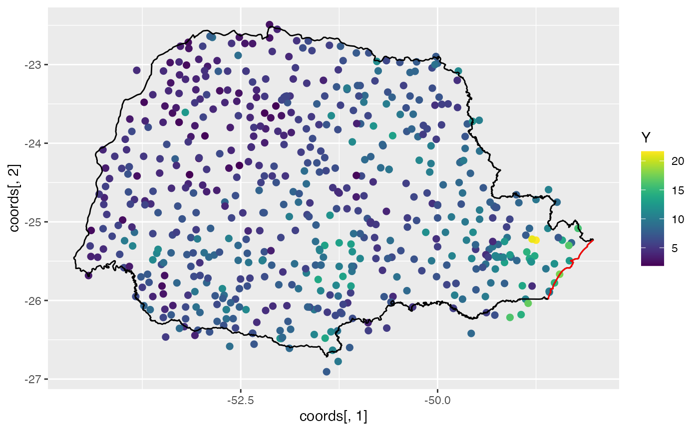
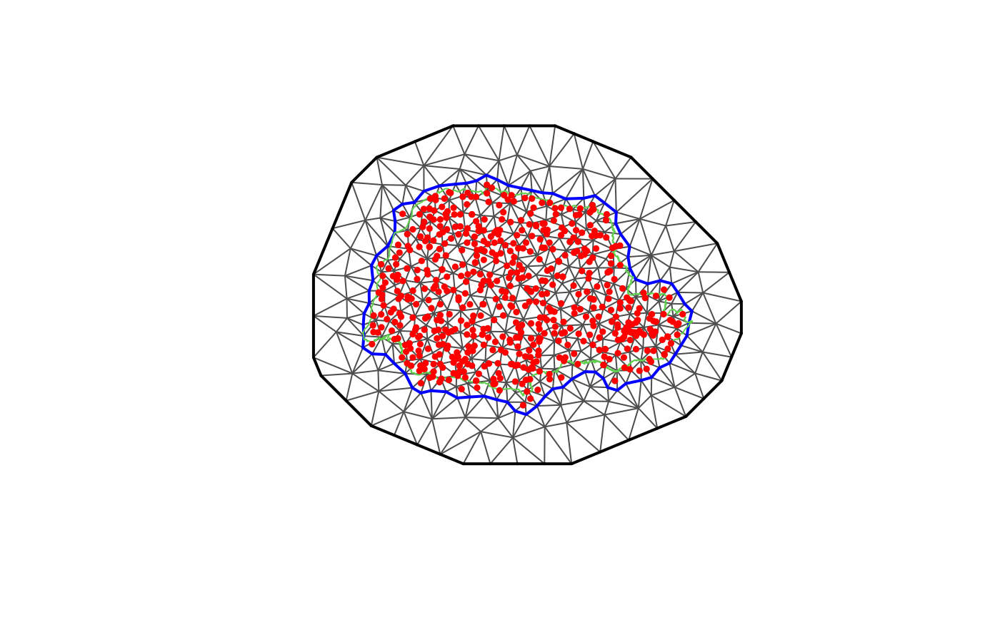
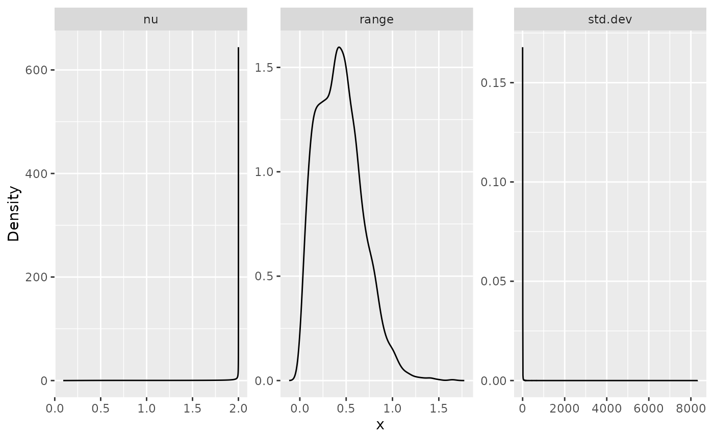
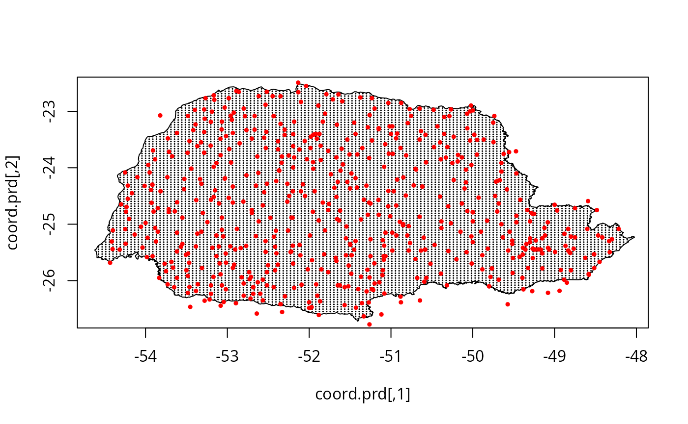
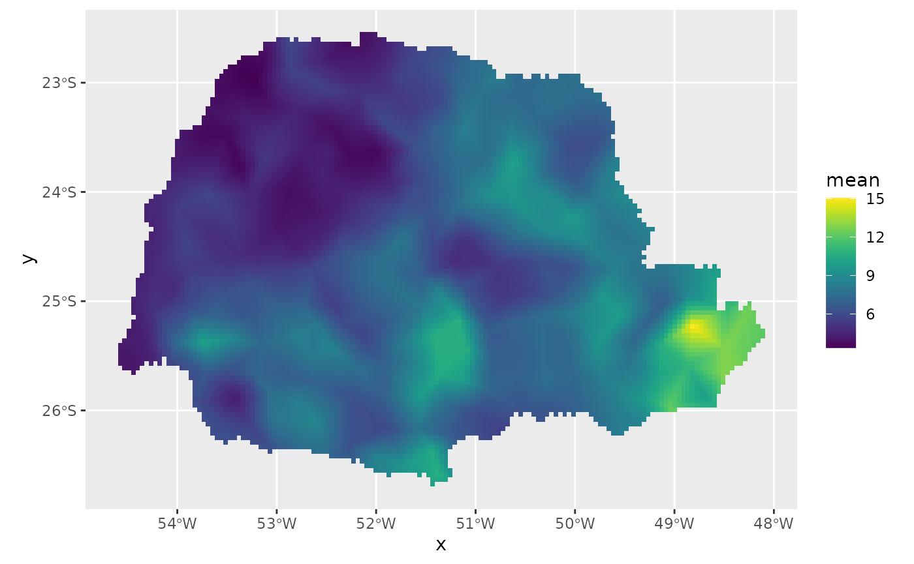
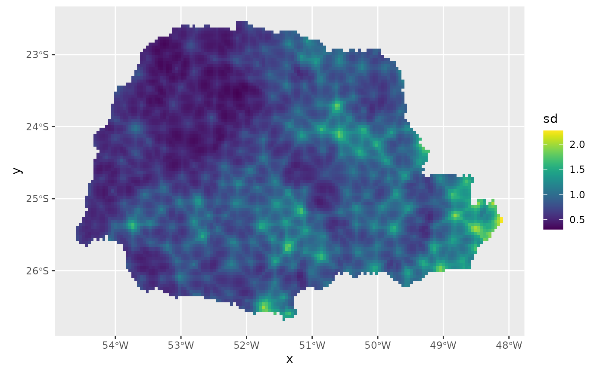
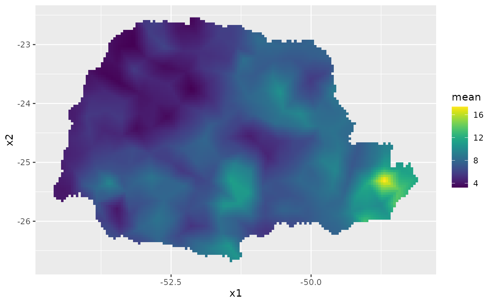
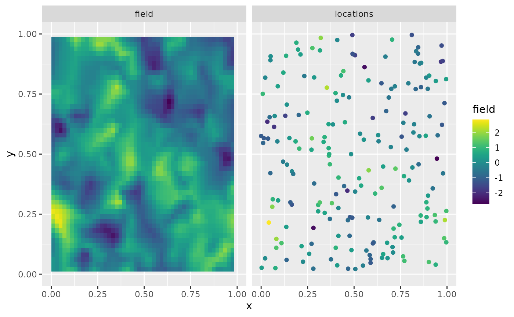
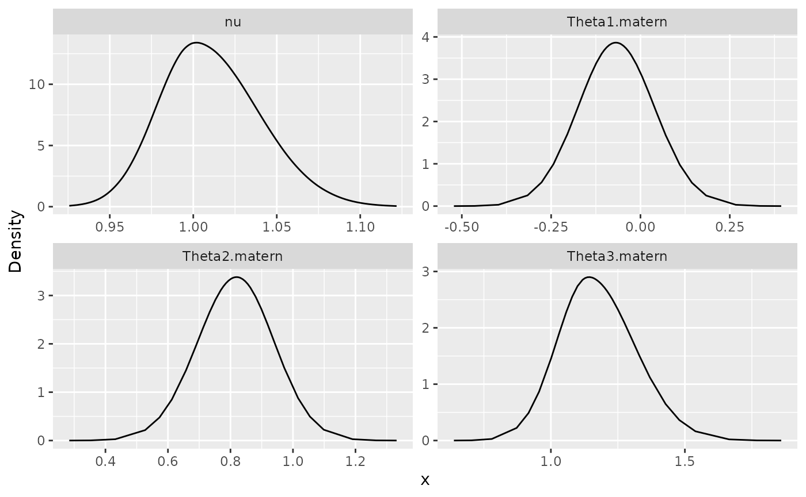

# inlabru implementation of the rational SPDE approach

## Introduction

In this vignette we will present the [`inlabru`](http://inlabru.org/)
implementation of the covariance-based rational SPDE approach. For
further technical details on the covariance-based approach, see the
[Rational approximation with the `rSPDE`
package](https://davidbolin.github.io/rSPDE/articles/rspde_cov.md)
vignette and [Bolin, Simas, and Xiong
(2023)](https://doi.org/10.1080/10618600.2023.2231051).

We begin by providing a step-by-step illustration on how to use our
implementation. To this end we will consider a real world data set that
consists of precipitation measurements from the Paraná region in Brazil.

After the initial model fitting, we will show how to change some
parameters of the model. In the end, we will also provide an example in
which we have replicates.

The examples in this vignette are the same as those in the [R-INLA
implementation of the rational SPDE
approach](https://davidbolin.github.io/rSPDE/articles/rspde_inla.md)
vignette. As in that case, it is important to mention that one can
improve the performance by using the PARDISO solver. Please, go to
<https://www.pardiso-project.org/r-inla/#license> to apply for a
license. Also, use
[`inla.pardiso()`](https://rdrr.io/pkg/INLA/man/pardiso.html) for
instructions on how to enable the PARDISO sparse library.

## An example with real data

To illustrate our implementation of `rSPDE` in
[`inlabru`](http://inlabru.org/) we will consider a dataset available in
[`R-INLA`](https://www.r-inla.org). This data has also been used to
illustrate the SPDE approach, see for instance the book [Advanced
Spatial Modeling with Stochastic Partial Differential Equations Using R
and
INLA](https://www.routledge.com/Advanced-Spatial-Modeling-with-Stochastic-Partial-Differential-Equations/Krainski-Gomez-Rubio-Bakka-Lenzi-Castro-Camilo-Simpson-Lindgren-Rue/p/book/9780367570644)
and also the vignette [Spatial Statistics using R-INLA and Gaussian
Markov random
fields](https://sites.stat.washington.edu/peter/591/INLA.html). See also
[Lindgren, Rue, and Lindström
(2011)](https://rss.onlinelibrary.wiley.com/doi/full/10.1111/j.1467-9868.2011.00777.x)
for theoretical details on the standard SPDE approach.

The data consist of precipitation measurements from the Paraná region in
Brazil and were provided by the Brazilian National Water Agency. The
data were collected at 616 gauge stations in Paraná state, south of
Brazil, for each day in 2011.

### An rSPDE model for precipitation

We will follow the vignette [Spatial Statistics using R-INLA and
Gaussian Markov random
fields](https://sites.stat.washington.edu/peter/591/INLA.html). As
precipitation data are always positive, we will assume it is Gamma
distributed. [`R-INLA`](https://www.r-inla.org) uses the following
parameterization of the Gamma distribution,
$$\Gamma(\mu,\phi):\pi(y) = \frac{1}{\Gamma(\phi)}\left( \frac{\phi}{\mu} \right)^{\phi}y^{\phi - 1}\exp\left( - \frac{\phi y}{\mu} \right).$$
In this parameterization, the distribution has expected value
$E(x) = \mu$ and variance $V(x) = \mu^{2}/\phi$, where $1/\phi$ is a
dispersion parameter.

In this example $\mu$ will be modelled using a stochastic model that
includes both covariates and spatial structure, resulting in the latent
Gaussian model for the precipitation measurements $$\begin{aligned}
{y_{i} \mid \mu\left( s_{i} \right),\theta} & {\sim \Gamma\left( \mu\left( s_{i} \right),c\phi \right)} \\
{\log\left( \mu(s) \right)} & {= \eta(s) = \sum\limits_{k}f_{k}\left( c_{k}(s) \right) + u(s)} \\
\theta & {\sim \pi(\theta)}
\end{aligned},$$

where $y_{i}$ denotes the measurement taken at location $s_{i}$,
$c_{k}(s)$ are covariates, $u(s)$ is a mean-zero Gaussian Matérn field,
and $\theta$ is a vector containing all parameters of the model,
including smoothness of the field. That is, by using the `rSPDE` model
we will also be able to estimate the smoothness of the latent field.

### Examining the data

We will be using [`inlabru`](http://inlabru.org/). The `inlabru` package
is available on CRAN and also on
[GitHub](https://github.com/inlabru-org/inlabru).

We begin by loading some libraries we need to get the data and build the
plots.

``` r
library(ggplot2)
library(INLA)
library(inlabru)
library(splancs)
library(viridis)
```

Let us load the data and the border of the region

``` r
data(PRprec)
data(PRborder)
```

The data frame contains daily measurements at 616 stations for the year
2011, as well as coordinates and altitude information for the
measurement stations. We will not analyze the full spatio-temporal data
set, but instead look at the total precipitation in January, which we
calculate as

``` r
Y <- rowMeans(PRprec[, 3 + 1:31])
```

In the next snippet of code, we extract the coordinates and altitudes
and remove the locations with missing values.

``` r
ind <- !is.na(Y)
Y <- Y[ind]
coords <- as.matrix(PRprec[ind, 1:2])
alt <- PRprec$Altitude[ind]
```

Let us build a plot for the precipitations:

``` r
ggplot() +
  geom_point(aes(
    x = coords[, 1], y = coords[, 2],
    colour = Y
  ), size = 2, alpha = 1) +
  geom_path(aes(x = PRborder[, 1], y = PRborder[, 2])) +
  geom_path(aes(x = PRborder[1034:1078, 1], y = PRborder[
    1034:1078,
    2
  ]), colour = "red") + 
  scale_color_viridis()
```



The red line in the figure shows the coast line, and we expect the
distance to the coast to be a good covariate for precipitation.

This covariate is not available, so let us calculate it for each
observation location:

``` r
seaDist <- apply(spDists(coords, PRborder[1034:1078, ],
  longlat = TRUE
), 1, min)
```

Now, let us plot the precipitation as a function of the possible
covariates:

``` r
par(mfrow = c(2, 2))
plot(coords[, 1], Y, cex = 0.5, xlab = "Longitude")
plot(coords[, 2], Y, cex = 0.5, xlab = "Latitude")
plot(seaDist, Y, cex = 0.5, xlab = "Distance to sea")
plot(alt, Y, cex = 0.5, xlab = "Altitude")
```


``` r
par(mfrow = c(1, 1))
```

### Creating the rSPDE model

To use the [`inlabru`](http://inlabru.org/) implementation of the
`rSPDE` model we need to load the functions:

``` r
library(rSPDE)
```

To create a `rSPDE` model, one would the
[`rspde.matern()`](https://davidbolin.github.io/rSPDE/reference/rspde.matern.md)
function in a similar fashion as one would use the
[`inla.spde2.matern()`](https://rdrr.io/pkg/INLA/man/inla.spde2.matern.html)
function.

#### Mesh

We can use
[`fm_mesh_2d()`](https://inlabru-org.github.io/fmesher/reference/fm_mesh_2d.html)
function from the `fmesher` package for creating the mesh. Let us create
a mesh which is based on a non-convex hull to avoid adding many small
triangles outside the domain of interest:

``` r
library(fmesher)

prdomain <- fm_nonconvex_hull(coords, -0.03, -0.05, resolution = c(100, 100))
prmesh <- fm_mesh_2d(boundary = prdomain, max.edge = c(0.45, 1), cutoff = 0.2)
plot(prmesh, asp = 1, main = "")
lines(PRborder, col = 3)
points(coords[, 1], coords[, 2], pch = 19, cex = 0.5, col = "red")
```



#### Setting up the data frame

In place of a `inla.stack`, we can set up a
[`data.frame()`](https://rdrr.io/r/base/data.frame.html) to use
[`inlabru`](http://inlabru.org/). We refer the reader to vignettes in
<https://inlabru-org.github.io/inlabru/index.html> for further details.

``` r
library(sf)
```

    ## Linking to GEOS 3.12.1, GDAL 3.8.4, PROJ 9.4.0; sf_use_s2() is TRUE

``` r
prdata <- data.frame(long = coords[,1], lat = coords[,2], 
                        seaDist = inla.group(seaDist), y = Y)
prdata <- st_as_sf(prdata, coords = c("long", "lat"), crs = 4326)
```

#### Setting up the rSPDE model

To set up an `rSPDE`model, all we need is the mesh. By default it will
assume that we want to estimate the smoothness parameter $\nu$ and to do
a covariance-based rational approximation of order 2.

Later in this vignette we will also see other options for setting up
`rSPDE` models such as keeping the smoothness parameter fixed and/or
increasing the order of the covariance-based rational approximation.

Therefore, to set up a model all we have to do is use the
[`rspde.matern()`](https://davidbolin.github.io/rSPDE/reference/rspde.matern.md)
function:

``` r
rspde_model <- rspde.matern(mesh = prmesh)
```

Notice that this function is very reminiscent of
[`R-INLA`](https://www.r-inla.org)’s
[`inla.spde2.matern()`](https://rdrr.io/pkg/INLA/man/inla.spde2.matern.html)
function.

We will assume the following linkage between model components and
observations
$$\eta(s) \sim Ax(s) + A{\mspace{6mu}\text{Intercept}} + \text{seaDist}.$$$\eta(s)$
will then be used in the observation-likelihood,
$$y_{i} \mid \eta\left( s_{i} \right),\theta \sim \Gamma\left( \exp\left( \eta\left( s_{i} \right) \right),c\phi \right).$$

### Model fitting

We will build a model using the distance to the sea $x_{i}$ as a
covariate through an improper CAR(1) model with
$\beta_{ij} = 1(i \sim j)$, which [`R-INLA`](https://www.r-inla.org)
calls a random walk of order 1. We will fit it in `inlabru`’s style:

``` r
cmp <- y ~ Intercept(1) + distSea(seaDist, model="rw1") +
field(geometry, model = rspde_model)
```

To fit the model we simply use the
[`bru()`](https://inlabru-org.github.io/inlabru/reference/bru.html)
function:

``` r
rspde_fit <- bru(cmp, data = prdata,
  family = "Gamma",
  options = list(
    control.inla = list(int.strategy = "eb"),
    verbose = FALSE,
    num.threads = "1:1")
)
```

### inlabru results

We can look at some summaries of the posterior distributions for the
parameters, for example the fixed effects (i.e. the intercept) and the
hyper-parameters (i.e. dispersion in the gamma likelihood, the precision
of the RW1, and the parameters of the spatial field):

``` r
summary(rspde_fit)
```

    ## inlabru version: 2.13.0
    ## INLA version: 26.01.26-1
    ## Components:
    ## Intercept: main = linear(1), group = exchangeable(1L), replicate = iid(1L), NULL
    ## distSea: main = rw1(seaDist), group = exchangeable(1L), replicate = iid(1L), NULL
    ## field: main = cgeneric(geometry), group = exchangeable(1L), replicate = iid(1L), NULL
    ## Observation models:
    ##   Family: 'Gamma'
    ##     Tag: <No tag>
    ##     Data class: 'sf', 'data.frame'
    ##     Response class: 'numeric'
    ##     Predictor: y ~ .
    ##     Additive/Linear: TRUE/TRUE
    ##     Used components: effects[Intercept, distSea, field], latent[]
    ## Time used:
    ##     Pre = 0.29, Running = 6.35, Post = 0.0964, Total = 6.74 
    ## Fixed effects:
    ##            mean    sd 0.025quant 0.5quant 0.975quant  mode kld
    ## Intercept 1.941 0.042       1.86    1.941      2.023 1.941   0
    ## 
    ## Random effects:
    ##   Name     Model
    ##     distSea RW1 model
    ##    field CGeneric
    ## 
    ## Model hyperparameters:
    ##                                                   mean       sd 0.025quant
    ## Precision-parameter for the Gamma observations   14.43    1.037      12.49
    ## Precision for distSea                          7750.84 4551.329    2327.86
    ## Theta1 for field                                 -4.33    3.394     -12.30
    ## Theta2 for field                                  2.04    0.716       0.96
    ## Theta3 for field                                  2.52    2.924      -1.61
    ##                                                0.5quant 0.975quant     mode
    ## Precision-parameter for the Gamma observations    14.40   1.66e+01   14.335
    ## Precision for distSea                           6674.57   1.95e+04 4972.714
    ## Theta1 for field                                  -3.84   4.53e-01   -1.141
    ## Theta2 for field                                   1.95   3.69e+00    1.476
    ## Theta3 for field                                   2.10   9.38e+00   -0.182
    ## 
    ## Marginal log-Likelihood:  -1254.76 
    ##  is computed 
    ## Posterior summaries for the linear predictor and the fitted values are computed
    ## (Posterior marginals needs also 'control.compute=list(return.marginals.predictor=TRUE)')

Let $\theta_{1} = \text{Theta1}$, $\theta_{2} = \text{Theta2}$ and
$\theta_{3} = \text{Theta3}$. In terms of the SPDE
$$\left( \kappa^{2}I - \Delta \right)^{\alpha/2}(\tau u) = \mathcal{W},$$
where $\alpha = \nu + d/2$, we have that
$$\tau = \exp\left( \theta_{1} \right),\quad\kappa = \exp\left( \theta_{2} \right),$$
and by default
$$\nu = 4(\frac{\exp\left( \theta_{3} \right)}{1 + \exp\left( \theta_{3} \right)}).$$
The number 4 comes from the upper bound for $\nu$, which is discussed in
[R-INLA implementation of the rational SPDE
approach](https://davidbolin.github.io/rSPDE/articles/rspde_inla.md)
vignette.

In general, we have
$$\nu = \nu_{UB}(\frac{\exp\left( \theta_{3} \right)}{1 + \exp\left( \theta_{3} \right)}),$$
where $\nu_{UB}$ is the value of the upper bound for the smoothness
parameter $\nu$.

Another choice for prior for $\nu$ is a truncated lognormal distribution
and is also discussed in [R-INLA implementation of the rational SPDE
approach](https://davidbolin.github.io/rSPDE/articles/rspde_inla.md)
vignette.

### inlabru results in the original scale

We can obtain outputs with respect to parameters in the original scale
by using the function
[`rspde.result()`](https://davidbolin.github.io/rSPDE/reference/rspde.result.md):

``` r
result_fit <- rspde.result(rspde_fit, "field", 
                rspde_model)
```

    ## Warning in rspde.result(rspde_fit, "field", rspde_model): the mean or mode of
    ## nu is very close to nu.upper.bound, please consider increasing nu.upper.bound,
    ## and refitting the model.

``` r
summary(result_fit)
```

    ##            mean        sd  0.025quant  0.5quant 0.975quant        mode
    ## tau    0.217288  0.517082 4.92838e-06 0.0241726    1.61219 6.96490e-09
    ## kappa 10.279600 10.725100 2.62863e+00 6.8225900   39.19500 3.81216e+00
    ## nu     1.511230  0.539875 3.28251e-01 1.7607400    1.99981 1.99999e+00

We can also plot the posterior densities. To this end we will use the
[`gg_df()`](https://davidbolin.github.io/rSPDE/reference/gg_df.md)
function, which creates `ggplot2` user-friendly data frames:

``` r
posterior_df_fit <- gg_df(result_fit)

ggplot(posterior_df_fit) + geom_line(aes(x = x, y = y)) + 
facet_wrap(~parameter, scales = "free") + labs(y = "Density")
```


We can also obtain the summary on a different parameterization by
setting the `parameterization` argument on the
[`rspde.result()`](https://davidbolin.github.io/rSPDE/reference/rspde.result.md)
function:

``` r
result_fit_matern <- rspde.result(rspde_fit, "field", 
                rspde_model, parameterization = "matern")
```

    ## Warning in rspde.result(rspde_fit, "field", rspde_model, parameterization =
    ## "matern"): the mean or mode of nu is very close to nu.upper.bound, please
    ## consider increasing nu.upper.bound, and refitting the model.

``` r
summary(result_fit_matern)
```

    ##             mean         sd 0.025quant 0.5quant 0.975quant      mode
    ## std.dev 8.565800 113.371000 -0.0109383  3.47824  32.574400 -0.160995
    ## range   0.433283   0.245995  0.0463670  0.41678   0.966398  0.424095
    ## nu      1.511230   0.539875  0.3282510  1.76074   1.999810  1.999990

In a similar manner, we can obtain posterior plots on the `matern`
parameterization:

``` r
posterior_df_fit_matern <- gg_df(result_fit_matern)

ggplot(posterior_df_fit_matern) + geom_line(aes(x = x, y = y)) + 
facet_wrap(~parameter, scales = "free") + labs(y = "Density")
```



### Predictions

Let us now obtain predictions (i.e. do kriging) of the expected
precipitation on a dense grid in the region.

We begin by creating the grid in which we want to do the predictions. To
this end, we can use the
[`fm_evaluator()`](https://inlabru-org.github.io/fmesher/reference/fm_evaluate.html)
function:

``` r
nxy <- c(150, 100)
projgrid <- fm_evaluator(prmesh,
  xlim = range(PRborder[, 1]),
  ylim = range(PRborder[, 2]), dims = nxy
)
```

This lattice contains 150 × 100 locations. One can easily change the
resolution of the kriging prediction by changing `nxy`. Let us find the
cells that are outside the region of interest so that we do not plot the
estimates there.

``` r
xy.in <- inout(projgrid$lattice$loc, cbind(PRborder[, 1], PRborder[, 2]))
```

Let us plot the locations that we will do prediction:

``` r
coord.prd <- projgrid$lattice$loc[xy.in, ]
plot(coord.prd, type = "p", cex = 0.1)
lines(PRborder)
points(coords[, 1], coords[, 2], pch = 19, cex = 0.5, col = "red")
```



Let us now create a
[`data.frame()`](https://rdrr.io/r/base/data.frame.html) of the
coordinates:

``` r
coord.prd.df <- data.frame(x1 = coord.prd[,1],
                            x2 = coord.prd[,2])
coord.prd.df <- st_as_sf(coord.prd.df, coords = c("x1", "x2"), 
                  crs = 4326)
```

Since we are using distance to the sea as a covariate, we also have to
calculate this covariate for the prediction locations. Finally, we add
the prediction location to our prediction
[`data.frame()`](https://rdrr.io/r/base/data.frame.html), namely,
`coord.prd.df`:

``` r
seaDist.prd <- apply(spDists(coord.prd,
  PRborder[1034:1078, ],
  longlat = TRUE
), 1, min)
coord.prd.df$seaDist <- seaDist.prd
```

``` r
pred_obs <- predict(rspde_fit, coord.prd.df, 
        ~exp(Intercept + field + distSea))
```

Finally, we plot the results. First the predicted mean:

``` r
ggplot() + gg(pred_obs, geom = "tile",
    aes(fill = mean)) +
  geom_raster() +
  scale_fill_viridis()
```



Then, the std. deviations:

``` r
ggplot() + gg(pred_obs, geom = "tile",
    aes(fill = sd)) +
  geom_raster() +
  scale_fill_viridis()
```



## An example with replicates

For this example we will simulate a data with replicates. We will use
the same example considered in the [Rational approximation with the
`rSPDE`
package](https://davidbolin.github.io/rSPDE/articles/rspde_cov.md)
vignette (the only difference is the way the data is organized). We also
refer the reader to this vignette for a description of the function
[`matern.operators()`](https://davidbolin.github.io/rSPDE/reference/matern.operators.md),
along with its methods (for instance, the
[`simulate()`](https://rdrr.io/r/stats/simulate.html) method).

### Simulating the data

Let us consider a simple Gaussian linear model with 30 independent
replicates of a latent spatial field $x(\mathbf{s})$, observed at the
same $m$ locations, $\{\mathbf{s}_{1},\ldots,\mathbf{s}_{m}\}$, for each
replicate. For each $i = 1,\ldots,m,$ we have

$$\begin{aligned}
y_{i} & {= x_{1}\left( \mathbf{s}_{i} \right) + \varepsilon_{i},} \\
\vdots & {= \vdots} \\
y_{i + 29m} & {= x_{30}\left( \mathbf{s}_{i} \right) + \varepsilon_{i + 29m},}
\end{aligned}$$

where $\varepsilon_{1},\ldots,\varepsilon_{30m}$ are iid normally
distributed with mean 0 and standard deviation 0.1.

We use the basis function representation of $x( \cdot )$ to define the
$A$ matrix linking the point locations to the mesh. We also need to
account for the fact that we have 30 replicates at the same locations.
To this end, the $A$ matrix we need can be generated by
[`spde.make.A()`](https://davidbolin.github.io/rSPDE/reference/spde.make.A.md)
function. The reason being that we are sampling $x( \cdot )$ directly
and not the latent vector described in the introduction of the [Rational
approximation with the `rSPDE`
package](https://davidbolin.github.io/rSPDE/articles/rspde_cov.md)
vignette.

We begin by creating the mesh:

``` r
m <- 200
loc_2d_mesh <- matrix(runif(m * 2), m, 2)
mesh_2d <- fm_mesh_2d(
  loc = loc_2d_mesh,
  cutoff = 0.05,
  offset = c(0.1, 0.4),
  max.edge = c(0.05, 0.5)
)
plot(mesh_2d, main = "")
points(loc_2d_mesh[, 1], loc_2d_mesh[, 2])
```



We then compute the $A$ matrix, which is needed for simulation, and
connects the observation locations to the mesh. To this end we will use
the
[`spde.make.A()`](https://davidbolin.github.io/rSPDE/reference/spde.make.A.md)
helper function, which is a wrapper that uses the functions
[`fm_basis()`](https://inlabru-org.github.io/fmesher/reference/fm_basis.html),
[`fm_block()`](https://inlabru-org.github.io/fmesher/reference/fm_block.html)
and
[`fm_row_kron()`](https://inlabru-org.github.io/fmesher/reference/fm_row_kron.html)
from the `fmesher` package.

``` r
n.rep <- 30
A <- spde.make.A(
  mesh = mesh_2d,
  loc = loc_2d_mesh,
  index = rep(1:m, times = n.rep),
  repl = rep(1:n.rep, each = m)
)
```

Notice that for the simulated data, we should use the $A$ matrix from
[`spde.make.A()`](https://davidbolin.github.io/rSPDE/reference/spde.make.A.md)
function instead of the
[`rspde.make.A()`](https://davidbolin.github.io/rSPDE/reference/rspde.make.A.md).

We will now simulate a latent process with standard deviation
$\sigma = 1$ and range $0.1$. We will use $\nu = 0.5$ so that the model
has an exponential covariance function. To this end we create a model
object with the
[`matern.operators()`](https://davidbolin.github.io/rSPDE/reference/matern.operators.md)
function:

``` r
nu <- 0.5
sigma <- 1
range <- 0.1
kappa <- sqrt(8 * nu) / range
tau <- sqrt(gamma(nu) / (sigma^2 * kappa^(2 * nu) * (4 * pi) * gamma(nu + 1)))
d <- 2
operator_information <- matern.operators(
  mesh = mesh_2d,
  nu = nu,
  range = range,
  sigma = sigma,
  m = 2,
  parameterization = "matern"
)
```

More details on this function can be found at the [Rational
approximation with the rSPDE
package](https://davidbolin.github.io/rSPDE/articles/rspde_cov.md)
vignette.

To simulate the latent process all we need to do is to use the
[`simulate()`](https://rdrr.io/r/stats/simulate.html) method on the
`operator_information` object. We then obtain the simulated data $y$ by
connecting with the $A$ matrix and adding the gaussian noise.

``` r
set.seed(1)
u <- simulate(operator_information, nsim = n.rep)
y <- as.vector(A %*% as.vector(u)) +
  rnorm(m * n.rep) * 0.1
```

The first replicate of the simulated random field as well as the
observation locations are shown in the following figure.

``` r
proj <- fm_evaluator(mesh_2d, dims = c(100, 100))

df_field <- data.frame(x = proj$lattice$loc[,1],
                        y = proj$lattice$loc[,2],
                        field = as.vector(fm_evaluate(proj, 
                        field = as.vector(u[, 1]))),
                        type = "field")

df_loc <- data.frame(x = loc_2d_mesh[, 1],
                      y = loc_2d_mesh[, 2],
                      field = y[1:m],
                      type = "locations")
df_plot <- rbind(df_field, df_loc)

ggplot(df_plot) + aes(x = x, y = y, fill = field) +
        facet_wrap(~type) + xlim(0,1) + ylim(0,1) + 
        geom_raster(data = df_field) +
        geom_point(data = df_loc, aes(colour = field),
        show.legend = FALSE) + 
        scale_fill_viridis() + scale_colour_viridis()
```



### Fitting the inlabru rSPDE model

Let us then use the rational SPDE approach to fit the data.

We begin by creating the model object.

``` r
rspde_model.rep <- rspde.matern(mesh = mesh_2d,
          parameterization = "spde") 
```

Let us now create the
[`data.frame()`](https://rdrr.io/r/base/data.frame.html) and the vector
with the replicates indexes:

``` r
rep.df <- data.frame(y = y, x1 = rep(loc_2d_mesh[,1], n.rep),
                      x2 = rep(loc_2d_mesh[,2], n.rep))
rep.df <- st_as_sf(rep.df, coords = c("x1", "x2"))
repl <- rep(1:n.rep, each=m)
```

Let us create the component and fit. It is extremely important not to
forget the `replicate` when fitting model with the
[`bru()`](https://inlabru-org.github.io/inlabru/reference/bru.html)
function. It will not produce warning and might fit some meaningless
model.

``` r
cmp.rep <-
  y ~ -1 + field(geometry,
    model = rspde_model.rep,
    replicate = repl
  )


rspde_fit.rep <-
  bru(cmp.rep,
    data = rep.df,
    family = "gaussian",
    options = list(num.threads = "1:1")
  )
```

We can get the summary:

``` r
summary(rspde_fit.rep)
```

    ## inlabru version: 2.13.0
    ## INLA version: 26.01.26-1
    ## Components:
    ## field: main = cgeneric(geometry), group = exchangeable(1L), replicate = iid(repl), NULL
    ## Observation models:
    ##   Family: 'gaussian'
    ##     Tag: <No tag>
    ##     Data class: 'sf', 'data.frame'
    ##     Response class: 'numeric'
    ##     Predictor: y ~ .
    ##     Additive/Linear: TRUE/TRUE
    ##     Used components: effects[field], latent[]
    ## Time used:
    ##     Pre = 0.202, Running = 46.4, Post = 0.948, Total = 47.6 
    ## Random effects:
    ##   Name     Model
    ##     field CGeneric
    ## 
    ## Model hyperparameters:
    ##                                           mean    sd 0.025quant 0.5quant
    ## Precision for the Gaussian observations 94.682 4.643      85.82   94.585
    ## Theta1 for field                        -3.748 1.186      -6.33   -3.664
    ## Theta2 for field                         3.172 0.172       2.87    3.160
    ## Theta3 for field                        -0.306 0.645      -1.41   -0.352
    ##                                         0.975quant   mode
    ## Precision for the Gaussian observations     104.10 94.430
    ## Theta1 for field                             -1.71 -3.247
    ## Theta2 for field                              3.55  3.101
    ## Theta3 for field                              1.10 -0.578
    ## 
    ## Marginal log-Likelihood:  -4473.75 
    ##  is computed 
    ## Posterior summaries for the linear predictor and the fitted values are computed
    ## (Posterior marginals needs also 'control.compute=list(return.marginals.predictor=TRUE)')

and the summary in the user’s scale:

``` r
result_fit_rep <- rspde.result(rspde_fit.rep, "field", rspde_model.rep)
summary(result_fit_rep)
```

    ##             mean        sd  0.025quant   0.5quant 0.975quant        mode
    ## tau    0.0425668 0.0498556  0.00183628  0.0263959   0.178761  0.00430969
    ## kappa 24.2006000 4.3286000 17.73910000 23.4708000  34.539400 21.74250000
    ## nu     0.8569230 0.2922080  0.39304200  0.8181840   1.493820  0.67519300

``` r
result_df <- data.frame(
  parameter = c("tau", "kappa", "nu"),
  true = c(tau, kappa, nu),
  mean = c(
    result_fit_rep$summary.tau$mean,
    result_fit_rep$summary.kappa$mean,
    result_fit_rep$summary.nu$mean
  ),
  mode = c(
    result_fit_rep$summary.tau$mode,
    result_fit_rep$summary.kappa$mode,
    result_fit_rep$summary.nu$mode
  )
)
print(result_df)
```

    ##   parameter        true        mean        mode
    ## 1       tau  0.08920621  0.04256681  0.00430969
    ## 2     kappa 20.00000000 24.20062400 21.74248299
    ## 3        nu  0.50000000  0.85692328  0.67519309

Let us also obtain the summary on the `matern` parameterization:

``` r
result_fit_rep_matern <- rspde.result(rspde_fit.rep, "field", rspde_model.rep, 
                          parameterization = "matern")
summary(result_fit_rep_matern)
```

    ##             mean         sd 0.025quant 0.5quant 0.975quant     mode
    ## std.dev 1.015180 0.10868700  0.7133100 1.046440   1.134060 1.096930
    ## range   0.106346 0.00500547  0.0952467 0.106751   0.115002 0.107168
    ## nu      0.856923 0.29220800  0.3930420 0.818184   1.493820 0.675193

``` r
result_df_matern <- data.frame(
  parameter = c("std_dev", "range", "nu"),
  true = c(sigma, range, nu),
  mean = c(
    result_fit_rep_matern$summary.std.dev$mean,
    result_fit_rep_matern$summary.range$mean,
    result_fit_rep_matern$summary.nu$mean
  ),
  mode = c(
    result_fit_rep$summary.std.dev$mode,
    result_fit_rep$summary.range$mode,
    result_fit_rep$summary.nu$mode
  )
)
print(result_df_matern)
```

    ##   parameter true      mean      mode
    ## 1   std_dev  1.0 1.0151775 0.6751931
    ## 2     range  0.1 0.1063464 0.6751931
    ## 3        nu  0.5 0.8569233 0.6751931

## An example with a non-stationary model

Our goal now is to show how one can fit model with non-stationary
$\sigma$ (std. deviation) and non-stationary $\rho$ (a range parameter).
One can also use the parameterization in terms of non-stationary SPDE
parameters $\kappa$ and $\tau$.

For this example we will consider simulated data.

### Simulating the data

Let us consider a simple Gaussian linear model with a latent spatial
field $x(\mathbf{s})$, defined on the rectangle $(0,10) \times (0,5)$,
where the std. deviation and range parameter satisfy the following
log-linear regressions: $$\begin{aligned}
{\log\left( \sigma(\mathbf{s}) \right)} & {= \theta_{1} + \theta_{3}b(\mathbf{s}),} \\
{\log\left( \rho(\mathbf{s}) \right)} & {= \theta_{2} + \theta_{3}b(\mathbf{s}),}
\end{aligned}$$ where $b(\mathbf{s}) = \left( s_{1} - 5 \right)/10$. We
assume the data is observed at $m$ locations,
$\{\mathbf{s}_{1},\ldots,\mathbf{s}_{m}\}$. For each $i = 1,\ldots,m,$
we have

$$y_{i} = x_{1}\left( \mathbf{s}_{i} \right) + \varepsilon_{i},$$

where $\varepsilon_{1},\ldots,\varepsilon_{m}$ are iid normally
distributed with mean 0 and standard deviation 0.1.

We begin by defining the domain and creating the mesh:

``` r
rec_domain <- cbind(c(0, 1, 1, 0, 0) * 10, c(0, 0, 1, 1, 0) * 5)

mesh <- fm_mesh_2d(loc.domain = rec_domain, cutoff = 0.1, 
  max.edge = c(0.5, 1.5), offset = c(0.5, 1.5))
```

We follow the same structure as `INLA`. However, `INLA` only allows one
to specify `B.tau` and `B.kappa` matrices, and, in `INLA`, if one wants
to parameterize in terms of range and standard deviation one needs to do
it manually. Here we provide the option to directly provide the matrices
`B.sigma` and `B.range`.

The usage of the matrices `B.tau` and `B.kappa` are identical to the
corresponding ones in
[`inla.spde2.matern()`](https://rdrr.io/pkg/INLA/man/inla.spde2.matern.html)
function. The matrices `B.sigma` and `B.range` work in the same way, but
they parameterize the stardard deviation and range, respectively.

The columns of the `B` matrices correspond to the same parameter. The
first column does not have any parameter to be estimated, it is a
constant column.

So, for instance, if one wants to share a parameter with both `sigma`
and `range` (or with both `tau` and `kappa`), one simply let the
corresponding column to be nonzero on both `B.sigma` and `B.range` (or
on `B.tau` and `B.kappa`).

We will assume $\nu = 0.8$, $\theta_{1} = 0,\theta_{2} = 1$ and
$\theta_{3} = 1$. Let us now build the model to obtain the sample with
the
[`spde.matern.operators()`](https://davidbolin.github.io/rSPDE/reference/spde.matern.operators.md)
function:

``` r
nu <- 0.8
true_theta <- c(0,1, 1)
B.sigma = cbind(0, 1, 0, (mesh$loc[,1] - 5) / 10)
B.range = cbind(0, 0, 1, (mesh$loc[,1] - 5) / 10)

# SPDE model
op_cov_ns <- spde.matern.operators(mesh = mesh, 
  theta = true_theta,
  nu = nu,
  B.sigma = B.sigma, 
  B.range = B.range, m = 2,
  parameterization = "matern")
```

Let us now sample the data with the
[`simulate()`](https://rdrr.io/r/stats/simulate.html) method:

``` r
u <- as.vector(simulate(op_cov_ns, seed = 123))
```

Let us now obtain 600 random locations on the rectangle and compute the
$A$ matrix:

``` r
m <- 600
loc_mesh <- cbind(runif(m) * 10, runif(m) * 5)

A <- spde.make.A(
  mesh = mesh,
  loc = loc_mesh
)
```

We can now generate the response vector `y`:

``` r
y <- as.vector(A %*% as.vector(u)) + rnorm(m) * 0.1
```

### Fitting the inlabru rSPDE model

Let us then use the rational SPDE approach to fit the data.

We begin by creating the model object. We are creating a new one so that
we do not start the estimation at the true values.

``` r
rspde_model_nonstat <- rspde.matern(mesh = mesh,
  B.sigma = B.sigma,
  B.range = B.range,
  parameterization = "matern") 
```

Let us now create the
[`data.frame()`](https://rdrr.io/r/base/data.frame.html) and the vector
with the replicates indexes:

``` r
nonstat_df <- data.frame(y = y, x1 = loc_mesh[,1],
                      x2 = loc_mesh[,2])
nonstat_df <- st_as_sf(nonstat_df, coords = c("x1", "x2"))
```

Let us create the component and fit. It is extremely important not to
forget the `replicate` when fitting model with the
[`bru()`](https://inlabru-org.github.io/inlabru/reference/bru.html)
function. It will not produce warning and might fit some meaningless
model.

``` r
cmp_nonstat <-
  y ~ -1 + field(geometry,
    model = rspde_model_nonstat
  )


rspde_fit_nonstat <-
  bru(cmp_nonstat,
    data = nonstat_df,
    family = "gaussian",
    options = list(verbose = FALSE,
                   num.threads = "1:1")
  )
```

We can get the summary:

``` r
summary(rspde_fit_nonstat)
```

    ## inlabru version: 2.13.0
    ## INLA version: 26.01.26-1
    ## Components:
    ## field: main = cgeneric(geometry), group = exchangeable(1L), replicate = iid(1L), NULL
    ## Observation models:
    ##   Family: 'gaussian'
    ##     Tag: <No tag>
    ##     Data class: 'sf', 'data.frame'
    ##     Response class: 'numeric'
    ##     Predictor: y ~ .
    ##     Additive/Linear: TRUE/TRUE
    ##     Used components: effects[field], latent[]
    ## Time used:
    ##     Pre = 0.166, Running = 16.2, Post = 0.146, Total = 16.5 
    ## Random effects:
    ##   Name     Model
    ##     field CGeneric
    ## 
    ## Model hyperparameters:
    ##                                            mean    sd 0.025quant 0.5quant
    ## Precision for the Gaussian observations 105.619 9.089     88.553  105.332
    ## Theta1 for field                         -0.044 0.080     -0.184   -0.048
    ## Theta2 for field                          0.806 0.097      0.611    0.807
    ## Theta3 for field                          1.328 0.337      0.874    1.273
    ## Theta4 for field                          0.057 0.082     -0.074    0.049
    ##                                         0.975quant    mode
    ## Precision for the Gaussian observations    124.317 104.987
    ## Theta1 for field                             0.130  -0.074
    ## Theta2 for field                             0.993   0.813
    ## Theta3 for field                             2.130   0.981
    ## Theta4 for field                             0.243   0.006
    ## 
    ## Marginal log-Likelihood:  2.62 
    ##  is computed 
    ## Posterior summaries for the linear predictor and the fitted values are computed
    ## (Posterior marginals needs also 'control.compute=list(return.marginals.predictor=TRUE)')

We can obtain outputs with respect to parameters in the original scale
by using the function
[`rspde.result()`](https://davidbolin.github.io/rSPDE/reference/rspde.result.md):

``` r
result_fit_nonstat <- rspde.result(rspde_fit_nonstat, "field", rspde_model_nonstat)
summary(result_fit_nonstat)
```

    ##                     mean        sd 0.025quant   0.5quant 0.975quant       mode
    ## Theta1.matern -0.0440761 0.0800768  -0.183846 -0.0483217   0.129592 -0.0743408
    ## Theta2.matern  0.8061370 0.0970137   0.611241  0.8074390   0.993266  0.8131000
    ## Theta3.matern  1.3284300 0.3374770   0.873768  1.2726800   2.130130  0.9807180
    ## nu             1.0283100 0.0406830   0.963791  1.0229700   1.119630  1.0027300

Let us compare the mean to the true values of the parameters:

``` r
summ_res_nonstat <- summary(result_fit_nonstat)
result_df <- data.frame(
  parameter = result_fit_nonstat$params,
  true = c(true_theta, nu),
  mean = summ_res_nonstat[,1],
  mode = summ_res_nonstat[,6]
)
print(result_df)
```

    ##       parameter true       mean       mode
    ## 1 Theta1.matern  0.0 -0.0440761 -0.0743408
    ## 2 Theta2.matern  1.0  0.8061370  0.8131000
    ## 3 Theta3.matern  1.0  1.3284300  0.9807180
    ## 4            nu  0.8  1.0283100  1.0027300

We can also plot the posterior densities. To this end we will use the
[`gg_df()`](https://davidbolin.github.io/rSPDE/reference/gg_df.md)
function, which creates `ggplot2` user-friendly data frames:

``` r
posterior_df_fit <- gg_df(result_fit_nonstat)

ggplot(posterior_df_fit) + geom_line(aes(x = x, y = y)) + 
facet_wrap(~parameter, scales = "free") + labs(y = "Density")
```



## Comparing the results by cross-validation

We can compare the models fitted by `inlabru` by using the function
[`cross_validation()`](https://davidbolin.github.io/rSPDE/reference/cross_validation.md).
To illustrate, we will consider the nonstationary model
`rspde_fit_nonstat` fitted in the previous example and a stationary fit
of the same dataset.

Let us, then, fit a stationary model with the previous dataset. We start
by defining the stationary model:

``` r
rspde_model_stat <- rspde.matern(mesh = mesh)
```

Then, `inlabru`’s component:

``` r
cmp_stat <-
  y ~ -1 + field(geometry,
    model = rspde_model_stat
  )
```

We can now fit the model:

``` r
rspde_fit_stat <-
  bru(cmp_stat,
    data = nonstat_df,
    family = "gaussian",
    options = list(verbose = FALSE,
                   num.threads = "1:1")
  )
```

To perform cross-validation, we create a list with the fitted models,
and we pass this list to the
[`cross_validation()`](https://davidbolin.github.io/rSPDE/reference/cross_validation.md)
function. It is also important to create a named list, so that the
output has meaningful names for the models. We will perform a
`leave percentage out` cross-validation, with the default that fits the
model on 20% of the data, to predict 80% of the data.

Let us create the models list:

``` r
models <- list(stationary = rspde_fit_stat, 
                nonstationary = rspde_fit_nonstat)
```

We will now run the cross-validation on the models above. We set the
`cv_type` to `lpo` to perform the leave percentage out cross-validation,
there are also the `k-fold` (default) and `loo` options to perform
k-fold and leave one out cross-validations, respectively. Observe that
by default we are performing a pseudo cross-validation, that is, we will
not refit the model for each fold, however only the training data will
be used to perform the prediction.

``` r
cv_result <- cross_validation(models, cv_type = "lpo", print = FALSE)
```

We can now look at the results by printing `cv_result`. Observe that the
best model with respect to each score is displayed in the last row.

``` r
cv_result
```

    ##           Model               mse               mae               dss
    ## 1    stationary  0.14979575536611 0.281290993359321 -1.06205831655155
    ## 2 nonstationary 0.148088187688944 0.280370629330245  -1.1412396111486
    ##            Best     nonstationary     nonstationary     nonstationary
    ##                crps             scrps
    ## 1 0.198006729309994 0.507703505449597
    ## 2 0.198708088283116 0.504644213058711
    ##          stationary     nonstationary

The
[`cross_validation()`](https://davidbolin.github.io/rSPDE/reference/cross_validation.md)
function also has the following useful options:

- `return_score_folds` option, so that the scores for each fold can be
  returned in order to create confidence regions for the scores.
- `return_train_test` To return the train and test indexes that were
  used to perform the cross-validation.
- `true_CV` To perform true cross-validation, that is, the data will be
  fit again for each fold, which is more costly.
- `train_test_indexes` In which the user can provide the indexes for the
  train and test sets.

More details can be found in the manual page of the
[`cross_validation()`](https://davidbolin.github.io/rSPDE/reference/cross_validation.md)
function.

## Further options of the `inlabru` implementation

There are several additional options that are available. For instance,
it is possible to change the order of the rational approximation, the
upper bound for the smoothness parameter (which may speed up the fit),
change the priors, change the type of the rational approximation, among
others. These options are described in the “Further options of the
`rSPDE`-`INLA` implementation” section of the [R-INLA implementation of
the rational SPDE
approach](https://davidbolin.github.io/rSPDE/articles/rspde_inla.md)
vignette. Observe that all these options are passed to the model through
the
[`rspde.matern()`](https://davidbolin.github.io/rSPDE/reference/rspde.matern.md)
function, and therefore the resulting model object can directly be used
in the
[`bru()`](https://inlabru-org.github.io/inlabru/reference/bru.html)
function, in an identical manner to the examples above.

## References

Bolin, David, Alexandre B. Simas, and Zhen Xiong. 2023.
“Covariance-Based Rational Approximations of Fractional SPDEs for
Computationally Efficient Bayesian Inference.” *Journal of Computational
and Graphical Statistics*.
<https://doi.org/10.1080/10618600.2022.2139648>.

Lindgren, Finn, Håvard Rue, and Johan Lindström. 2011. “An Explicit Link
Between Gaussian Fields and Gaussian Markov Random Fields: The
Stochastic Partial Differential Equation Approach.” *Journal of the
Royal Statistical Society. Series B. Statistical Methodology* 73 (4):
423–98.
