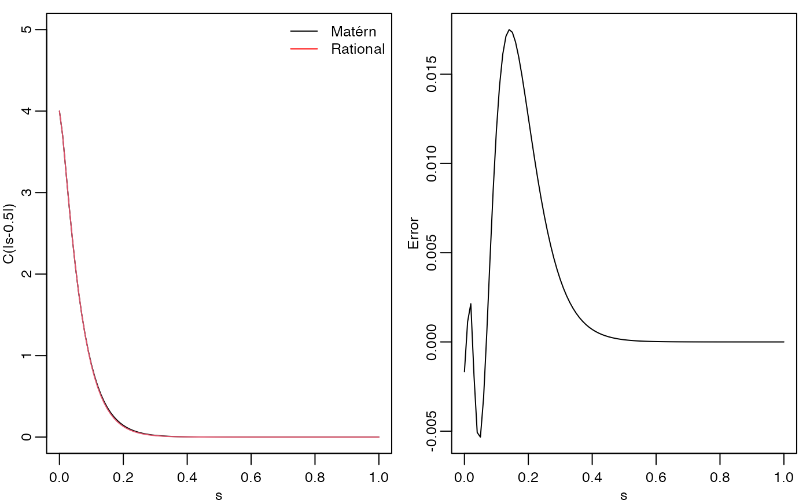
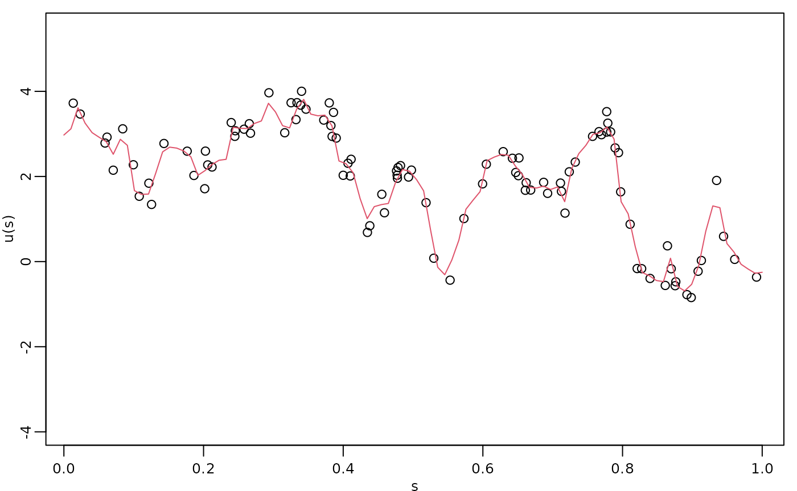
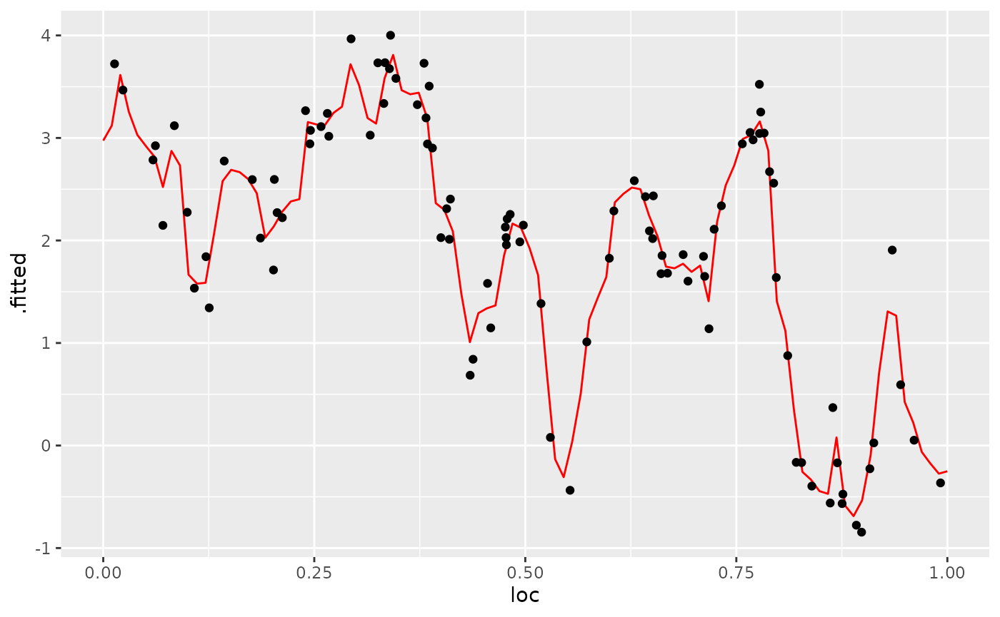
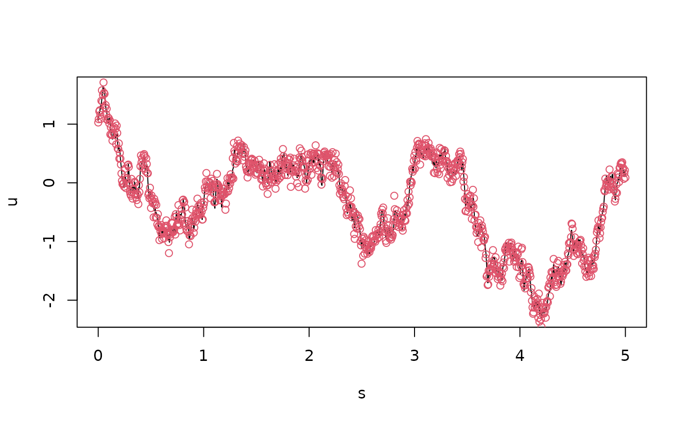
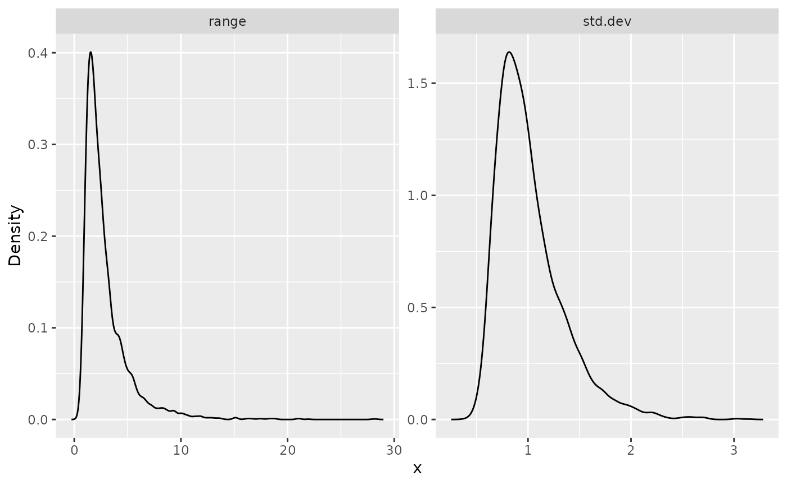

# Rational approximations without finite element approximations

## Introduction

For models in one dimension, we can perform rational approximations
without finite elements. This enables us to provide computationally
efficient approximations of Gaussian processes with Mat'ern covariance
functions, without having to define finite element meshes, and without
having boundary effects due to the boundary conditions that are usually
required. In this vignette we will introduce these methods.

We begin by loading the `rSPDE` package:

``` r
library(rSPDE)
```

Assume that we want to define a model on the interval
$\lbrack 0,1\rbrack$, which we want to evaluate at some locations

``` r
s <- seq(from = 0, to = 1, length.out = 101)
```

We can now use
[`matern.rational()`](https://davidbolin.github.io/rSPDE/reference/matern.rational.md)
to construct a rational SPDE approximation of order $m = 2$ for a
Gaussian random field with a Matérn covariance function on the interval.

``` r
kappa <- 20
sigma <- 2
nu <- 0.8
r <- sqrt(8*nu)/kappa #range parameter
op_cov <- matern.rational(loc = s, nu = nu, range = r, sigma = sigma, m = 2, parameterization = "matern")
```

The object `op_cov` contains the information needed for evaluating the
approximation. Note, however, that the approximation is invariant to the
locations `loc`, and they are only supplied to indicate where we want to
evaluate it.

To evaluate the accuracy of the approximation, let us compute the
covariance function between the process at $s = 0$ and all other
locations in `s` and compare with the true Matérn covariance function.
The covariances can be calculated by using the `covariance()` method.

``` r
c_cov.approx <- op_cov$covariance(ind = 1)
c.true <- matern.covariance(abs(s[1] - s), kappa, nu, sigma)
```

The covariance function and the error compared with the Matérn
covariance are shown in the following figure.

``` r
opar <- par(
  mfrow = c(1, 2), mgp = c(1.3, 0.5, 0),
  mar = c(2, 2, 0.5, 0.5) + 0.1
)
plot(s, c.true,
  type = "l", ylab = "C(|s-0.5|)", xlab = "s", ylim = c(0, 5),
  cex.main = 0.8, cex.axis = 0.8, cex.lab = 0.8
)
lines(s, c_cov.approx, col = 2)
legend("topright",
  bty = "n",
  legend = c("Matérn", "Rational"),
  col = c("black", "red"),
  lty = rep(1, 2), ncol = 1,
  cex = 0.8
)

plot(s, c.true - c_cov.approx,
  type = "l", ylab = "Error", xlab = "s",
  cex.main = 0.8, cex.axis = 0.8, cex.lab = 0.8
)
par(opar)
```



To improve the approximation we can increase the order of the
approximation, by increasing $m$. Let us, for example, compute the
approximation with $m = 1,\ldots,4$.

``` r
errors <- rep(0, 4)
for (i in 1:4) {
  op_cov_i <- matern.rational(loc = s, range = r, sigma = sigma, nu = nu,
                            m = i, parameterization = "matern")
  errors[i] <- norm(c.true - op_cov_i$covariance(ind = 1))
}
print(errors)
```

    ## [1] 1.36208052 0.29200800 0.07907210 0.02597968

We see that the error decreases very fast when we increase $m$ from $1$
to $4$.

## Simulation

We can simulate from the constructed model using the
[`simulate()`](https://rdrr.io/r/stats/simulate.html) method. To such an
end we simply apply the
[`simulate()`](https://rdrr.io/r/stats/simulate.html) method to the
object returned by the
[`matern.operators()`](https://davidbolin.github.io/rSPDE/reference/matern.operators.md)
function:

``` r
u <- simulate(op_cov)
plot(s, u, type = "l")
```


If we want replicates, we simply set the argument `nsim` to the desired
number of replicates. For instance, to generate two replicates of the
model, we simply do:

``` r
u.rep <- simulate(op_cov, nsim = 2)
```

### Inference

There is built-in support for computing log-likelihood functions and
performing kriging prediction in the `rSPDE` package. To illustrate
this, we use the simulation to create some noisy observations of the
process. For this, we first construct the observation matrix linking the
FEM basis functions to the locations where we want to simulate. We first
randomly generate some observation locations and then construct the
matrix.

``` r
set.seed(1)
n.obs <- 100
obs.loc <- sort(runif(n.obs))
```

We now generate the observations as
$Y_{i} = 2 - x1 + u\left( s_{i} \right) + \varepsilon_{i}$, where
$\varepsilon_{i} \sim N\left( 0,\sigma_{e}^{2} \right)$ is Gaussian
measurement noise, $x1$ is a covariate giving the observation location.
We will assume that the latent process has a Matérn covariance with
$\kappa = 20,\sigma = 1.3$ and $\nu = 0.8$:

``` r
n.rep <- 10
kappa <- 20
sigma <- 1.3
nu <- 0.8
r <- sqrt(8*nu)/kappa
op_cov <- matern.rational(loc = obs.loc, nu = nu, range = r, sigma = sigma, m = 2, 
                          parameterization = "matern")

u <- matrix(simulate(op_cov, n = n.rep), ncol = n.rep)

sigma.e <- 0.3

x1 <- obs.loc

Y <- matrix(rep(2 - x1, n.rep), ncol = n.rep) + u + sigma.e * matrix(rnorm(n.obs*n.rep), ncol = n.rep)
repl <- rep(1:n.rep, each = n.obs)
df_data <- data.frame(y = as.vector(Y), loc = rep(obs.loc, n.rep), 
                      x1 = rep(x1, n.rep), repl = repl)
```

Let us create a new object to fit the model:

``` r
op_cov_est <- matern.rational(loc = obs.loc, m = 2)
```

Let us now fit the model. To this end we will use the
[`rspde_lme()`](https://davidbolin.github.io/rSPDE/reference/rspde_lme.md)
function:

``` r
fit <- rspde_lme(y~x1, model = op_cov_est,
                 repl = repl, data = df_data, loc = "loc",
                 parallel = TRUE)
```

Here is the summary:

``` r
summary(fit)
```

    ## 
    ## Latent model - Whittle-Matern
    ## 
    ## Call:
    ## rspde_lme(formula = y ~ x1, loc = "loc", data = df_data, model = op_cov_est, 
    ##     repl = repl, parallel = TRUE)
    ## 
    ## Fixed effects:
    ##             Estimate Std.error z-value Pr(>|z|)    
    ## (Intercept)   2.0141    0.2957   6.812  9.6e-12 ***
    ## x1           -1.1959    0.4969  -2.407   0.0161 *  
    ## 
    ## Random effects:
    ##       Estimate Std.error z-value
    ## nu     0.91412   0.10870   8.409
    ## sigma  1.41325   0.08784  16.089
    ## range  0.12563   0.01634   7.689
    ## 
    ## Random effects (SPDE parameterization):
    ##        Estimate Std.error z-value
    ## alpha  1.414116  0.108702   13.01
    ## tau    0.024819  0.001191   20.84
    ## kappa 21.525897  1.918353   11.22
    ## 
    ## Measurement error:
    ##          Estimate Std.error z-value
    ## std. dev  0.29205   0.01446    20.2
    ## ---
    ## Signif. codes:  0 '***' 0.001 '**' 0.01 '*' 0.05 '.' 0.1 ' ' 1 
    ## 
    ## Log-Likelihood:  -876.9437 
    ## Number of function calls by 'optim' = 42
    ## Optimization method used in 'optim' = L-BFGS-B
    ## 
    ## Time used to:     fit the model =  2.36269 mins 
    ##   set up the parallelization = 2.74573 secs

Let us compare with the true values and compare the time:

``` r
print(data.frame(
  sigma = c(sigma, fit$coeff$random_effects[2]), 
  range = c(r, fit$coeff$random_effects[3]),
  nu = c(nu, fit$coeff$random_effects[1]),
  row.names = c("Truth", "Estimates")
))
```

    ##              sigma     range        nu
    ## Truth     1.300000 0.1264911 0.8000000
    ## Estimates 1.413248 0.1256274 0.9141162

``` r
# Total time (time to fit plus time to set up the parallelization)
total_time <- fit$fitting_time + fit$time_par
print(total_time)
```

    ## Time difference of 144.5075 secs

### Kriging

Finally, we compute the kriging prediction of the process $u$ at the
locations in `s` based on these observations.

Let us create the `data.frame` with locations in which we want to obtain
the predictions. Observe that we also must provide the values of the
covariates.

``` r
s <- seq(from = 0, to = 1, length.out = 100)
df_pred <- data.frame(loc = s, x1 = s)
```

We can now perform kriging with the
[`predict()`](https://rdrr.io/r/stats/predict.html) method. For example,
to predict at the locations for the first replicate:

``` r
u.krig <- predict(fit, newdata = df_pred, loc = "loc", which_repl = 1)
```

The simulated process, the observed data, and the kriging prediction are
shown in the following figure.

``` r
opar <- par(mgp = c(1.3, 0.5, 0), mar = c(2, 2, 0.5, 0.5) + 0.1)
plot(obs.loc, Y[,1],
  ylab = "u(s)", xlab = "s",
  ylim = c(min(c(min(u), min(Y))), max(c(max(u), max(Y)))),
  cex.main = 0.8, cex.axis = 0.8, cex.lab = 0.8
)
lines(s, u.krig$mean, col = 2)
par(opar)
```



We can also use the
[`augment()`](https://davidbolin.github.io/rSPDE/reference/augment.rspde_lme.md)
function and pipe the results into a plot:

``` r
library(ggplot2)
library(dplyr)

augment(fit, newdata = df_pred, loc = "loc", which_repl = 1) %>% ggplot() + 
                aes(x = loc, y = .fitted) +
                geom_line(col="red") + 
                geom_point(data = df_data[df_data$repl==1,], aes(x = loc, y=y))
```



## Using the models in `INLA`

The `inla` implementation of the models is found in the `rspde.matern1d`
function. To test it, let us simulate some data again.

``` r
sigma <- 1
nu <- 0.8
sigma.e <- 0.1
n.obs <- 1000
r <- 1
s <- seq(from = 0, to = 5, length.out = n.obs)
op_cov <- matern.rational(loc = s, nu = nu, range = r, sigma = sigma, m = 1, parameterization = "matern")
u <- simulate(op_cov)
Y <- u + sigma.e * rnorm(n.obs)
plot(s, u, type = "l")
points(s,Y,col=2)
```

 We can now
specify the model and fit it to the data using `inla`. In the following
code, we fix the smoothness parameter to 0.5. In this case, it will not
be estimated in `inla`. By removing the specification of `nu` in the
`rspde.matern1d` call, it is assumed to be free and will be estimated
from data. Note that the `A` matrix and the `index` vector needed by
`inla` are pre-computed in the function. The default name of the model
component (set in the index vector) is `field`.

``` r
library(INLA)
```

    ## 

``` r
inla_model <- rspde.matern1d(loc = s, nu = 0.5)
st.dat <- inla.stack(data = list(y = as.vector(Y)), A = inla_model$A, effects = inla_model$index)
res <- inla(y ~ -1 + f(field, model = inla_model), 
        data = inla.stack.data(st.dat),
        family = "gaussian",
        control.predictor = list(A = inla.stack.A(st.dat)))
```

Let us look at some summaries of the fit:

``` r
result_fit <- rspde.result(res, "field", inla_model, parameterization = "matern") 
summary(result_fit)
```

    ##            mean       sd 0.025quant 0.5quant 0.975quant     mode
    ## std.dev 1.01505 0.329789   0.584176 0.942381    1.85979 0.817218
    ## range   2.88842 2.249800   0.782410 2.230720    9.04231 1.539910

``` r
posterior_df_fit <- gg_df(result_fit)

ggplot(posterior_df_fit) + geom_line(aes(x = x, y = y)) + 
facet_wrap(~parameter, scales = "free") + labs(y = "Density")
```



## Using the models in `inlabru`

Let us now fit the following model using our `inlabru` implementation.
In this case, we will estimate nu.

``` r
sigma <- 1
nu <- 0.8
sigma.e <- 0.1
n.obs <- 251
r <- 1
s <- seq(from = 0, to = 5, length.out = n.obs)
op_cov <- matern.rational(loc = s, nu = nu, range = r, sigma = sigma, m = 1, parameterization = "matern")
u <- simulate(op_cov)
Y <- u + sigma.e * rnorm(n.obs)
```

We need to create a `data.frame` with the response variables and
locations:

``` r
df_bru <- data.frame(y = Y, loc = s)
```

We now create the model object, without specifying `nu`:

``` r
bru_model <- rspde.matern1d(loc = s)
```

Finally, we can load the `inlabru` package, create the model component,
and fit the model:

``` r
library(inlabru)
```

    ## Loading required package: fmesher

``` r
cmp <- y ~ -1 + Intercept(1) + field(loc, model = bru_model)
bru_fit <- bru(cmp, data = df_bru, options = list(num.threads = "1:1"))
```

Let us, again, look at the summaries of the fit:

``` r
result_fit <- rspde.result(bru_fit, "field", bru_model, parameterization = "matern") 
summary(result_fit)
```

    ##             mean       sd 0.025quant 0.5quant 0.975quant     mode
    ## std.dev 0.394873 0.245769  0.0279941 0.366349   0.931201 0.179567
    ## range   1.058350 0.424010  0.4723420 0.978837   2.111090 0.849723
    ## nu      0.408905 0.186901  0.1070510 0.392849   0.808998 0.331797

## Kriging with the inlabru implementation

We will now do prediction with the previous model. To this end, we start
by creating the `data.frame` containing the locations in which we want
to do prediction:

``` r
s_pred <- seq(from = 0, to = 5, length.out = 1001)
df_pred <- data.frame(loc = s_pred)
```

Now, first observe that we cannot directly use `inlabru`’s predict
method:

``` r
pred <- predict(bru_fit, newdata = df_pred, formula = ~ Intercept + field)
```

    ## Error in `match_with_tolerance()`:
    ## ! Error: The input location 0.0050000000 is not present in the original locations used to create the model object.

Indeed, it complained that we are trying to obtain predictions at
locations that were not used to create the model object. However, we can
obtain predictions using our modified `predict` method, in which we need
to pass the components and well as the model:

``` r
pred <- predict(bru_model, cmp, bru_fit, newdata = df_pred, formula = ~ Intercept + field)
```

## References
