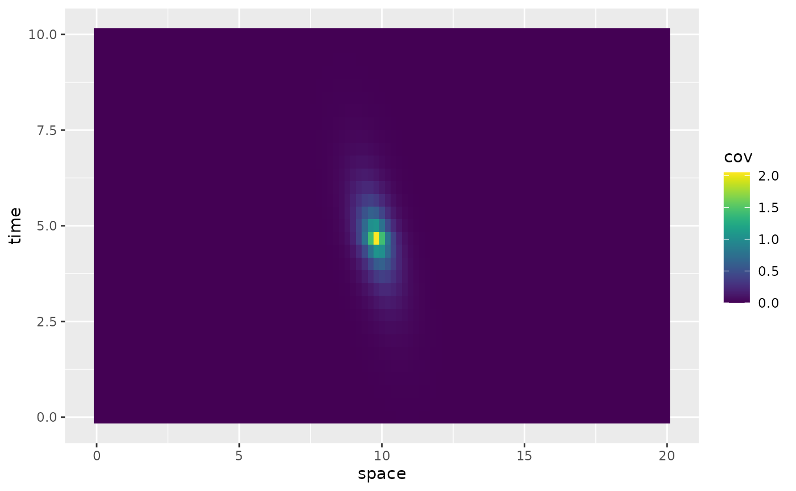
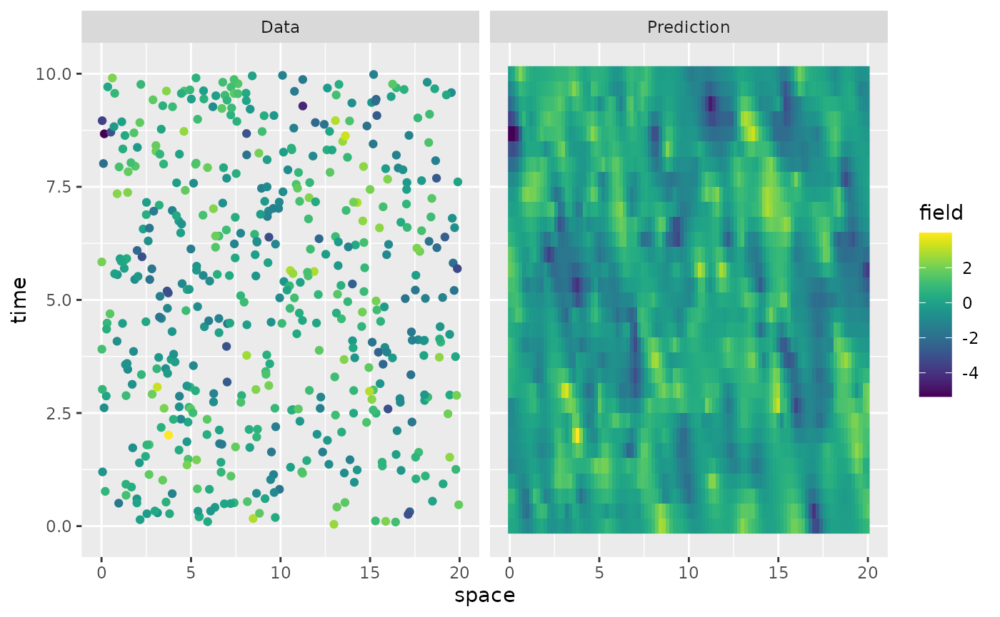
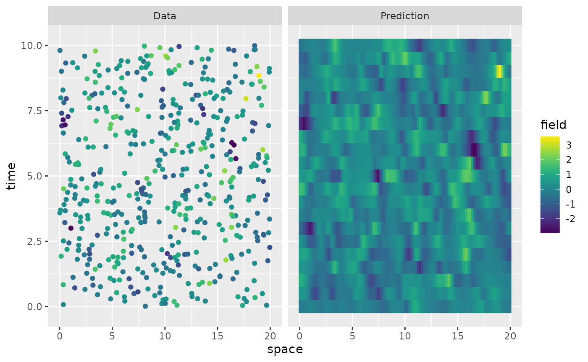
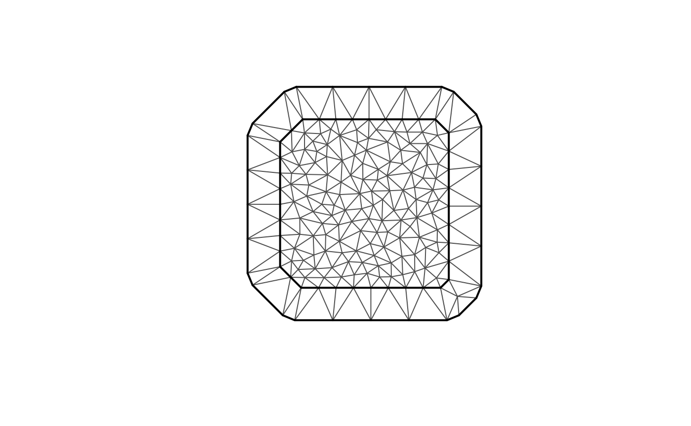
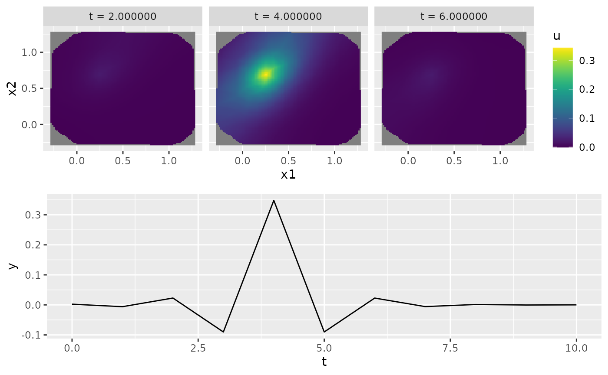
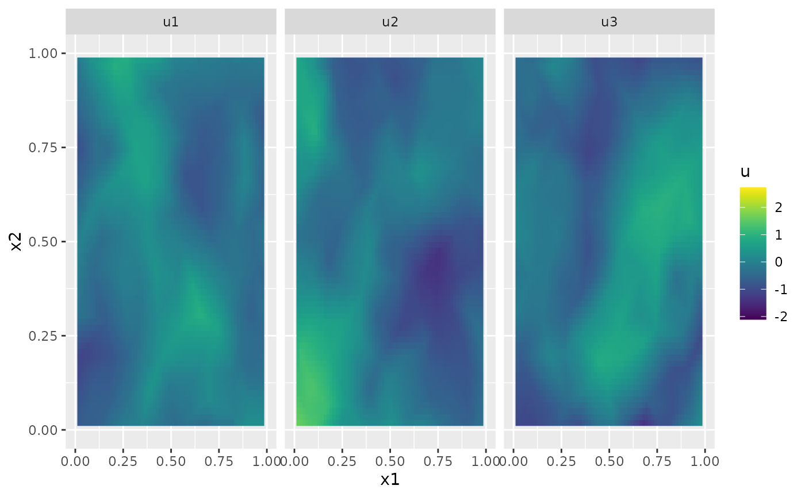

# Spatio-temporal models

## Introduction

The `rSPDE` package implements the following spatio-temporal model
``` math
d u + \gamma(\kappa^2 + \kappa^{d/2}\rho\cdot \nabla - \Delta)^{\alpha} u = dW_Q, \quad \text{on } T\times D
```
where $`T`$ is a temporal interval and $`D`$ is a spatial domain which
can be an interval, a bounded subset of $`\mathbb{R}^2`$ or a metric
graph. Here $`\kappa>0`$ is a spatial range parameter, $`\rho`$ is a
drift parameter which is in $`\mathbb{R}`$ for spatial domains that are
intervals or metric graphs, and in $`\mathbb{R}^2`$ for spatial domains
which are bounded subsets of $`\mathbb{R}^2`$. Further, $`W_Q`$ is a
$`Q`$-Wiener process with spatial covariance operator
$`\sigma^2(\kappa^2 - \Delta)^{-\beta}`$, where $`\sigma^2`$ is a
variance parameter. Thus, the model has two smoothness parameters
$`\alpha`$ and $`\beta`$ which are assumed to be integers. The model is
therefore a generalization of the spatio-temporal models introduced in
[Lindgren et al.
(2024)](https://www.raco.cat/index.php/SORT/article/view/428665), where
the generalization is to allow for drift and to allow for metric graphs
as spatial domains. The model is implemented using a finite element
discretization of the corresponding precision operator
``` math
\sigma^{-2}(d + \gamma(\kappa^2 + \kappa^{d/2}\rho\cdot \nabla - \Delta)^{\alpha})(\kappa^2 - \Delta)^{\beta} ((d + \gamma(\kappa^2 - \kappa^{d/2}\rho\cdot \nabla - \Delta)^{\alpha}))
```
in both space and time, similarly to the discretization introduced in
[Lindgren et al.
(2024)](https://www.raco.cat/index.php/SORT/article/view/428665). This
parameterization of the drift term, using $`\rho \kappa^{d/2}`$ in place
of the standard $`\rho`$, is chosen to simplify the enforcement of
theoretical bounds on the range of $`\rho`$, ensuring that the equation
remains well-posed and also providing numerical stability for
finite-dimensional approximations.

## Implementation details

Let us begin by loading some packages needed for making the plots

``` r

library(ggplot2)
library(gridExtra)
library(viridis)
```

The function
[`spacetime.operators()`](https://davidbolin.github.io/rSPDE/reference/spacetime.operators.md)
can be used to define the model. The function requires specifying the
two smoothness parameters, and the discretization points for the spatial
and temporal discretizations. The spatial discretization can be
specified through a mesh object from the `fmesher` package, as a graph
from the `MetricGraph` package, or as the mesh nodes for models on
intervals. The temporal discretization can be specified either by
specifying the mesh nodes or by providing a mesh object.

Assume that we want to define a model on the spatial interval $`[0,20]`$
and the temporal domain $`[0,10]`$. We can then simply specify the mesh
nodes as

``` r

s <- s_1d <- seq(from = 0, to = 20, length.out = 101)
t <- t_1d <- seq(from = 0, to = 10, length.out = 21)
```

We can now use
[`spacetime.operators()`](https://davidbolin.github.io/rSPDE/reference/spacetime.operators.md)
to construct the model

``` r

kappa <- 5
sigma <- 10
gamma <- 0.1
rho_1d <- 1
alpha <- 1
beta <- 1

op <- spacetime.operators(
  space_loc = s, time_loc = t,
  kappa = kappa, sigma = sigma, alpha = alpha,
  beta = beta, rho = rho_1d, gamma = gamma
)
```

The `spacetime.operators` object has a `plot_covariances` method which
for univariate spatial domains simply plots the covariance
$`C(u(s,t), u(s_0, t_0))`$ for a fixed spatio-temporal location
$`(s_0, t_0)`$ specified by the indices in the spatial and temporal
discretizations. For example:

``` r

op$plot_covariances(t.ind = 15, s.ind = 50)
```


The object `op` contains the matrices needed for evaluating the model,
and we have here initialized it by providing values for all parameters.

We can simulate from the model using
[`simulate()`](https://rdrr.io/r/stats/simulate.html):

``` r

u <- simulate(op)
```

There is also built-in support for kriging prediction. To illustrate
this, we use the simulation to create some noisy observations of the
process. For this, we first construct the observation matrix linking the
FEM basis functions to the locations where we want to simulate. We first
randomly generate some observation locations and then construct the
matrix.

``` r

n.obs <- 500

obs.loc <- data.frame(x = max(s) * runif(n.obs), t = max(t) * runif(n.obs))
A <- make_A(op, loc = obs.loc$x, time = obs.loc$t)
```

We now generate the observations as $`Y_i = u(s_i) + \varepsilon_i`$,
where $`\varepsilon_i \sim N(0,\sigma_e^2)`$ is Gaussian measurement
noise.

``` r

x <- simulate(op, nsim = 1)
sigma.e <- 0.01
Y <- as.vector(A %*% x + sigma.e * rnorm(n.obs))
```

Finally, we compute the kriging prediction of the process $`u`$ at the
locations in `s` based on these observations. To specify which locations
that should be predicted, the argument `Aprd` is used. This argument
should be an observation matrix that links the mesh locations to the
prediction locations.

``` r

Aprd <- make_A(op, loc = rep(s, length(t)), time = rep(t, each = length(s)))
u.krig <- predict(op, A = A, Aprd = Aprd, Y = Y, sigma.e = sigma.e)
```

The process simulation, and the kriging prediction are shown in the
following figure.

``` r

data.df <- data.frame(space = obs.loc$x, time = obs.loc$t, field = Y, type = "Data")
krig.df <- data.frame(
  space = rep(s, length(t)), time = rep(t, each = length(s)),
  field = as.vector(u.krig$mean), type = "Prediction"
)
df_plot <- rbind(data.df, krig.df)
ggplot(df_plot) +
  aes(x = space, y = time, fill = field) +
  facet_wrap(~type) +
  geom_raster(data = krig.df) +
  geom_point(
    data = data.df, aes(colour = field),
    show.legend = FALSE
  ) +
  scale_fill_viridis() +
  scale_colour_viridis()
```



## Setting up a data frame

To estimate the model parameters based on this data, we can use the our
`rspde_lme` function or our `inlabru` implementation. For this, we
collect the data in a data frame, that also contains the spatial
locations and the time points.

``` r

df_1d <- data.frame(y = as.matrix(Y), space = obs.loc$x, time = obs.loc$t)
```

Let us create a mesh for the spatial and temporal domains for the model
fitting:

``` r

mesh_1d_time <- fmesher::fm_mesh_1d(t)
mesh_1d_space <- fmesher::fm_mesh_1d(s)
```

## Parameter estimation

### `rspde_lme` implementation

We begin by creating an `rspde` operator:

``` r

op_lme1d <- spacetime.operators(mesh_space = mesh_1d_space, mesh_time = mesh_1d_time, alpha = 1, beta = 1)
```

We now fit the model:

``` r

res <- rspde_lme(y ~ 1, loc = "space", loc_time = "time", data = df_1d, model = op_lme1d, parallel = TRUE)
```

In the call, `y~1` indicates that we also want to estimate a mean value
of the model, and the arguments `loc` and `loc_time` provide the names
of the spatial and temporal coordinates in the data frame. Let us see a
summary of the fitted model:

``` r

summary(res)
#> 
#> Latent model - Spatio-temporal with alpha =  1 , beta =  1
#> 
#> Call:
#> rspde_lme(formula = y ~ 1, loc = "space", loc_time = "time", 
#>     data = df_1d, model = op_lme1d, parallel = TRUE)
#> 
#> Fixed effects:
#>             Estimate Std.error z-value Pr(>|z|)
#> (Intercept)  0.01225   0.05987   0.205    0.838
#> 
#> Random effects:
#>               Estimate Std.error z-value
#> kappa          4.70309   0.38170  12.322
#> sigma          9.06735   1.11125   8.160
#> gamma          0.10761   0.01969   5.465
#> rho            1.03043   0.04652  22.150
#> alpha (fixed)  1.00000        NA      NA
#> beta (fixed)   1.00000        NA      NA
#> 
#> Measurement error:
#>          Estimate Std.error z-value
#> std. dev 0.013992  0.008174   1.712
#> ---
#> Signif. codes:  0 '***' 0.001 '**' 0.01 '*' 0.05 '.' 0.1 ' ' 1 
#> 
#> Log-Likelihood:  -366.9571 
#> Number of function calls by 'optim' = 50
#> Optimization method used in 'optim' = L-BFGS-B
#> 
#> Time used to:     fit the model =  22.63368 secs 
#>   set up the parallelization = 5.36154 secs
```

Let us compare the estimated results with the true values:

``` r

results <- data.frame(
  kappa = c(kappa, res$coeff$random_effects[1]),
  sigma = c(sigma, res$coeff$random_effects[2]),
  gamma = c(gamma, res$coeff$random_effects[3]),
  rho = c(rho_1d, res$coeff$random_effects[4]),
  sigma.e = c(sigma.e, res$coeff$measurement_error),
  intercept = c(0, res$coeff$fixed_effects),
  row.names = c("True", "Estimate")
)

print(results)
#>             kappa     sigma    gamma      rho    sigma.e  intercept
#> True     5.000000 10.000000 0.100000 1.000000 0.01000000 0.00000000
#> Estimate 4.703093  9.067345 0.107612 1.030429 0.01399151 0.01225026
```

Finally, we can also do prediction based on the fitted model as

``` r

pred.data <- data.frame(x = rep(s, length(t)), t = rep(t, each = length(s)))
pred <- predict(res, newdata = pred.data, loc = "x", time = "t")
data.df <- data.frame(space = obs.loc$x, time = obs.loc$t, field = Y, type = "Data")
krig.df <- data.frame(
  space = rep(s, length(t)), time = rep(t, each = length(s)),
  field = as.vector(pred$mean), type = "Prediction"
)
df_plot <- rbind(data.df, krig.df)
ggplot(df_plot) +
  aes(x = space, y = time, fill = field) +
  facet_wrap(~type) +
  geom_raster(data = krig.df) +
  geom_point(
    data = data.df, aes(colour = field),
    show.legend = FALSE
  ) +
  scale_fill_viridis() +
  scale_colour_viridis()
```



### `inlabru` Implementation

Let us now fit the model using our `inlabru` implementation. We start by
creating the model object with the
[`rspde.spacetime()`](https://davidbolin.github.io/rSPDE/reference/rspde.spacetime.md)
function:

``` r

library(inlabru)
st_bru <- rspde.spacetime(mesh_space = mesh_1d_space, mesh_time = mesh_1d_time, alpha = 1, beta = 1)
```

We now create the model component, which requires the user to pass the
index as a list containing the elements `space` with the spatial indices
and `time` with the temporal indices:

``` r

cmp <- y ~ -1 + Intercept(1) + field(list(space = space, time = time), model = st_bru)
```

We are now in a position to fit the model:

``` r

bru_fit <- bru(cmp, data = df_1d, options = list(num.threads = "1:1"))
```

Let us now compare the estimated results (the means of the parameters)
with the true values:

``` r

param_st_1d <- transform_parameters_spacetime(
  bru_fit$summary.hyperpar$mean[2:5],
  st_bru
)

results <- data.frame(
  kappa = c(kappa, param_st_1d[[1]]),
  sigma = c(sigma, param_st_1d[[2]]),
  gamma = c(gamma, param_st_1d[[3]]),
  rho = c(rho_1d, param_st_1d[[4]]),
  sigma.e = c(sigma.e, sqrt(1 / bru_fit$summary.hyperpar$mean[1])),
  intercept = c(0, bru_fit$summary.fixed$mean),
  row.names = c("True", "Estimate")
)

print(results)
#>             kappa     sigma      gamma     rho     sigma.e  intercept
#> True     5.000000 10.000000 0.10000000 1.00000 0.010000000 0.00000000
#> Estimate 5.081651  8.948111 0.07988228 1.59596 0.008589387 0.01238519
```

## A spatial example

Let us now illustrate how to implement a spatial version. We start by
creating a region of interest and a spatial mesh using the `fmesher`
package:

``` r

library(fmesher)
n_loc <- 1000
loc_2d_mesh <- matrix(runif(n_loc * 2), n_loc, 2)
mesh_2d <- fm_mesh_2d(
  loc = loc_2d_mesh,
  cutoff = 0.07,
  max.edge = c(0.2, 0.6)
)
plot(mesh_2d, main = "")
```



We now proceed as previously by defining a temporal region and the model

``` r

t <- seq(from = 0, to = 10, length.out = 11)
kappa <- 9.9
sigma <- 29
gamma <- 0.11
rho_2d <- c(0.2, 0.3)
alpha <- 1
beta <- 1

op <- spacetime.operators(
  mesh_space = mesh_2d, time_loc = t,
  kappa = kappa, sigma = sigma, alpha = alpha,
  beta = beta, rho = rho_2d, gamma = gamma
)
op$plot_covariances(s.ind = 100, t.ind = 5, t.shift = c(-2, 0, 2))
```



    #> TableGrob (2 x 1) "arrange": 2 grobs
    #>   z     cells    name           grob
    #> 1 1 (1-1,1-1) arrange gtable[layout]
    #> 2 2 (2-2,1-1) arrange gtable[layout]
    #> TableGrob (2 x 1) "arrange": 2 grobs
    #>   z     cells    name           grob
    #> 1 1 (1-1,1-1) arrange gtable[layout]
    #> 2 2 (2-2,1-1) arrange gtable[layout]

The `spacetime.operators` object has a `plot_covariances` method which
can be used to vizualise marginal spatial and temporal covariances. The
function takes as input `t.ind` which is the index of the location in
the time discretization to plot the marginal spatial covariance for, and
an input `s.ind` which is the index of the location in the space
discretization to show the marginal temporal covariance for. It further
takes an input `t.shift` which can be used to plot covariances
$`C(u(\cdot, t_i), u(\cdot, t_j))`$, where $`t_i`$ is `t[t.ind]` and
$`t_j`$ is `t[t.ind + t.shift]`. For example

We can simulate from the model using
[`simulate()`](https://rdrr.io/r/stats/simulate.html):

``` r

u <- simulate(op)
```

Let us plot the simulation for a few time points

``` r

proj <- fm_evaluator(mesh_2d, dims = c(100, 100))
U <- matrix(u, nrow = mesh_2d$n, ncol = length(t))
field1 <- fm_evaluate(proj, field = as.vector(U[, 2]))
field2 <- fm_evaluate(proj, field = as.vector(U[, 3]))
field3 <- fm_evaluate(proj, field = as.vector(U[, 4]))

field1.df <- data.frame(
  x1 = proj$lattice$loc[, 1], x2 = proj$lattice$loc[, 2],
  u = as.vector(field1), type = "u1"
)
field2.df <- data.frame(
  x1 = proj$lattice$loc[, 1], x2 = proj$lattice$loc[, 2],
  u = as.vector(field2), type = "u2"
)
field3.df <- data.frame(
  x1 = proj$lattice$loc[, 1], x2 = proj$lattice$loc[, 2],
  u = as.vector(field3), type = "u3"
)
field.df <- rbind(field1.df, field2.df, field3.df)
ggplot(field.df) +
  aes(x = x1, y = x2, fill = u) +
  facet_wrap(~type) +
  geom_raster() +
  xlim(0, 1) +
  ylim(0, 1) +
  scale_fill_viridis()
#> Warning: Removed 18468 rows containing missing values or values outside the scale range
#> (`geom_raster()`).
```



We now generate the observations as $`Y_i = u(s_i) + \varepsilon_i`$,
where $`\varepsilon_i \sim N(0,\sigma_e^2)`$ is Gaussian measurement
noise.

``` r

n.obs <- 500
obs.loc <- data.frame(x = runif(n.obs), y = runif(n.obs), t = max(t) * runif(n.obs))
A <- make_A(op, loc = cbind(obs.loc$x, obs.loc$y), time = obs.loc$t)
sigma.e <- 0.01
Y <- as.vector(A %*% u + sigma.e * rnorm(n.obs))
```

## Setting up a data frame

To estimate the model parameters based on this data, we can use the
`rspde_lme` function. For this, we collect the data in a data frame,
that also contanis the spatial locations, and we fit the model:

``` r

df_2d <- data.frame(Y = as.matrix(Y), x = obs.loc$x, y = obs.loc$y, t = obs.loc$t)
```

Let us also create spatial and temporal meshes for the model fitting:

``` r

mesh_2d_spatial <- fm_mesh_2d(
  loc = df_2d[, c("x", "y")],
  cutoff = 0.07,
  max.edge = c(0.2, 0.6)
)

mesh_2d_time <- fmesher::fm_mesh_1d(t)
```

### `rspde_lme` implementation

We begin by creating an `rspde` operator:

``` r

op_lme2d <- spacetime.operators(mesh_space = mesh_2d_spatial, mesh_time = mesh_2d_time, alpha = 1, beta = 1)
```

Let us now fit the model:

``` r

res_2d <- rspde_lme(Y ~ 1, loc = c("x", "y"), loc_time = "t", data = df_2d, model = op_lme2d, parallel = TRUE)
```

Let us see a summary of the fitted model:

``` r

summary(res_2d)
#> 
#> Latent model - Spatio-temporal with alpha =  1 , beta =  1
#> 
#> Call:
#> rspde_lme(formula = Y ~ 1, loc = c("x", "y"), loc_time = "t", 
#>     data = df_2d, model = op_lme2d, parallel = TRUE)
#> 
#> Fixed effects:
#>             Estimate Std.error z-value Pr(>|z|)
#> (Intercept)  0.03702   0.04815   0.769    0.442
#> 
#> Random effects:
#>               Estimate Std.error z-value
#> kappa          9.71690   0.74406  13.059
#> sigma         11.91772   6.46226   1.844
#> gamma          0.06230   0.03416   1.824
#> rho            0.07952   0.60347   0.132
#> rho2           0.12814   0.76728   0.167
#> alpha (fixed)  1.00000        NA      NA
#> beta (fixed)   1.00000        NA      NA
#> 
#> Measurement error:
#>          Estimate Std.error z-value
#> std. dev  0.04683   0.10797   0.434
#> ---
#> Signif. codes:  0 '***' 0.001 '**' 0.01 '*' 0.05 '.' 0.1 ' ' 1 
#> 
#> Log-Likelihood:  149.8674 
#> Number of function calls by 'optim' = 81
#> Optimization method used in 'optim' = L-BFGS-B
#> 
#> Time used to:     fit the model =  2.66224 mins 
#>   set up the parallelization = 5.81563 secs
```

Let us compare the estimated results with the true values:

``` r

results <- data.frame(
  kappa = c(kappa, res_2d$coeff$random_effects[1]),
  sigma = c(sigma, res_2d$coeff$random_effects[2]),
  gamma = c(gamma, res_2d$coeff$random_effects[3]),
  rho_1 = c(rho_2d[1], res_2d$coeff$random_effects[4]),
  rho_2 = c(rho_2d[2], res_2d$coeff$random_effects[5]),
  sigma.e = c(sigma.e, res_2d$coeff$measurement_error),
  intercept = c(0, res_2d$coeff$fixed_effects),
  row.names = c("True", "Estimate")
)

print(results)
#>             kappa    sigma      gamma      rho_1    rho_2    sigma.e  intercept
#> True     9.900000 29.00000 0.11000000 0.20000000 0.300000 0.01000000 0.00000000
#> Estimate 9.716897 11.91772 0.06229696 0.07952028 0.128144 0.04683421 0.03702207
```

Let us now use our `inlabru` implementation. We first define the model.

``` r

st_bru_field <- rspde.spacetime(
  mesh_space = mesh_2d_spatial,
  mesh_time = mesh_2d_time, alpha = 1, beta = 1
)
```

Now, the component:

``` r

cmp <- y ~ -1 + Intercept(1) + field(list(
  space = cbind(x, y),
  time = t
), model = st_bru_field)
```

We are now in a position to fit the model:

``` r

bru_fit_field <- bru(cmp, data = df_2d, options = list(num.threads = "1:1"))
```

Let us now compare the estimated results (the means of the parameters)
with the true values:

``` r

param_st <- transform_parameters_spacetime(
  bru_fit_field$summary.hyperpar$mean[2:6],
  st_bru_field
)

results <- data.frame(
  kappa = c(kappa, param_st[[1]]),
  sigma = c(sigma, param_st[[2]]),
  gamma = c(gamma, param_st[[3]]),
  rho_1 = c(rho_2d[1], param_st[[4]]),
  rho_2 = c(rho_2d[2], param_st[[5]]),
  sigma.e = c(sigma.e, sqrt(1 / bru_fit_field$summary.hyperpar$mean[1])),
  intercept = c(0, bru_fit_field$summary.fixed$mean),
  row.names = c("True", "Estimate")
)

print(results)
#>          kappa        sigma     gamma      rho_1      rho_2      sigma.e
#> True     9.900 2.900000e+01 1.100e-01 0.20000000 0.30000000 0.0100000000
#> Estimate 0.297 3.921411e-05 9.078e-09 0.01821738 0.01381615 0.0005198445
#>          intercept
#> True     0.0000000
#> Estimate 0.4935684
```

## Fit with `bounded_rho = FALSE`

In cases where the estimated value of $`\rho`$ approaches the upper
bound (available in `st_bru$bound_rho`), the model can be re-fitted with
`bounded_rho = FALSE`. This removes the bounding constraint on $`\rho`$,
which can lead to a better fit but may introduce numerical instability.
Below, we demonstrate this for both the 1D and spatial examples.

------------------------------------------------------------------------

### 1D Example with `bounded_rho = FALSE`

Let us first start with the
[`rspde_lme()`](https://davidbolin.github.io/rSPDE/reference/rspde_lme.md)
example. We will use the previous fit as a starting point for the new
fit to improve the convergence of the optimization.

``` r

op_1d_unbounded <- spacetime.operators(
  space_loc = s_1d, time_loc = t_1d,
  alpha = 1, beta = 1,
  bounded_rho = FALSE
)

res_unbounded <- rspde_lme(y ~ 1,
  loc = "space", loc_time = "time",
  data = df_1d, model = op_1d_unbounded, parallel = TRUE,
  previous_fit = res
)

results <- data.frame(
  kappa = c(kappa, res_unbounded$coeff$random_effects[1]),
  sigma = c(sigma, res_unbounded$coeff$random_effects[2]),
  gamma = c(gamma, res_unbounded$coeff$random_effects[3]),
  rho = c(rho_1d, res_unbounded$coeff$random_effects[4]),
  sigma.e = c(sigma.e, res_unbounded$coeff$measurement_error),
  intercept = c(0, res_unbounded$coeff$fixed_effects),
  row.names = c("True", "Estimate")
)

print(results)
#>             kappa     sigma     gamma      rho    sigma.e intercept
#> True     9.900000 29.000000 0.1100000 1.000000 0.01000000 0.0000000
#> Estimate 4.703064  9.066892 0.1076068 1.030319 0.01399226 0.0122834
```

Now, the `inlabru` implementation:

``` r

### Fit with bounded_rho = FALSE
st_bru_unbounded <- rspde.spacetime(
  space_loc = s_1d, time_loc = t_1d, alpha = 1,
  beta = 1, bounded_rho = FALSE
)

### Fitting the Model
cmp_unbounded <- y ~ -1 + Intercept(1) + field(list(space = space, time = time),
  model = st_bru_unbounded
)

bru_fit_unbounded <- bru(cmp_unbounded, data = df_1d, options = list(num.threads = "1:1", verbose = TRUE))

### Extract and Compare Results
param_unbounded <- transform_parameters_spacetime(
  bru_fit_unbounded$summary.hyperpar$mean[2:5],
  st_bru_unbounded
)

results_unbounded <- data.frame(
  kappa = c(kappa, param_unbounded$kappa),
  sigma = c(sigma, param_unbounded$sigma),
  gamma = c(gamma, param_unbounded$gamma),
  rho = c(rho_1d, param_unbounded$rho),
  sigma.e = c(sigma.e, sqrt(1 / bru_fit_unbounded$summary.hyperpar$mean[1])),
  intercept = c(0, bru_fit_unbounded$summary.fixed$mean),
  row.names = c("True", "Estimate")
)

print(results_unbounded)
#>             kappa    sigma      gamma      rho     sigma.e  intercept
#> True     9.900000 29.00000 0.11000000 1.000000 0.010000000 0.00000000
#> Estimate 4.922853  9.12735 0.09723031 1.209845 0.009207415 0.01240725
```

## References

Lindgren, Finn, Haakon Bakka, David Bolin, Elias Krainski, and Håvard
Rue. 2024. “A Diffusion-Based Spatio-Temporal Extension of Gaussian
Matérn Fields.” *SORT Statistics and Operations Research Transactions*
48 (1): 3–66.
