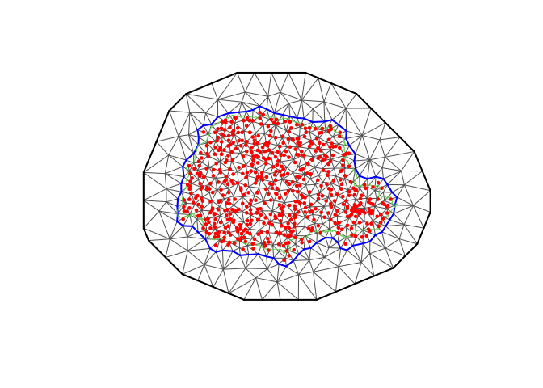
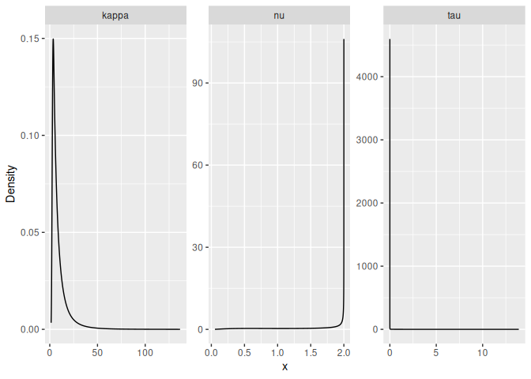
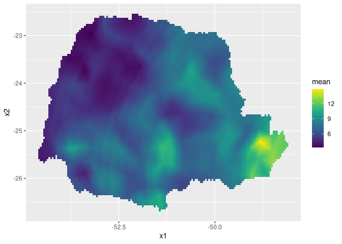
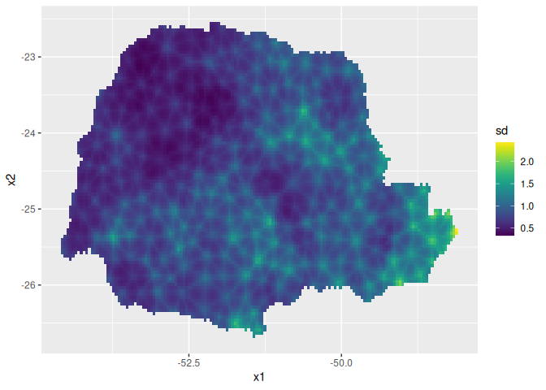
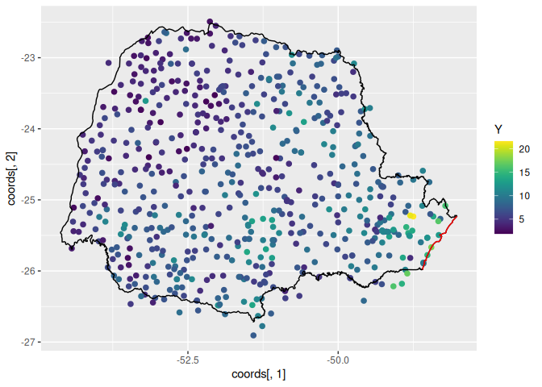
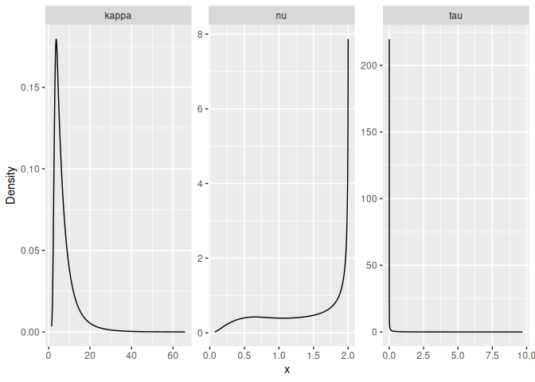
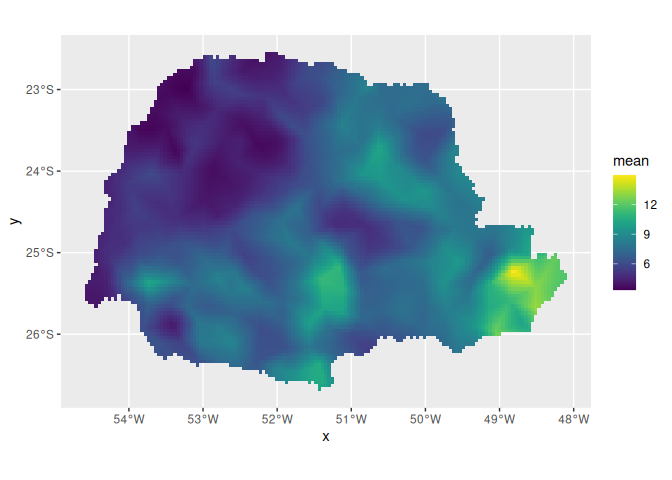
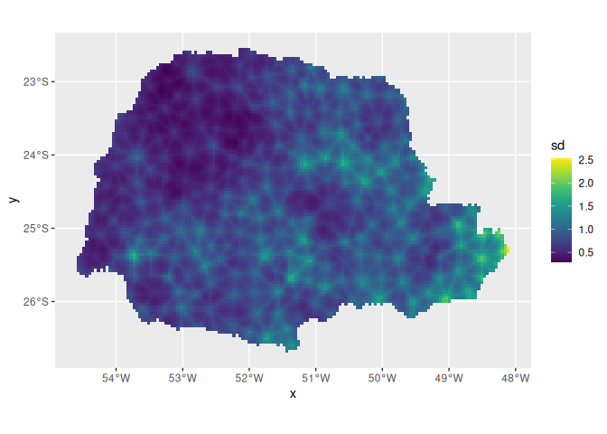

# The `rSPDE` package

[](https://cran.r-project.org/package=rSPDE)
[](https://cranlogs.r-pkg.org/badges/grand-total/rSPDE)
[](https://github.com/davidbolin/rSPDE/actions/workflows/R-CMD-check.yaml)

`rSPDE` is an R package used for computing rational approximations of
fractional SPDEs. These rational approximations can be used for
computatially efficient statistical inference.

Basic statistical operations such as likelihood evaluations and kriging
predictions using the fractional approximations are also implemented.
The package also contains an interface to
[R-INLA](https://www.r-inla.org "INLA homepage").

# Introduction

Several popular Gaussian random field models can be represented as
solutions to stochastic partial differential equations (SPDEs) of the
form

``` math
L^{\beta} (\tau u) = \mathcal{W}.
```

Here $`\mathcal{W}`$ is a Gaussian white noise, $`L`$ is a second-order
differential operator, the fractional power $`\beta`$ determines the
smoothness of $`u`$, and $`\tau`$ scales the variance of $`u`$. The
simplest example is a model on $`\mathbb{R}^d`$ with
$`L = \kappa^2 - \Delta`$, which results in a Gaussian random field
$`u`$ with a Matérn covariance function

``` math
C(h) = \dfrac{ \sigma^2 }{ 2 ^ {\nu-1} \Gamma (\nu)} (\kappa h)^{\nu} K_{\nu} (\kappa h).
```

If $`2 \beta`$ is an integer and if the domain $`\mathcal{D}`$ where the
model is defined is bounded, then $`u`$ can be approximated by a
Gaussian Markov random field (GMRF) $`\mathbf { \mathrm{u} }`$ via a
finite element method (FEM) for the SPDE. Specifically, the
approximation can be written as

``` math
u_h(s) = \sum_{i=1}^n u_i \varphi_i (s).
```

Here $`\{\varphi_i\}`$ are piecewise linear basis functions defined by
some triangulation of $`\mathcal{D}`$ and the vector of weights
$`\mathbf{\mathrm{u}} = (u_1,\ldots,u_n)^\top`$ is normally distributed,
$`N(\mathbf{\mathrm{u}}, \tilde{\mathbf{\mathrm{Q}}}^{-1})`$, where
$`\tilde{ \mathbf{ \mathrm{Q} } }`$ is sparse. See [An explicit link
between Gaussian fields and Gaussian Markov random fields: the
stochastic partial differential equation
approach](https://rss.onlinelibrary.wiley.com/doi/full/10.1111/j.1467-9868.2011.00777.x "An explicit link between Gaussian fields and Gaussian Markov random fields: the stochastic partial differential equation approach")
for further details.

The `rSPDE` package provides corresponding computationally efficient
approximations for the case when $`\beta`$ is a general fractional
power. The main idea is to combine the FEM approximation with a rational
approximation of the fractional operator. As a result, one can easily do
inference and prediction using fractional SPDE models such as

``` math
(\kappa^2-\Delta)^\beta u = \mathcal{W}.
```

In particular, it allows for bayesian inference of all model parameters,
including the fractional parameter $`\beta`$.

For illustration purposes, the package contains a simple FEM
implementation for models on R. See the [An introduction to the rSPDE
package](https://davidbolin.github.io/rSPDE//articles/rSPDE.html "An introduction to the rSPDE package")
vignette for an introduction to the package. The [Rational approximation
with the rSPDE
package](https://davidbolin.github.io/rSPDE//articles/rspde_cov.html)
and [Operator-based rational
approximation](https://davidbolin.github.io/rSPDE//articles/rspde_base.html)
vignettes provide introductions to how to create and fit `rSPDE` models.
For an introduction to the [`R-INLA`](https://www.r-inla.org)
implementation of the `rSPDE` models see the [R-INLA implementation of
the rational SPDE
approach](https://davidbolin.github.io/rSPDE//articles/rspde_inla.html "INLA vignette").
The [`rSPDE`
documentation](https://davidbolin.github.io/rSPDE/reference/index.html "`rSPDE` documentation.")
contains descriptions and examples of the functions in the `rSPDE`
package.

# Installation instructions

The latest CRAN release of the package can be installed directly from
CRAN with `install.packages("rSPDE")`. The latest stable version (which
is sometimes slightly more recent than the CRAN version), can be
installed by using the command

``` r

remotes::install_github("davidbolin/rspde", ref = "stable")
```

in R. The development version can be installed using the command

``` r

remotes::install_github("davidbolin/rspde", ref = "devel")
```

If you want to install the package using the
`{r}emotes::install_github`-method on Windows, you first need to install
`Rtools` and add the paths to `Rtools` and `gcc` to the Windows `PATH`
environment variable. This can be done for the current R session only
using the commands

``` r
rtools = "C:\Rtools\bin"
gcc = "C:\Rtools\gcc-4.6.3\bin"
Sys.setenv(PATH = paste(c(gcc, rtools, Sys.getenv("PATH")), collapse = ";"))
```

where the variables `{r}tools` and `gcc` need to be changed if `Rtools`
is not installed directly on `C:`, and `gcc`’s version might need to be
changed depending on the version of `Rtools`.

# Example with rSPDE - INLA

We will illustrate the `rSPDE` package with a kriging example using our
`R-INLA` interface to `rSPDE`.

The data consist of precipitation measurements from the Paraná region in
Brazil and were provided by the Brazilian National Water Agency. The
data were collected at 616 gauge stations in Paraná state, south of
Brazil, for each day in 2011. We will not analyse the full
spatio-temporal data set, but instead look at the total precipitation in
January

For further details on the dataset and on the commands we refer the
reader to the [rSPDE-INLA
Vignette](https://davidbolin.github.io/rSPDE//articles/rspde_inla.html "INLA vignette").

``` r

library(rSPDE)
library(ggplot2)
library(INLA)
library(splancs)
library(viridis)

#Load the data
data(PRprec)
data(PRborder)

#Get the precipitation in January
Y <- rowMeans(PRprec[, 3 + 1:31])

#Treat the data and plot
ind <- !is.na(Y)
Y <- Y[ind]
coords <- as.matrix(PRprec[ind, 1:2])
alt <- PRprec$Altitude[ind]

ggplot() +
  geom_point(aes(
    x = coords[, 1], y = coords[, 2],
    colour = Y
  ), size = 2, alpha = 1) +
  geom_path(aes(x = PRborder[, 1], y = PRborder[, 2])) +
  geom_path(aes(x = PRborder[1034:1078, 1], y = PRborder[
    1034:1078,
    2
  ]), colour = "red") + 
  scale_color_viridis()
```


``` r

#Get distance from the sea
seaDist <- apply(spDists(coords, PRborder[1034:1078, ], longlat = TRUE), 1, 
                 min)
                 
#Create the mesh
library(fmesher)
prdomain <- fm_nonconvex_hull(coords, -0.03, -0.05, resolution = c(100, 100))
prmesh <- fm_mesh_2d(boundary = prdomain, max.edge = c(0.45, 1), cutoff = 0.2)
plot(prmesh, asp = 1, main = "")
lines(PRborder, col = 3)
points(coords[, 1], coords[, 2], pch = 19, cex = 0.5, col = "red")
```



``` r

#Create the observation matrix
Abar <- rspde.make.A(mesh = prmesh, loc = coords)

#Create the rspde model object
rspde_model <- rspde.matern(mesh = prmesh)

#Create the index and inla.stack object
mesh.index <- rspde.make.index(name = "field", mesh = prmesh)
stk.dat <- inla.stack(
  data = list(y = Y), A = list(Abar, 1), tag = "est",
  effects = list(
    c(
      mesh.index
    ),
    list(
      seaDist = inla.group(seaDist),
      Intercept = 1
    )
  )
)
                      
#Create the formula object and fit the model
f.s <- y ~ -1 + Intercept + f(seaDist, model = "rw1") +
  f(field, model = rspde_model)
  
rspde_fit <- inla(f.s, family = "Gamma", data = inla.stack.data(stk.dat), 
            verbose = FALSE, 
            control.inla=list(int.strategy='eb'),
            control.predictor = list(A = inla.stack.A(stk.dat), compute = TRUE))
            
summary(rspde_fit)
```

``` R
## Time used:
##     Pre = 0.163, Running = 3.73, Post = 0.101, Total = 4 
## Fixed effects:
##            mean    sd 0.025quant 0.5quant 0.975quant  mode kld
## Intercept 1.942 0.042       1.86    1.942      2.023 1.942   0
## 
## Random effects:
##   Name     Model
##     seaDist RW1 model
##    field CGeneric
## 
## Model hyperparameters:
##                                                   mean       sd 0.025quant
## Precision-parameter for the Gamma observations   14.43    1.041     12.488
## Precision for seaDist                          7498.48 4228.878   2381.196
## Theta1 for field                                 -4.27    3.698    -12.878
## Theta2 for field                                  2.15    0.908      0.776
## Theta3 for field                                  2.51    3.231     -2.207
##                                                0.5quant 0.975quant     mode
## Precision-parameter for the Gamma observations    14.40      16.59   14.329
## Precision for seaDist                           6516.94   18432.00 4953.167
## Theta1 for field                                  -3.76       1.12   -1.188
## Theta2 for field                                   2.04       4.24    1.456
## Theta3 for field                                   2.06      10.03   -0.176
## 
## Marginal log-Likelihood:  -1254.60 
##  is computed 
## Posterior summaries for the linear predictor and the fitted values are computed
## (Posterior marginals needs also 'control.compute=list(return.marginals.predictor=TRUE)')
```

``` r

result_fit <- rspde.result(rspde_fit, "field", rspde_model)
```

``` R
## Warning in rspde.result(rspde_fit, "field", rspde_model): the mean or mode of
## nu is very close to nu.upper.bound, please consider increasing nu.upper.bound,
## and refitting the model.
```

``` r

summary(result_fit)
```

``` R
##            mean        sd  0.025quant  0.5quant 0.975quant        mode
## tau    0.376403  1.137120 2.81302e-06 0.0262791    3.02767 2.46210e-09
## kappa 14.045900 21.261900 2.19318e+00 7.4507200   67.73870 3.47289e+00
## nu     1.465120  0.596418 2.00616e-01 1.7531200    1.99989 1.99999e+00
```

``` r

#Plot the posterior densities
posterior_df_fit <- gg_df(result_fit)

ggplot(posterior_df_fit) + geom_line(aes(x = x, y = y)) + 
facet_wrap(~parameter, scales = "free") + labs(y = "Density")
```



``` r

#Create a grid to predict
nxy <- c(150, 100)
projgrid <- rspde.mesh.projector(prmesh,
  xlim = range(PRborder[, 1]),
  ylim = range(PRborder[, 2]), dims = nxy
)
xy.in <- inout(projgrid$lattice$loc, cbind(PRborder[, 1], PRborder[, 2]))
coord.prd <- projgrid$lattice$loc[xy.in, ]

#Compute A matrix and seaDist at predict locations and build the stack
A.prd <- projgrid$proj$A[xy.in, ]
seaDist.prd <- apply(spDists(coord.prd, 
    PRborder[1034:1078, ], longlat = TRUE), 1, min)
ef.prd = list(c(mesh.index), 
    list(long = inla.group(coord.prd[, 
    1]), lat = inla.group(coord.prd[, 2]), 
    seaDist = inla.group(seaDist.prd),
    Intercept = 1))
stk.prd <- inla.stack(data = list(y = NA), 
    A = list(A.prd, 1), tag = "prd", 
    effects = ef.prd)
stk.all <- inla.stack(stk.dat, stk.prd)

rspde_fitprd <- inla(f.s,
  family = "Gamma",
  data = inla.stack.data(stk.all),
  control.predictor = list(
    A = inla.stack.A(stk.all),
    compute = TRUE, link = 1
  ),
  control.compute = list(
    return.marginals = FALSE,
    return.marginals.predictor = FALSE
  ),
  control.inla = list(int.strategy = "eb")
)

id.prd <- inla.stack.index(stk.all, "prd")$data
m.prd <- rspde_fitprd$summary.fitted.values$mean[id.prd]
sd.prd <- rspde_fitprd$summary.fitted.values$sd[id.prd]

#Plot the predictions
pred_df <- data.frame(x1 = coord.prd[,1],
                      x2 = coord.prd[,2],
                      mean = m.prd,
                      sd = sd.prd)

ggplot(pred_df, aes(x = x1, y = x2, fill = mean)) +
  geom_raster() +
  scale_fill_viridis()
```



Then, the std. deviations:

``` r

ggplot(pred_df, aes(x = x1, y = x2, fill = sd)) +
  geom_raster() + scale_fill_viridis()
```



# Example with rSPDE - inlabru

We will now illustrate the `rSPDE` the same kriging example above with
our `inlabru` interface to `rSPDE`. We will make this description
self-contained, so we will not use any information or codes from the
example above.

The data consist of precipitation measurements from the Paraná region in
Brazil and were provided by the Brazilian National Water Agency. The
data were collected at 616 gauge stations in Paraná state, south of
Brazil, for each day in 2011. We will not analyse the full
spatio-temporal data set, but instead look at the total precipitation in
January

For further details on the dataset and on the commands we refer the
reader to the [rSPDE-inlabru
Vignette](https://davidbolin.github.io/rSPDE//articles/rspde_inlabru.html "inlabru vignette").

``` r

library(rSPDE)
library(ggplot2)
library(INLA)
library(inlabru)
library(splancs)

#Load the data
data(PRprec)
data(PRborder)

#Get the precipitation in January
Y <- rowMeans(PRprec[, 3 + 1:31])

#Treat the data and plot
ind <- !is.na(Y)
Y <- Y[ind]
coords <- as.matrix(PRprec[ind, 1:2])
alt <- PRprec$Altitude[ind]

ggplot() +
  geom_point(aes(
    x = coords[, 1], y = coords[, 2],
    colour = Y
  ), size = 2, alpha = 1) +
  geom_path(aes(x = PRborder[, 1], y = PRborder[, 2])) +
  geom_path(aes(x = PRborder[1034:1078, 1], y = PRborder[
    1034:1078,
    2
  ]), colour = "red") + 
  scale_color_viridis()
```



``` r

#Get distance from the sea
seaDist <- apply(spDists(coords, PRborder[1034:1078, ], longlat = TRUE), 1, 
                 min)
                 
#Create the mesh
library(fmesher)
prdomain <- fm_nonconvex_hull(coords, -0.03, -0.05, resolution = c(100, 100))
prmesh <- fm_mesh_2d(boundary = prdomain, max.edge = c(0.45, 1), cutoff = 0.2)
plot(prmesh, asp = 1, main = "")
lines(PRborder, col = 3)
points(coords[, 1], coords[, 2], pch = 19, cex = 0.5, col = "red")
```


``` r

library(sf)
```

``` R
## Linking to GEOS 3.12.1, GDAL 3.8.4, PROJ 9.4.0; sf_use_s2() is TRUE
```

``` r

#Create the rspde model object
rspde_model <- rspde.matern(mesh = prmesh)

#Create the data.frame
prdata <- data.frame(long = coords[,1], lat = coords[,2], 
                        seaDist = inla.group(seaDist), y = Y)
                      
prdata <- st_as_sf(prdata, coords = c("long", "lat"), crs = 4326)                      
#Create the component

cmp <- y ~ Intercept(1) + distSea(seaDist, model="rw1") +
field(geometry, model = rspde_model)

# Fit the model
  
rspde_fit <- bru(cmp, family = "Gamma", 
            data = prdata,
            options = list(
            verbose = FALSE, 
            control.inla=list(int.strategy='eb'),
            control.predictor = list(compute = TRUE))
)
            
summary(rspde_fit)
```

``` R
## inlabru version: 2.15.0 
## INLA version: 26.08.22 
## Latent components:
## Intercept: main = linear(1)
## distSea: main = rw1(seaDist)
## field: main = cgeneric(geometry)
## Observation models:
##   Model tag: <No tag>
##     Family: 'Gamma'
##     Data class: 'sf', 'data.frame'
##     Response class: 'numeric'
##     Predictor: y ~ Intercept + distSea + field
##     Additive/Linear/Rowwise: TRUE/TRUE/TRUE
##     Used components: effect[Intercept, distSea, field], latent[] 
## Time used:
##     Pre = 0.162, Running = 3.68, Post = 0.0323, Total = 3.87 
## Fixed effects:
##            mean    sd 0.025quant 0.5quant 0.975quant  mode kld
## Intercept 1.942 0.042      1.859    1.942      2.024 1.942   0
## 
## Random effects:
##   Name     Model
##     distSea RW1 model
##    field CGeneric
## 
## Model hyperparameters:
##                                                   mean       sd 0.025quant
## Precision-parameter for the Gamma observations   14.41    1.040     12.479
## Precision for distSea                          7521.54 4160.315   2464.622
## Theta1 for field                                 -4.75    4.007    -14.134
## Theta2 for field                                  2.19    0.908      0.841
## Theta3 for field                                  3.00    3.564     -2.076
##                                                0.5quant 0.975quant     mode
## Precision-parameter for the Gamma observations    14.38   1.66e+01   14.297
## Precision for distSea                           6561.31   1.83e+04 5032.230
## Theta1 for field                                  -4.18   9.47e-01   -1.197
## Theta2 for field                                   2.07   4.29e+00    1.458
## Theta3 for field                                   2.49   1.13e+01   -0.144
## 
## Marginal log-Likelihood:  -1254.59 
##  is computed 
## Posterior summaries for the linear predictor and the fitted values are computed
## (Posterior marginals needs also 'control.compute=list(return.marginals.predictor=TRUE)')
```

``` r

#Get the summary on the user's scale
result_fit <- rspde.result(rspde_fit, "field", rspde_model)
```

``` R
## Warning in rspde.result(rspde_fit, "field", rspde_model): the mean or mode of
## nu is very close to nu.upper.bound, please consider increasing nu.upper.bound,
## and refitting the model.
```

``` r

summary(result_fit)
```

``` R
##            mean        sd  0.025quant  0.5quant 0.975quant        mode
## tau    0.319331  0.968456 7.63758e-07 0.0174448    2.62265 3.57019e-10
## kappa 14.666800 22.605800 2.33232e+00 7.6850400   71.38010 3.53811e+00
## nu     1.516200  0.583129 2.20297e-01 1.8292200    1.99996 1.99999e+00
```

``` r

#Plot the posterior densities
posterior_df_fit <- gg_df(result_fit)

ggplot(posterior_df_fit) + geom_line(aes(x = x, y = y)) + 
facet_wrap(~parameter, scales = "free") + labs(y = "Density")
```



``` r

#Create a grid to predict
nxy <- c(150, 100)
projgrid <- rspde.mesh.projector(prmesh, xlim = range(PRborder[, 1]), 
ylim = range(PRborder[,2]), dims = nxy)
xy.in <- inout(projgrid$lattice$loc, cbind(PRborder[, 1], PRborder[, 2]))
coord.prd <- projgrid$lattice$loc[xy.in, ]

#Compute seaDist at predict locations 
seaDist.prd <- apply(spDists(coord.prd, 
    PRborder[1034:1078, ], longlat = TRUE), 1, min)

# Build the prediction data.frame()
coord.prd.df <- data.frame(long = coord.prd[,1],
                            lat = coord.prd[,2])

coord.prd.df$seaDist <- seaDist.prd

coord.prd.df <- st_as_sf(coord.prd.df, coords = c("long", "lat"), 
                        crs = 4326)

# Obtain prediction at the locations
pred_obs <- predict(rspde_fit, coord.prd.df, 
        ~exp(Intercept + field + distSea))
```

Finally, we plot the results. First the predicted mean:

``` r

ggplot() + gg(pred_obs, geom = "tile", 
          aes(fill = mean)) +
  scale_fill_viridis()
```



Then, the std. deviations:

``` r

ggplot() + gg(pred_obs, geom = "tile", aes(fill = sd)) +
  geom_raster() + scale_fill_viridis()
```


