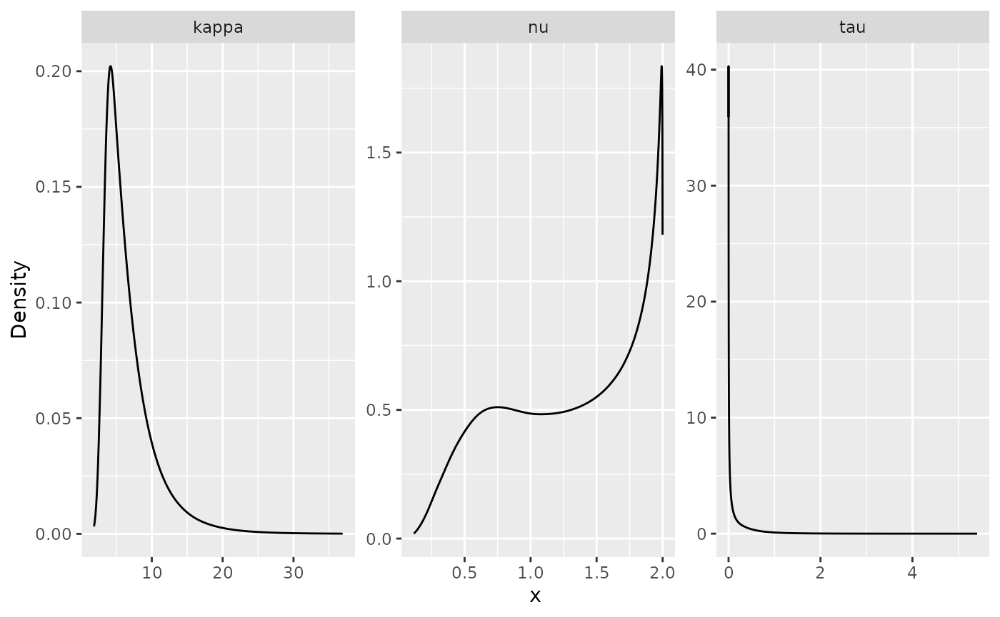
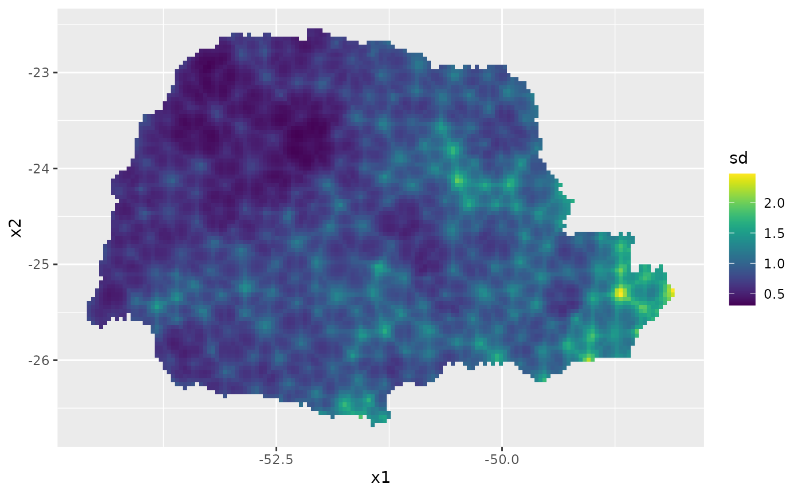

# The `rSPDE` Package 

[](https://cran.r-project.org/package=rSPDE)
[](https://cranlogs.r-pkg.org/badges/grand-total/rSPDE)
[](https://github.com/davidbolin/rSPDE/actions/workflows/R-CMD-check.yaml)

`rSPDE` is an R package used for computing rational approximations of fractional SPDEs. These rational approximations can be used for computatially efficient statistical inference.

Basic statistical operations such as likelihood evaluations and kriging predictions using the fractional approximations are also implemented. The package also contains an interface to [R-INLA][ref4].

# Introduction #

Several popular Gaussian random field models can be represented as solutions to stochastic partial differential equations (SPDEs) of the form 


\\[
L^{\\beta}(\\tau u) = \\mathcal{W}.
\\]

Here \\(\\mathcal{W}\\) is a Gaussian white noise, \\(L\\) is a second-order differential operator, the fractional power \\(\\beta&gt;0\\) determines the smoothness of \\(u\\), and \\(\\tau&gt;0\\) scales the variance of \\(u\\). The simplest example is a model on \\(\\mathbb {R}^d\\) with \\(L = \\kappa^2 - \\Delta\\), which results in a Gaussian random field \\(u\\) with a Matérn covariance function

\\[
C(h) = \\dfrac{ \\sigma^2 }{ 2 ^ {\\nu-1} \\Gamma (\\nu)} (\\kappa h) ^ {\\nu} K_{\\nu} (\\kappa h).
\\]

If \\(2 \\beta\\) is an integer and if the domain \\(\\mathcal {D}\\) where the model is defined is bounded, then \\(u\\) can be approximated by a Gaussian Markov random field (GMRF) \\(\\mathbf { \\mathrm{u} }\\) via a finite element method (FEM) for the SPDE. Specifically, the approximation can be written as

\\[
u_h (s) = \\sum _ { i=1 } ^ n u_i \\varphi_i (s).
\\]

Here \\(\\{\\varphi_i\\}\\) are piecewise linear basis functions defined by some triangulation of \\(\\mathcal {D}\\) and the vector of weights \\( \\mathbf { \\mathrm { u } } = (u_1,\\ldots,u_n)^\\top \\) is normally distributed, \\(N(\\mathbf { \\mathrm{u} }, \\tilde{ \\mathbf { \\mathrm{Q} } }^{-1})\\), where \\(\\tilde{ \\mathbf{ \\mathrm{Q} } }\\) is sparse. See [An explicit link between Gaussian fields and Gaussian Markov random fields: the stochastic partial differential equation approach][ref8] for further details. 

The `rSPDE` package provides corresponding computationally efficient approximations for the case when \\(\\beta\\) is a general fractional power. The main idea is to combine the FEM approximation with a rational approximation of the fractional operator.
As a result, one can easily do inference and prediction using fractional SPDE models such as 

\\[
( \\kappa^2-\\Delta )^\\beta u = \\mathcal{ W }.
\\]

In particular, it allows for bayesian inference of all model parameters, including the fractional parameter \\(\\beta\\).

For illustration purposes, the package contains a simple FEM implementation for models on R. See the 
[An introduction to the rSPDE package][ref2] vignette for an introduction to the package. The [Rational approximation with the rSPDE package][ref6] and [Operator-based rational approximation ][ref5] vignettes provide
introductions to how to create and fit `rSPDE` models. For an introduction to the [`R-INLA`](https://www.r-inla.org) implementation
of the `rSPDE` models see the [R-INLA implementation of the rational SPDE approach][ref3]. The [`rSPDE` documentation][ref7] contains descriptions and examples of the functions in the `rSPDE` package.

# Installation instructions #
The latest CRAN release of the package can be installed directly from CRAN with `install.packages("rSPDE")`.
The latest stable version (which is sometimes slightly more recent than the CRAN version), can be installed by using the command
```r
remotes::install_github("davidbolin/rspde", ref = "stable")
```
in R. The development version can be installed using the command
```r
remotes::install_github("davidbolin/rspde", ref = "devel")
```

If you want to install the package using the `remotes::install_github`-method on Windows, you first need to install `Rtools` and add the paths to `Rtools` and `gcc` to the Windows `PATH` environment variable. This can be done for the current R session only using the commands
```r
rtools = "C:\\Rtools\\bin"
gcc = "C:\\Rtools\\gcc-4.6.3\\bin"
Sys.setenv(PATH = paste(c(gcc, rtools, Sys.getenv("PATH")), collapse = ";"))
```
where the variables `rtools` and `gcc` need to be changed if `Rtools` is not installed directly on `C:`,
and `gcc`'s version might need to be changed depending on the version of `Rtools`.

# Example with rSPDE - INLA

We will illustrate the `rSPDE` package with a kriging example using our `R-INLA` interface to
`rSPDE`. 

The data consist of precipitation measurements from the Paraná region in Brazil
and were provided by the Brazilian National Water Agency. The data were collected
at 616 gauge stations in Paraná state, south of Brazil, for each day in 2011.
We will not analyse the full spatio-temporal data set, but instead look at the 
total precipitation in January

For further details on the dataset and on the commands we refer the reader
to the [rSPDE-INLA Vignette][ref3].

```r
library(rSPDE)
library(ggplot2)
library(INLA)
library(splancs)

#Load the data
data(PRprec)
data(PRborder)

#Get the precipitation in January
Y <- rowMeans(PRprec[, 3 + 1:31])

#Treat the data and plot
ind <- !is.na(Y)
Y <- Y[ind]
coords <- as.matrix(PRprec[ind, 1:2])
alt <- PRprec$Altitude[ind]

ggplot() +
  geom_point(aes(
    x = coords[, 1], y = coords[, 2],
    colour = Y
  ), size = 2, alpha = 1) +
  geom_path(aes(x = PRborder[, 1], y = PRborder[, 2])) +
  geom_path(aes(x = PRborder[1034:1078, 1], y = PRborder[
    1034:1078,
    2
  ]), colour = "red") + 
  scale_color_viridis()
```


```r
#Get distance from the sea
seaDist <- apply(spDists(coords, PRborder[1034:1078, ], longlat = TRUE), 1, 
                 min)
                 
#Create the mesh
prdomain <- inla.nonconvex.hull(coords, -0.03, -0.05, resolution = c(100, 100))
prmesh <- inla.mesh.2d(boundary = prdomain, max.edge = c(0.45, 1), cutoff = 0.2)
plot(prmesh, asp = 1, main = "")
lines(PRborder, col = 3)
points(coords[, 1], coords[, 2], pch = 19, cex = 0.5, col = "red")
```


```r
#Create the observation matrix
Abar <- rspde.make.A(mesh = prmesh, loc = coords)

#Create the rspde model object
rspde_model <- rspde.matern(mesh = prmesh)

#Create the index and inla.stack object
mesh.index <- rspde.make.index(name = "field", mesh = prmesh)
stk.dat <- inla.stack(
  data = list(y = Y), A = list(Abar, 1), tag = "est", 
  effects = list(c(mesh.index, 
                   list(Intercept = 1)), 
                 list(long = inla.group(coords[, 1]), 
                      lat = inla.group(coords[,2]),
                      seaDist = inla.group(seaDist))))
                      
#Create the formula object and fit the model
f.s <- y ~ -1 + Intercept +  f(seaDist, model = "rw1") + 
  f(field, model = rspde_model) 
  
rspde_fit <- inla(f.s, family = "Gamma", data = inla.stack.data(stk.dat), 
            verbose = FALSE, 
            control.inla=list(int.strategy='eb'),
            control.predictor = list(A = inla.stack.A(stk.dat), compute = TRUE))
            
summary(rspde_fit)
#>
#> 
#> 
#> Call:
#>    c("inla.core(formula = formula, family = family, contrasts = contrasts, 
#>    ", " data = data, quantiles = quantiles, E = E, offset = offset, ", " 
#>    scale = scale, weights = weights, Ntrials = Ntrials, strata = strata, 
#>    ", " lp.scale = lp.scale, link.covariates = link.covariates, verbose = 
#>    verbose, ", " lincomb = lincomb, selection = selection, control.compute 
#>    = control.compute, ", " control.predictor = control.predictor, 
#>    control.family = control.family, ", " control.inla = control.inla, 
#>    control.fixed = control.fixed, ", " control.mode = control.mode, 
#>    control.expert = control.expert, ", " control.hazard = control.hazard, 
#>    control.lincomb = control.lincomb, ", " control.update = 
#>    control.update, control.lp.scale = control.lp.scale, ", " 
#>    control.pardiso = control.pardiso, only.hyperparam = only.hyperparam, 
#>    ", " inla.call = inla.call, inla.arg = inla.arg, num.threads = 
#>    num.threads, ", " blas.num.threads = blas.num.threads, keep = keep, 
#>    working.directory = working.directory, ", " silent = silent, inla.mode 
#>    = inla.mode, safe = FALSE, debug = debug, ", " .parent.frame = 
#>    .parent.frame)") 
#> Time used:
#>     Pre = 3.99, Running = 33.5, Post = 0.134, Total = 37.6 
#> Fixed effects:
#>            mean    sd 0.025quant 0.5quant 0.975quant  mode kld
#> Intercept 0.642 0.036      0.571    0.642      0.712 0.642   0
#> 
#> Random effects:
#>   Name     Model
#>     seaDist RW1 model
#>    field CGeneric
#> 
#> Model hyperparameters:
#>                                                     mean       sd 0.025quant
#> Precision parameter for the Gamma observations    13.386    0.899     11.717
#> Precision for seaDist                          20934.746 6782.979   8078.653
#> Theta1 for field                                  -0.247    0.037     -0.337
#> Theta2 for field                                   0.581    0.177      0.094
#> Theta3 for field                                  -2.299    0.129     -2.609
#>                                                 0.5quant 0.975quant      mode
#> Precision parameter for the Gamma observations    13.350     15.257    13.269
#> Precision for seaDist                          17336.147  47243.069 18259.956
#> Theta1 for field                                  -0.240     -0.155    -0.249
#> Theta2 for field                                   0.515      1.050     0.591
#> Theta3 for field                                  -2.280     -1.985    -2.307
#> 
#> Marginal log-Likelihood:  -1261.82 
#>  is computed 
#> Posterior summaries for the linear predictor and the fitted values are computed
#> (Posterior marginals needs also 'control.compute=list(return.marginals.predictor=TRUE)')

#Get the summary on the user's scale
result_fit <- rspde.result(rspde_fit, "field", rspde_model)
summary(result_fit)
#>
#>             mean        sd 0.025quant 0.5quant 0.975quant     mode
#> std.dev 0.781908 0.0288775   0.728352 0.780797   0.841701 0.778383
#> range   1.815890 0.3195230   1.252690 1.793990   2.504550 1.748340
#> nu      0.367063 0.0429435   0.291565 0.363951   0.460036 0.357430

#Plot the posterior densities
posterior_df_fit <- gg_df(result_fit)

ggplot(posterior_df_fit) + geom_line(aes(x = x, y = y)) + 
facet_wrap(~parameter, scales = "free") + labs(y = "Density")
```



```r
#Create a grid to predict
nxy <- c(150, 100)
projgrid <- rspde.mesh.projector(prmesh, xlim = range(PRborder[, 1]), 
ylim = range(PRborder[,2]), dims = nxy)
xy.in <- inout(projgrid$lattice$loc, cbind(PRborder[, 1], PRborder[, 2]))
coord.prd <- projgrid$lattice$loc[xy.in, ]

#Compute A matrix and seaDist at predict locations and build the stack
A.prd <- projgrid$proj$A[xy.in, ]
seaDist.prd <- apply(spDists(coord.prd, 
    PRborder[1034:1078, ], longlat = TRUE), 1, min)
ef.prd = list(c(mesh.index, list(Intercept = 1)), 
    list(long = inla.group(coord.prd[, 
    1]), lat = inla.group(coord.prd[, 2]), 
    seaDist = inla.group(seaDist.prd)))
stk.prd <- inla.stack(data = list(y = NA), 
    A = list(A.prd, 1), tag = "prd", 
    effects = ef.prd)
stk.all <- inla.stack(stk.dat, stk.prd)

rspde_fitprd <- inla(f.s, family = "Gamma", 
             data = inla.stack.data(stk.all), 
             control.predictor = list(A = inla.stack.A(stk.all),
             compute = TRUE, link = 1))

id.prd <- inla.stack.index(stk.all, "prd")$data
sd.prd <- m.prd <- matrix(NA, nxy[1], nxy[2])
m.prd[xy.in] <- rspde_fitprd$summary.fitted.values$mean[id.prd]
sd.prd[xy.in] <- rspde_fitprd$summary.fitted.values$sd[id.prd]

#Plot the predictions
pred_df <- data.frame(x1 = coord.prd[,1],
                      x2 = coord.prd[,2],
                      mean = m.prd,
                      sd = sd.prd)

ggplot(pred_df, aes(x = x1, y = x2, fill = mean)) +
  geom_raster() +
  scale_fill_viridis()
```


Then, the std. deviations:

```r
ggplot(pred_df, aes(x = x1, y = x2, fill = sd)) +
  geom_raster() + scale_fill_viridis()
```


# Example with rSPDE - inlabru

We will now illustrate the `rSPDE` the same kriging example above with our `inlabru`
interface to `rSPDE`. We will make this description self-contained, so we will not use
any information or codes from the example above.

The data consist of precipitation measurements from the Paraná region in Brazil
and were provided by the Brazilian National Water Agency. The data were collected
at 616 gauge stations in Paraná state, south of Brazil, for each day in 2011.
We will not analyse the full spatio-temporal data set, but instead look at the 
total precipitation in January

For further details on the dataset and on the commands we refer the reader
to the [rSPDE-inlabru Vignette][ref9].

```r
library(rSPDE)
library(ggplot2)
library(INLA)
library(inlabru)
library(splancs)

#Load the data
data(PRprec)
data(PRborder)

#Get the precipitation in January
Y <- rowMeans(PRprec[, 3 + 1:31])

#Treat the data and plot
ind <- !is.na(Y)
Y <- Y[ind]
coords <- as.matrix(PRprec[ind, 1:2])
alt <- PRprec$Altitude[ind]

ggplot() +
  geom_point(aes(
    x = coords[, 1], y = coords[, 2],
    colour = Y
  ), size = 2, alpha = 1) +
  geom_path(aes(x = PRborder[, 1], y = PRborder[, 2])) +
  geom_path(aes(x = PRborder[1034:1078, 1], y = PRborder[
    1034:1078,
    2
  ]), colour = "red") + 
  scale_color_viridis()
```


```r
#Get distance from the sea
seaDist <- apply(spDists(coords, PRborder[1034:1078, ], longlat = TRUE), 1, 
                 min)
                 
#Create the mesh
prdomain <- inla.nonconvex.hull(coords, -0.03, -0.05, resolution = c(100, 100))
prmesh <- inla.mesh.2d(boundary = prdomain, max.edge = c(0.45, 1), cutoff = 0.2)
plot(prmesh, asp = 1, main = "")
lines(PRborder, col = 3)
points(coords[, 1], coords[, 2], pch = 19, cex = 0.5, col = "red")
```


```r
#Create the rspde model object
rspde_model <- rspde.matern(mesh = prmesh)

#Create the data.frame
prdata <- data.frame(long = coords[,1], lat = coords[,2], 
                        seaDist = inla.group(seaDist), y = Y)
coordinates(prdata) <- c("long","lat")
                      
#Create the component

# The following synthax is available for inlabru version 2.5.3.9002 and above:
cmp <- y ~ Intercept(1) + distSea(seaDist, model="rw1") +
field(coordinates, model = rspde_model)

# For inlabru version 2.5.3 one should use:
cmp <- y ~ Intercept(1) + distSea(seaDist, model="rw1") +
field(coordinates, model = rspde_model, mapper = bru_mapper(rspde_model))

# Fit the model
  
rspde_fit <- bru(cmp, family = "Gamma", 
            data = prdata,
            options = list(
            verbose = FALSE, 
            control.inla=list(int.strategy='eb'),
            control.predictor = list(compute = TRUE))
)
            
summary(rspde_fit)
#>
#> 
#> inlabru version: 2.6.0
#> INLA version: 22.10.23
#> Components:
#>   Intercept: Model types main='linear', group='exchangeable', replicate='iid'
#>   distSea: Model types main='rw1', group='exchangeable', replicate='iid'
#>   field: Model types main='cgeneric', group='exchangeable', replicate='iid'
#> Likelihoods:
#>   Family: 'Gamma'
#>     Data class: 'SpatialPointsDataFrame'
#>     Predictor: y ~ .
#> Time used:
#>     Pre = 3.99, Running = 48, Post = 0.344, Total = 52.4 
#> Fixed effects:
#>            mean    sd 0.025quant 0.5quant 0.975quant  mode kld
#> Intercept 1.919 0.644      0.657    1.919      3.181 1.919   0
#> 
#> Random effects:
#>   Name     Model
#>     distSea RW1 model
#>    field CGeneric
#> 
#> Model hyperparameters:
#>                                                     mean       sd 0.025quant
#> Precision parameter for the Gamma observations    13.511 9.13e-01     11.794
#> Precision for distSea                          25694.848 2.19e+04   4340.399
#> Theta1 for field                                  -0.444 8.70e-02     -0.619
#> Theta2 for field                                   2.147 1.07e+00      0.058
#> Theta3 for field                                  -3.466 7.09e-01     -4.898
#>                                                 0.5quant 0.975quant      mode
#> Precision parameter for the Gamma observations    13.484     15.389    13.434
#> Precision for distSea                          19581.551  84073.684 11101.416
#> Theta1 for field                                  -0.443     -0.274    -0.439
#> Theta2 for field                                   2.137      4.291     2.098
#> Theta3 for field                                  -3.451     -2.106    -3.398
#> 
#> Deviance Information Criterion (DIC) ...............: 2496.60
#> Deviance Information Criterion (DIC, saturated) ....: 4743.70
#> Effective number of parameters .....................: 90.50
#> 
#> Watanabe-Akaike information criterion (WAIC) ...: 2498.45
#> Effective number of parameters .................: 81.06
#> 
#> Marginal log-Likelihood:  -1258.94 
#>  is computed 
#> Posterior summaries for the linear predictor and the fitted values are computed
#> (Posterior marginals needs also 'control.compute=list(return.marginals.predictor=TRUE)')


#Get the summary on the user's scale
result_fit <- rspde.result(rspde_fit, "field", rspde_model)
summary(result_fit)
#>     
#>              mean         sd 0.025quant 0.5quant 0.975quant      mode
#> std.dev  0.643757  0.0558954  0.5393440 0.642068   0.758644 0.6393640
#> range   15.214500 21.3076000  1.0785500 8.464680  71.716700 2.7165100
#> nu       0.150098  0.1053520  0.0300533 0.123157   0.429020 0.0766468

#Plot the posterior densities
posterior_df_fit <- gg_df(result_fit)

ggplot(posterior_df_fit) + geom_line(aes(x = x, y = y)) + 
facet_wrap(~parameter, scales = "free") + labs(y = "Density")
```


```r
#Create a grid to predict
nxy <- c(150, 100)
projgrid <- rspde.mesh.projector(prmesh, xlim = range(PRborder[, 1]), 
ylim = range(PRborder[,2]), dims = nxy)
xy.in <- inout(projgrid$lattice$loc, cbind(PRborder[, 1], PRborder[, 2]))
coord.prd <- projgrid$lattice$loc[xy.in, ]

#Compute seaDist at predict locations 
seaDist.prd <- apply(spDists(coord.prd, 
    PRborder[1034:1078, ], longlat = TRUE), 1, min)

# Build the prediction data.frame()
coord.prd.df <- data.frame(x1 = coord.prd[,1],
                            x2 = coord.prd[,2])
coordinates(coord.prd.df) <- c("x1", "x2")
coord.prd.df$seaDist <- seaDist.prd

# Obtain prediction at the locations
pred_obs <- predict(rspde_fit, coord.prd.df, 
        ~exp(Intercept + field + distSea))

# Prepare the plotting data.frame()
pred_df <- pred_obs@data
pred_df <- cbind(pred_df, pred_obs@coords)
```

Finally, we plot the results. First the predicted mean:

```r
ggplot(pred_df, aes(x = x1, y = x2, fill = mean)) +
  geom_raster() +
  scale_fill_viridis()
```


Then, the std. deviations:

```r
ggplot(pred_df, aes(x = x1, y = x2, fill = sd)) +
  geom_raster() + scale_fill_viridis()
```


[ref]: https://www.tandfonline.com/doi/full/10.1080/10618600.2019.1665537  "The rational SPDE approach for Gaussian random fields with general smoothness"
[ref2]: https://davidbolin.github.io/rSPDE//articles/rSPDE.html "An introduction to the rSPDE package"
[ref3]: https://davidbolin.github.io/rSPDE//articles/rspde_inla.html "INLA vignette"
[ref4]: https://www.r-inla.org "INLA homepage"
[ref5]: https://davidbolin.github.io/rSPDE//articles/rspde_base.html
[ref6]: https://davidbolin.github.io/rSPDE//articles/rspde_cov.html
[ref7]: https://davidbolin.github.io/rSPDE/reference/index.html "`rSPDE` documentation."
[ref8]: https://rss.onlinelibrary.wiley.com/doi/full/10.1111/j.1467-9868.2011.00777.x "An explicit link between Gaussian fields and Gaussian Markov random fields: the stochastic partial differential equation approach"
[ref9]: https://davidbolin.github.io/rSPDE//articles/rspde_inlabru.html "inlabru vignette"
