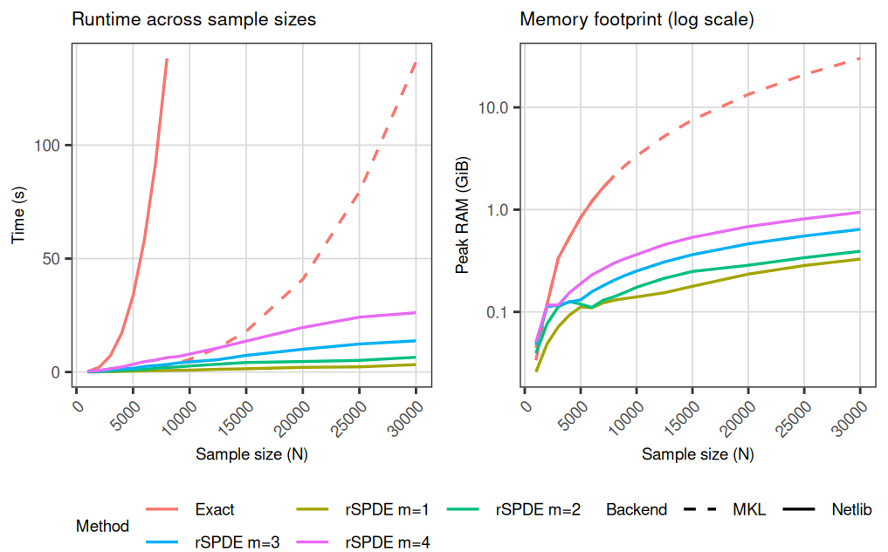

```{r setup, message=FALSE, warning=FALSE}
library(rSPDE)
library(fmesher)
library(Matrix)
library(ggplot2)
library(dplyr)
library(gridExtra)
library(gtable)
library(peakRAM)
library(tidyr)
```

## Introduction

This vignette compares the computational cost of exact dense Matérn likelihood evaluation with the sparse rSPDE approximation. For the R-INLA implementation of rSPDE, see [R-INLA implementation of the rational SPDE approach](https://davidbolin.github.io/rSPDE/articles/rspde_inla.html). For the inlabru implementation, see [inlabru implementation of the rational SPDE approach](https://davidbolin.github.io/rSPDE/articles/rspde_inlabru.html). For a general introduction, see [An introduction to the rSPDE package](https://davidbolin.github.io/rSPDE/articles/rSPDE.html). For covariance-based and operator-based workflows, see [Rational approximation with the rSPDE package](https://davidbolin.github.io/rSPDE/articles/rspde_cov.html) and [Operator-based rational approximation](https://davidbolin.github.io/rSPDE/articles/rspde_base.html). For additional modeling examples, see [Anisotropic models](https://davidbolin.github.io/rSPDE/articles/anisotropic.html), [Intrinsic models in the rSPDE package](https://davidbolin.github.io/rSPDE/articles/intrinsic.html), [Spatio-temporal models](https://davidbolin.github.io/rSPDE/articles/spacetime.html), and [Rational approximations without finite element approximations](https://davidbolin.github.io/rSPDE/articles/rspde_nofem.html).

## rSPDE sparse approximation

rSPDE replaces dense covariance computations with sparse precision matrix computations by constructing a Gaussian Markov random field (GMRF) representation. The resulting linear algebra is substantially cheaper in both time and memory than dense covariance factorizations. The approximation order $m$ controls accuracy; the approximation error decreases exponentially fast with $m$, so small orders often provide high accuracy at low computational cost.

## Benchmark setup

We consider a Gaussian model
\[
y_i = u(s_i) + \varepsilon_i,\qquad \varepsilon_i \sim \mathcal{N}(0,\sigma_e^2),
\]
where $u$ is a Mat\'ern field on the unit square and the observations are taken at $N$ random locations $s_i \in [0,1]^2$. We use
$N \in \{1000,2000,\ldots,10000,12500,15000,20000,25000,30000\}$. For each $N$, we build a triangulation with `fm_mesh_2d` using `cutoff = 0.0025`, construct the observation matrix with `fm_basis`, and compare the cost of evaluating:

- the exact dense Mat\'ern likelihood, based on the Cholesky factorization of the covariance matrix, and
- the rSPDE sparse log-likelihood for approximation orders $m = 1,\ldots,4$.

For each $m$, the rSPDE timing is averaged over 10 runs. When R is linked to FlexiBLAS and MKL or vecLib is available, we evaluate the exact model under Netlib (up to $N=8000$) and under MKL/vecLib for all sample sizes, while running rSPDE under Netlib for all sample sizes. Otherwise, both exact and rSPDE timings use the base R BLAS.

Netlib BLAS is single-threaded, whereas MKL is multi-threaded. To keep the overall cost manageable, the exact Netlib evaluations are only computed up to $N=8000$, since dense Cholesky factorization becomes prohibitively expensive at larger $N$ in a single-threaded setting.

```{r timing-benchmark-data, echo=TRUE, eval = FALSE}
loglike_exact_chol <- function(y, Sigma_matern, sigma_e) {
  S <- Sigma_matern
  diag(S) <- diag(S) + sigma_e^2
  chol_U <- tryCatch(chol(S), error = function(e) NULL)
  if (is.null(chol_U)) {
    return(-Inf)
  }
  log_det <- 2 * sum(log(diag(chol_U)))
  z <- backsolve(chol_U, y, transpose = TRUE)
  -0.5 * (length(y) * log(2 * pi) + log_det + sum(z^2))
}

has_flexiblas <- function() {
  if (!requireNamespace("flexiblas", quietly = TRUE)) {
    return(FALSE)
  }
  out <- try(flexiblas::flexiblas_list(), silent = TRUE)
  !inherits(out, "try-error")
}

list_backends <- function() {
  if (!has_flexiblas()) {
    return(character())
  }
  flexiblas::flexiblas_list()
}

has_backend <- function(pattern, backends) {
  any(grepl(pattern, tolower(backends)))
}

pick_backend <- function(target, backends) {
  nm_low <- tolower(backends)
  target_low <- tolower(target)
  idx <- which(nm_low == target_low)
  if (!length(idx) && target_low == "veclib") {
    idx <- which(grepl("veclib|vec|apple", nm_low))
  }
  if (!length(idx) && target_low == "mkl") {
    idx <- which(nm_low == "mklopenmp")
    if (!length(idx)) {
      idx <- which(grepl("mklopenmp", nm_low))
    }
    if (!length(idx)) {
      idx <- which(grepl("mkl", nm_low))
    }
  }
  if (!length(idx) && target_low == "netlib") {
    idx <- which(grepl("netlib", nm_low))
  }
  if (!length(idx)) stop(paste("FlexiBLAS backend not found:", target))
  backends[idx[1]]
}

set_backend <- function(backend_name) {
  if (!has_flexiblas()) {
    return(invisible(NULL))
  }
  loaded <- flexiblas::flexiblas_list_loaded()
  if (!any(tolower(loaded) == tolower(backend_name))) {
    flexiblas::flexiblas_load_backend(backend_name)
    loaded <- flexiblas::flexiblas_list_loaded()
  }
  idx <- which(tolower(loaded) == tolower(backend_name))
  if (!length(idx)) stop(paste("FlexiBLAS backend not loaded:", backend_name))
  flexiblas::flexiblas_switch(idx[1])
}

backend_label <- function(name) {
  if (name == "base") {
    return("Base")
  }
  if (grepl("mkl", name, ignore.case = TRUE)) {
    return("MKL")
  }
  if (grepl("netlib", name, ignore.case = TRUE)) {
    return("Netlib")
  }
  if (grepl("veclib|vec|apple", name, ignore.case = TRUE)) {
    return("VecLib")
  }
  name
}

sys <- Sys.info()
arch <- R.version$arch
machine <- sys[["machine"]]

is_mac <- sys[["sysname"]] == "Darwin"
is_arm64 <- grepl("arm64|aarch64", arch) || grepl("arm64|aarch64", machine)
is_intel <- grepl("x86_64|amd64|i386", arch) || grepl("x86_64|amd64|i386", machine)

flex_backends <- list_backends()
use_flexi <- length(flex_backends) > 0

bench_plan <- list()
has_netlib <- use_flexi && has_backend("netlib", flex_backends)
has_mkl <- use_flexi && has_backend("mkl", flex_backends)
has_veclib <- use_flexi && has_backend("veclib|vec|apple", flex_backends)

if (has_netlib && is_intel && has_mkl) {
  bench_plan$exact_backends <- c("netlib", "mkl")
  bench_plan$rspde_backend <- "netlib"
} else if (has_netlib && is_mac && is_arm64 && has_veclib) {
  bench_plan$exact_backends <- c("netlib", "veclib")
  bench_plan$rspde_backend <- "netlib"
} else {
  bench_plan$exact_backends <- "base"
  bench_plan$rspde_backend <- "base"
}

sample_sizes <- c(seq(1000, 10000, by = 1000), 12500, 15000, 20000, 25000, 30000)
sigma_true <- 1.5
range_true <- 0.2
nu_true <- 0.8
sigma_e <- 0.5
kappa_true <- sqrt(8 * nu_true) / range_true

benchmark_data <- lapply(sample_sizes, function(N) {
  set.seed(123 + N)
  list(
    N = N,
    locs = matrix(runif(N * 2), ncol = 2),
    Y = rnorm(N)
  )
})

run_exact <- function(locs, Y, backend_name) {
  if (backend_name != "base") {
    set_backend(pick_backend(backend_name, flex_backends))
  }
  timing_env <- new.env(parent = emptyenv())
  timing_env$elapsed <- NA_real_
  peak <- peakRAM::peakRAM({
    Sigma_field <- rSPDE::matern.covariance(
      h = as.matrix(dist(locs)),
      kappa = kappa_true, nu = nu_true, sigma = sigma_true
    )
    timing_env$elapsed <- system.time({
      loglike_exact_chol(Y, Sigma_field, sigma_e)
    })["elapsed"]
  })
  list(elapsed_sec = as.numeric(timing_env$elapsed), peak_mib = peak$Peak_RAM_Used_MiB)
}

run_rspde <- function(locs, Y, backend_name, m) {
  if (backend_name != "base") {
    set_backend(pick_backend(backend_name, flex_backends))
  }
  timing_env <- new.env(parent = emptyenv())
  timing_env$elapsed <- NA_real_
  peak <- peakRAM::peakRAM({
    mesh <- fm_mesh_2d(loc = locs, cutoff = 0.0025)
    A <- fm_basis(mesh, locs)
    obj <- matern.operators(
      mesh = mesh, nu = nu_true, range = range_true, sigma = sigma_true,
      m = m, parameterization = "matern"
    )
    timing_env$elapsed <- system.time({
      rSPDE:::rSPDE.matern.loglike(object = obj, Y = Y, A = A, sigma.e = sigma_e)
    })["elapsed"]
  })
  list(elapsed_sec = as.numeric(timing_env$elapsed), peak_mib = peak$Peak_RAM_Used_MiB)
}

bench_rows <- list()
for (bm in benchmark_data) {
  N <- bm$N
  locs <- bm$locs
  Y <- bm$Y

  for (backend_name in bench_plan$exact_backends) {
    if (backend_name == "netlib" && N > 8000) next
    exact_vec <- run_exact(locs, Y, backend_name)
    bench_rows[[length(bench_rows) + 1]] <- data.frame(
      N = N,
      backend = backend_label(backend_name),
      method = "Exact",
      elapsed_sec = exact_vec$elapsed_sec,
      ram_gib = exact_vec$peak_mib / 1024
    )
  }

  for (m in 1:4) {
    rspde_runs <- lapply(seq_len(10), function(i) run_rspde(locs, Y, bench_plan$rspde_backend, m))
    rspde_elapsed <- vapply(rspde_runs, function(x) x$elapsed_sec, numeric(1))
    rspde_peak <- vapply(rspde_runs, function(x) x$peak_mib, numeric(1))
    rspde_net <- list(elapsed_sec = mean(rspde_elapsed), peak_mib = mean(rspde_peak))
    bench_rows[[length(bench_rows) + 1]] <- data.frame(
      N = N,
      backend = backend_label(bench_plan$rspde_backend),
      method = paste0("rSPDE m=", m),
      elapsed_sec = rspde_net$elapsed_sec,
      ram_gib = rspde_net$peak_mib / 1024
    )
  }
}

bench_df <- bind_rows(bench_rows)
results_all <- bench_df %>% mutate(expr = method, median = elapsed_sec)
mem_df <- bench_df %>% mutate(method = method)

dir.create("cache", showWarnings = FALSE, recursive = TRUE)
saveRDS(list(results_all = results_all, mem_df = mem_df, sample_sizes = sample_sizes),
  file = "cache/timing_benchmark_results.rds"
)
```

## Results

{width=100%}
